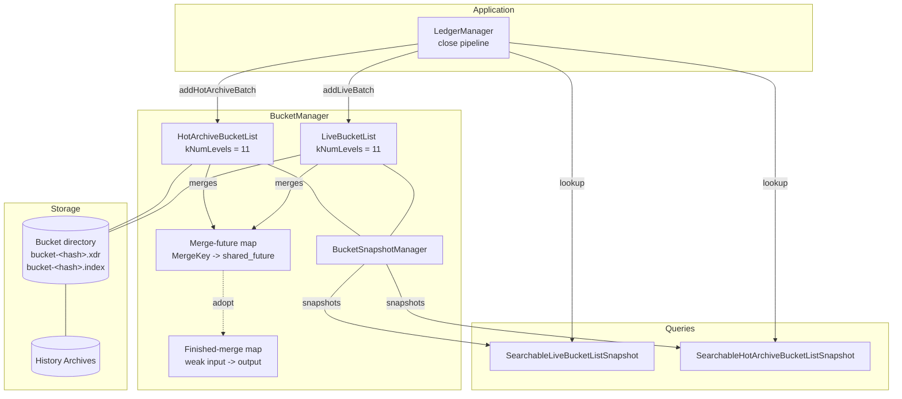
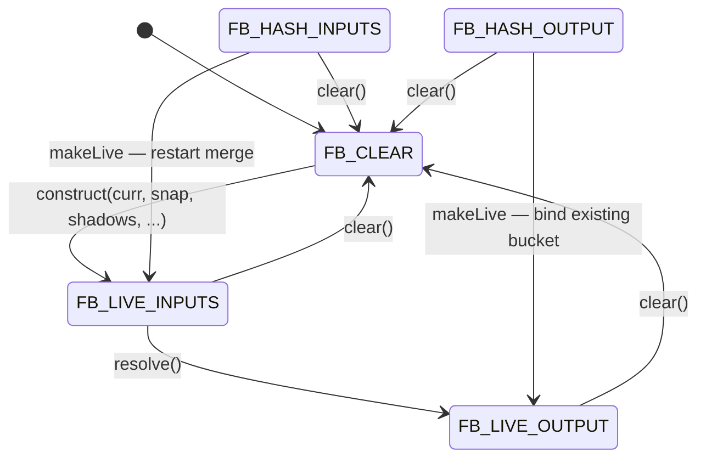
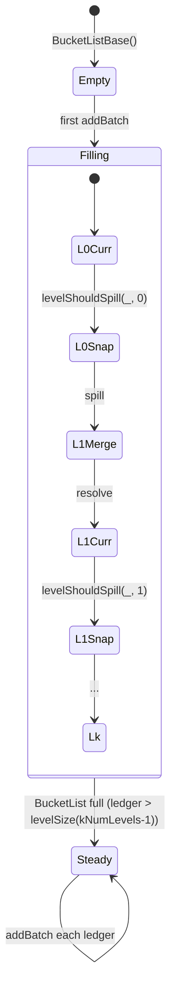

# Stellar BucketList and BucketListDB Specification

**Version:** 27 (stellar-core v27.0.0 / Protocol 27)
**Status:** Informational
**Date:** 2026-06-21

---

## Table of Contents

1. [Introduction](#1-introduction)
2. [Architecture](#2-architecture)
3. [Data Types](#3-data-types)
4. [BucketList Structure](#4-bucketlist-structure)
5. [Bucket Lifecycle](#5-bucket-lifecycle)
6. [Merge Algorithm](#6-merge-algorithm)
7. [Asynchronous Merges and FutureBucket](#7-asynchronous-merges-and-futurebucket)
8. [BucketManager](#8-bucketmanager)
9. [Indexing](#9-indexing)
10. [Snapshot and Query Layer](#10-snapshot-and-query-layer)
11. [Hot Archive BucketList](#11-hot-archive-bucketlist)
12. [Eviction](#12-eviction)
13. [Catchup Integration](#13-catchup-integration)
14. [Serialization](#14-serialization)
15. [Invariants and Safety Properties](#15-invariants-and-safety-properties)
16. [Constants](#16-constants)
17. [References](#17-references)
18. [Appendix A — Merge Equal-Key Decision Matrix](#appendix-a--merge-equal-key-decision-matrix)
19. [Appendix B — BucketList State Diagram](#appendix-b--bucketlist-state-diagram)
20. [Appendix C — Eviction Scan Walkthrough](#appendix-c--eviction-scan-walkthrough)

---

## 1. Introduction

### 1.1 Purpose and Scope

This document specifies the BucketList and BucketListDB subsystem of the
Stellar network. The BucketList is a temporally-stratified, log-structured
merge (LSM) data structure that provides two observable properties:

- a single cryptographic hash (`bucketListHash`) that uniquely identifies
  the set of all live ledger entries at a given ledger close, and
- a compact "delta" representation of the global ledger state that
  enables fast catchup via history archives.

BucketListDB extends the BucketList to act as a key-value store, replacing
the auxiliary SQL database for `LedgerEntry` lookup with per-bucket
indexes and Bloom filters.

This specification is **implementation agnostic**. It is derived
exclusively from the vetted stellar-core C++ implementation (v27.0.0).
Any conforming implementation that produces an identical
`bucketListHash` for the same input sequence of ledger close batches,
and that returns identical query results for any `LedgerKey`, is
considered correct.

Out of scope:

- on-disk file formats (.xdr bucket file layout, .index index-file
  layout, gzip framing);
- bucket directory locking and process-level mutual exclusion;
- threading model, worker-thread scheduling, and lock ordering;
- in-memory cache sizing heuristics and eviction policy for the
  per-bucket entry cache;
- metric and log instrumentation;
- garbage-collection scheduling and reference-count plumbing.

### 1.2 Conventions and Terminology

The key words "MUST", "MUST NOT", "REQUIRED", "SHALL", "SHALL NOT",
"SHOULD", "SHOULD NOT", "RECOMMENDED", "MAY", and "OPTIONAL" in this
document are to be interpreted as described in RFC 2119.

| Term | Definition |
|------|------------|
| BucketList | The distinguished ordered collection of levels, each containing two `Bucket`s, that summarizes the live ledger state. |
| Bucket | An immutable, sorted, content-addressed sequence of bucket entries identified by a SHA-256 hash. |
| Level | A pair `(curr, snap)` of `Bucket`s at a given depth in the BucketList. Levels are numbered 0 (youngest, smallest) through `kNumLevels-1` (oldest, largest). |
| `curr` | The active half of a level into which incoming spills are merged. |
| `snap` | The half of a level that has been frozen and is awaiting promotion to the next level. |
| Spill | The event in which a level's `curr` becomes `snap` and the previous `snap` is merged into the next level's `curr`. |
| Tombstone | An entry that represents the deletion of a `LedgerKey`. For `LiveBucket` this is `DEADENTRY`; for `HotArchiveBucket` this is `HOT_ARCHIVE_LIVE`. |
| Shadow | A bucket from a younger level that elides keywise-equal entries in older-level merges, under the pre-protocol-12 algorithm. |
| FutureBucket | A wrapper around a pending or completed merge that supports serialization in a `HistoryArchiveState` and re-attachment to running merges. |
| HAS | `HistoryArchiveState` — the serializable description of a BucketList at a specific ledger. |
| Hot Archive | A second BucketList that records evicted persistent Soroban entries. |
| Eviction | The protocol-23+ process of removing expired Soroban entries from the live state and (for persistent entries) archiving them. |

### 1.3 Notation

Algorithms in this document use:

- `camelCase` for variables and function names;
- `SCREAMING_SNAKE_CASE` for XDR enum values and constants;
- `@version(≥N)` / `@version(<N)` annotations on protocol-version-gated
  behavior;
- Mermaid for diagrams.

Cross-references to companion specifications use the plain-text form
`SPEC_NAME §N.N`.

### 1.4 Relationship to Other Specifications

| Specification | Relationship |
|---------------|--------------|
| LEDGER_SPEC | The ledger close pipeline produces the per-ledger `(initEntries, liveEntries, deadEntries)` and `(archivedEntries, restoredEntries)` batches consumed by this subsystem. Eviction (`§12`) feeds back into the ledger close as part of the seal-and-store step. |
| TX_SPEC | Soroban execution uses BucketListDB lookups for `getNewestVersion` semantics on persistent entries. State archival and restoration produced by `RestoreFootprint` and TTL expiry interact with the Hot Archive. |
| CATCHUP_SPEC | Catchup downloads buckets via the History Archive, reassembles a BucketList using `assumeState` (`§13`), and applies live buckets to reconstruct ledger state. |
| HERDER_SPEC | The bucketList hash produced by this subsystem feeds the `LedgerHeader` that is externalized through consensus (`SCP_SPEC`). |

---

## 2. Architecture

The BucketList is a sequence of levels, each composed of two `Bucket`s
(`curr` and `snap`). Each level `i` is conceptually four times the size
of level `i-1`. Entries enter at level 0 in batches every ledger and
migrate downward via periodic spills. There are two BucketLists in the
system:

- **LiveBucketList** — canonical live ledger state. Entries are of XDR
  type `BucketEntry` (`INITENTRY` / `LIVEENTRY` / `DEADENTRY` /
  `METAENTRY`).
- **HotArchiveBucketList** — recently evicted persistent Soroban
  entries. Entries are of XDR type `HotArchiveBucketEntry`
  (`HOT_ARCHIVE_ARCHIVED` / `HOT_ARCHIVE_LIVE` / `HOT_ARCHIVE_METAENTRY`).
  Present from protocol 23 onward.



The architectural goals are:

1. **Deterministic hash.** A single `bucketListHash` summarizes the
   entire live ledger state and is recorded in the `LedgerHeader`.
2. **Bounded write amplification.** A given entry is rewritten on
   average `kNumLevels` times over its lifetime, regardless of how
   often it is modified.
3. **Background merging.** Merges of all levels above 0 occur on
   worker threads while the main thread continues to close ledgers.
4. **Catchup-friendly deltas.** A peer can fetch the difference
   between two BucketLists by transferring at most the buckets that
   differ.
5. **Key-value store.** Per-bucket indexes and Bloom filters make
   point lookups against the BucketList efficient enough to serve as
   the primary ledger-entry store, eliminating the auxiliary SQL
   database for entry lookup.

---

## 3. Data Types

### 3.1 BucketEntry (LiveBucket)

`BucketEntry` is a tagged union with four cases used in `LiveBucket`s:

| Tag | Field | Semantics |
|-----|-------|-----------|
| `METAENTRY` | `metaEntry` of type `BucketMetadata` | Per-file header; appears at most once and only as the first entry. `@version(≥11)`. |
| `INITENTRY` | `liveEntry` of type `LedgerEntry` | Entry that was newly created in this batch; predecessor state is DEAD or nonexistent. `@version(≥11)`. |
| `LIVEENTRY` | `liveEntry` of type `LedgerEntry` | Entry that exists, regardless of whether it was just created or modified. Pre-protocol-11 buckets use `LIVEENTRY` for both create and update. |
| `DEADENTRY` | `deadEntry` of type `LedgerKey` | Tombstone marking deletion of a key. |

`BucketMetadata` carries:

| Field | Type | Description |
|-------|------|-------------|
| `ledgerVersion` | `uint32` | Protocol version at which the bucket was written. |
| `ext` | union | `v == 0` (unused) or `v == 1` with `bucketListType` set to `LIVE` or `HOT_ARCHIVE`. The `v == 1` form is REQUIRED from `FIRST_PROTOCOL_SUPPORTING_PERSISTENT_EVICTION` (protocol 23) onward. |

### 3.2 HotArchiveBucketEntry

`HotArchiveBucketEntry` is a tagged union with three cases:

| Tag | Field | Semantics |
|-----|-------|-----------|
| `HOT_ARCHIVE_METAENTRY` | `metaEntry` of type `BucketMetadata` (with `ext.v() == 1`, `bucketListType() == HOT_ARCHIVE`) | Per-file header. |
| `HOT_ARCHIVE_ARCHIVED` | `archivedEntry` of type `LedgerEntry` | Full snapshot of a persistent Soroban `LedgerEntry` evicted from the live state. |
| `HOT_ARCHIVE_LIVE` | `key` of type `LedgerKey` | Marks an archived key as having been restored (back to live state); acts as the Hot Archive's tombstone. |

A conforming implementation MUST reject any `HOT_ARCHIVE_ARCHIVED` entry
whose payload is not a persistent Soroban entry, and any
`HOT_ARCHIVE_LIVE` entry whose key is not for a persistent Soroban
type.

### 3.3 Sort Order

Entries within a bucket file are written in ascending order under a
comparator that:

1. Treats `METAENTRY` (or `HOT_ARCHIVE_METAENTRY`) as strictly less than
   every other entry type. The metadata entry — if present — MUST
   therefore be the first record.
2. Compares non-metadata entries by their associated `LedgerKey`
   ("identity"), independent of the entry tag (`INIT` / `LIVE` / `DEAD`
   for `LiveBucket`, `ARCHIVED` / `LIVE` for `HotArchiveBucket`).
3. Compares `LedgerKey` lexicographically by `LedgerEntryType` first,
   then by the type-specific identifier: `accountID` for `ACCOUNT`;
   `(accountID, asset)` for `TRUSTLINE`; `(sellerID, offerID)` for
   `OFFER`; `(accountID, dataName)` for `DATA`; `balanceID` for
   `CLAIMABLE_BALANCE`; `liquidityPoolID` for `LIQUIDITY_POOL`;
   `(contract, key, durability)` for `CONTRACT_DATA`; `hash` for
   `CONTRACT_CODE`; `configSettingID` for `CONFIG_SETTING`; `keyHash`
   for `TTL`.

A conforming implementation MUST produce, for any input, a byte-for-byte
identical bucket-file content under this ordering, so that the
content-addressed SHA-256 hash matches stellar-core.

### 3.4 BucketEntryCounters

For each bucket, a per-type counter table is maintained recording the
count and aggregate byte-size of entries by `LedgerEntryTypeAndDurability`
(which splits `CONTRACT_DATA` into `TEMPORARY` and `PERSISTENT`
variants). Counters are summed across the BucketList for reporting.
These counts are observable through the snapshot query layer and MUST
be deterministic given the BucketList contents.

---

## 4. BucketList Structure

### 4.1 Levels

A BucketList has a fixed depth of `kNumLevels = 11` for both
`LiveBucketList` and `HotArchiveBucketList`. The depth is wired into
the protocol: any change to it would alter the `bucketListHash`.

Each level holds:

- `curr` — the active half;
- `snap` — the frozen half awaiting promotion;
- `next` — a `FutureBucket` (or in-memory bucket, for level 0)
  representing the merge that will replace `curr` at the next spill of
  the level above.

The last level (`level == kNumLevels - 1`) has no `next`; it accumulates
all older state and never spills.

### 4.2 Level Sizing

For algorithmic-boundary purposes the idealized size of level `i`, in
ledgers, is

```
levelSize(i)  = 1 << (2 * (i + 1))
levelHalf(i)  = levelSize(i) / 2
```

This yields the following idealized sizes:

| level | levelSize | levelHalf |
|------:|----------:|----------:|
| 0 | 4 | 2 |
| 1 | 16 | 8 |
| 2 | 64 | 32 |
| 3 | 256 | 128 |
| 4 | 1024 | 512 |
| 5 | 4096 | 2048 |
| 6 | 16384 | 8192 |
| 7 | 65536 | 32768 |
| 8 | 262144 | 131072 |
| 9 | 1048576 | 524288 |
| 10 | 4194304 | 2097152 |

The actual size and ledger range of `curr` and `snap` at a given ledger
`k` follow the recursive `sizeOfCurr(k, level)` and `sizeOfSnap(k, level)`
functions. While the idealized sizes are powers of four, every level's
range carries an "initial skew" introduced while the BucketList is
filling up. This skew is observable but does not affect determinism:
the hash depends only on the contents of `curr` and `snap`, not on the
ledger range they cover.

### 4.3 Spill Condition

A level `i` spills (its `curr` becomes `snap` and the next level's
`curr` absorbs the prior `snap`) precisely at the ledger boundaries:

```
levelShouldSpill(ledger, level) :=
    level != kNumLevels - 1
    AND ( ledger == roundDown(ledger, levelHalf(level))
          OR ledger == roundDown(ledger, levelSize(level)) )
```

where `roundDown(v, m) = v & ~(m - 1)`. The last level never spills.

For each ledger `k`, the function `getMaxMergeLevel(k)` is the largest
level for which `levelShouldSpill(k, level)` holds; spills are
processed in descending order from that level down to level 1 (see
`§5.3`).

### 4.4 Update Period

For metrics and eviction-scan validity, each bucket has a
`bucketUpdatePeriod(level, isCurr)`:

```
bucketUpdatePeriod(level, true)  = (level == 0) ? 1 : 1 << (2 * level - 1)
bucketUpdatePeriod(level, false) = bucketUpdatePeriod(level + 1, true)
```

Equivalently, the `curr` of level `i > 0` is rewritten every
`2^(2i - 1)` ledgers; level 0's `curr` is rewritten every ledger; and
each `snap` inherits the update period of the `curr` of the level below.

### 4.5 Tombstone Retention

The function `keepTombstoneEntries(level)` returns `true` for every
level except the last:

```
keepTombstoneEntries(level) := level < kNumLevels - 1
```

When the result is `true`, tombstone entries (`DEADENTRY` for
`LiveBucket`, `HOT_ARCHIVE_LIVE` for `HotArchiveBucket`) MUST be
written to the output bucket. When the result is `false` (i.e. the
merge writes the deepest level), tombstones MUST be elided. Elision at
the deepest level is the mechanism by which deleted entries are
garbage-collected; for any shallower level, tombstones MUST be
preserved so they can continue to shadow older versions of the same
key.

### 4.6 Oldest Ledger Tracking

`oldestLedgerInCurr(k, level)` and `oldestLedgerInSnap(k, level)` are
defined recursively in terms of `sizeOfCurr` and `sizeOfSnap`. These
quantities are observable through the publishing pipeline
(`CATCHUP_SPEC`), but the BucketList hash depends only on contents,
not on ledger ranges.

### 4.7 BucketList Hash Computation

The BucketList hash is computed as the SHA-256 of the concatenation of
each level's hash, in order from level 0 to level `kNumLevels - 1`:

```
levelHash(i)  := SHA256( curr(i).hash || snap(i).hash )
listHash      := SHA256( levelHash(0) || levelHash(1) || ... || levelHash(kNumLevels - 1) )
```

Each bucket's own hash is the SHA-256 of its on-disk byte content as
written by the deterministic output iterator (see `§5.4`). An empty
bucket has hash `0000...`.

The `bucketListHash` recorded in the `LedgerHeader` is computed from
both BucketLists from protocol 23 onward:

```
@version(≥23)
bucketListHash := SHA256( liveBucketList.hash || hotArchiveBucketList.hash )

@version(<23)
bucketListHash := liveBucketList.hash
```

A conforming implementation MUST reproduce this hash exactly.

### 4.8 LedgerHeader Skip List

When the ledger sequence is a multiple of `SKIP_1`, the BucketList hash
just computed is propagated into a four-element `skipList` maintained
in the `LedgerHeader`. With `SKIP_1 = 50`, `SKIP_2 = 5_000`,
`SKIP_3 = 50_000`, `SKIP_4 = 500_000`, the shift cascade is:

1. If `ledgerSeq % SKIP_1 == 0`, then set `skipList[0] := bucketListHash`.
2. If additionally `(ledgerSeq - SKIP_1) > 0`
   and `(ledgerSeq - SKIP_1) % SKIP_2 == 0`, then shift
   `skipList[0]` into `skipList[1]` before step 1.
3. If additionally `(ledgerSeq - SKIP_2 - SKIP_1) > 0`
   and `(ledgerSeq - SKIP_2 - SKIP_1) % SKIP_3 == 0`, then shift
   `skipList[1]` into `skipList[2]` first.
4. If additionally `(ledgerSeq - SKIP_3 - SKIP_2 - SKIP_1) > 0`
   and `(ledgerSeq - SKIP_3 - SKIP_2 - SKIP_1) % SKIP_4 == 0`, then
   shift `skipList[2]` into `skipList[3]` first.

The skip list is a consensus-deterministic field of the `LedgerHeader`
and MUST be reproduced exactly.

---

## 5. Bucket Lifecycle

### 5.1 Entry Conversion

Before being written, a per-ledger LiveBucketList batch
`(initEntries, liveEntries, deadEntries)` is converted into a sorted
`vector<BucketEntry>` as follows:

1. Each `e` in `initEntries` becomes a `BucketEntry` of type
   `INITENTRY` (`@version(≥11)`) or `LIVEENTRY` (`@version(<11)`) with
   `liveEntry == e`.
2. Each `e` in `liveEntries` becomes `LIVEENTRY` with `liveEntry == e`.
3. Each `k` in `deadEntries` becomes `DEADENTRY` with `deadEntry == k`.
4. The combined vector is sorted by `BucketEntryIdCmp`. The caller
   MUST ensure no two input entries refer to the same `LedgerKey`; any
   duplicates detected during the sort assertion MUST cause the batch
   to be rejected.

For the Hot Archive, conversion is analogous: each `archivedEntries`
element becomes `HOT_ARCHIVE_ARCHIVED`, and each `restoredEntries`
element becomes `HOT_ARCHIVE_LIVE`. Both kinds MUST refer exclusively
to persistent Soroban ledger entries.

### 5.2 Creation: `fresh`

`fresh(bucketManager, protocolVersion, ...)` creates a new bucket from
a converted entry vector:

1. Build a `BucketMetadata` with `ledgerVersion := protocolVersion`. For
   `@version(≥23)` set `ext.v(1)` and `ext.bucketListType()` to `LIVE`
   or `HOT_ARCHIVE` as appropriate. For `HotArchiveBucket`, the
   metadata extension MUST be present (the Hot Archive only exists at
   protocol ≥23).
2. Open a `BucketOutputIterator` with `keepTombstoneEntries = true`.
3. If `protocolVersion >= 11`, write a `METAENTRY` first.
4. Write each entry in sorted order via `put()`.
5. Close the output, compute the SHA-256 of the byte stream, and adopt
   the file into `BucketManager` (`§8.1`).

A "level −1 snap" variant `freshInMemoryOnly` constructs a transient
in-memory `LiveBucket` for the immediate level-0 merge path (`§5.5`);
it skips the on-disk write and hash computation.

### 5.3 addBatch — Per-Ledger Update Sequence

For each ledger `currLedger > 0`, `addBatchInternal` performs the
following steps. The ordering is normative.

1. **Shadow gathering.** Collect a list of all current `(curr, snap)`
   pointers from every level into `shadows`, then pop the last two
   elements (the level being merged into does not shadow itself, nor
   does its immediate predecessor).
2. **Spill propagation, descending order.** For `i` from
   `kNumLevels - 1` down to `1`:
   1. Pop the next two `shadows` entries (so that at iteration `i`,
      only levels `0..i-2` remain as shadows).
   2. If `levelShouldSpill(currLedger, i - 1)`, then:
      - `snap := levels[i - 1].snap()` — promotes level `i-1`'s
        `curr` to its `snap`, resetting `curr` to empty.
      - `levels[i].commit()` — resolves any `next` from a prior
        ledger, replacing `curr` with the merge output.
      - `levels[i].prepare(app, currLedger, currLedgerProtocol, snap,
        shadows, countMergeEvents = true)` — kicks off a new merge
        for level `i`.
3. **Level 0 update.** Call `prepareFirstLevel(app, currLedger,
   currLedgerProtocol, ...)`, then `levels[0].commit()` to install
   the new level-0 `curr`.
4. **Resolve ready futures.** Walk every level and, for any
   `FutureBucket` whose merge has finished, eagerly resolve it. This
   step MAY be skipped under test configuration but SHALL run in
   production for deterministic publishing behavior.

The shadow popping in step 2.1 implements the rule that level `i`'s
merge MUST NOT shadow against itself or the level whose `snap` it is
absorbing.

### 5.4 prepare and shouldMergeWithEmptyCurr

`prepare(app, currLedger, currLedgerProtocol, snap, shadows, ...)`
builds the `FutureBucket` that will become level `i`'s new `curr` at
the next spill event:

1. Choose the `curr` input: if
   `shouldMergeWithEmptyCurr(currLedger, i)` is true, use an empty
   bucket; otherwise use the current level `i` `curr`.
2. Compute the effective shadow vector based on the `snap`'s protocol
   version: if `snap.bucketVersion >= FIRST_PROTOCOL_SHADOWS_REMOVED`
   (protocol 12), use an empty shadow vector; otherwise use the
   caller-provided shadows.
3. Construct `FutureBucket(app, curr, snap, shadows, protocol, level)`
   which begins the merge on a worker thread.

`shouldMergeWithEmptyCurr(ledger, level)` returns `true` when the
level's `next` state is going to absorb only the prior level's `snap`
without merging into existing `curr` content (the "snap-only" cases).
This corresponds to ledgers that are one previous-level-half away from
a snap of the current level.

### 5.5 Level 0 In-Memory Merge (LiveBucket Only)

For `LiveBucketList` level 0, an optimized in-memory path is used
when both inputs have in-memory entry vectors. The procedure:

1. Build a transient `freshInMemoryOnly` "level −1 snap" from the
   per-ledger batch.
2. If the current level-0 `curr` does not have in-memory entries (a
   startup edge case), fall back to the regular `prepare` path, which
   writes the snap to disk via `fresh` and starts a normal
   `FutureBucket` merge.
3. Otherwise call `LiveBucket::mergeInMemory(curr, snap, ...)`, which
   merges the two in-memory entry vectors using the standard merge
   algorithm (`§6`) and writes the result both to disk (so it can be
   served from a file like any other bucket) and to memory (so the
   next ledger's level-0 merge can also avoid disk I/O).
4. Store the result in the level's `next` slot as a direct
   `shared_ptr<LiveBucket>` (not a `FutureBucket`).
5. `levels[0].commit()` then installs that `LiveBucket` as the new
   `curr`.

`HotArchiveBucket` does NOT support in-memory merges; its level 0 uses
the standard `prepare` path.

### 5.6 snap and commit

- `snap()` on a level returns the current `curr`, installs it as the
  new `snap`, and resets `curr` to an empty bucket.
- `commit()` resolves the level's `next` and installs it as the new
  `curr`. For an in-memory `next` (level 0 only), this unwraps the
  `shared_ptr<BucketT>`. For a `FutureBucket`, this calls `resolve()`
  to obtain the merged bucket. After commit, `next` is cleared.

A pending merge MUST NOT be in progress when `setNext` is called for
the same level; the implementation MUST detect this and abort.

---

## 6. Merge Algorithm

### 6.1 Effective Protocol Version

For a merge of `old` and `new` (and, for `LiveBucket`, a vector of
shadows), the effective protocol version is computed by
`calculateMergeProtocolVersion`:

```
protocolVersion := max( old.metadata.ledgerVersion,
                        new.metadata.ledgerVersion )

for each shadow s:
    if s.metadata.ledgerVersion < FIRST_PROTOCOL_SHADOWS_REMOVED:
        protocolVersion := max(protocolVersion, s.metadata.ledgerVersion)

if protocolVersion > maxProtocolVersion:
    throw "bucket protocol version exceeds maxProtocolVersion"
```

The maximum-over-inputs rule (and the conditional inclusion of
pre-protocol-12 shadows) ensures that the moment a single new-protocol
bucket enters the BucketList, every merge it participates in upgrades
its shadow semantics. This guarantees correctness when
`INITENTRY`/`DEADENTRY` pairwise annihilation interacts with shadows in
older levels.

The output bucket's metadata `ledgerVersion` equals the effective
protocol version. If any input has `metadata.ext.v() == 1`, the output
MUST also use `ext.v(1)` with the appropriate `bucketListType`; this
requires the resolved `protocolVersion` to be at least
`FIRST_PROTOCOL_SUPPORTING_PERSISTENT_EVICTION`.

### 6.2 Merge Loop

The merge proceeds as a single linear pass over `old` and `new`
(supplied either as file-backed iterators or as in-memory
`vector<EntryT>`s). The driver is `mergeInternal`:

```
while !inputSource.isDone():
    if not mergeCasesWithDefaultAcceptance(...):
        mergeCasesWithEqualKeys(...)
```

`mergeCasesWithDefaultAcceptance` handles the four "easy" cases:

| Case | Action |
|------|--------|
| `new` exhausted, or `old < new` | Emit `old`, advance `old` |
| `old` exhausted, or `new < old` | Emit `new`, advance `new` |
| both exhausted | Loop exits |
| equal keys | Defer to `mergeCasesWithEqualKeys` |

Before emission, each entry is checked for protocol legality
(`checkProtocolLegality`) and then passed through `maybePut`, which
applies shadow elision (`§6.3`) and optionally writes the entry to the
output iterator. The output iterator deduplicates same-key emissions
via a one-element lookahead buffer.

### 6.3 Shadow Elision (LiveBucket Only)

For each candidate entry produced by the merge loop, `LiveBucket::maybePut`
decides whether to write it based on the effective protocol version and
the entry type.

@version(<11) — pre-`INITENTRY`:

`keepShadowedLifecycleEntries` is `false`. Every candidate is checked
against every shadow iterator and dropped if a keywise-equal shadow
exists, regardless of the candidate's type. This is the original shadow
algorithm.

@version(≥11, <12) — `INITENTRY` introduced, shadows still permitted:

`keepShadowedLifecycleEntries` is `true`. `INITENTRY` and `DEADENTRY`
candidates are NEVER dropped due to shadows. Only `LIVEENTRY`
candidates are subject to shadow elision. The asymmetric rule prevents
the following anti-pattern:

```
lev1:DEAD, lev2:INIT, lev3:DEAD, lev4:INIT
```

from collapsing to `lev4:INIT` and "reviving" an older state via the
pairwise `INIT + DEAD => empty` rule.

@version(≥12) — `FIRST_PROTOCOL_SHADOWS_REMOVED`:

Shadows are forbidden. If a merge constructed under this protocol is
asked to consider a non-empty shadow vector, the implementation MUST
abort. `FutureBucket` construction enforces this at the call site.

The shadow scan is implemented as a parallel advance over the shadow
iterators using `BucketEntryIdCmp`: each shadow iterator is advanced
forward while strictly less than the candidate; equality at any shadow
indicates a hit.

### 6.4 Equal-Key Merge Rules (LiveBucket)

When `old` and `new` have keywise-equal entries, `mergeCasesWithEqualKeys`
applies the following rules:

| old | new | result |
|-----|-----|--------|
| `INIT` | `INIT` | error — malformed |
| `LIVE` | `INIT` | error — malformed |
| `DEAD` | `INIT = x` | emit `LIVE = x` |
| `INIT = x` | `LIVE = y` | emit `INIT = y` |
| `INIT` | `DEAD` | emit nothing (annihilation) |
| `LIVE`/`DEAD` | `LIVE`/`DEAD` (no INIT in pair) | emit `new` |

Both `old` and `new` iterators advance unconditionally. The emitted
output (if any) is passed through `maybePut` (`§6.3`).

Two invariants are preserved by this table:

- **Invariant V (value):** A reader of the merged bucket sees the
  same value for the key as it would if the two pre-merge entries were
  read in order.
- **Invariant L (lifecycle):** Whenever an entry is in `INIT` state,
  the chronological state immediately preceding it is `DEAD` or
  nonexistent. This justifies the `INIT + DEAD => empty` annihilation:
  the predecessor of the merged-away `INIT` is necessarily `DEAD` or
  nonexistent, so the deletion of the pair preserves the externally
  visible state.

`@version(<11)`: `INITENTRY` does not exist. Equal-key merges always
keep `new`. The implementation MUST reject any attempt to write
`INITENTRY` or `METAENTRY` to a pre-protocol-11 output (enforced by
`checkProtocolLegality`).

### 6.5 Equal-Key Merge Rules (HotArchiveBucket)

For the Hot Archive, the rule is trivial: emit `new`, advance both.
There is no `INIT`/annihilation logic, because the Hot Archive only
holds full snapshots (`HOT_ARCHIVE_ARCHIVED`) and restoration
tombstones (`HOT_ARCHIVE_LIVE`), and a newer occurrence of either
strictly supersedes any older one for the same key.

### 6.6 Tombstone Elision at the Deepest Level

Independent of shadows, when a merge produces the deepest level
(`level == kNumLevels - 1`), the output iterator is constructed with
`keepTombstoneEntries = false`. Each candidate entry is then tested by
`BucketT::isTombstoneEntry(e)`:

- `LiveBucket`: `e.type() == DEADENTRY`;
- `HotArchiveBucket`: `e.type() == HOT_ARCHIVE_LIVE`.

If true, the entry is dropped before being buffered. This is the only
mechanism by which tombstones are removed from the BucketList; it
operates independently of protocol version and shadow rules.

### 6.7 In-Memory Merge

`LiveBucket::mergeInMemory` performs the same merge algorithm against
two `MemoryMergeInput` sources (vectors of `BucketEntry`). It is used
only for level-0 merges where both inputs are in-memory. The result is
written to disk (so the bucket is content-addressed and indexable like
any other) and additionally retained in memory so the next ledger's
level-0 merge can again skip disk I/O.

### 6.8 Output Bucket Identity

Two merges with identical `(keepTombstoneEntries, currHash, snapHash,
shadowHashes)` produce buckets with identical on-disk content and
therefore identical hashes. If a merge produces an empty output (zero
entries written after all elisions), the temporary file is deleted, no
bucket is adopted, and an empty bucket sentinel (hash `0000...`) is
returned.

---

## 7. Asynchronous Merges and FutureBucket

### 7.1 FutureBucket State Machine

A `FutureBucket` cycles through the following observable states:

| State | Meaning |
|-------|---------|
| `FB_CLEAR` | No inputs, no output, no hashes. |
| `FB_LIVE_INPUTS` | A merge is running on a worker thread; inputs are alive, output is a pending `shared_future`. |
| `FB_LIVE_OUTPUT` | The merge has completed; the output bucket is held by `shared_ptr`. |
| `FB_HASH_INPUTS` | Deserialized from a HAS: input hashes only, no live inputs and no output. |
| `FB_HASH_OUTPUT` | Deserialized from a HAS: output hash only, no live inputs/output. |

Permitted transitions:



A `FutureBucket` MUST NOT be transitioned directly between
`FB_HASH_INPUTS` and `FB_HASH_OUTPUT`, nor directly between either
`FB_LIVE_*` state and the opposite-direction `FB_HASH_*` state. The
state-validity checks (in `checkState`) enforce these constraints.

### 7.2 Construction and Merge Start

Constructing a `FutureBucket` with live inputs immediately:

1. Records `curr.hash`, `snap.hash`, and each shadow's hash in
   parallel string fields (these are what get serialized).
2. Rejects construction if `snap.bucketVersion >=
   FIRST_PROTOCOL_SHADOWS_REMOVED` and any shadows are present.
3. For `HotArchiveBucket`, rejects construction if `snap` is non-empty
   and `snap.bucketVersion <
   FIRST_PROTOCOL_SUPPORTING_PERSISTENT_EVICTION`.
4. Calls `startMerge(app, maxProtocolVersion, countMergeEvents, level)`.

### 7.3 Merge Deduplication via MergeKey

`MergeKey` is the tuple
`(keepTombstoneEntries, currHash, snapHash, shadowHashes)`.
`startMerge` first calls `bucketManager.getMergeFuture(mk)`:

- If a `shared_future` for `mk` is already registered (because an
  identical merge is already in flight, or one recently completed and
  has not yet been GC'd), the `FutureBucket` re-attaches to it
  instead of starting a duplicate worker task.
- Otherwise a new packaged task is posted to a worker thread; the
  task's `shared_future` is registered under `mk` via
  `bucketManager.putMergeFuture(mk, future)`.

The `BucketMergeMap` (`§8.2`) maintains a complementary _weak_
mapping from `MergeKey` to output hash. When an in-flight future
completes and its output is adopted, the entry in the strong
`mLiveBucketFutures` / `mHotArchiveBucketFutures` map can be removed
because subsequent re-attachment requests can synthesize a
pre-resolved future from the bucket already in the shared map.

### 7.4 Resolution

`resolve()` is callable only in `FB_LIVE_INPUTS` or `FB_LIVE_OUTPUT`:

- In `FB_LIVE_OUTPUT`, it returns the already-resolved bucket.
- In `FB_LIVE_INPUTS`, it blocks on the output future, records the
  output hash, clears the input buckets, and transitions to
  `FB_LIVE_OUTPUT`.

Inputs are released as soon as resolution completes to enable
upstream GC.

### 7.5 HAS Integration: makeLive

A `FutureBucket` in a deserialized `HistoryArchiveState` is in
`FB_HASH_INPUTS` or `FB_HASH_OUTPUT`. `makeLive(app, maxProtocolVersion,
level)` materializes the live buckets:

- `FB_HASH_OUTPUT`: look up the output bucket by hash in the
  `BucketManager` and bind it as the live output (`FB_LIVE_OUTPUT`).
- `FB_HASH_INPUTS`: look up `curr`, `snap`, and each shadow by hash
  and restart the merge via `startMerge` (`FB_LIVE_INPUTS`).
  Re-attachment to an in-flight merge happens here too if applicable.

When `restartMerges(app, maxProtocolVersion, ledger)` runs on startup
(e.g., during catchup state adoption), for each level it either calls
`makeLive` (if the level has stored hashes) or, for shadowless
protocol-12+ buckets where no output hash was stored, reconstructs the
merge inputs from the level above's `snap` and starts the merge afresh.
A clear `next` slot on a level with an empty `snap` is treated as an
untouched level; a clear `next` on a level whose `snap` is from a
pre-protocol-12 bucket without recorded inputs/outputs MUST cause an
error, because there is insufficient information to reproduce the
merge.

---

## 8. BucketManager

### 8.1 Adoption

`adoptFileAsBucket(filename, hash, mergeKey, index, inMemoryState)`
moves a freshly written bucket file from a temporary directory into
the `BucketManager`'s bucket directory under the canonical name
`bucket-<hex(hash)>.xdr`. If a bucket with the same hash already
exists, the temporary file is discarded and the existing bucket is
returned. The returned `shared_ptr<Bucket>` is recorded in the shared
bucket map keyed by hash.

Two buckets MUST NOT exist in memory with the same hash but distinct
backing files; this invariant is enforced by `adoptFileAsBucket`.

When `mergeKey != nullptr`, the merge map records the
`mergeKey -> hash` relation. When the output of a merge is empty (no
file written), `noteEmptyMergeOutput(mergeKey)` records that fact
instead, removing the in-flight `shared_future` so that future merges
of the same inputs can be skipped (they would also produce empty).

### 8.2 Garbage Collection

`forgetUnreferencedBuckets(has)` reclaims storage for buckets that are
no longer required:

1. Compute the set of "referenced" hashes as the union of:
   - all `curr`, `snap`, and `next` hashes in both BucketLists,
   - all hashes returned by `has.allBuckets()` (the LCL HAS),
   - all hashes referenced by anything in the publish queue, and
     transitively, via the `BucketMergeMap`, all merge outputs whose
     inputs are referenced.
2. For each entry in the shared bucket map: if its hash is not in
   the referenced set _and_ its `shared_ptr` use-count is `1` (i.e.,
   only the BucketManager holds it), drop it from the map and remove
   the file. Also drop the bucket's index file and forget any
   merge-map entries whose output is the dropped hash.

`cleanupStaleFiles(has)` performs the file-system side of GC: it
sweeps the bucket directory and unlinks any `bucket-<hash>.xdr` (and
its `.index` companion) whose hash is not in the referenced set.

The implementation rules above are observable only in that they
preserve the invariant that the canonical bucket directory contains
exactly the buckets needed to reconstruct the BucketList, the LCL
HAS, and the publish queue.

### 8.3 Statistics

For each bucket, observable counters per `LedgerEntryTypeAndDurability`
record entry counts and aggregate byte sizes (see `§3.4`). These
counters MUST be derivable from the bucket contents alone, ensuring
deterministic reporting.

---

## 9. Indexing

### 9.1 Lookup Semantics

Every non-empty bucket has an associated index that, given a
`LedgerKey k`, returns one of:

- `CACHE_HIT(entry)` — the entry is in the bucket's in-memory entry
  cache; the result is exact (the entry may be a tombstone).
- `FILE_OFFSET(off)` — the entry, if present, is at file offset
  `off`; the caller MUST read the bucket file at that offset and
  scan for an exact match within a single page.
- `NOT_FOUND` — the key is provably not in the bucket.

The choice between cache, file offset, and not-found is an
implementation detail; observable behavior is that the lookup either
returns the correct entry or `NOT_FOUND`.

### 9.2 InMemoryIndex

For small buckets (below the configured cutoff), the index keeps the
full set of `BucketEntry`s in memory. Lookups therefore never return
`FILE_OFFSET` for an in-memory-indexed bucket; the result is either
`CACHE_HIT` or `NOT_FOUND`.

### 9.3 DiskIndex

For large buckets, the index is page-based. The bucket file is
logically divided into pages of size
`2^BUCKETLIST_DB_INDEX_PAGE_SIZE_EXPONENT` bytes (default
configuration). For each page, the index records:

- the `(lowerBound, upperBound)` `LedgerKey` pair covered by the page;
- the file offset of the page;
- a Binary-Fuse-16 filter (a Bloom-filter variant) over all keys in
  the bucket.

A lookup performs a binary search over the page ranges, then
consults the Bloom filter. If the filter says "absent",
`NOT_FOUND` is returned; otherwise the file offset of the page is
returned for caller-side scan. The filter's false-positive rate is
bounded below 1/1000; false-positive scans MUST still yield the
correct answer.

### 9.4 Type Range Map

The disk and in-memory indexes both maintain a map from
`LedgerEntryType` to a `(lowFileOffset, highFileOffset)` pair giving
the range within the bucket file that contains entries of that type.
This map is used by the bucket-applicator OFFER scan (`§13.1`) and by
the type-scan query (`§10.6`). For page-based indexes the range is
inclusive of any adjacent entries that happen to share the start or
end page.

### 9.5 AssetPoolIDMap

`LiveBucket` indexes additionally maintain an
`AssetPoolIDMap : Asset -> [PoolID]` derived from the bucket's
`LIQUIDITY_POOL` entries. This map enables the pool-share trustline
query (`§10.4`).

### 9.6 Entry Cache

Each large `LiveBucket` MAY maintain a per-bucket
`RandomEvictionCache<LedgerKey, BucketEntry>` for `ACCOUNT` lookups.
The cache is sized as a fraction of the configured total cache budget
proportional to the bucket's share of total `ACCOUNT` bytes in the
BucketList. The cache is consulted only by the snapshot query layer
(`§10`); cache contents do not affect the deterministic BucketList
hash or its merge outputs.

### 9.7 Persistence

A non-validator node MAY persist index files to disk to avoid
re-indexing on restart. Validators MUST NOT persist indexes; on
restart the index is rebuilt from the bucket file. Index files have a
versioned header (`BUCKET_INDEX_VERSION`) and a page size; if either
disagrees with the running configuration on load, the persisted
index MUST be discarded and rebuilt.

---

## 10. Snapshot and Query Layer

### 10.1 BucketSnapshotManager

The `BucketSnapshotManager` holds the immutable `BucketListSnapshotData`
for the most recent ledger (one per BucketList) plus up to
`QUERY_SNAPSHOT_LEDGERS` historical snapshots. On every successful
ledger close, the snapshot manager publishes a fresh snapshot pair.

A `BucketListSnapshotData` consists of:

- a vector of `Level { curr, snap }` `shared_ptr`s, one per level;
- the `LedgerHeader` of the snapshot.

Snapshots are deep-copy-cheap (they share bucket `shared_ptr`s) and
are safe to read from multiple threads concurrently. The query layer
takes the snapshot as input and exposes per-thread state (file
streams) on top of it.

Atomic dual-snapshot access returns a `(live, hotArchive)` pair both
observed at the same ledger.

### 10.2 Point Lookup

`SearchableBucketListSnapshot::load(k)`:

1. For each non-empty bucket in iteration order from level 0 `curr`,
   level 0 `snap`, level 1 `curr`, level 1 `snap`, … down to level
   `kNumLevels - 1`:
   1. Query the index for `k`.
   2. If `CACHE_HIT`, return the entry (resolving tombstone → null).
   3. If `FILE_OFFSET`, read up to one page at that offset and scan
      for the key. If found, return it; otherwise (Bloom-filter false
      positive) continue.
   4. If `NOT_FOUND`, continue.
2. If no bucket matches, return null.

The result is `null` iff the key has no `LIVEENTRY`/`INITENTRY` in any
bucket; the youngest matching entry wins. For Hot Archive lookups,
the corresponding rule applies with `HOT_ARCHIVE_ARCHIVED` and
`HOT_ARCHIVE_LIVE`.

### 10.3 Bulk Load

`loadKeys(inKeys, label)` performs the same iteration as point load
but, for each bucket, walks the index sequentially with the (sorted)
input key set, removing each key from the set on a hit. The
short-circuit applies: the routine returns as soon as the key set is
empty.

`loadKeysFromLedger(inKeys, ledgerSeq)` walks the corresponding
historical snapshot if available; otherwise returns `nullopt`. The
ledger sequence is defined as "the state of the BucketList at the
beginning of the ledger", so the maximum `lastModifiedLedgerSeq` of
any returned entry is `ledgerSeq - 1`.

### 10.4 Pool Share Trust Lines

`loadPoolShareTrustLinesByAccountAndAsset(accountID, asset)`:

1. For each non-empty bucket, fetch the `AssetPoolIDMap` and read
   `poolIDs := map[asset]`. Construct candidate `LedgerKey`s
   `(TRUSTLINE, accountID, ASSET_TYPE_POOL_SHARE, poolID)` for each
   `poolID`.
2. Bulk-load the candidate set as in `§10.3`.

### 10.5 Inflation Winners (Legacy)

`loadInflationWinners(maxWinners, minBalance)` walks every `LiveBucket`
in BucketList order, iterating only over the `ACCOUNT` range. For each
`LIVEENTRY` or `INITENTRY` `ACCOUNT`, if the `accountID` has not yet
been seen (younger levels win), accumulate
`voteCount[inflationDest] += balance` when `balance >= 1_000_000_000`
and `inflationDest` is present. `DEADENTRY` `ACCOUNT`s mark the
`accountID` as seen but contribute no votes. After the scan, return up
to `maxWinners` accounts with the highest accumulated votes, where
each winner's accumulated total is `>= minBalance`. Ordering follows
the source key order.

### 10.6 Entry Type Scan

`scanForEntriesOfType(type, callback)` walks every `LiveBucket`'s
`type`-range. For each entry whose key is `<= type`, invoke
`callback(entry)`; the callback may return `Loop::COMPLETE` to halt.
This iterates over all `BucketEntry`s of the given type — including
shadowed and tombstoned ones — and is intended for full table scans
where the consumer applies its own freshness logic.

`SearchableHotArchiveBucketListSnapshot::scanAllEntries(callback)` is
the analogous full scan for the Hot Archive.

---

## 11. Hot Archive BucketList

### 11.1 Purpose

The Hot Archive (introduced at
`FIRST_PROTOCOL_SUPPORTING_PERSISTENT_EVICTION = 23`) records persistent
Soroban entries that have been evicted from the live ledger state by
TTL expiry, so they can be restored (`RestoreFootprint`) later.
Temporary Soroban entries are simply deleted from live state and are
NOT placed in the Hot Archive.

### 11.2 Structure

The Hot Archive shares the same level layout (`kNumLevels = 11`),
sizing formulas, spill schedule, and tombstone-retention semantics as
the LiveBucketList. The differences are:

- entries are of XDR type `HotArchiveBucketEntry`;
- the per-file metadata `ext.v(1)` and `bucketListType() == HOT_ARCHIVE`
  is REQUIRED on every Hot Archive bucket;
- there is no level-0 in-memory merge path; the standard `prepare`
  path is always used;
- shadows are not supported.

### 11.3 Entry Types and Sort

| Entry | Carries | Semantics |
|-------|---------|-----------|
| `HOT_ARCHIVE_ARCHIVED` | `LedgerEntry` (persistent Soroban) | A full snapshot of an entry that was evicted at the recording ledger. |
| `HOT_ARCHIVE_LIVE` | `LedgerKey` (persistent Soroban) | A restoration marker; acts as the Hot Archive's tombstone, dropped only at the deepest level. |
| `HOT_ARCHIVE_METAENTRY` | `BucketMetadata` | First-record metadata, REQUIRED. |

Sort order follows the rule in `§3.3`.

### 11.4 Merge Rules

For the Hot Archive, the equal-key rule is simply "take new" (`§6.5`).
There is no INIT/annihilation logic. The level-0 `prepare` always uses
the on-disk merge path. Tombstone elision applies at the deepest
level (dropping `HOT_ARCHIVE_LIVE`).

A Hot Archive batch consists of `(archivedEntries, restoredEntries)`.
The implementation MUST reject any batch added at a protocol version
below `FIRST_PROTOCOL_SUPPORTING_PERSISTENT_EVICTION`.

---

## 12. Eviction

Eviction is the @version(≥23) process of detecting and removing
expired Soroban entries from live state. The scan runs on a background
thread, against an LCL snapshot, in parallel with regular ledger close
work.

### 12.1 Eviction Iterator

`EvictionIterator` records the scan's persistent cursor across ledgers:

| Field | Description |
|-------|-------------|
| `bucketListLevel` | Level currently being scanned. |
| `isCurrBucket` | `true` for `curr`, `false` for `snap`. |
| `bucketFileOffset` | Byte offset within the bucket file. |

The iterator is stored as part of the `SorobanNetworkConfig` and is
updated each ledger.

### 12.2 Starting Position

Before each scan, `updateStartingEvictionIterator(iter, firstScanLevel,
ledgerSeq)` adjusts the iterator:

1. If `iter.bucketListLevel < firstScanLevel` (the network config has
   raised the starting level), reset to
   `{firstScanLevel, isCurrBucket = true, bucketFileOffset = 0}`.
2. If the bucket pointed at by `iter` was changed by a spill on the
   previous ledger, reset `bucketFileOffset = 0`. The check examines:
   - `levelShouldSpill(ledgerSeq - 1, bucketListLevel - 1)` if
     pointing at `curr` (which receives a spill from the level above);
   - `levelShouldSpill(ledgerSeq - 1, bucketListLevel)` if pointing at
     `snap` (which is replaced when its own level spills).

### 12.3 Scan Process

`scanForEviction(ledgerSeq, metrics, evictionIter, stats, sas,
ledgerVers)`:

1. Update the iterator's starting position (`§12.2`) and record
   `startIter`. Set `bytesToScan := sas.evictionScanSize`.
2. Loop:
   1. Fetch the bucket pointed at by the iterator. Warn if the
      bucket cannot be fully scanned within its update period.
   2. Call `scanForEvictionInBucket(bucket, iter, bytesToScan,
      ledgerSeq, evictableEntries, ledgerVers,
      keysInEvictableEntries)` (`§12.4`).
   3. If it returns `Loop::COMPLETE`, the byte budget is exhausted —
      exit.
   4. Otherwise advance the iterator with
      `updateEvictionIterAndRecordStats(iter, startIter,
      firstScanLevel, ledgerSeq, stats, metrics)`:
      - first move from `curr` to `snap` within the same level
        (skipped for the deepest level);
      - then advance to the next level's `curr`;
      - on overflowing `kNumLevels`, wrap around to `firstScanLevel`
        and emit cycle metrics;
      - if `iter` is now equal to `startIter`, exit.

### 12.4 In-Bucket Scan

`scanForEvictionInBucket`:

1. If the bucket is empty or has
   `bucketVersion < SOROBAN_PROTOCOL_VERSION`, return
   `Loop::INCOMPLETE` (skip to next bucket); buckets predating Soroban
   contain no evictable entries.
2. Open a fresh stream at `iter.bucketFileOffset`. Read entries
   sequentially, advancing `iter.bucketFileOffset` after each read.
   For each `INITENTRY`/`LIVEENTRY`:
   - Determine evictable type. @version(<23): temporary entries
     only. @version(≥23): every Soroban entry (persistent or
     temporary).
   - Skip if this key is already in `keysInEvictableEntries`.
   - Append the `TTL` key to `keysToSearch` and (@version(≥24)
     only, for persistent entries) the entry's own key, then push a
     stub `EvictionResultEntry` onto `maybeEvictQueue`.
3. After the byte budget is exhausted (or on EOF), perform a single
   bulk `loadKeys(keysToSearch, "eviction")` over the snapshot. For
   each candidate:
   - If the TTL is still live (`liveUntilLedgerSeq >= ledgerSeq`),
     drop the candidate.
   - Otherwise mark as evictable and stash the TTL's
     `liveUntilLedgerSeq` on the candidate.
   - @version(≥24): for persistent entries, replace the candidate's
     payload with the newest version of the entry (the one fetched
     in the bulk load), to ensure that the archived snapshot is
     the most recent version. @version(=23) has a known bug where
     this check is not performed and an older version may be
     archived; conforming implementations targeting protocol 23
     MUST reproduce this behavior exactly to preserve determinism.
4. Return `Loop::COMPLETE` when the byte budget is exhausted,
   `Loop::INCOMPLETE` on EOF.

### 12.5 Validity Check

`EvictionResultCandidates::isValid(currLedgerSeq, currLedgerVers, sas)`
returns `false` if any of the following changed between scan start and
scan use:

- the ledger sequence;
- `maxEntriesToArchive`, `evictionScanSize`, or
  `startingEvictionScanLevel`;
- the protocol crossing
  `FIRST_PROTOCOL_SUPPORTING_PERSISTENT_EVICTION` (which fundamentally
  changes evictable type).

If invalid, the scan MUST be restarted with the new settings before
its result is consumed.

### 12.6 Applying the Scan: EvictedStateVectors

`resolveBackgroundEvictionScan(ltx, modifiedKeys)`:

1. Drop any candidate whose TTL has been modified in the current
   ledger (`modifiedKeys.contains(getTTLKey(entry))`).
2. The implementation MUST reject any candidate whose entry itself
   has been modified in the current ledger; this represents a logic
   bug, not a normal occurrence.
3. For up to `maxEntriesToArchive` candidates in scan order:
   - `ltx.erase(entryKey)` and `ltx.erase(ttlKey)`.
   - For temporary entries, append `entryKey` to `deletedKeys`.
   - For persistent entries, append the entry to `archivedEntries`.
   - In both cases, append `ttlKey` to `deletedKeys`.
   - Update `newEvictionIterator` to the candidate's recorded
     iterator state.
4. Persist `newEvictionIterator` back to the Soroban network config
   in `ltx`. If fewer than `maxEntriesToArchive` were evicted (i.e.,
   the scan region was fully consumed), the iterator is set to the
   end of the scan region instead.
5. Return `EvictedStateVectors { deletedKeys, archivedEntries }`.

The ledger close pipeline then feeds `archivedEntries` to the Hot
Archive via `addHotArchiveBatch`, and the TTL/key deletions enter the
LiveBucketList via the regular `addLiveBatch` `deadEntries` argument.
The partitioning between `deletedKeys` and `archivedEntries` is a
normative invariant (see `INV-B7`).

---

## 13. Catchup Integration

### 13.1 Bucket Application

During catchup, the bucket-applicator applies the LiveBucketList to a
fresh ledger state. For each bucket from level 0 down to level
`kNumLevels - 1` (oldest last), the applicator walks the bucket's
entries:

1. Reject any entry that violates `checkProtocolLegality` for the
   current `maxProtocolVersion`.
2. Skip entries whose `LedgerEntryType` is not supported via the
   bucket-applicator path (currently only `OFFER` is applied through
   this path; the remaining types live solely in the BucketList and
   are served by the snapshot query layer).
3. For OFFER entries:
   - For `LIVEENTRY` / `INITENTRY`: insert the entry into the target
     state, except that if the key has already been seen (i.e., is
     present in `seenKeys`), it is skipped — only the youngest
     occurrence wins.
   - For `DEADENTRY`: simply record the key in `seenKeys`. Do not
     touch the target state.
   - For @version(<11) buckets where `INITENTRY` does not exist, the
     applicator MUST consult the ledger-txn state to determine
     whether the entry already exists and choose between `create` and
     `update`.
   - At the deepest level (`level == kNumLevels - 1`), any
     `LIVEENTRY` MUST be treated as `INITENTRY` (a `create`), since
     the deepest level reflects the oldest-known state and no
     predecessor exists.

### 13.2 Application Order

Buckets are applied from youngest to oldest with respect to the
content of the live state but, when applying to a fresh state during
catchup, the applicator uses the `seenKeys` set to ensure only the
newest occurrence of any key persists. The detailed scheduling across
multiple buckets and apply-batches is the responsibility of the
catchup pipeline (`CATCHUP_SPEC`).

### 13.3 State Reconstruction: assumeState

`BucketManager::assumeState(app, has, maxProtocolVersion, restartMerges)`
adopts a deserialized `HistoryArchiveState`:

1. For each level `i` and each BucketList type, look up the buckets
   named in `has.currentBuckets[i].curr` and `.snap` (and analogously
   for `has.hotArchiveBuckets`) by hash. All MUST exist in the
   BucketManager.
2. If `has.currentBuckets[i].next` has an output hash, look up that
   bucket and bind it; otherwise the `FutureBucket` is in
   `FB_HASH_INPUTS` state and will be restarted later.
3. Each bound bucket MUST already be indexed.
4. Install `(curr, snap, next)` on each level.
5. If `restartMerges`, call `bl.restartMerges(app, maxProtocolVersion,
   ledger)` for each list, which calls `makeLive` on every level's
   `next` (`§7.5`).

After `assumeState` completes, the BucketList is functionally
equivalent to the one that produced the HAS, and querying
`liveBucketList.getHash()` MUST yield the same hash recorded in the
HAS (and thus in the `LedgerHeader`'s `bucketListHash`).

---

## 14. Serialization

### 14.1 HistoryArchiveState

`HistoryArchiveState` (HAS) is a serializable structure describing a
complete BucketList state at a specific ledger. Its observable
content is:

| Field | Description |
|-------|-------------|
| `version` | HAS schema version. `1` for pre-Hot-Archive (`<23`); `2` for Hot-Archive-aware (`≥23`). |
| `server` | Informational. |
| `networkPassphrase` | Network identifier. REQUIRED at HAS version 2. |
| `currentLedger` | Ledger sequence at which the snapshot was taken. |
| `currentBuckets` | Vector of `HistoryStateBucket<LiveBucket>` of length `kNumLevels`. |
| `hotArchiveBuckets` | Vector of `HistoryStateBucket<HotArchiveBucket>` of length `kNumLevels`. REQUIRED at HAS version 2. |

Each `HistoryStateBucket<B>` carries:

| Field | Description |
|-------|-------------|
| `curr` | Hex hash of level's `curr` bucket. |
| `snap` | Hex hash of level's `snap` bucket. |
| `next` | A `FutureBucket<B>`, serialized in either `FB_CLEAR`, `FB_HASH_INPUTS`, or `FB_HASH_OUTPUT` form (live forms collapse to their hash form on serialization). |

`allBuckets()` returns the deduplicated set of every non-zero hash
referenced by the HAS (across `curr`, `snap`, and every `next`'s
input and output hashes). `differingBuckets(other)` returns the
buckets present in `this` but not in `other`, ordered from largest /
oldest level to smallest / youngest, with `snap` before `curr` at
each level — this is the order in which a peer catching up from
`other` applies fetched buckets.

The maximum permitted bucket size in a history archive is
`100 GiB`; downloads exceeding this size MUST be rejected as
suspicious.

### 14.2 Bucket Directory Layout

Each bucket is stored as
`<bucketDir>/bucket-<hex(hash)>.xdr`, optionally accompanied by a
gzipped sibling `bucket-<hex(hash)>.xdr.gz` (used for archive transfer)
and a `bucket-<hex(hash)>.index` index file. Filenames are the only
observable association between a bucket and its hash; a conforming
implementation MAY use any other on-disk layout provided it can
reproduce the hash-content correspondence required by the HAS.

### 14.3 Checkpoint Alignment

The publishing pipeline (`CATCHUP_SPEC`) snapshots HAS at checkpoint
boundaries. The BucketList contract is that, at every ledger, the
`bucketListHash` recorded in the `LedgerHeader` corresponds exactly
to the SHA-256 of (live‖hotArchive) BucketLists as defined in `§4.7`.
Publishing serializes the HAS at the checkpoint ledger; loading a
HAS via `assumeState` (`§13.3`) recreates the same BucketList.

---

## 15. Invariants and Safety Properties

The following invariants are normative. A conforming implementation
MUST preserve each one.

- **INV-B1 — Deterministic BucketList hash.** For any sequence of
  per-ledger batches, the `bucketListHash` recorded in the
  `LedgerHeader` MUST equal the value computed in `§4.7`. Two
  implementations applying the same batches MUST produce
  byte-identical bucket files and therefore identical hashes.

- **INV-B2 — Monotonic Level 0 update.** Each ledger close adds
  exactly one batch to level 0 of each BucketList (subject to the
  per-list protocol gate). The `curr` of level 0 of the
  LiveBucketList MUST contain the entries of the most-recent
  per-ledger batch, merged with any earlier level-0 content, sorted
  by `BucketEntryIdCmp`.

- **INV-B3 — Spill schedule.** A level `i < kNumLevels - 1` spills
  precisely at the ledgers identified by `levelShouldSpill(ledger,
  i)`. The deepest level never spills. The set of spilled levels at
  a given ledger MUST be processed in descending order.

- **INV-B4 — Effective merge protocol.** The protocol version used
  by a merge MUST equal the maximum over the input buckets'
  versions and any pre-`FIRST_PROTOCOL_SHADOWS_REMOVED` shadows'
  versions. A merge MUST fail if this value exceeds the supplied
  `maxProtocolVersion`.

- **INV-B5 — Shadow elision pre/post INITENTRY.** Under
  `@version(<11)`, shadow elision applies to all entry types. Under
  `@version(≥11, <12)`, `INITENTRY` and `DEADENTRY` MUST NOT be
  elided by shadow. Under `@version(≥12)`, merges MUST NOT receive
  any non-empty shadow vector.

- **INV-B6 — INIT/DEAD annihilation.** Whenever an entry is in
  `INIT` state, its chronological predecessor MUST be `DEAD` or
  nonexistent. The `(INIT_x, LIVE_y) -> INIT_y`,
  `(DEAD, INIT_x) -> LIVE_x`, and `(INIT, DEAD) -> empty` equal-key
  merge rules MUST be applied exactly as in `§6.4`.

- **INV-B7 — Eviction partitioning.** The output of
  `resolveBackgroundEvictionScan` MUST partition evicted entries
  such that:
  - persistent Soroban entries appear in `archivedEntries`;
  - temporary Soroban entries' keys appear in `deletedKeys`;
  - every evicted entry's TTL key appears in `deletedKeys` exactly
    once;
  - no key appears in both `archivedEntries` and `deletedKeys`.

- **INV-B8 — Tombstone elision only at deepest level.** Tombstone
  entries (`DEADENTRY` or `HOT_ARCHIVE_LIVE`) MUST NOT be dropped
  by any merge where `keepTombstoneEntries(level) == true`. They
  MUST be dropped by any merge where this returns `false` (i.e., the
  deepest level).

- **INV-B9 — Bucket immutability.** Once a bucket has been adopted
  by the `BucketManager`, its file content MUST NOT change. A merge
  producing a bucket with an already-known hash MUST reuse the
  existing bucket and discard the temporary file.

- **INV-B10 — FutureBucket state invariants.** A `FutureBucket` MUST
  satisfy the state-validity table in `§7.1`. In particular, an
  `FB_LIVE_INPUTS` future MUST hold non-null `curr` and `snap`
  inputs and a valid output future; an `FB_LIVE_OUTPUT` future MUST
  hold a non-null output and no input pointers.

- **INV-B11 — Merge identity.** Two merges with identical `MergeKey`
  MUST produce buckets with identical hashes, and identical merge
  re-attachment MUST yield the same output regardless of who started
  the merge.

- **INV-B12 — Last-level INIT correctness during apply.** When
  applying a `LIVEENTRY` from the deepest BucketList level
  (`kNumLevels - 1`) during catchup, the applicator MUST treat it
  as `INITENTRY` (a `create`), since no older state precedes it.

- **INV-B13 — Hot Archive content constraint.** Every
  `HOT_ARCHIVE_ARCHIVED` entry MUST carry a persistent Soroban
  `LedgerEntry`; every `HOT_ARCHIVE_LIVE` entry MUST carry a
  persistent Soroban `LedgerKey`. Adding any other type MUST be
  rejected.

- **INV-B14 — HAS round-trip.** Serializing a BucketList to a HAS
  and then loading it via `assumeState` MUST yield a BucketList
  with identical `bucketListHash`.

- **INV-B15 — `bucketListHash` composition.** From protocol 23
  onward, the `bucketListHash` MUST be
  `SHA256(liveBucketList.hash || hotArchiveBucketList.hash)`; before
  protocol 23, it MUST be `liveBucketList.hash`.

- **INV-B16 — Metadata first.** A `METAENTRY` or `HOT_ARCHIVE_METAENTRY`,
  if present, MUST be the first record in a bucket file and MUST NOT
  recur. The corresponding `BucketInputIterator` enforces this on
  read.

---

## 16. Constants

### 16.1 Protocol Constants (MUST NOT vary)

| Constant | Value | Description | Section |
|----------|------:|-------------|---------|
| `kNumLevels` | `11` | Number of levels in either BucketList. | [4.1](#41-levels) |
| `levelSize(i)` | `1 << (2*(i+1))` | Idealized size of level `i` in ledgers. | [4.2](#42-level-sizing) |
| `levelHalf(i)` | `levelSize(i) / 2` | Idealized half-size. | [4.2](#42-level-sizing) |
| `FIRST_PROTOCOL_SUPPORTING_INITENTRY_AND_METAENTRY` | `11` | Protocol introducing `INITENTRY` and `METAENTRY`. | [3.1](#31-bucketentry-livebucket) |
| `FIRST_PROTOCOL_SHADOWS_REMOVED` | `12` | Protocol from which merges MUST have no shadows. | [6.3](#63-shadow-elision-livebucket-only) |
| `FIRST_PROTOCOL_SUPPORTING_PERSISTENT_EVICTION` | `23` | Protocol from which the Hot Archive exists, persistent eviction is enabled, and `BucketMetadata.ext.v(1)` is REQUIRED. | [11.1](#111-purpose) |
| `SOROBAN_PROTOCOL_VERSION` | (per LEDGER_SPEC) | Below this version, eviction scans skip the bucket. | [12.4](#124-in-bucket-scan) |
| `SKIP_1` | `50` | Skip-list ledger period stage 1. | [4.8](#48-ledgerheader-skip-list) |
| `SKIP_2` | `5_000` | Skip-list ledger period stage 2. | [4.8](#48-ledgerheader-skip-list) |
| `SKIP_3` | `50_000` | Skip-list ledger period stage 3. | [4.8](#48-ledgerheader-skip-list) |
| `SKIP_4` | `500_000` | Skip-list ledger period stage 4. | [4.8](#48-ledgerheader-skip-list) |
| `MAX_HISTORY_ARCHIVE_BUCKET_SIZE` | `100 GiB` | Maximum bucket file size accepted from a history archive. | [14.1](#141-historyarchivestate) |
| HAS version | `1` (pre-Hot-Archive) / `2` (≥23) | History Archive State schema version. | [14.1](#141-historyarchivestate) |

### 16.2 Recommended Parameters

| Constant | Default | Description | Section |
|----------|---------|-------------|---------|
| `BUCKETLIST_DB_INDEX_PAGE_SIZE_EXPONENT` | impl-defined | `pageSize == 2^N` for the `RangeIndex`. | [9.3](#93-diskindex) |
| `BUCKETLIST_DB_INDEX_CUTOFF` | `250 MB` | Buckets smaller than this size use the in-memory index. | [9.2](#92-inmemoryindex) |
| `BUCKETLIST_DB_PERSIST_INDEX` | `true` (non-validators) | When `true`, indexes are persisted to disk. Validators ignore this and never persist. | [9.7](#97-persistence) |
| `BUCKETLIST_DB_MEMORY_FOR_CACHING` | impl-defined | Total budget for the per-bucket entry cache used by large buckets. | [9.6](#96-entry-cache) |
| `QUERY_SNAPSHOT_LEDGERS` | impl-defined | Number of historical BucketList snapshots retained for query. | [10.1](#101-bucketsnapshotmanager) |
| `LEDGER_ENTRY_BATCH_COMMIT_SIZE` | impl-defined | Number of entries the bucket applicator commits per inner ledger-txn batch during catchup. | [13.1](#131-bucket-application) |

These parameters affect performance and memory consumption only; they
do not affect the `bucketListHash` or any other consensus-deterministic
output.

---

## 17. References

| Reference | Description |
|-----------|-------------|
| LEDGER_SPEC | Stellar Ledger Close Pipeline Specification — defines the per-ledger batch formation that this subsystem consumes, and the `LedgerHeader` fields (`bucketListHash`, `skipList`) populated by this subsystem. |
| TX_SPEC | Stellar Transactions Specification — defines `RestoreFootprint`, `ExtendFootprintTTL`, and the persistent / temporary distinction the Hot Archive depends on. |
| CATCHUP_SPEC | Stellar Catchup, Replay, and History Publishing Specification — defines bucket download, application order, and HAS publishing. |
| HERDER_SPEC | Stellar Herder Specification — describes how the `LedgerHeader` populated here becomes part of the consensus value. |
| [CAP-0044] | Persistent Entry Eviction (protocol 23). |
| [CAP-0046] | Soroban smart contract environment. |
| RFC 2119 | Key words for use in RFCs to Indicate Requirement Levels. |
| FIPS 180-4 | SHA-256 specification. |

---

## Appendix A — Merge Equal-Key Decision Matrix

The following matrix is the normative table from `§6.4`, reproduced
for ease of reference. `x` and `y` denote `LedgerEntry` values for the
same `LedgerKey`. Bold entries are errors; the implementation MUST
fail if encountered.

| old \ new | INIT = y | LIVE = y | DEAD |
|-----------|----------|----------|------|
| INIT = x | **error: malformed** | emit INIT = y, advance both | emit nothing, advance both (annihilation) |
| LIVE = x | **error: malformed** | emit LIVE = y, advance both | emit DEAD, advance both |
| DEAD | emit LIVE = y, advance both | emit LIVE = y, advance both | emit DEAD, advance both |

For the Hot Archive (`§6.5`), every equal-key cell collapses to "emit
new, advance both".

The four "easy" (non-equal-key) cases use the column corresponding to
whichever iterator advances:

| Condition | Action |
|-----------|--------|
| new exhausted, OR old < new | emit old, advance old |
| old exhausted, OR new < old | emit new, advance new |
| both exhausted | terminate |
| keys equal, both live | use table above |

---

## Appendix B — BucketList State Diagram



The "Empty" state is the initial state of a fresh `BucketListBase`
with all `curr` and `snap` set to empty buckets. The "Filling" period
covers ledgers `1..levelSize(kNumLevels - 1) - 1` during which the
oldest level has not yet reached its idealized size; the offset (skew)
introduced here persists indefinitely into the "Steady" state.

Each ledger in the "Steady" state performs the following work:

- level 0 ingests the new batch;
- for each spilling level `i > 0`, the prior merge is committed,
  `curr` is promoted to `snap`, and a new merge is started against the
  prior level's `snap`.

---

## Appendix C — Eviction Scan Walkthrough

This appendix illustrates a single eviction tick at a protocol-23+
node. Constants like `scanSize` and `maxEntriesToArchive` are taken
from the active `SorobanNetworkConfig`. The walkthrough is for
explanation only; the body of `§12` is normative.

1. **Start of ledger N.** Main thread starts a background eviction
   scan against the LCL snapshot. The scan's
   `evictionIter = {level = 6, isCurr = false, offset = 0x40_000}`
   was persisted at the end of ledger N-1.
2. **Background scan begins.**
   `updateStartingEvictionIterator(iter, firstScanLevel, ledgerSeq)`
   confirms no upgrade or recent spill has invalidated the cursor.
3. **First bucket pulled.** The scan reads up to `evictionScanSize`
   bytes from level 6 `snap`, starting at `offset = 0x40_000`. For
   each Soroban-typed `LIVEENTRY`, it records the corresponding TTL
   key in `keysToSearch` and (for persistent entries under
   protocol-24+) the entry's own key.
4. **TTL bulk load.** After the byte budget is exhausted (or EOF is
   hit), the scan calls `loadKeys(keysToSearch, "eviction")` against
   the snapshot. For each candidate:
   - if the TTL is missing or live (`liveUntilLedger >= ledgerSeq`),
     the candidate is dropped;
   - otherwise the candidate is added to `eligibleEntries`, and for
     protocol-24+ persistent entries its payload is replaced with
     the newest version returned by the bulk load.
5. **End of bucket.** If the byte budget is not exhausted but the
   bucket ends, `updateEvictionIterAndRecordStats` advances to the
   next bucket (here: level 7 `curr`).
6. **Main-thread resolution.** When ledger N's apply phase begins,
   `resolveBackgroundEvictionScan(ltx, modifiedKeys)`:
   - drops candidates whose TTL was modified in this ledger;
   - evicts up to `maxEntriesToArchive` candidates from `ltx`;
   - partitions the evicted set into `deletedKeys` (TTL keys plus
     all temporary entry keys) and `archivedEntries` (persistent
     entries);
   - updates the network-config eviction iterator with the new
     position.
7. **Feeding the BucketLists.** The seal-and-store step of the
   ledger close pipeline feeds `archivedEntries` to
   `addHotArchiveBatch` and includes `deletedKeys` in
   `addLiveBatch`'s `deadEntries` argument, where they enter level 0
   of the respective BucketLists as `HOT_ARCHIVE_ARCHIVED` and
   `DEADENTRY` entries.

The cycle continues each ledger, with the iterator wrapping back to
`firstScanLevel` after sweeping past the deepest level. A complete
eviction cycle covers every byte of every eligible bucket exactly
once, at which point `EvictionStatistics::submitMetricsAndRestartCycle`
is called.

[CAP-0044]: https://github.com/stellar/stellar-protocol/blob/master/core/cap-0044.md
[CAP-0046]: https://github.com/stellar/stellar-protocol/blob/master/core/cap-0046.md
