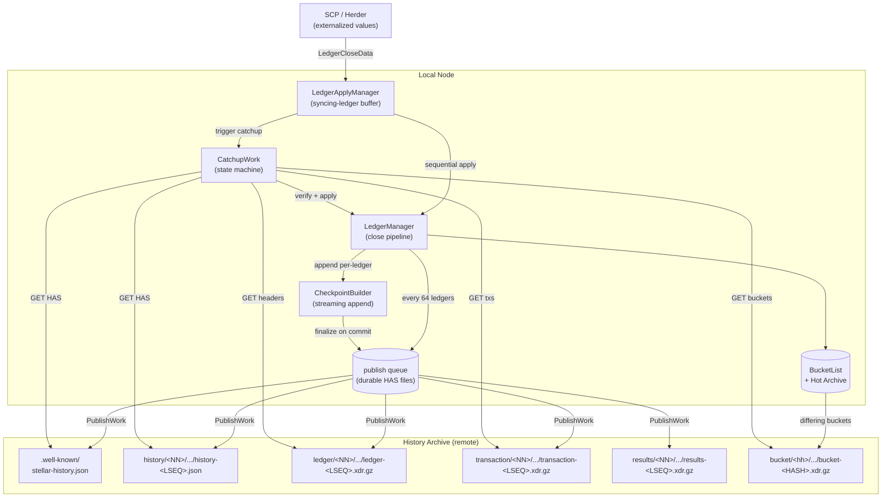
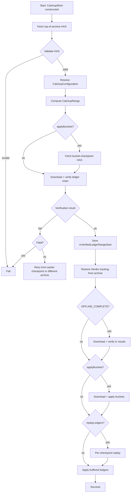

# Stellar Catchup, Replay, and History Publishing Specification

**Version:** 26 (stellar-core v26.0.1 / Protocol 26)
**Status:** Informational
**Date:** 2026-05-13

---

## Table of Contents

1. [Introduction](#1-introduction)
2. [Architecture](#2-architecture)
3. [Data Types](#3-data-types)
4. [History Archive Structure](#4-history-archive-structure)
5. [Checkpoint Publishing Pipeline](#5-checkpoint-publishing-pipeline)
6. [Catchup Configuration and Range](#6-catchup-configuration-and-range)
7. [Ledger Apply Manager](#7-ledger-apply-manager)
8. [Catchup Pipeline](#8-catchup-pipeline)
9. [Ledger Chain Verification](#9-ledger-chain-verification)
10. [Bucket Application](#10-bucket-application)
11. [Transaction Replay](#11-transaction-replay)
12. [Transaction Results Verification](#12-transaction-results-verification)
13. [Buffered Ledger Application](#13-buffered-ledger-application)
14. [Error Handling and Crash Recovery](#14-error-handling-and-crash-recovery)
15. [Invariants and Safety Properties](#15-invariants-and-safety-properties)
16. [Constants](#16-constants)
17. [References](#17-references)
18. [Appendix A: History Archive Layout Example](#appendix-a-history-archive-layout-example)
19. [Appendix B: Catchup Phase Sequence](#appendix-b-catchup-phase-sequence)
20. [Appendix C: Knit-to-LCL Decision Matrix](#appendix-c-knit-to-lcl-decision-matrix)

---

## 1. Introduction

### 1.1 Purpose and Scope

This specification defines the observable protocol behavior of the Stellar catchup, replay, and history publishing subsystem. It covers:

- The structure of history archives published by validators.
- The pipeline by which a node incrementally builds, finalizes, and uploads checkpoints to history archives.
- The catchup algorithm by which a desynchronized node reconstitutes ledger state from history archives and re-enters consensus.
- The verification rules a conforming implementation MUST apply to history archive content before accepting it as authoritative.

This specification is **implementation agnostic**. It is derived exclusively from the vetted stellar-core C++ implementation (v26.0.1). Any conforming implementation that produces identical history archive contents and identical post-catchup ledger state for all valid inputs is considered correct.

Out of scope:

- File transfer mechanics (HTTP, S3, GCS, command templates).
- Compression formats (gzip) and on-disk file naming conventions used internally by the implementation.
- Work-graph scheduling, threading models, retry counts, parallelism strategies.
- Database schemas, in-memory caching, metrics, logging.
- The internal structure of buckets (see BUCKETLISTDB_SPEC) and the internal structure of ledger close (see LEDGER_SPEC).

### 1.2 Conventions and Terminology

The key words **MUST**, **MUST NOT**, **REQUIRED**, **SHALL**, **SHALL NOT**, **SHOULD**, **SHOULD NOT**, **RECOMMENDED**, **MAY**, and **OPTIONAL** in this document are to be interpreted as described in RFC 2119.

| Term | Definition |
|------|------------|
| Checkpoint | A unit of historical content covering 64 consecutive ledgers, anchored at the last ledger of the range (a value of the form `K*64 - 1`). |
| Checkpoint Ledger | The last ledger of a checkpoint; equivalently `checkpointContainingLedger(L)` for any L in the checkpoint. |
| Checkpoint Frequency | The constant `CHECKPOINT_FREQUENCY = 64` ledgers. |
| HAS | History Archive State — a JSON document describing the BucketList snapshot at a given ledger. |
| LCL | Last Closed Ledger — the most recently applied and committed ledger on the local node. |
| LCL+1 | The ledger immediately following the LCL; the next ledger expected for application. |
| Genesis | The fictional ledger 0; ledger 1 is the first real ledger. |
| Buffered Ledger | A `LedgerCloseData` value received from consensus but not yet applied, held in memory pending application. |
| Trusted Hash | A `(ledgerSeq, hash)` pair whose authenticity is established by a source outside the history archive (typically SCP nomination or operator-supplied input). |
| Trust Anchor | Either the LCL (rooted in the local node's prior committed state) or a trusted hash supplied at catchup initiation. |
| ONLINE Mode | Catchup mode in which the node is connected to the network and buffers new ledgers from consensus during catchup. |
| OFFLINE Mode | Catchup mode in which the node is not connected to the network; only archive content drives state. |

#### Cross-Spec References

| Specification | Relationship |
|---------------|--------------|
| BUCKETLISTDB_SPEC | Defines bucket structure, BucketList hash, and BucketApplicator semantics referenced by §10. |
| LEDGER_SPEC | Defines `applyLedger` and the ledger close pipeline invoked by §11 and §13. |
| HERDER_SPEC | Defines the SCP-tracked state set by §8 and the source of buffered ledgers consumed by §13. |
| TX_SPEC | Defines transaction sets and transaction results whose hashes are verified in §11–§12. |

### 1.3 Notation

Algorithms use camelCase pseudocode. Protocol-version conditional behavior is annotated `@version(≥N)` or `@version(<N)`. XDR enums and error codes are rendered SCREAMING_SNAKE_CASE. Cross-spec references use plain text (e.g., `BUCKETLISTDB_SPEC §5`).

---

## 2. Architecture

The catchup, replay, and history publishing subsystem encompasses two complementary, concurrently-running workflows:

1. **Publishing**: A synchronized validator that has consensus participation enabled produces, every 64 ledgers, a complete checkpoint of recent history and uploads it to one or more history archives.
2. **Catchup**: A desynchronized or newly-joining node downloads history archive content, verifies it against a trust anchor, reconstitutes BucketList state, and replays per-checkpoint transactions to converge with the network.



A validator MAY operate as a pure observer (catchup only), as a pure publisher (publish only), or as both (the typical full validator). Publishing requires both a configured `get` and `put` command for at least one archive; nodes that lack writable archives produce no checkpoints but still consume them.

---

## 3. Data Types

### 3.1 HistoryArchiveState (HAS)

A HAS is a JSON document describing the BucketList state at a single ledger boundary. Two on-the-wire versions exist:

| Field | Type | Description |
|-------|------|-------------|
| `version` | unsigned | `1` (pre Hot Archive) or `2` (with Hot Archive). |
| `server` | string | Implementation version string of the producer; informational. |
| `networkPassphrase` | string | Network identifier (e.g., `"Public Global Stellar Network ; September 2015"`). REQUIRED when `version >= 2`. |
| `currentLedger` | uint32 | Ledger sequence number this HAS describes. MUST be the last ledger of a checkpoint. |
| `currentBuckets` | array | The live BucketList. MUST have exactly `LIVE_BUCKETLIST_LEVELS` (= 11) entries. |
| `hotArchiveBuckets` | array | The Hot Archive BucketList. Present iff `version >= 2`. MUST have exactly `HOT_ARCHIVE_BUCKETLIST_LEVELS` entries when present. |

Each bucket-level entry has the form:

| Field | Type | Description |
|-------|------|-------------|
| `curr` | hex-string (Hash) | Hash of the `curr` bucket at this level. |
| `snap` | hex-string (Hash) | Hash of the `snap` bucket at this level. |
| `next` | object | Future-bucket state: either clear, output-hash, or live (with input hashes). |

The `next` field's representation is documented in BUCKETLISTDB_SPEC §6.

### 3.2 CheckpointRange and LedgerRange

A `LedgerRange` is a half-open `(mFirst, mCount)` pair denoting the range `[mFirst, mFirst + mCount)`. A `CheckpointRange` is a `LedgerRange` whose `mFirst` is `firstLedgerInCheckpointContaining(L)` for some L and whose length is a non-negative multiple of 64 (with the special-case exception that the first checkpoint contains 63 real ledgers).

### 3.3 CatchupConfiguration

| Field | Type | Description |
|-------|------|-------------|
| `toLedger` | uint32 | Destination ledger; the special value `0` (= `CURRENT`) resolves to "latest known checkpoint" from the archive. |
| `hash` | optional Hash | When supplied, fixes a trusted hash for `toLedger`. |
| `count` | uint32 | Number of past ledgers to replay before `toLedger`. `0` = minimal (buckets only when possible); `UINT32_MAX` = complete (full history replay). |
| `mode` | enum | One of `OFFLINE_BASIC`, `OFFLINE_COMPLETE`, `ONLINE`. |

### 3.4 CatchupRange

A `CatchupRange` is computed from a `(lcl, CatchupConfiguration, HistoryManager)` triple and consists of:

| Field | Type | Description |
|-------|------|-------------|
| `applyBuckets` | bool | Whether to apply a bucket snapshot. |
| `applyBucketsAtLedger` | uint32 | The checkpoint ledger at which buckets are applied; `0` iff `!applyBuckets`. |
| `replayRange` | LedgerRange | Half-open range of ledgers to replay after any bucket application. |

### 3.5 LedgerCloseData

A `LedgerCloseData` value bundles the information required to apply a single ledger. Defined in HERDER_SPEC; the catchup subsystem consumes it as an opaque ledger-close request whose contents include `ledgerSeq`, transaction set, `StellarValue`, and (optionally) an expected hash for the resulting ledger header.

### 3.6 LedgerHeaderHistoryEntry

A pair of `(LedgerHeader, Hash)` written into ledger files. The `Hash` MUST be `SHA256(xdr_to_opaque(header))`. Defined in LEDGER_SPEC; this subsystem treats it as the smallest unit of header-stream data.

### 3.7 TransactionHistoryEntry and TransactionHistoryResultEntry

The two entry types written into transaction and results files, respectively. Each entry is keyed by `ledgerSeq` and contains either a `TxSetXDRFrame` (legacy v0 or generalized v1) or a `TransactionResultSet`.

---

## 4. History Archive Structure

### 4.1 File Layout

A history archive is a content-addressable tree served over an arbitrary public-readable medium (HTTP, S3, etc.). Five file types exist:

| Type | Path Template | Encoding |
|------|---------------|----------|
| Well-known HAS | `.well-known/stellar-history.json` | JSON (latest checkpoint) |
| HAS | `history/<NN>/<NN>/<NN>/history-<LSEQ>.json` | JSON |
| Ledger headers | `ledger/<NN>/<NN>/<NN>/ledger-<LSEQ>.xdr.gz` | gzipped XDR stream |
| Transactions | `transaction/<NN>/<NN>/<NN>/transaction-<LSEQ>.xdr.gz` | gzipped XDR stream |
| Results | `results/<NN>/<NN>/<NN>/results-<LSEQ>.xdr.gz` | gzipped XDR stream |
| SCP messages | `scp/<NN>/<NN>/<NN>/scp-<LSEQ>.xdr.gz` | gzipped XDR stream (optional) |
| Bucket | `bucket/<NN>/<NN>/<NN>/bucket-<HASH>.xdr.gz` | gzipped XDR stream |

`LSEQ` denotes the 8-digit lowercase-hex representation of the checkpoint ledger number; `<NN>` denotes one of three two-character hex prefixes of that ledger number (or of the bucket hash, for buckets). For example, checkpoint `0x0000003f` (= 63) is stored under `history/00/00/00/history-0000003f.json`.

### 4.2 Path Construction

Given a checkpoint ledger `L` and a type `T`:

1. `hex = lowercaseHex8(L)`
2. `prefix0 = hex[0..2]`, `prefix1 = hex[2..4]`, `prefix2 = hex[4..6]`
3. `remoteDir = typeString(T) + "/" + prefix0 + "/" + prefix1 + "/" + prefix2`
4. `remoteName = remoteDir + "/" + typeString(T) + "-" + hex + ".xdr.gz"`

For buckets, the same prefix-tree scheme MUST be applied to the bucket's content hash (hex-encoded) rather than to a ledger sequence.

### 4.3 Checkpoint Frequency

The constant `CHECKPOINT_FREQUENCY` SHALL be `64` ledgers in production deployments. Checkpoint `K` covers the inclusive ledger range `[K*64, ((K+1)*64) - 1]`. Each range contains exactly 64 ledgers, except for the first range `[0, 63]`, which contains only the 63 real ledgers `[1, 63]` (there is no ledger 0).

A ledger `L` is the **last** ledger of a checkpoint iff `(L + 1) mod 64 == 0`. Implementations MUST compute the containing checkpoint of an arbitrary ledger `L` as:

```
checkpointContainingLedger(L) = ((L / 64) + 1) * 64 - 1
```

A ledger `L` is the **first** ledger of a checkpoint iff:

```
firstLedgerInCheckpointContaining(L) =
    checkpointContainingLedger(L) - (sizeOfCheckpointContaining(L) - 1)
```

where `sizeOfCheckpointContaining(L) = 63` if `L < 64`, else `64`.

A "ledger zero" pseudo-checkpoint is also written to a fresh archive at `history/00/00/00/history-00000000.json`, with all-zero bucket hashes. It signals only that the archive has been initialized and carries no transaction or ledger-header content.

### 4.4 HAS Structural Validation

When a conforming implementation receives a HAS, it MUST validate the following before treating its contents as authoritative:

1. `version` is `1` or `2`. Other values MUST be rejected.
2. If `version >= 2`, `networkPassphrase` MUST equal the local node's configured network passphrase; otherwise the HAS MUST be rejected.
3. `currentBuckets` has exactly `LIVE_BUCKETLIST_LEVELS` entries.
4. If `version >= 2`, `hotArchiveBuckets` has exactly `HOT_ARCHIVE_BUCKETLIST_LEVELS` entries.
5. Iterating each BucketList from the highest level downward, both `snap` and `curr` at each level are valid buckets whose `bucketVersion`s form a **non-decreasing** sequence as level decreases (newer levels have versions greater-or-equal to older levels). The `snap` at a given level is processed before its `curr` because `snap` is older than `curr`. Any version inversion MUST cause rejection.
6. Level 0's `next` field MUST be clear (no future merge is tracked at the youngest level).
7. For levels `i >= 1`, given the previous level's `snap` (i.e., `buckets[i-1].snap`) with version `prevSnapVersion`:
   - `@version(≥12)` (FIRST_PROTOCOL_SHADOWS_REMOVED, i.e., `prevSnapVersion >= 12`): `next` at level `i` MUST be **clear**. Future merges no longer track shadows.
   - `@version(<12)`: `next` at level `i` MUST have a **resolved output hash** (`hasOutputHash() == true`); a live, unresolved future MUST cause rejection.
8. If a downloaded bucket file exceeds `MAX_HISTORY_ARCHIVE_BUCKET_SIZE = 100 GB`, the bucket MUST be rejected as invalid.

### 4.5 BucketList Hash Computation

The BucketList hash carried in a ledger header MUST be computed as follows (and MUST match what the HAS implies, on pain of catchup failure):

```
function bucketListHash(has):
    liveHash = sha256()
    for each level in has.currentBuckets:
        levelHash = sha256()
        levelHash.add(level.curr)
        levelHash.add(level.snap)
        liveHash.add(levelHash.finish())

    if has.version >= 2:
        hotHash = sha256()
        for each level in has.hotArchiveBuckets:
            levelHash = sha256()
            levelHash.add(level.curr)
            levelHash.add(level.snap)
            hotHash.add(levelHash.finish())
        combined = sha256()
        combined.add(liveHash.finish())
        combined.add(hotHash.finish())
        return combined.finish()
    else:
        return liveHash.finish()
```

---

## 5. Checkpoint Publishing Pipeline

A node with at least one writable archive MUST publish a fresh checkpoint every 64 ledgers. Publication is structured as four logical phases, executed across a streaming append phase that overlaps consensus and an asynchronous upload phase that follows ledger commit.

### 5.1 Incremental Checkpoint Building

On every `closeLedger(L)`, the publishing node:

1. Opens (if not already open) three streaming XDR output files in append mode, one each for ledger headers, transactions, and transaction results. Each is created with a `.dirty` suffix and is `fsync`-on-write.
2. Appends a `LedgerHeaderHistoryEntry` `(header, sha256(xdr_to_opaque(header)))` to the ledger-header file.
3. If the closed ledger contained a non-empty transaction set: appends a `TransactionHistoryEntry` (with the `txSet` or the `generalizedTxSet`, depending on whether the set is a v0 wire form or a v1 generalized form) to the transactions file and a `TransactionHistoryResultEntry` with `txResultSet` to the results file. Empty ledgers SHALL NOT append transaction or results entries (gaps are permitted in these two streams, but not in the headers stream).

The append-phase invariant is: **dirty publish files always end at a ledger sequence >= LCL in the database**. Conversely, after `checkpointComplete` (§5.2), **finalized files always end at a ledger sequence <= LCL**.

### 5.2 Checkpoint Finalization

When `closeLedger(L)` runs with `L` equal to a checkpoint ledger (`isLastLedgerInCheckpoint(L)`):

1. After the ledger transaction commits, the publishing node closes the three dirty streams.
2. For each of the three file types, the dirty file is renamed via a durable rename (rename followed by `fsync` of the containing directory) to its canonical (non-dirty) name. This renaming step is atomic and survives crashes: a finalized file always reflects committed content.
3. If a finalized file already exists at the target name (from a prior aborted attempt), the rename is skipped.

After finalization, the three checkpoint files are immutable until publication completes (or until a subsequent `deletePublishedFiles` removes them).

### 5.3 HAS Queue

In parallel with file finalization, the closing node produces a HAS describing the BucketList state at the checkpoint ledger:

1. Construct a HAS object:
   - `@version(≥23)` (FIRST_PROTOCOL_SUPPORTING_PERSISTENT_EVICTION, equivalent to ledger protocol 23): `version = 2`; populate both `currentBuckets` and `hotArchiveBuckets`.
   - `@version(<23)`: `version = 1`; populate only `currentBuckets`.
2. Set `networkPassphrase` to the local node's configured network passphrase.
3. Serialize the HAS to a dirty file in the publish queue directory; durably rename it to a temporary "queued" file `<seq>.checkpoint.dirty` pending ledger commit.
4. After ledger commit, durably rename the temporary file to `<seq>.checkpoint` (the finalized queued state).

The set of `.checkpoint` files in the publish queue directory constitutes the **HAS publish queue**. Each file represents one pending publish operation.

### 5.4 Upload

For each `.checkpoint` file in the queue (oldest first):

1. **ResolveSnapshotWork**: any unresolved `FutureBucket`s referenced by the HAS are resolved (their merges driven to completion).
2. **WriteSnapshotWork**: an SCP-history file (containing the SCP messages used to externalize the ledgers in the checkpoint) is emitted to a temporary directory. If no SCP messages exist for the range, no SCP file is uploaded.
3. **PutSnapshotFilesWork**: for each writable archive,
   a. The archive's current well-known HAS is fetched.
   b. The set of differing buckets (those present in the local HAS but not in the remote, computed by walking both BucketLists from highest level to lowest) is computed.
   c. Each differing file (ledger, transactions, results, optional SCP, and each differing bucket) is gzipped.
   d. Files are uploaded to their respective remote paths (§4.1).
   e. The HAS itself is uploaded twice: once to its permanent path `history/<NN>/<NN>/<NN>/history-<LSEQ>.json` and once (overwriting) to `.well-known/stellar-history.json`.
4. On successful upload to **all** configured writable archives:
   - The HAS file is dequeued.
   - Local `ledger-`, `transaction-`, `results-`, and `.checkpoint` files for the just-published checkpoint MAY be deleted (the `deletePublishedFiles` operation walks backwards through up to `MAX_PUBLISH_DELETE_CHECKPOINTS = 100` prior checkpoints to clean up any straggler files).
5. On any failure: the HAS remains queued and the operation is retried on a future scheduling.

A node MAY add a configurable delay before initiating upload (`PUBLISH_TO_ARCHIVE_DELAY`) so that local merge work has time to complete before futures are forced.

### 5.5 Differing-Buckets Computation

The set of bucket hashes to upload from a local HAS `H` relative to a remote archive's HAS `H'` is computed as follows:

1. Initialize `inhibit = { all-zero-hash }`.
2. For each level of `H'`, insert that level's `curr`, `snap`, and (resolved) `next` output hash into `inhibit`.
3. Walk the levels of `H` from highest to lowest. For each level, for each of `snap`, `next` output hash (if any), `curr` (in that order), append the hash to the output list iff it is not already in `inhibit`, and add it to `inhibit`.

This produces a list ordered from largest/oldest bucket (high level snap) to smallest/newest (level 0 curr).

### 5.6 Backpressure

When catchup is replaying transactions in OFFLINE mode while the local publisher is also queueing checkpoints, the catchup pipeline applies backpressure:

- While `publishQueueLength <= PUBLISH_QUEUE_UNBLOCK_APPLICATION` (= 8), replay continues unimpeded.
- When `publishQueueLength > PUBLISH_QUEUE_MAX_SIZE` (= 16), replay pauses (each per-checkpoint apply step waits) until the queue drains to or below `PUBLISH_QUEUE_UNBLOCK_APPLICATION`.

This prevents catchup-driven publishing from running away from upload capacity. Backpressure is hysteretic: the pause-threshold and resume-threshold differ, preventing oscillation. ONLINE catchup does not apply this backpressure — it is intended to converge quickly with the network.

### 5.7 Crash Recovery

On startup, the node's `restoreCheckpoint(lcl)` procedure restores a consistent publishing state from the LCL recorded in the database:

1. **Checkpoint files**: `cleanup(lcl)` is called.
   - The three potentially-dirty files for `checkpointContainingLedger(lcl)` are scanned.
   - Each dirty file is read sequentially; entries with `ledgerSeq <= lcl` are written to a tmp file, and the file is truncated at the first entry whose `ledgerSeq > lcl` or whose XDR is malformed.
   - The truncated tmp file is durably renamed back over the dirty file.
   - For ledger headers, an additional check enforces that the recovered file ends at exactly `lcl`. Transactions and results files are permitted to end earlier (empty ledgers leave no entries).
   - If none of the three dirty files exist (publishing was disabled before the crash), `skipFirstCheckpointSinceItIsIncomplete = true`. Subsequent appends will skip ledgers until the next checkpoint-aligned `firstLedgerInCheckpoint`.
   - If some dirty files exist but not all three, the recovery MUST fail (the partial state is unrecoverable).
2. **Publish queue tmp files**: any `<seq>.checkpoint.dirty` file with `seq > lcl` is removed.
3. **Checkpoint finalization**: if `isLastLedgerInCheckpoint(lcl)` and the canonical files have not yet been finalized, `maybeCheckpointComplete(lcl)` is invoked, performing the rename step described in §5.2.

After `restoreCheckpoint` completes, the publishing pipeline is in a state from which forward operation is well-defined.

---

## 6. Catchup Configuration and Range

### 6.1 Catchup Modes

The three catchup modes derive from `CatchupConfiguration.mode`:

| Mode | Semantics |
|------|-----------|
| `OFFLINE_BASIC` | Node is not connected. Files of unused types MAY be skipped during validation; only files needed for the chosen catchup path are downloaded and verified. |
| `OFFLINE_COMPLETE` | Node is not connected. All file types in the catchup range are validated regardless of whether they are applied. Notably, transaction results files are downloaded and verified per §12. |
| `ONLINE` | Node is connected; SCP-buffered ledgers are drained after catchup completes (§13). |

### 6.2 Strategy Selection

The three traditional strategies map to `count` values:

| Strategy | Count | Description |
|----------|-------|-------------|
| Minimal | `0` | Apply buckets only; no transaction replay. Permitted only when `toLedger` lies exactly on a checkpoint boundary and LCL is genesis. |
| Recent | configured value (typical: a few thousand) | Apply buckets at a checkpoint just before `toLedger - count + 1`, then replay forward. |
| Complete | `UINT32_MAX` | Replay every ledger from genesis to `toLedger`; no bucket application. |

A configured value of `"max"` MUST parse to `UINT32_MAX`. A configured value of `"current"` for the destination ledger MUST parse to `CatchupConfiguration::CURRENT` (= `0`), which is resolved later against the archive's well-known HAS.

### 6.3 Range Computation

Given `lcl` and a resolved `CatchupConfiguration` (with `toLedger != CURRENT`), the `CatchupRange` is computed as follows. Preconditions: `lcl >= GENESIS_LEDGER_SEQ`, `toLedger > GENESIS_LEDGER_SEQ`, `toLedger > lcl`.

```
function calculateCatchupRange(lcl, cfg, hm):
    init = GENESIS_LEDGER_SEQ        # = 1
    fullReplayCount = cfg.toLedger - lcl

    # Case 1: LCL is not genesis. Replay forward from LCL+1.
    if lcl > init:
        return CatchupRange(replayRange = (lcl + 1, fullReplayCount))

    # All remaining cases: lcl == genesis.
    fullReplay = (init + 1, fullReplayCount)

    # Case 2: count >= entire required replay range.
    if cfg.count >= fullReplayCount:
        return CatchupRange(replayRange = fullReplay)

    # Case 3: bucket-only catchup. Count is zero AND target is exactly on
    # a checkpoint boundary.
    if cfg.count == 0 and isLastLedgerInCheckpoint(cfg.toLedger):
        return CatchupRange(applyBucketsAtLedger = cfg.toLedger)

    targetStart = cfg.toLedger - cfg.count + 1
    firstInCheckpoint = firstLedgerInCheckpointContaining(targetStart)

    # Case 4: target lies entirely within the first checkpoint.
    if firstInCheckpoint == init:
        return CatchupRange(replayRange = fullReplay)

    # Case 5: apply buckets at the prior checkpoint, then replay.
    applyBucketsAt = lastLedgerBeforeCheckpointContaining(targetStart)
    replay = (firstInCheckpoint, cfg.toLedger - applyBucketsAt)
    return CatchupRange(applyBucketsAt, replay)
```

The five cases are mutually exclusive and exhaustive. The `CatchupRange` invariants are checked after construction:

- At least one of `applyBuckets` or `replayLedgers` is true.
- If only replay (cases 1, 2, 4): `replayRange.mFirst != 0`.
- If buckets+replay (case 5): `applyBucketsAtLedger + 1 == replayRange.mFirst`.
- If buckets only (case 3): `replayRange.mFirst == 0`.

---

## 7. Ledger Apply Manager

The Ledger Apply Manager mediates between consensus (which produces a stream of `LedgerCloseData` values) and the ledger close pipeline (which applies them one at a time). It is also responsible for triggering catchup when the node falls behind.

### 7.1 Syncing-Ledger Buffer

The Apply Manager maintains an in-memory ordered map `syncingLedgers : ledgerSeq -> LedgerCloseData`. The following invariants MUST hold at every quiescent point:

- (a) `syncingLedgers` is empty, OR
- (b) `syncingLedgers.firstKey() == lastQueuedToApply + 1` (the buffer is contiguous with the apply stream), OR
- (c) `syncingLedgers` contains at most `CHECKPOINT_FREQUENCY + 1` (= 65) entries, all of which lie in `{L, L+1, ..., L+63, L+64}` for some `L = firstLedgerInCheckpointContaining(L)`. (The buffer holds at most one full checkpoint of ledgers plus the first ledger of the following checkpoint.)

A separate counter `largestLedgerSeqHeard` records the highest ledger sequence ever observed by the manager (whether buffered, applied, or skipped).

### 7.2 Process Ledger Decision Tree

When the manager receives a new `LedgerCloseData` (with sequence `S`) it performs the following decision tree (in order):

1. **Cleanup**: if `CatchupWork` has completed (success or failure), it is reset. If it failed fatally (§14.3), set `catchupFatalFailure = true`.
2. **Refresh `lastQueuedToApply`** from `LedgerManager.getLastClosedLedgerNum()`.
3. **Skip-stale**: if `S <= lastQueuedToApply`, return `PROCESSED_ALL_LEDGERS_SEQUENTIALLY`. The ledger is silently dropped.
4. **Buffer**: insert `(S, LedgerCloseData)` into `syncingLedgers`. Update `largestLedgerSeqHeard = max(largestLedgerSeqHeard, S)`.
5. **Try sequential apply**: if no `CatchupWork` is currently running and `S == lastQueuedToApply + 1`, call `tryApplySyncingLedgers()` (§7.3) and return `PROCESSED_ALL_LEDGERS_SEQUENTIALLY`.
6. **In-flight catchup**: if `CatchupWork` is running:
   - If `S <= catchupConfig.toLedger`, the ledger is permitted in the buffer (it will be drained in §13).
   - Otherwise, call `trimSyncingLedgers()` (§7.4) and return `WAIT_TO_APPLY_BUFFERED_OR_CATCHUP`.
7. **Buffer maintenance**: call `trimSyncingLedgers()`.
8. **Trigger catchup**: if the first buffered ledger is the **first** ledger of a checkpoint, the buffer contains more than one ledger, the LedgerManager is not currently applying, and `catchupFatalFailure` is false, invoke `startOnlineCatchup()`. Otherwise emit a status message describing why catchup has not started (e.g., "Waiting for trigger ledger") and return `WAIT_TO_APPLY_BUFFERED_OR_CATCHUP`.

### 7.3 Sequential Application

`tryApplySyncingLedgers` iterates over the buffer from its smallest entry forward. For each entry whose sequence equals `lastQueuedToApply + 1`:

- If `lastQueuedToApply - lcl >= MAX_EXTERNALIZE_LEDGER_APPLY_DRIFT` (= 12), apply scheduling stops; the node will gracefully transition to catchup mode on the next received ledger.
- Otherwise, `applyLedger(lcd, externalize=true)` is invoked (synchronously in single-threaded mode, or posted to the ledger-close thread in parallel mode).
- `lastQueuedToApply` is advanced to the just-applied ledger.
- The applied entry is removed from the buffer.

Iteration stops on the first non-contiguous gap. The remaining entries stay buffered for a future call.

### 7.4 Buffer Trimming

`trimSyncingLedgers` discards ledgers that cannot contribute to a future catchup operation:

1. Remove all entries with `ledgerSeq < lastQueuedToApply + 1` (stale ledgers).
2. Let `lastBuffered = largest key`. If `isFirstLedgerInCheckpoint(lastBuffered)`:
   - The checkpoint containing `lastBuffered` has not yet been published. Retain only `lastBuffered` plus the entire prior checkpoint.
3. Otherwise:
   - The checkpoint containing `lastBuffered` has begun publishing. Retain only entries with sequence `>= firstLedgerInCheckpointContaining(lastBuffered)`.

### 7.5 Online Catchup Trigger

`startOnlineCatchup` constructs a `CatchupConfiguration`:

- `toLedger = firstBufferedLedgerSeq - 1` (catchup ends one before the earliest buffered ledger so that the first buffered ledger's `previousLedgerHash` can be cross-checked against the apex of the verified chain).
- `hash = firstBufferedLedger.txSet.previousLedgerHash` (the trust anchor at the apex).
- `count = config.CATCHUP_COMPLETE ? UINT32_MAX : config.CATCHUP_RECENT`.
- `mode = ONLINE`.

It is a precondition error to invoke `startOnlineCatchup` with fewer than 2 buffered ledgers. The check for "first buffered ledger is the first ledger of a checkpoint" (§7.2 step 8) ensures this precondition.

---

## 8. Catchup Pipeline

A single `CatchupWork` instance drives one end-to-end catchup pass. Its high-level state sequence is:



### 8.1 Phase 1: Fetch HAS

The catchup pipeline begins by fetching a HAS from the chosen archive:

1. If `cfg.toLedger == CURRENT`, fetch `.well-known/stellar-history.json`. Otherwise, fetch the HAS for `checkpointContainingLedger(cfg.toLedger)`.
2. Load and parse the HAS.
3. Validate per §4.4.
4. If `mHAS.currentLedger <= lcl`, fail with "Nothing to catch up to" (the network has not progressed beyond local state).
5. Resolve `CatchupConfiguration.toLedger` to `mHAS.currentLedger` if it was `CURRENT`.
6. Compute the `CatchupRange` (§6.3).
7. If `applyBuckets`, fetch a second HAS for the bucket-apply ledger (unless the bucket-apply ledger coincides with the already-fetched HAS, in which case the existing HAS is reused).

### 8.2 Phase 2: Download and Verify Ledger Chain

For the full range `getFullRangeIncludingBucketApply()`, the pipeline issues a batch download of all checkpoint ledger files. After the batch download completes, `VerifyLedgerChainWork` verifies the chain (§9).

### 8.3 Phase 3: Build the Catchup Sequence

After verification, the pipeline assembles a `WorkSequence` of dependent steps:

1. **Herder-state consistency**: scan the archive's ledger file for `catchupRange.last()` and set the Herder's tracked SCP value to that ledger's `scpValue`. This bootstraps Herder so it can rejoin consensus after catchup.
2. (If `OFFLINE_COMPLETE`) **Verify tx results**: per §12, ensure all transaction-result files in the replay range hash correctly.
3. (If `applyBuckets`) **Download and apply buckets**: per §10.
4. (If `replayLedgers`) **Download and apply transactions**: per §11.
5. **Apply buffered ledgers**: per §13.

### 8.4 Phase 4: Apply Buffered Ledgers

After the last checkpoint of the replay range has been applied, the pipeline checks whether any SCP-buffered ledgers remain (these accumulated in the `LedgerApplyManager`'s `syncingLedgers` while catchup was running). If so, `ApplyBufferedLedgersWork` is invoked (§13). It applies as many as possible in order from the buffer; any gap stops draining. After this step succeeds with no further buffered ledgers, catchup is complete.

### 8.5 Consistency Asserts After Apply

After bucket application completes, the pipeline asserts (§10.6):

- `bucketHAS.currentLedger == verifiedLedgerRangeStart.header.ledgerSeq`
- `bucketHAS.getBucketListHash() == verifiedLedgerRangeStart.header.bucketListHash`
- `verifiedLedgerRangeStart.header.ledgerSeq >= lcl.header.ledgerSeq` (catchup MUST NOT apply buckets at a ledger older than LCL)

After transaction replay completes, the pipeline asserts:

- `mLastApplied.hash == LedgerManager.getLastClosedLedgerHeader().hash`
- `mLastApplied.header == LedgerManager.getLastClosedLedgerHeader().header`

Any mismatch aborts catchup.

---

## 9. Ledger Chain Verification

The ledger chain is verified in **reverse** order, walking from the highest-numbered checkpoint in the catchup range down to the lowest. This reverse walk is what allows a single trusted hash at the apex to authenticate every ledger below it via the chain of `previousLedgerHash` links.

### 9.1 Trust Establishment

`VerifyLedgerChainWork` is parameterized with two trust anchors:

1. `lastClosed`: the local node's LCL, `(seq, hash)`. The pair `hash` is required to be present (the local node always has a hash for LCL).
2. `trustedMaxLedger`: a future-typed `(seq, optional<hash>)` for the highest ledger of the verification range. If the hash is `None`, no upper-end trusted hash exists and the chain is verified internally only.

For ONLINE catchup the upper trust anchor's hash is the buffered ledger's `previousLedgerHash` (§7.5). For OFFLINE catchup with an operator-supplied hash, that hash is used directly. For OFFLINE catchup with no hash, the upper anchor's hash is `None` and the implementation MUST log that verification is "skipping" the trusted-hash check.

### 9.2 Verification Algorithm

Each invocation of `verifyHistoryOfSingleCheckpoint` verifies a single checkpoint file. Variables `incoming` (the link from the next-higher checkpoint, written by the previous iteration into `verifiedAhead`) and `verifiedAhead` (the link to pass down to the next-lower checkpoint) chain the iterations together.

For each ledger header `curr` in the checkpoint file (read in order):

1. **Catastrophic version mismatch**: if `curr.header.ledgerVersion > config.LEDGER_PROTOCOL_VERSION`, set `chainDisagreesWithLocalState = VERIFY_STATUS_ERR_BAD_LEDGER_VERSION`. Do not return yet — continue verifying so that the propagation chain remains consistent.
2. **LCL-overlap check**: if `curr.header.ledgerSeq == lcl.seq`, verify `sha256(xdr_to_opaque(curr.header)) == lcl.hash`. On mismatch, set `chainDisagreesWithLocalState = VERIFY_STATUS_ERR_BAD_HASH`.
3. **LCL-link check**: if `curr.header.ledgerSeq == lcl.seq + 1`, verify the link `curr.header.previousLedgerHash == lcl.hash`. On mismatch, set `chainDisagreesWithLocalState = result`.
4. **Resume-trust check**: if a `maxPrevVerified` hash anchor was supplied and `curr.header.ledgerSeq == maxPrevVerified.seq`, verify `curr.hash == maxPrevVerified.hash`. Mismatch is fatal (`VERIFY_STATUS_ERR_BAD_HASH`).
5. **Checkpoint-start check (first ledger of file)**: verify `isFirstLedgerInCheckpoint(curr.header.ledgerSeq)`; on failure return `VERIFY_STATUS_ERR_MISSING_ENTRIES`. Also verify the standalone hash `verifyLedgerHistoryEntry(curr)` (just the `sha256` of the header equals `curr.hash`).
6. **Sequential link check (subsequent ledgers)**: verify `curr.header.ledgerSeq == prev.header.ledgerSeq + 1`. Lower → `VERIFY_STATUS_ERR_UNDERSHOT`; higher → `VERIFY_STATUS_ERR_OVERSHOT`. Then verify `curr.header.previousLedgerHash == prev.hash` and `verifyLedgerHistoryEntry(curr)`.
7. **Stop at range end**: if `curr.header.ledgerSeq == rangeLast`, stop reading this file early (the file may extend beyond the requested range).

After the loop, verify that the last-read `curr` is either the checkpoint ledger or `rangeLast`. Any other value indicates a corrupt file → `VERIFY_STATUS_ERR_MISSING_ENTRIES`.

Then:

- Save `verifiedAhead = (first.header.ledgerSeq - 1, first.header.previousLedgerHash)` for the next-lower checkpoint.
- If this iteration is the first (i.e., the apex checkpoint), use `trustedMaxLedger.get()` instead of `incoming` for the apex check.
- Apex check: `verifyLastLedgerInCheckpoint(curr, incoming)` — if `incoming.hash` is present, verify `curr.hash == incoming.hash`; mismatch → `VERIFY_STATUS_ERR_BAD_HASH`.

If this iteration is the **lowest** checkpoint:

- Write `(first.header.ledgerSeq - 1, first.header.previousLedgerHash)` to the work's `verifiedMinLedgerPrev` output (the downstream catchup steps read this as `mVerifiedLedgerRangeStart`).
- Record `mMaxVerifiedLedgerOfMinCheckpoint = curr`; this is the apex of the lowest verified checkpoint and is used as the bucket-apply target.

A failure to read an XDR-format header is mapped:

- `xdr_bad_message_size` → `VERIFY_STATUS_ERR_BAD_LEDGER_VERSION`. The implementation interprets this as "the archive's ledger headers are encoded against a future protocol version this binary cannot deserialize" and signals upgrade-required.
- Any other deserialization error → `VERIFY_STATUS_ERR_CORRUPT_HEADER`.

### 9.3 Outcome Mapping and Fatal Failure

After verification completes, `VerifyLedgerChainWork.onSuccess` resolves a `fatalFailurePromise` to `(chainDisagreesWithLocalState != None) && hasTrustedHash`. The interpretation is:

- If the chain verified internally AND was authenticated by a trusted hash at the apex, AND it disagreed with local LCL or local version, then the failure is fatal: the local node's state is incompatible with the network and no amount of retry will recover. `LedgerApplyManager` MUST set `catchupFatalFailure = true` and refuse to retry catchup.
- If no trusted hash was supplied, a local disagreement MAY indicate a corrupt archive; the catchup MAY be retried against a different archive.

The mapping of `LedgerVerificationStatus` to corrective action:

| Status | Action |
|--------|--------|
| `VERIFY_STATUS_OK` | Continue to next-lower checkpoint, or finish if at lowest. |
| `VERIFY_STATUS_ERR_BAD_LEDGER_VERSION` | Fatal. Local node version is incompatible with the network. |
| `VERIFY_STATUS_ERR_BAD_HASH` | Retry from a different archive (or fatal if a trusted hash authenticated the bad chain). |
| `VERIFY_STATUS_ERR_OVERSHOT` | Archive corruption; retry. |
| `VERIFY_STATUS_ERR_UNDERSHOT` | Archive corruption; retry. |
| `VERIFY_STATUS_ERR_MISSING_ENTRIES` | Archive corruption; retry. |
| `VERIFY_STATUS_ERR_CORRUPT_HEADER` | Archive or local-FS corruption; retry. |

---

## 10. Bucket Application

When the `CatchupRange` calls for `applyBuckets`, the catchup pipeline reconstitutes ledger state directly from the BucketList described in the bucket-apply HAS.

### 10.1 Download

The set of differing buckets (relative to the local `BucketManager`'s already-known buckets) is computed using the §5.5 algorithm against the local HAS. Each differing bucket is downloaded, gunzipped, and verified.

Per-bucket verification (`VerifyBucketWork`):

1. The downloaded file's size MUST NOT exceed `MAX_HISTORY_ARCHIVE_BUCKET_SIZE = 100 GB`; otherwise verification fails.
2. The file is read end-to-end and a SHA-256 hash is computed.
3. The computed hash MUST equal the hash declared in the HAS; otherwise verification fails.

### 10.2 HAS Validity Check

After all buckets are downloaded but before any application, the HAS is re-validated using `containsValidBuckets` (§4.4). Failure aborts catchup with no state mutations. Before bucket application begins, the LedgerManager's apply-state phase is reset to `SETTING_UP_STATE`, and a persistent-state flag `REBUILD_FOR_OFFER_TABLE` is set so that an interrupted bucket apply is recoverable.

### 10.3 Application Algorithm

For each level `i` from `0` to `LIVE_BUCKETLIST_LEVELS - 1`, in order, and for each bucket within that level (`curr` then `snap`):

1. Track the minimum-seen `bucketVersion` across all buckets applied so far (`mMinProtocolVersionSeen`).
2. For each entry in the bucket, in stored order:
   - If the entry's `LedgerKey` has already been seen (`mSeenKeys`), skip it. The first occurrence of any key in this traversal order is necessarily the newest version, because the BucketList is sorted with newer levels first.
   - Otherwise, apply the entry to the database and insert the key into `mSeenKeys`.
3. After all entries in the bucket are applied, run bucket-apply invariants and advance to the next bucket.

The protocol-version semantics used during apply are the **maximum** of `LEDGER_PROTOCOL_VERSION` and `mVerifiedLedgerRangeStart.header.ledgerVersion`. The implementation temporarily writes this version into the loaded ledger header for the duration of bucket application and restores it afterward.

The Hot Archive BucketList is **not** applied to live SQL state; only the live BucketList contributes to entry application. Hot Archive buckets are still indexed (§10.4) so they can be queried for retroactive evictions per BUCKETLISTDB_SPEC §10.

### 10.4 Index Buckets

After application, all applied buckets are indexed (in-memory plus on-disk index per BUCKETLISTDB_SPEC §7). Hot Archive buckets are indexed at this stage as well, even though they are not applied to the live SQL state.

### 10.5 Assume State

After indexing completes, `AssumeStateWork`:

1. Verifies that every bucket referenced by the HAS (curr, snap, and any resolved next output hash, on both live and hot archive lists) is present in the `BucketManager`. Any missing bucket is an unrecoverable error.
2. Calls `BucketManager.assumeState(has, maxProtocolVersion, restartMerges=true)` which restores the in-memory BucketList from the HAS and resumes any in-progress merges. (See BUCKETLISTDB_SPEC §6 for the merge state machine.)
3. Runs `InvariantManager.checkAfterAssumeState`.

### 10.6 Post-Apply State Setup

Once all buckets are applied and state is assumed:

1. The consistency asserts of §8.5 are checked.
2. `LedgerManager.setLastClosedLedger(verifiedLedgerRangeStart, rebuildInMemoryState)` updates LCL. The `rebuildInMemoryState` flag is `true` in ONLINE mode or in OFFLINE mode that has a replay phase, and `false` for offline buckets-only catchup.
3. The `REBUILD_FOR_OFFER_TABLE` persistent-state flag is cleared. If the node crashes after `setLastClosedLedger` but before this flag is cleared, the new HAS is already durable; the rebuild on restart is harmless re-application of buckets to a consistent state.

---

## 11. Transaction Replay

The replay phase is checkpoint-driven: for each checkpoint in the replay range, the per-checkpoint transaction file is downloaded, the ledger headers file is opened, and each ledger in the checkpoint is reconstructed and applied.

### 11.1 Per-Checkpoint Workflow

For checkpoint `K` (starting from the lowest checkpoint covering `replayRange.mFirst` and ascending to the highest covering `replayRange.last()`):

1. Download `transaction-<K>.xdr.gz`; gunzip to local path.
2. Open `ledger-<K>.xdr` (already downloaded in §8.2) and `transaction-<K>.xdr`.
3. Determine the inclusive range to apply for this checkpoint:
   - `low = firstLedgerInCheckpointContaining(K)` (the first real ledger of the checkpoint).
   - `high = min(K, replayRange.last())`.
4. Sequentially read ledger headers from the ledger file. For each header with `header.ledgerSeq` in `[low, high]`, perform the knit-to-LCL analysis (§11.2). If the header survives the analysis, construct a `LedgerCloseData` and invoke `applyLedger(lcd, externalize=false)`.
5. After each apply, verify `LedgerManager.getLastClosedLedgerHeader().hash == header.hash`. Mismatch is a hard failure.

Conditional per-ledger application requires that any in-flight BucketList merges that block apply (specifically, merges at levels not greater than `getMaxMergeLevel(LCL + 1)`) have completed. The pipeline polls every 500 ms until this predicate is satisfied.

The local transaction file is deleted after the checkpoint's apply completes (low water mark; deletion is non-fatal).

The construction of `ApplyCheckpointWork` enforces two structural preconditions: the ledger range's `mFirst` MUST equal `firstLedgerInCheckpointContaining(K)`, and the range's `last()` MUST NOT exceed `K`. A `LedgerRange` that spans more than one checkpoint MUST NOT be passed to a single `ApplyCheckpointWork`.

### 11.2 Knit-to-LCL Case Analysis

Reading the next header from the file (call it `H`, with sequence `S`), the implementation MUST handle five cases:

| Case | Condition | Action |
|------|-----------|--------|
| 1 | `S + 1 < LCL.seq` | Skip. Header is older than the start of the replay range. |
| 2 | `S + 1 == LCL.seq` | Verify `H.hash == LCL.previousLedgerHash`. Mismatch is fatal. Skip (do not apply); H is the predecessor of LCL. |
| 3 | `S == LCL.seq` | Verify `H.hash == LCL.hash`. Mismatch is fatal. Skip. |
| 4 | `S == LCL.seq + 1` | This is the next ledger to apply. Verify `H.previousLedgerHash == LCL.hash`; mismatch is fatal. Build a `LedgerCloseData` and apply. |
| 5 | `S > LCL.seq + 1` | Replay has overshot the current ledger. This is fatal — it means the local apply path stalled or LCL is in an unexpected state. |

### 11.3 Transaction Set Reconstruction

When constructing the `LedgerCloseData` (case 4):

1. Look up the next `TransactionHistoryEntry` for the same `ledgerSeq` from the transaction file. If absent (an empty ledger), construct an empty `TxSetXDRFrame` using LCL's header as basis.
2. If the `TransactionHistoryEntry.ext.v() == 0`, decode `txSet` as the legacy v0 wire form; otherwise decode `ext.generalizedTxSet()` as the generalized v1 form.
3. Verify `header.scpValue.txSetHash == txSet.contentsHash`. Mismatch is fatal (the archive's transaction set does not match the verified header).
4. Construct `LedgerCloseData(ledgerSeq, txSet, header.scpValue, expectedHash=header.hash)`.

The expected hash is propagated through `applyLedger` and verified against the apply outcome (§11.1 step 5).

### 11.4 Backpressure During Replay

When the catchup mode is `offline()` (either `OFFLINE_BASIC` or `OFFLINE_COMPLETE`), each per-checkpoint apply step is wrapped in a conditional work item that pauses until the publish queue (§5.6) has drained. ONLINE catchup does not apply this backpressure — it is intended to converge quickly with the network, and the publish queue is expected to drain naturally as the node re-syncs.

### 11.5 Gaps

Both transaction and results files MAY have gaps (empty ledgers produce no entry). The ledger header file MUST NOT have gaps within a checkpoint. When a transaction entry for the current ledger is absent, the implementation constructs an empty `TxSetXDRFrame` from the current LCL header.

---

## 12. Transaction Results Verification

In `OFFLINE_COMPLETE` mode, the catchup pipeline downloads and verifies every per-checkpoint results file in the replay range, even though the results are not directly applied (transaction outcomes are produced fresh by the local apply).

For each checkpoint `K` in the replay range:

1. Download `results-<K>.xdr.gz` and gunzip.
2. Open the local `ledger-<K>.xdr` and the freshly-downloaded `results-<K>.xdr`.
3. For each `LedgerHeaderHistoryEntry` `curr` in the ledger file:
   a. Read the matching `TransactionHistoryResultEntry` for `curr.header.ledgerSeq` from the results file. The reader enforces that result ledger sequences are strictly increasing within the file, and never exceed `K` or fall below `firstLedgerInCheckpointContaining(K)`.
   b. Compute `resultSetHash = sha256(xdr_to_opaque(resultEntry.txResultSet))`.
   c. Verify `resultSetHash == curr.header.txSetResultHash`. Mismatch is fatal for the catchup.
   d. The genesis ledger is exempt: if `curr.header.ledgerSeq == GENESIS_LEDGER_SEQ` and `resultEntry.txResultSet.results` is empty, the hash check is skipped.

`OFFLINE_BASIC` mode SHALL NOT perform this verification. `ONLINE` mode SHALL NOT perform this verification (the live tx-result hash is verified by SCP nomination).

---

## 13. Buffered Ledger Application

When catchup completes successfully (or is started in ONLINE mode), the `LedgerApplyManager`'s `syncingLedgers` buffer MAY contain ledgers that arrived from consensus during the catchup. `ApplyBufferedLedgersWork` drains these:

1. Call `maybeGetNextBufferedLedgerToApply()`. This trims stale entries, then returns the smallest buffered ledger iff its sequence is exactly `lastQueuedToApply + 1`.
2. If `None` is returned: no more contiguous buffered ledgers; finish.
3. Construct an `ApplyLedgerWork` for the returned ledger, wrap it in a conditional work item that waits for any blocking BucketList merges to complete, and apply.
4. After application, repeat from step 1.

The drain operation MAY terminate without emptying the buffer if there is a gap (a ledger is missing from the buffer that would otherwise lie between two buffered ledgers). The remaining buffered ledgers MUST be retained: a subsequent ledger arrival could fill the gap, or further catchup MAY be triggered.

After `ApplyBufferedLedgersWork` succeeds and no further buffered ledger is contiguous, catchup MUST report success only if `maybeGetNextBufferedLedgerToApply()` returns `None`.

---

## 14. Error Handling and Crash Recovery

### 14.1 Retry Semantics

Within a single `CatchupWork`:

- File download steps MAY retry against the current archive a small number of times, then rotate to a different archive from the configured pool.
- Top-level catchup work does not retry once verification or apply fails: the caller is expected to schedule a new `CatchupWork` after addressing the cause.

### 14.2 Archive Rotation

When a batch download exhausts its retries on a given archive, it rotates to a different readable archive from the pool selected at random by `HistoryArchiveManager.selectRandomReadableHistoryArchive()`. Rotation is an internal recovery mechanism: a successful catchup MAY combine files from multiple archives provided each individual file passes verification.

### 14.3 Fatal Failure

A catchup failure is **fatal** (i.e., MUST NOT be retried automatically) iff the chain verified against a trusted hash anchor AND was found internally consistent AND disagreed with the local node's LCL or local protocol version. The `LedgerApplyManager` MUST honor `catchupFatalFailure = true` and refuse to schedule further catchup attempts until the operator intervenes.

All other failure classes — archive corruption, missing files, hash mismatches without a trust anchor, transient network errors — MAY be retried.

### 14.4 Publish-Side Crash Recovery

Publishing-side crash recovery is described in §5.7. Summary:

- Dirty checkpoint files are truncated to LCL on restart.
- The publish queue's tmp files are purged for any seq > LCL.
- If LCL is on a checkpoint boundary, finalization is re-attempted (idempotent).

### 14.5 Catchup-Side Crash Recovery

If a crash occurs during bucket application, the `REBUILD_FOR_OFFER_TABLE` persistent-state flag survives the crash. On restart, the node will detect this flag and re-trigger catchup (the database is in an inconsistent state and SHALL NOT be trusted as LCL). The `setLastClosedLedger` + `clearRebuildForOfferTable` pair is the commit boundary for a successful bucket apply.

If a crash occurs during transaction replay, no special recovery action is required: the partial replay's results were either committed (and reflected in LCL) or rolled back (and not). On restart, normal ledger close pipeline operation resumes from the current LCL and the apply manager will trigger a fresh catchup if still desynchronized.

---

## 15. Invariants and Safety Properties

| ID | Statement |
|----|-----------|
| INV-C1 | **Chain monotonic**: for every pair of consecutive `LedgerHeaderHistoryEntry` entries `(prev, curr)` in a ledger-history file, `curr.header.ledgerSeq == prev.header.ledgerSeq + 1` AND `curr.header.previousLedgerHash == prev.hash` AND `sha256(xdr_to_opaque(curr.header)) == curr.hash`. |
| INV-C2 | **Checkpoint alignment**: a checkpoint file MUST begin with the first ledger of the checkpoint (`isFirstLedgerInCheckpoint(L)`) and end with the checkpoint ledger (`isLastLedgerInCheckpoint(L)`), except that the first checkpoint omits ledger 0. |
| INV-C3 | **HAS integrity**: a valid HAS contains exactly `LIVE_BUCKETLIST_LEVELS` entries in `currentBuckets`; if `version >= 2`, exactly `HOT_ARCHIVE_BUCKETLIST_LEVELS` entries in `hotArchiveBuckets`; bucket versions are non-decreasing from older (high level) to newer (low level); level 0 `next` is clear; level-i `next` is clear iff prior level's snap is `@version(≥12)`, else has resolved output hash. |
| INV-C4 | **BucketList hash agreement**: for any HAS `H` and corresponding ledger header `L.header`, `bucketListHash(H) == L.header.bucketListHash`. |
| INV-C5 | **Trust anchor authentication**: a catchup that completes successfully MUST have verified the chain against either the local LCL or an externally-supplied trusted hash; chains verified only internally (no anchor on either end) MUST NOT be promoted to LCL. |
| INV-C6 | **Tx result hash check** (`OFFLINE_COMPLETE`): for every non-genesis ledger `L` in the replay range, `sha256(xdr_to_opaque(L.txResultSet)) == L.header.txSetResultHash`. |
| INV-C7 | **Knit-to-LCL exclusivity**: each replayed ledger header from a checkpoint file MUST fall into exactly one of the five cases in §11.2; case 5 (overshoot) MUST cause catchup failure. |
| INV-C8 | **Buffered drain ordering**: `ApplyBufferedLedgersWork` SHALL apply buffered ledgers strictly in ascending sequence order. It MUST NOT skip a gap; the first gap terminates the drain. |
| INV-C9 | **Bucket-apply newest wins**: during bucket application, for any `LedgerKey K`, the entry applied is the entry from the first bucket (in the level-0-curr, level-0-snap, level-1-curr, ... traversal order) in which `K` appears. |
| INV-C10 | **Publish file finalization boundary**: a finalized (canonical-named) checkpoint file MUST contain only ledger sequences `<= LCL` at the time of finalization. A dirty file MAY contain sequences `> LCL` only between append and commit, never observable after a crash recovery completes. |
| INV-C11 | **Publish queue durability**: a HAS in `<seq>.checkpoint` (finalized) MUST correspond to a committed ledger; a HAS in `<seq>.checkpoint.dirty` (tmp) corresponds to a ledger that has been appended but not yet committed. On restart, all `.dirty` files with `seq > LCL` MUST be removed. |
| INV-C12 | **No retry on fatal**: once `catchupFatalFailure = true`, the apply manager MUST NOT schedule a new `CatchupWork` until the flag is cleared by operator intervention. |
| INV-C13 | **Range exclusivity**: a `CatchupRange` falls into exactly one of the five cases of §6.3; in particular `applyBuckets && replayLedgers` implies `applyBucketsAtLedger + 1 == replayRange.mFirst`. |
| INV-C14 | **Replay determinism**: applying the same ordered sequence of `LedgerCloseData` values to the same starting LCL MUST produce the same LCL hash. This is the core determinism property that catchup relies on; any divergence indicates a bug or version incompatibility. |
| INV-C15 | **Catchup never applies older state**: post-bucket-apply, `verifiedLedgerRangeStart.header.ledgerSeq >= lcl.header.ledgerSeq`. A catchup that would apply state earlier than the local LCL MUST abort before mutating state. |

---

## 16. Constants

| Constant | Value | Description | Section |
|----------|-------|-------------|---------|
| `CHECKPOINT_FREQUENCY` | 64 | Number of ledgers per checkpoint. | [4.3](#43-checkpoint-frequency) |
| `MAX_HISTORY_ARCHIVE_BUCKET_SIZE` | 100 GB | Maximum permitted size of a single downloaded bucket. | [4.4](#44-has-structural-validation), [10.1](#101-download) |
| `HISTORY_ARCHIVE_STATE_VERSION_BEFORE_HOT_ARCHIVE` | 1 | HAS version prior to Hot Archive support. | [3.1](#31-historyarchivestate-has) |
| `HISTORY_ARCHIVE_STATE_VERSION_WITH_HOT_ARCHIVE` | 2 | HAS version including `hotArchiveBuckets`. Used `@version(≥23)`. | [3.1](#31-historyarchivestate-has), [5.3](#53-has-queue) |
| `LIVE_BUCKETLIST_LEVELS` | 11 | Number of levels in the live BucketList (see BUCKETLISTDB_SPEC). | [4.4](#44-has-structural-validation) |
| `HOT_ARCHIVE_BUCKETLIST_LEVELS` | (see BUCKETLISTDB_SPEC) | Number of levels in the Hot Archive BucketList. | [4.4](#44-has-structural-validation) |
| `GENESIS_LEDGER_SEQ` | 1 | The first real ledger sequence number. | [6.3](#63-range-computation) |
| `FIRST_PROTOCOL_SHADOWS_REMOVED` | 12 | Protocol version threshold above which BucketList merges no longer track shadows; `next` is always clear. | [4.4](#44-has-structural-validation) |
| `FIRST_PROTOCOL_SUPPORTING_PERSISTENT_EVICTION` | 23 | Protocol version threshold above which HAS `version == 2` is emitted with `hotArchiveBuckets`. | [5.3](#53-has-queue) |
| `MAX_EXTERNALIZE_LEDGER_APPLY_DRIFT` | 12 | Maximum gap between LCL and `lastQueuedToApply` before sequential application stops scheduling and the node will fall into catchup. | [7.3](#73-sequential-application) |
| `PUBLISH_QUEUE_UNBLOCK_APPLICATION` | 8 | Publish queue depth below which offline catchup replay resumes after a backpressure pause. | [5.6](#56-backpressure), [11.4](#114-backpressure-during-replay) |
| `PUBLISH_QUEUE_MAX_SIZE` | 16 | Publish queue depth above which offline catchup replay pauses. | [5.6](#56-backpressure), [11.4](#114-backpressure-during-replay) |
| `MAX_PUBLISH_DELETE_CHECKPOINTS` | 100 | Maximum number of prior checkpoints scanned by `deletePublishedFiles`. | [5.4](#54-upload) |
| `CONDITIONAL_APPLY_POLL_INTERVAL` | 500 ms | Polling interval for per-ledger conditional apply (waiting on blocking merges). | [11.1](#111-per-checkpoint-workflow) |

The `CHECKPOINT_FREQUENCY` value of 64 is consensus-fixed (every conforming archive uses the same frequency); the others are tunable parameters that conforming implementations MAY adjust, except where noted.

---

## 17. References

| Reference | Description |
|-----------|-------------|
| [stellar-core-v26.0.1] | The reference implementation, `stellar-core/` submodule at v26.0.1. |
| [RFC-2119] | Key words for use in RFCs to Indicate Requirement Levels. |
| [RFC-5785] | Defining Well-Known Uniform Resource Identifiers. The `.well-known/stellar-history.json` convention follows this RFC. |
| [BUCKETLISTDB_SPEC] | Stellar Bucket List Database Specification. Defines BucketList structure, bucket merge semantics, and bucket-apply algorithms referenced by §10. |
| [LEDGER_SPEC] | Stellar Ledger Close Pipeline Specification. Defines `applyLedger` invoked by §11 and §13. |
| [HERDER_SPEC] | Stellar Herder Specification. Defines the `LedgerCloseData` type and the SCP-tracked state restored in §8.3. |
| [TX_SPEC] | Stellar Transaction Specification. Defines transaction sets and the `txSetResultHash` checked in §12. |

---

## Appendix A: History Archive Layout Example

The following is a snapshot of a small history archive after three checkpoints have been published. Checkpoints are numbered 0x3f (= 63), 0x7f (= 127), and 0xbf (= 191).

```
archive-root/
├── .well-known/
│   └── stellar-history.json                       # HAS for checkpoint 0xbf
├── history/
│   └── 00/00/00/
│       ├── history-00000000.json                  # ledger-zero pseudo-checkpoint
│       ├── history-0000003f.json                  # HAS for checkpoint 0x3f
│       ├── history-0000007f.json                  # HAS for checkpoint 0x7f
│       └── history-000000bf.json                  # HAS for checkpoint 0xbf
├── ledger/
│   └── 00/00/00/
│       ├── ledger-0000003f.xdr.gz                 # ledgers 1..63 (63 headers)
│       ├── ledger-0000007f.xdr.gz                 # ledgers 64..127 (64 headers)
│       └── ledger-000000bf.xdr.gz                 # ledgers 128..191
├── transaction/
│   └── 00/00/00/
│       ├── transaction-0000003f.xdr.gz
│       ├── transaction-0000007f.xdr.gz
│       └── transaction-000000bf.xdr.gz
├── results/
│   └── 00/00/00/
│       ├── results-0000003f.xdr.gz
│       ├── results-0000007f.xdr.gz
│       └── results-000000bf.xdr.gz
└── bucket/
    ├── 03/8a/2f/
    │   └── bucket-038a2f...xdr.gz                 # one of many buckets
    └── ...
```

A `version == 2` HAS at checkpoint 0xbf might serialize as:

```json
{
    "version": 2,
    "server": "v26.0.1",
    "networkPassphrase": "Public Global Stellar Network ; September 2015",
    "currentLedger": 191,
    "currentBuckets": [
        { "curr": "0000...", "next": { "state": 0 }, "snap": "038a..." },
        { "curr": "5712...", "next": { "state": 0 }, "snap": "0000..." }
    ],
    "hotArchiveBuckets": [ "..." ]
}
```

(Truncated for readability; actual HAS has 11 `currentBuckets` entries plus 11 `hotArchiveBuckets` entries.)

---

## Appendix B: Catchup Phase Sequence

The following sequence diagram traces a typical ONLINE catchup triggered by a node that fell out of sync and started buffering ledgers around sequence 1088. Checkpoint frequency is 64, so 1088 is the first ledger of a checkpoint.

```mermaid
sequenceDiagram
    participant SCP
    participant LAM as LedgerApplyManager
    participant CW as CatchupWork
    participant ARCH as Archive
    participant BM as BucketManager
    participant LM as LedgerManager

    SCP->>LAM: ledger 1090, 1091, 1092 (LCL=999)
    LAM->>LAM: buffer, trim
    SCP->>LAM: ledger 1089 (out of order)
    LAM->>LAM: buffer (now contains 1088..1092 after trim)
    Note over LAM: 1088 is first-of-checkpoint;<br/>trigger online catchup
    LAM->>CW: startCatchup(toLedger=1087,<br/>trustedHash=prevHash(1088), count=RECENT)
    CW->>ARCH: GET .well-known/stellar-history.json
    ARCH-->>CW: HAS at latest checkpoint
    CW->>CW: resolve(toLedger); CatchupRange computed
    CW->>ARCH: GET HAS for bucket-apply ledger
    ARCH-->>CW: HAS at apply-buckets checkpoint
    CW->>ARCH: BatchDownload ledger-*.xdr.gz for verify range
    ARCH-->>CW: ledger files
    CW->>CW: VerifyLedgerChainWork<br/>(reverse from apex to base)
    Note over CW: chain verifies against<br/>trustedHash at 1087
    CW->>ARCH: GET differing buckets
    ARCH-->>CW: bucket files
    CW->>CW: VerifyBucketWork (per bucket)
    CW->>BM: ApplyBucketsWork (state at bucket-apply ledger)
    BM-->>CW: state applied; AssumeState complete
    CW->>LM: setLastClosedLedger(bucket-apply ledger)
    CW->>ARCH: GET transaction-*.xdr.gz
    ARCH-->>CW: tx files
    CW->>LM: applyLedger per ledger up to 1087
    CW->>LAM: maybeGetNextBufferedLedgerToApply
    LAM-->>CW: ledger 1088
    CW->>LM: applyLedger(1088)..applyLedger(1092)
    CW-->>LAM: SUCCESS
    LAM->>LAM: clear mCatchupWork; node is back in sync
```

---

## Appendix C: Knit-to-LCL Decision Matrix

This matrix summarizes the five cases of §11.2 by header sequence `S` relative to `LCL.seq`. `H` denotes the just-read `LedgerHeaderHistoryEntry`.

| S vs LCL.seq | Case | Hash Check | Apply? | Failure Mode |
|--------------|------|------------|--------|--------------|
| `S + 1 < LCL.seq` | 1 | none | no | none — silently skipped |
| `S + 1 == LCL.seq` | 2 | `H.hash == LCL.previousLedgerHash` | no | fatal if mismatch |
| `S == LCL.seq` | 3 | `H.hash == LCL.hash` | no | fatal if mismatch |
| `S == LCL.seq + 1` | 4 | `H.previousLedgerHash == LCL.hash` AND post-apply `LCL.hash == H.hash` | yes | fatal if either check fails or txSet hash diverges |
| `S > LCL.seq + 1` | 5 | none (pre-apply) | no (rejected) | always fatal — replay overshot the apply target |

A replay run that processes a checkpoint file MUST exercise only cases 1–4 in well-formed inputs; case 5 is a structural error.

---

[stellar-core-v26.0.1]: https://github.com/stellar/stellar-core/tree/v26.0.1
[RFC-2119]: https://www.rfc-editor.org/rfc/rfc2119
[RFC-5785]: https://www.rfc-editor.org/rfc/rfc5785
[BUCKETLISTDB_SPEC]: ./BUCKETLISTDB_SPEC.md
[LEDGER_SPEC]: ./LEDGER_SPEC.md
[HERDER_SPEC]: ./HERDER_SPEC.md
[TX_SPEC]: ./TX_SPEC.md
