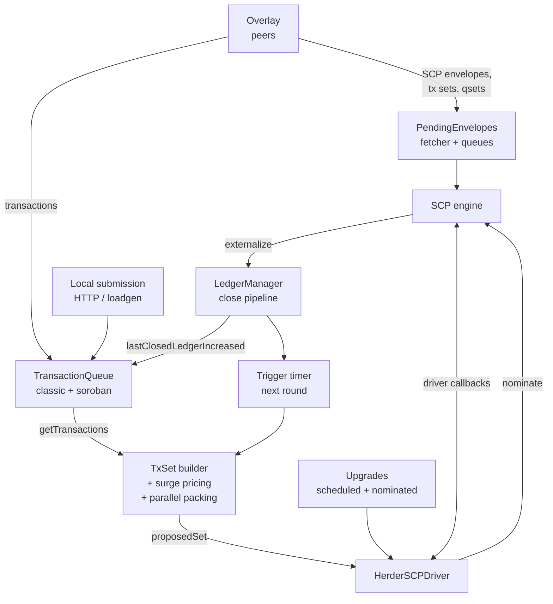
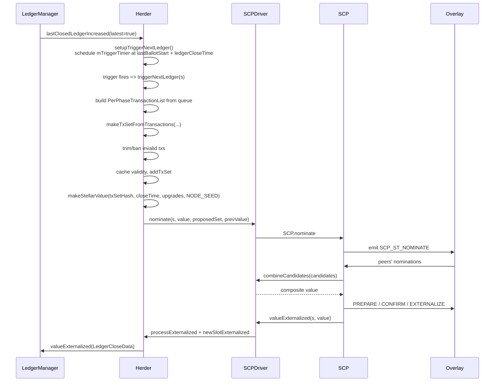

# Stellar Herder Specification

**Version:** 27 (stellar-core v27.0.0 / Protocol 27)
**Status:** Informational
**Date:** 2026-06-21

---

## Table of Contents

1. [Introduction](#1-introduction)
2. [Architecture](#2-architecture)
3. [Data Types](#3-data-types)
4. [Herder State Machine](#4-herder-state-machine)
5. [Consensus Round Lifecycle](#5-consensus-round-lifecycle)
6. [StellarValue Construction and Validation](#6-stellarvalue-construction-and-validation)
7. [Transaction Set Construction](#7-transaction-set-construction)
8. [Parallel Soroban Phase Construction](#8-parallel-soroban-phase-construction)
9. [Transaction Set Validation](#9-transaction-set-validation)
10. [Transaction Set Apply Ordering](#10-transaction-set-apply-ordering)
11. [Candidate Combination](#11-candidate-combination)
12. [Transaction Queue](#12-transaction-queue)
13. [Surge Pricing and Eviction](#13-surge-pricing-and-eviction)
14. [Transaction Broadcasting](#14-transaction-broadcasting)
15. [SCP Envelope Management](#15-scp-envelope-management)
16. [Protocol Upgrades](#16-protocol-upgrades)
17. [Invariants and Safety Properties](#17-invariants-and-safety-properties)
18. [Constants](#18-constants)
19. [References](#19-references)
20. [Appendix A: Worked TxSet Construction Example](#appendix-a-worked-txset-construction-example)
21. [Appendix B: Parallel Soroban Packing Illustration](#appendix-b-parallel-soroban-packing-illustration)

---

## 1. Introduction

### 1.1 Purpose and Scope

This specification describes the observable behavior of the Stellar Herder
subsystem: the protocol-facing logic that drives the Stellar Consensus
Protocol (SCP) on behalf of a node, manages the transaction queue from which
nominations are drawn, constructs and validates transaction sets, combines
candidate values during the SCP nomination round, and schedules
protocol-level upgrades.

This specification is **implementation agnostic**. It is derived exclusively
from the vetted stellar-core C++ implementation (v27.0.0). Any conforming
implementation that produces identical SCP envelopes, externalized
StellarValues, transaction set hashes, and post-close ledger state for all
valid inputs is considered correct.

**In scope**:

- Herder lifecycle states and transitions (BOOTING / SYNCING / TRACKING).
- The end-to-end consensus round (trigger, nomination, ballot, externalize).
- `StellarValue` construction, signing, and validation.
- Transaction set construction, surge pricing, the lane model, and parallel
  Soroban packing.
- Transaction set validation rules (XDR structure, semantic, per-phase, and
  per-transaction).
- Apply-order determination for sequential and parallel phases.
- Candidate combination logic during SCP nomination convergence.
- Transaction queue lifecycle: reception, aging, replace-by-fee, banning,
  and broadcasting.
- SCP envelope reception, fetching, and queuing.
- Protocol upgrade scheduling, validation, merging, and expiration.

**Out of scope**:

- The internals of SCP itself (nomination/ballot protocols, federated
  voting, quorum tests). See SCP_SPEC.
- Overlay/network message framing, peer authentication, and flow control.
  See OVERLAY_SPEC.
- Ledger close pipeline mechanics, ledger header construction, and storage.
  See LEDGER_SPEC.
- Transaction validation, signing, and application semantics. See TX_SPEC.
- BucketList layout, eviction, and indexing. See BUCKETLISTDB_SPEC.
- Catchup, history publishing, and crash recovery. See CATCHUP_SPEC.
- Persistence schemas, SQL layout, threading models, logging, metrics, and
  any other implementation-internal details.

### 1.2 Conventions and Terminology

The key words MUST, MUST NOT, REQUIRED, SHALL, SHALL NOT, SHOULD, SHOULD
NOT, RECOMMENDED, MAY, and OPTIONAL in this document are to be interpreted
as described in [RFC 2119][rfc2119] and [RFC 8174][rfc8174] when, and only
when, they appear in all capitals.

**Glossary**:

| Term | Definition |
|------|------------|
| Herder | The subsystem that drives SCP, manages the transaction queue, and constructs/validates transaction sets. |
| Slot | A consensus round bound to a ledger sequence number. |
| Slot index | The 64-bit integer naming a slot; conceptually equal to the ledger sequence number being decided. |
| LCL | Last Closed Ledger; the most recently externalized ledger applied to the local state. |
| Tracking | A Herder state in which the node has a reliable estimate of the network's current slot index. |
| Nomination | The first phase of SCP, in which validators propose values for a slot. |
| Ballot protocol | The second phase of SCP, in which validators converge on a single value via PREPARE/CONFIRM/EXTERNALIZE statements. |
| Externalize | The terminal SCP event for a slot, fixing the externalized `StellarValue`. |
| `StellarValue` | The atomic unit on which SCP votes: a tx set hash, a close time, optional upgrade steps, and a signature. |
| Tx set | The ordered set of transactions to apply in a slot, plus phase structure and fee information. |
| Phase | A logically homogeneous block of transactions within a tx set: currently CLASSIC or SOROBAN. |
| Stage | In a parallel Soroban phase, a sequential checkpoint that all later stages await. |
| Cluster | In a parallel Soroban phase, a group of transactions inside a stage that may share state and apply on a single worker. |
| Inclusion fee | The portion of a transaction's fee bid used for fee competition (excluding flat surcharges such as the Soroban resource fee). |
| Surge pricing | A mechanism that raises the effective per-operation base fee for a slot when transaction demand exceeds capacity. |
| Lane | A logical grouping for surge pricing comparison (e.g., a DEX lane separates DEX-bearing classic transactions from the generic lane). |
| Replace-by-fee | The mechanism by which a fee-bump transaction MAY replace an existing transaction with the same source/seq, provided it pays a sufficient fee premium. |

### 1.3 Notation

Pseudocode uses:

- `camelCase` for variables and functions.
- `SCREAMING_SNAKE_CASE` for XDR enum values and protocol-level result
  codes.
- `@version(≥N)` / `@version(<N)` annotations to gate logic by protocol
  version.
- Plain `if` / `for each` / `return` control flow, language-agnostic.

XDR types are referenced by name (e.g., `StellarValue`,
`GeneralizedTransactionSet`) without reproducing their definitions; see the
companion specs that own each type.

### 1.4 Relationship to Other Specifications

| Specification | Relationship |
|---------------|--------------|
| SCP_SPEC | Herder is the protocol-aware driver of the abstract SCP state machine; sections 4–5 and 15 here invoke SCP_SPEC primitives. |
| OVERLAY_SPEC | Herder emits SCP envelopes for, and consumes envelopes/tx-sets/qsets from, the overlay. The fetcher pattern in §15 relies on overlay message types. |
| LEDGER_SPEC | Externalized values are forwarded to the ledger close pipeline. Tx set construction reads the LCL header and Soroban network configuration produced by LEDGER. |
| TX_SPEC | All per-transaction validity, fee, and resource checks defer to TX_SPEC. Herder only enforces set-level structure and aggregate limits. |
| BUCKETLISTDB_SPEC | Herder reads but does not write the BucketList; transactions are validated against a `LedgerSnapshot`. |
| CATCHUP_SPEC | Herder's TRACKING state, lost-sync recovery, and `setInSyncAndTriggerNextLedger` interact with catchup to recover from gaps. |

---

## 2. Architecture

Herder mediates between the network (overlay), the abstract consensus
engine (SCP), the ledger close pipeline (ledger manager), and the
user-facing transaction submission paths.



The Herder MUST:

- Maintain a single instance of the SCP driver and a single transaction
  queue per phase (classic, and Soroban once the protocol enables it).
- Process all SCP envelopes and ledger close events on a single
  deterministic thread of control with respect to protocol state.
  Background work (e.g., quorum intersection analysis, persistence, RPC)
  MAY be done asynchronously but MUST NOT mutate protocol state.
- Drive at most one nomination round per slot and emit exactly one
  externalize event per externalized slot.

---

## 3. Data Types

Herder defines no protocol-level XDR types of its own. It consumes types
defined elsewhere:

| Type | Defined in | Role |
|------|------------|------|
| `StellarValue` | LEDGER_SPEC (XDR `Stellar-ledger.x`) | The value voted on per slot. Contains `txSetHash`, `closeTime`, `upgrades`, and (in `STELLAR_VALUE_SIGNED`) a `LedgerCloseValueSignature`. |
| `SCPEnvelope`, `SCPStatement`, `SCPQuorumSet` | SCP_SPEC (XDR `Stellar-SCP.x`) | Carry per-validator votes and quorum configuration. |
| `TransactionSet` | TX_SPEC (XDR `Stellar-transaction.x`) | Legacy (pre-protocol-20) wire form of a tx set: previous ledger hash plus a sorted sequence of envelopes. |
| `GeneralizedTransactionSet` | TX_SPEC (XDR `Stellar-transaction.x`) | Protocol 20+ wire form. Carries explicit phases and per-component base fees; phases MAY be sequential (`v=0`) or parallel (`v=1`, Soroban only). |
| `TransactionPhase` / `ParallelTxsComponent` | TX_SPEC | Building blocks of `GeneralizedTransactionSet`: a phase contains components; a parallel component carries `executionStages` (stages of clusters of envelopes). |
| `LedgerUpgrade`, `UpgradeType` | LEDGER_SPEC | Upgrade values voted on inside `StellarValue.upgrades`. |
| `ConfigUpgradeSetKey`, `ConfigUpgradeSet` | LEDGER_SPEC | Soroban network-configuration upgrade referenced by content hash. |
| `LedgerCloseData` | Internal coupling type | Bundles `(ledgerSeq, txSet, StellarValue)` for handoff to the ledger close pipeline. |

The wire-level transaction set value referenced by `txSetHash` is a
`TxSetXDRFrame`, which is either a legacy `TransactionSet` (protocol < 20)
or a `GeneralizedTransactionSet` (protocol ≥ 20). The hash is:

- For legacy form: SHA-256 of `previousLedgerHash` concatenated with
  XDR-encoded envelopes in hash order.
- For generalized form: SHA-256 of the entire encoded
  `GeneralizedTransactionSet`.

The `ApplicableTxSetFrame` is the in-memory, validated, applicable
counterpart: it groups transactions by phase, knows each transaction's
discount base fee, and exposes apply order.

---

## 4. Herder State Machine

The Herder operates in one of three states:

```mermaid
stateDiagram-v2
    [*] --> BOOTING
    BOOTING --> SYNCING: start() at genesis without FORCE_SCP
    BOOTING --> TRACKING: start() with restored or bootstrapped state
    SYNCING --> TRACKING: externalize newer slot
    TRACKING --> SYNCING: consensus stuck timeout fires
    TRACKING --> TRACKING: externalize next slot
    SYNCING --> SYNCING: outOfSyncRecovery
    note right of BOOTING: Forbidden:<br/>TRACKING -> BOOTING,<br/>SYNCING -> BOOTING
```

**State semantics**:

| State | Meaning |
|-------|---------|
| `HERDER_BOOTING_STATE` | No tracking estimate yet. `trackingConsensusLedgerIndex()` MUST NOT be called. |
| `HERDER_SYNCING_STATE` | Tracking estimate exists but the node is not in sync with the network for the next slot. |
| `HERDER_TRACKING_NETWORK_STATE` | The node believes its tracked slot equals the network's current slot and MAY participate in nomination. |

**Transition rules**:

1. `setState(BOOTING)` MUST fail if the previous state is TRACKING or
   SYNCING. Once Herder has acquired a tracking estimate, it MUST NOT
   regress to BOOTING.
2. `setTrackingSCPState(slotIndex, value, isTrackingNetwork)` sets the
   tracking record and selects TRACKING or SYNCING from the
   `isTrackingNetwork` flag.
3. `valueExternalized` for a slot strictly greater than the current
   tracking index transitions to TRACKING and updates the tracking
   record. Older slots leave the state unchanged.
4. The tracking timer (default `CONSENSUS_STUCK_TIMEOUT_SECONDS`)
   restarts on every externalize and ledger application. When it fires
   while the node is not applying, the node transitions to SYNCING
   (`herderOutOfSync`) and starts the out-of-sync recovery timer
   (`OUT_OF_SYNC_RECOVERY_TIMER`).
5. The invariant `trackingConsensusLedgerIndex() ≥ LCL.ledgerSeq` MUST
   hold; violation is a fatal internal error.

`isTracking()` MUST return `true` if and only if the state is
`HERDER_TRACKING_NETWORK_STATE`.

---

## 5. Consensus Round Lifecycle

A consensus round for slot `s = LCL + 1` proceeds as:



### 5.1 Trigger

Trigger setup (`setupTriggerNextLedger`) MUST be invoked only after the
ledger close pipeline has produced LCL for slot `s-1`, and MUST satisfy:

- `LedgerManager.isApplying() == false`.
- `Herder.isTracking() == true`.
- `trackingConsensusLedgerIndex() == LCL.ledgerSeq`.
- `LedgerManager.isSynced() == true`.

Trigger time is computed as `lastBallotStart + expectedLedgerCloseTime`,
where `lastBallotStart` is the recorded start of the previous slot's
PREPARE phase if available, otherwise `now - expectedLedgerCloseTime` (a
pessimistic estimate). If the resulting trigger time is in the past, it
is advanced to `now`.

The trigger time is further adjusted forward by `ctValidityOffset` to
guarantee that the next nominated `closeTime` (which MUST be strictly
greater than `LCL.scpValue.closeTime`) will lie within the allowed
close-time window when the trigger fires.

If `MANUAL_CLOSE` is configured the trigger timer is not armed; instead,
a new round MUST be initiated via an external command.

### 5.2 Nomination

`triggerNextLedger(s, checkTracking)` MUST:

1. Skip if not tracking (when `checkTracking` is set) or not synced.
2. Skip if the ledger pipeline is currently applying.
3. Collect transactions per phase from the queue(s):
   - `phases[CLASSIC] = mTransactionQueue.getTransactions(LCL.header)`
   - If `@version(≥SOROBAN_PROTOCOL_VERSION)`:
     `phases[SOROBAN] = mSorobanTransactionQueue.getTransactions(LCL.header)`
4. Pick `nextCloseTime`:
   - Start with `now` (system clock seconds).
   - If `nextCloseTime ≤ LCL.scpValue.closeTime`, set
     `nextCloseTime = LCL.scpValue.closeTime + 1`.
   - If `ctValidityOffset(nextCloseTime) > 0`, abort the nomination
     (clock is too far ahead of real time).
5. Compute
   `lowerBoundCloseTimeOffset = upperBoundCloseTimeOffset =
    nextCloseTime - LCL.scpValue.closeTime`.
6. Call `makeTxSetFromTransactions(phases, …, invalidTxs)`.
7. Cache the proposed tx set as valid in the tx-set validity cache.
8. Ban each invalid tx by phase (`mTransactionQueue.ban`,
   `mSorobanTransactionQueue.ban`).
9. Insert the proposed tx set into `PendingEnvelopes` so peers can
   fetch.
10. Reload the LCL: if a side-effect of `addTxSet` advanced the ledger
    (handover to ledger pipeline), abort the nomination.
11. Construct `newUpgrades` from
    `mUpgrades.createUpgradesFor(LCL.header, ledgerSnapshot)`. An
    upgrade whose XDR encoding meets or exceeds
    `UpgradeType::max_size()` is dropped with an error log.
12. If the node is not a validator (`!SCP.isValidator()`), stop here.
    Non-validators still build and cache a tx set so they can answer
    fetches.
13. Sign `StellarValue` via
    `makeStellarValue(txSetHash, nextCloseTime, upgrades, NODE_SEED)`
    and call
    `SCPDriver.nominate(s, value, proposedSet,
     previousValue=LCL.scpValue)`.

The Herder MUST emit at most one `nominate` call per slot. Subsequent
externalizations of the same slot are handled by SCP idempotently.

### 5.3 Ballot and Externalize

Ballot protocol is wholly driven by SCP and is described in SCP_SPEC.
The driver's role is limited to:

- Setting up timers requested by SCP (§5.4).
- Reporting prepare/externalize timings for metrics.
- Performing value validation (§6).

When SCP externalizes a value for slot `s`, the driver:

1. Cancels all timers for slots ≤ `s`.
2. Parses the externalized value (which MUST succeed; failure is a
   fatal internal error).
3. If `s > trackingConsensusLedgerIndex()`, treats it as the latest
   slot: stops nomination (`SCP.stopNomination`), updates tracking via
   `setTrackingSCPState(s, value, true)`, then forwards to
   `HerderImpl.valueExternalized(s, value, isLatestSlot=true)`.
4. Otherwise (catching up on older slots), forwards directly to
   `HerderImpl.valueExternalized(s, value, isLatestSlot=false)` without
   touching tracking.

`HerderImpl.valueExternalized` then:

1. Records close-time drift in the sliding window
   (`CLOSE_TIME_DRIFT_LEDGER_WINDOW_SIZE` samples).
2. If `isLatestSlot`:
   - Records a tracking heartbeat (restarts the stuck-consensus
     timer).
   - Cancels the trigger timer.
   - Calls `processExternalized` (which merges in the externalized
     upgrades via `mUpgrades.removeUpgrades` and constructs a
     `LedgerCloseData`).
   - Forwards to `LedgerManager.valueExternalized` for application.
   - Performs `newSlotExternalized` cleanup (envelope/timer/tx-set
     eviction outside the validity bracket).
   - Triggers quorum-map re-analysis if the transitive quorum has
     changed.
3. Otherwise forwards a non-latest externalize to LedgerManager, which
   MAY buffer it for sequential application.

`processExternalized` MUST persist SCP history for the previous slot
(without quorum map) before persisting the current slot (with the
current quorum map), when `MODE_STORES_HISTORY_MISC` is enabled.

### 5.4 Timers

SCP requests two timer kinds per slot via
`setupTimer(slotIndex, timerID, timeout, cb)`:

- `NOMINATION_PROTOCOL_TIMER`
- `BALLOT_PROTOCOL_TIMER`

Driver behavior:

- Timers for slots `≤ trackingConsensusLedgerIndex()` MUST NOT be
  armed; they are dropped.
- When a timer fires for a future slot (Herder tracking has not yet
  advanced to the slot's index), the callback is rescheduled with a
  1-second delay rather than executed.
- Timer durations are computed via
  `computeTimeout(roundNumber, isNomination)`:
  - `@version(<23)`: linear schedule
    `timeoutMS = 1000 + (roundNumber - 1) × 1000`,
    capped at `MAX_TIMEOUT_MS = 30 × 60 × 1000`.
  - `@version(≥23)`: reads `nominationTimeoutInitialMilliseconds`,
    `nominationTimeoutIncrementMilliseconds`,
    `ballotTimeoutInitialMilliseconds`, and
    `ballotTimeoutIncrementMilliseconds` from the Soroban network
    configuration, then applies the same
    `initial + (round-1) × increment` formula with the same cap.

---

## 6. StellarValue Construction and Validation

### 6.1 Construction

`makeStellarValue(txSetHash, closeTime, upgrades, key)` MUST:

1. Set `ext.v() = STELLAR_VALUE_SIGNED`.
2. Set `txSetHash`, `closeTime`, `upgrades` to the provided values.
3. Set `ext.lcValueSignature().nodeID = key.publicKey`.
4. Set `ext.lcValueSignature().signature = key.sign(domainSeparator)`
   where `domainSeparator =
   xdrEncode(networkID, ENVELOPE_TYPE_SCPVALUE, txSetHash, closeTime)`.

A value with `ext.v() != STELLAR_VALUE_SIGNED` MUST be rejected during
validation (§6.2).

### 6.2 Validation

`validateValue(slotIndex, value, nomination)` MUST execute the
following checks in order; the first failure returns `kInvalidValue`:

1. **XDR**: deserialize `value` into a `StellarValue`. Failure → invalid.
2. **Signed value type**: `sv.ext.v() == STELLAR_VALUE_SIGNED`. Failure
   → invalid.
3. **Signature**: verify the signature against
   `(networkID, ENVELOPE_TYPE_SCPVALUE, txSetHash, closeTime)`. Failure
   → invalid.
4. **Local state validation** (`validateValueAgainstLocalState`):
   - If `slotIndex == LCL.ledgerSeq + 1` (current slot):
     - Check `closeTime` via `checkCloseTime`:
       - `closeTime > LCL.scpValue.closeTime`, AND
       - `closeTime ≤ now + MAX_TIME_SLIP_SECONDS`.
     - Fetch tx set by `txSetHash`. Missing → invalid.
     - Validate tx set via `checkAndCacheTxSetValid` (§9). Invalid
       → invalid; valid → `kFullyValidatedValue`.
   - If `slotIndex == LCL.ledgerSeq` (prior slot):
     - `closeTime == LCL.scpValue.closeTime`. Otherwise invalid.
   - If `slotIndex < LCL.ledgerSeq` (older):
     - `closeTime < LCL.scpValue.closeTime`. Otherwise invalid.
   - If `slotIndex > LCL.ledgerSeq + 1` (future):
     - Validate close time via `checkCloseTime`.
     - If not tracking: return `kMaybeValidValue`.
     - If tracking and `nextConsensusLedgerIndex() > slotIndex`: return
       `kMaybeValidValue` (already past it).
     - If tracking and `nextConsensusLedgerIndex() < slotIndex`: return
       invalid (this is unexpected while tracking).
     - Otherwise, check close time against
       `trackingConsensusCloseTime()` and return `kMaybeValidValue`.
5. **Upgrade validity and ordering**: iterate `sv.upgrades`:
   - Each step is decoded and validated via `Upgrades.isValid` (§16).
   - The upgrade type sequence MUST be strictly increasing (i.e.,
     `lastUpgradeType < thisUpgradeType` for every step after the
     first). Any out-of-order step → invalid.

Validators MUST treat `kFullyValidatedValue` and `kMaybeValidValue` as
defined by SCP_SPEC; only `kFullyValidatedValue` permits the value to be
nominated locally.

### 6.3 Extract Valid Value

`extractValidValue(slotIndex, value)` is used by SCP nomination to drop
upgrade steps the local node disagrees with. It MUST:

1. Parse the value.
2. Validate against local state (must be `kFullyValidatedValue`).
3. Remove every upgrade step for which
   `Upgrades.isValid(step, type, nomination=true, …)` returns `false`.
4. Return the stripped value wrapped for SCP.

### 6.4 Close-Time Envelope Filter

Independent of value validation, every received `SCPEnvelope` MUST pass
`checkCloseTime(env, enforceRecent)` (see §15.1):

- `enforceRecent` sets a lower bound
  `ctCutoff = now - MAXIMUM_LEDGER_CLOSETIME_DRIFT` for very old
  messages.
- For each `StellarValue` in the envelope, the close time MUST either:
  - Equal `LCL.scpValue.closeTime` (if its slot equals
    `LCL.ledgerSeq`), or
  - Be strictly less than `LCL.scpValue.closeTime` (older slot), or
  - Pass `checkCloseTime(slotIndex, lastCloseTime, sv)` (future slot).
- If `isTracking()`, `lastCloseTime` is upgraded to
  `trackingConsensusCloseTime()` when the envelope's slot index is at
  least `trackingConsensusLedgerIndex()`.

---

## 7. Transaction Set Construction

`makeTxSetFromTransactions(perPhaseTxs, app, lowerBoundCt,
upperBoundCt, invalidTxs)` produces a `(TxSetXDRFrame,
ApplicableTxSetFrame)` pair. The output is guaranteed to pass
`checkValid(lowerBoundCt, upperBoundCt)`.

### 7.1 Phase Structure

Phases are indexed by `TxSetPhase`:

| Index | Phase | Present from |
|-------|-------|--------------|
| 0 | `CLASSIC` | All protocol versions. |
| 1 | `SOROBAN` | `@version(≥SOROBAN_PROTOCOL_VERSION)`. |

For each phase `i` the implementation MUST verify that every
transaction in `perPhaseTxs[i]` matches the expected kind
(`tx.isSoroban() == (i == SOROBAN)`); a mismatch is a contract violation
by the caller and MUST abort construction.

### 7.2 Per-Phase Pipeline

For each phase:

1. **Trim invalid transactions** (`TxSetUtils.trimInvalid`): runs
   per-tx validity against the LCL snapshot using the given close-time
   bounds and a cross-phase `accountFeeMap`. Invalid txs are moved into
   `invalidTxs[i]`.
2. **Apply surge pricing** (`applySurgePricing`, §13):
   - Build the surge pricing lane config for the phase (§13.1).
   - For sequential phases: invoke
     `SurgePricingPriorityQueue.getMostTopTxsWithinLimits` returning a
     `TxFrameList`.
   - For the parallel Soroban phase
     (`@version(≥PARALLEL_SOROBAN_PHASE_PROTOCOL_VERSION)`): invoke
     `buildSurgePricedParallelSorobanPhase` returning a
     `TxStageFrameList` (§8).
   - Compute the per-lane lowest per-op fee
     (`computePerOpFee(tx, ledgerVersion)`) and combine with
     `hadTxNotFittingLane` to derive the lane base fees via
     `computeLaneBaseFee`:
     - If the generic lane filled, every lane's base fee MUST be the
       overall minimum (`minBaseFee`).
     - If a limited lane filled, that lane's base fee MUST be its own
       lowest per-op fee.
     - Otherwise the lane base fee MUST equal `LCL.baseFee` (no
       surge).
3. **Wrap in `TxSetPhaseFrame`**: store transactions plus an
   `InclusionFeeMap` mapping each included tx to its lane base fee.

### 7.3 Wire Encoding

Constructed phases are written to XDR:

- **Sequential phase** → `TransactionPhase.v(0)` with one
  `TXSET_COMP_TXS_MAYBE_DISCOUNTED_FEE` component per distinct base
  fee. Components MUST be sorted by base fee with `nullopt` first, and
  base fees MUST be unique across components. Transactions within a
  component MUST be sorted in hash order (`TxSetUtils.hashTxSorter`).
- **Parallel phase** → `TransactionPhase.v(1)` with a single
  `ParallelTxsComponent` carrying `executionStages`. All transactions
  in a parallel phase MUST share the same base fee; the wire form MUST
  reject (and the builder MUST assert) any inconsistency. Stages,
  clusters, and transactions within a cluster MUST be sorted in hash
  order.

After construction, the builder MUST roundtrip the constructed set
through XDR (`prepareForApply`) and re-validate it. Any divergence
between the preliminary and round-tripped frame (number of phases or
per-phase tx count) is a fatal internal error.

### 7.4 Empty Tx Set

`TxSetXDRFrame.makeEmpty(lclHeader)` MUST produce:

- `@version(<SOROBAN_PROTOCOL_VERSION)`: a legacy `TransactionSet` with
  no transactions.
- `@version(≥SOROBAN_PROTOCOL_VERSION)`: a `GeneralizedTransactionSet`
  with two phases, both empty. The Soroban phase MUST be a parallel
  empty phase iff
  `@version(≥PARALLEL_SOROBAN_PHASE_PROTOCOL_VERSION)`.

---

## 8. Parallel Soroban Phase Construction

`@version(≥PARALLEL_SOROBAN_PHASE_PROTOCOL_VERSION)` only.

The Soroban phase becomes a `TxStageFrameList`: a sequence of stages,
each containing clusters. A stage MUST complete before the next begins;
clusters within a stage may run independently.

### 8.1 Build Inputs and Output

Inputs:

- Transactions selected by the upstream surge pricing prefilter
  (Soroban uses a single generic lane).
- Network configuration: `ledgerMaxDependentTxClusters` and
  `ledgerMaxInstructions` from the live Soroban network config.
- Per-transaction instructions (`tx.sorobanResources().instructions`)
  and footprint (`readOnly` + `readWrite`).

For each candidate `stageCount` in
`[SOROBAN_PHASE_MIN_STAGE_COUNT, SOROBAN_PHASE_MAX_STAGE_COUNT]` the
builder constructs a tentative phase and records its total inclusion
fee. The selected result MUST be the one with the smallest stage count
whose total inclusion fee is at least
`MAX_INCLUSION_FEE_TOLERANCE_FOR_STAGE_COUNT × maxTotalInclusionFee`
(0.999 × maximum). The remaining transactions form
`hadTxNotFittingLane`.

### 8.2 Per-Stage Packing Algorithm

For a fixed `stageCount`:

- `clustersPerStage = ledgerMaxDependentTxClusters`.
- `instructionsPerCluster = ledgerMaxInstructions / stageCount`.
- `instructionsPerStage = instructionsPerCluster × clustersPerStage`.

Transactions are considered in decreasing fee order
(`TxFeeComparator(isGreater=true)`). For each transaction, the builder
attempts to add it to a stage, then moves to the next stage if
rejection occurs. A transaction is added to a stage by:

1. Computing the set of existing clusters that conflict with the
   transaction's footprint (RW–RW or RW–RO conflicts).
2. Forming a merged cluster (transaction + all conflicting clusters);
   rejecting if the merged cluster's instruction sum exceeds
   `instructionsPerCluster`.
3. Attempting an in-place first-fit bin-pack of the new merged cluster
   into the stage's `clustersPerStage` bins.
4. If in-place packing fails and there were no conflicts, attempting
   one global first-fit-decreasing repack; on a second failure with no
   conflicts, the stage MUST be considered full for further insertions
   beyond this fast-path heuristic.

### 8.3 Conflict Detection

Two transactions conflict iff their footprints have:

- a key in `readWrite` shared by either transaction's `readWrite`, OR
- a key in `readOnly` shared by another's `readWrite`.

Two transactions sharing only `readOnly` keys do NOT conflict.

Implementations MAY hash footprint keys for conflict grouping; hash
collisions MUST be conservatively treated as conflicts. Within a single
transaction, duplicated entries (rare collision case) MUST NOT be
reported as a self-conflict.

### 8.4 Determinism

The packing result depends on:

- The input fee order (broken by a random tiebreaker seed: the seed is
  produced from a pseudo-random source for nomination; for replay the
  packing is reconstructed deterministically from the wire form).
- The fixed stage count.
- The protocol-level Soroban network configuration.

The wire form fully describes the packing, so apply-time behavior is
deterministic.

---

## 9. Transaction Set Validation

`ApplicableTxSetFrame.checkValid(lowerBoundCt, upperBoundCt)` MUST
execute checks in the following order. The first failing check MUST be
returned as the validation result (`TxSetValidationResult`):

1. **Previous ledger hash**: `previousLedgerHash == LCL.hash`.
   Otherwise `PREVIOUS_LEDGER_HASH_MISMATCH`.
2. **Form match**: generalized iff
   `@version(≥SOROBAN_PROTOCOL_VERSION)`. Otherwise
   `GENERALIZED_TXSET_MISMATCH`.
3. **Phase count**: 2 phases for generalized, exactly 1 for legacy
   (enforced by the constructor).
4. **No duplicate source account across phases** (only for generalized
   sets): a source account MUST appear in at most one transaction
   across all phases. Otherwise `MULTIPLE_TXS_PER_SOURCE_ACCOUNT`.
5. **Per-phase validation** in phase order:
   - Validate the phase's inclusion fee map (§9.1).
   - Validate per-phase type matching (§9.2).
   - Validate phase-specific limits (§9.3 for classic, §9.4 for
     Soroban).
   - Validate per-transaction legality (§9.5), unless the caller has
     already validated them (`txsAreValidated=true`).
6. **Cross-phase fee accumulation**:
   - `@version(≥V_26)`: a single `accountFeeMap` MUST accumulate across
     both phases.
   - `@version(<V_26)`: the `accountFeeMap` is cleared between phases.

### 9.1 Inclusion Fee Map Check

For every `(tx, baseFee)` in the inclusion fee map with
`baseFee.has_value()`:

- `baseFee ≥ LCL.baseFee`. Otherwise `COMPONENT_BASE_FEE_TOO_LOW`.
- `tx.getInclusionFee() ≥ getMinInclusionFee(tx, LCL, baseFee)`.
  Otherwise `TX_FEE_BID_TOO_LOW`.

The `nullopt` base fee (legacy non-discounted component) carries no fee
check (the network ledger fee applies).

### 9.2 Phase Type Check

For every transaction in the phase,
`tx.isSoroban() == (phase == SOROBAN)`. Otherwise
`INVALID_PHASE_TX_TYPE`.

### 9.3 Classic Phase Check

- The phase MUST NOT be parallel. Otherwise
  `CLASSIC_PHASE_PARALLEL_NOT_ALLOWED`.
- `@version(≥V_11)`: `phase.sizeOp() ≤ LCL.maxTxSetSize`. Otherwise
  `TOO_MANY_CLASSIC_TXS`.
- `@version(<V_11)`: `phase.sizeTx() ≤ LCL.maxTxSetSize`. Same error
  code.

### 9.4 Soroban Phase Check

- Parallel iff
  `@version(≥PARALLEL_SOROBAN_PHASE_PROTOCOL_VERSION)`. Otherwise
  `SOROBAN_PARALLEL_SUPPORT_MISMATCH`.
- Aggregate resources (sum of per-tx resources) MUST be representable
  without overflow. Otherwise `SOROBAN_RESOURCES_OVERFLOW`.
- Aggregate resources, with the instructions component relaxed in the
  parallel case (see below), MUST be ≤ ledger limits. Otherwise
  `SOROBAN_RESOURCES_EXCEED_LIMIT`.

If the phase is parallel:

- Each stage MUST contain ≤ `ledgerMaxDependentTxClusters` clusters.
  Otherwise `TOO_MANY_SOROBAN_CLUSTERS`.
- For each stage, compute
  `stageInstructions = max over clusters of sum(tx.instructions in cluster)`,
  accumulating overflow checks:
  - Within a cluster, summing instructions MUST NOT overflow
    `int64_t`. Otherwise
    `SOROBAN_SEQUENTIAL_INSTRUCTIONS_OVERFLOW`.
  - Accumulating `stageInstructions` across stages MUST NOT overflow
    `int64_t`. Otherwise `SOROBAN_INSTRUCTIONS_OVERFLOW`.
- The cumulative total `sum(stageInstructions)` MUST be
  ≤ `ledgerMaxInstructions`. Otherwise
  `SOROBAN_INSTRUCTIONS_EXCEED_LIMIT`.
- For each stage, no two clusters MAY share footprint dependencies:
  - A key in one cluster's `readOnly` MUST NOT appear in another
    cluster's `readWrite`.
  - A key in one cluster's `readWrite` MUST NOT appear in another
    cluster's `readOnly` or `readWrite`.
  - Violation: `TX_ORDERING_INVALID`.

### 9.5 Per-Transaction Validation

When `txsAreValidated=false`, the phase calls
`TxSetUtils.getInvalidTxListWithErrors(*this, app, accountFeeMap,
lowerBoundCt, upperBoundCt)`. This MUST:

- Run each transaction through the overlay validity check (TX_SPEC).
- Accumulate fee debits per account into `accountFeeMap`: each
  transaction's `fullFee` is added to the fee source account's running
  total, and the account's
  `availableBalance(LCL, account) - accumulatedFees` MUST stay ≥ 0.
  Otherwise `ACCOUNT_CANT_PAY_FEE`.
- Surface the first failure as `TX_VALIDATION_FAILED` or
  `ACCOUNT_CANT_PAY_FEE`.

### 9.6 XDR-Level Phase Structure (Wire Decoding)

When decoding a `GeneralizedTransactionSet` from the wire,
`validateTxSetXDRStructure` MUST verify:

- `txSet.v() == 1`. Otherwise `UNSUPPORTED_VERSION`.
- Exactly 2 phases (`WRONG_PHASE_COUNT`).
- For each phase:
  - `phase.v() ≤ 1`. Otherwise `UNSUPPORTED_PHASE_VERSION`.
  - If `phase.v() == 1`: the phase MUST be the Soroban phase
    (`NON_SOROBAN_PARALLEL_PHASE`), and inside `parallelTxsComponent`
    every stage MUST be non-empty (`EMPTY_STAGE`) and every cluster
    MUST be non-empty (`EMPTY_CLUSTER`).
  - If `phase.v() == 0`: components MUST be sorted by base fee
    (`INCORRECT_COMPONENT_ORDER`), base fees MUST be unique across
    components (`DUPLICATE_COMPONENT_BASE_FEES`), and no component
    MAY be empty (`EMPTY_COMPONENT`).
- Transactions within a component (sequential) or within a cluster
  (parallel) MUST be sorted in hash order; stages MUST be sorted by
  the hash of their first cluster's first transaction.

### 9.7 Tx Set Validity Cache

The Herder SCP driver caches validation results keyed by
`(lclHash, txSetHash, lowerBoundCt, upperBoundCt)`
(`TXSETVALID_CACHE_SIZE = 1000`). A cache hit returns the cached
boolean directly. A cached `false` result combined with a fresh `true`
evaluation is a fatal internal error
(`Inconsistent txSet validity`).

---

## 10. Transaction Set Apply Ordering

`ApplicableTxSetFrame.getPhasesInApplyOrder()` produces, for each
phase, a deterministic apply order derived from the tx set hash.

### 10.1 Sequential Phase (Legacy and Generalized Sequential)

1. Build per-account FIFO queues from transactions belonging to each
   source account, in ascending sequence-number order.
2. While any account queue is non-empty, take the head of every
   non-empty queue, forming a batch.
3. Sort each batch using `ApplyTxSorter(txSetHash)`: a comparator that
   XORs each transaction's full hash with the tx set hash and compares
   the result lexicographically (`lessThanXored`).
4. Append the sorted batch to the output list.

This guarantees:

- Transactions for the same source account apply in sequence-number
  order.
- The cross-account interleaving is unpredictable to anyone who does
  not know the tx set hash, mitigating front-running.

### 10.2 Parallel Soroban Phase

1. Within each cluster, sort transactions with
   `ApplyTxSorter(txSetHash)`.
2. Sort stages by the first transaction of the first cluster (via the
   same comparator). Clusters within a stage are not reordered because
   they are independent.

Cluster apply may exploit parallelism per-cluster; stages are applied
sequentially.

---

## 11. Candidate Combination

During SCP nomination convergence,
`combineCandidates(slotIndex, candidates)` MUST produce a single
composite `StellarValue`. The procedure is:

1. Parse every candidate value. Any malformed candidate is a fatal
   internal error.
2. Maintain `candidatesHash = XOR of sha256(value)` across all
   candidates — used as the tiebreaker seed.
3. **Tx set selection** — pick the highest candidate among those whose
   `txSet.previousLedgerHash == LCL.hash` via `compareTxSets`:
   - **Primary**: `txSet.size(LCL)` (operations under
     `@version(≥V_11)`, otherwise transactions). Largest wins.
   - **Tie-break 1** (`@version(≥SOROBAN_PROTOCOL_VERSION)`): total
     inclusion fees. Largest wins.
   - **Tie-break 2** (`@version(≥V_11)`): total fees. Largest wins.
   - **Tie-break 3** (`@version(≥SOROBAN_PROTOCOL_VERSION)`): encoded
     XDR size. **Smallest** wins.
   - **Final tie-break**:
     `lessThanXored(lh, rh, candidatesHash)`.
4. **Upgrade merge** — collapse upgrades by type, picking the dominant
   value:
   - `LEDGER_UPGRADE_VERSION`: max.
   - `LEDGER_UPGRADE_BASE_FEE`: max.
   - `LEDGER_UPGRADE_MAX_TX_SET_SIZE`: max.
   - `LEDGER_UPGRADE_BASE_RESERVE`: max.
   - `LEDGER_UPGRADE_FLAGS`: max.
   - `LEDGER_UPGRADE_CONFIG`: lexicographic max on
     `(contractID, contentHash)` (compare `contractID` first; on tie,
     prefer the larger `contentHash`).
   - `LEDGER_UPGRADE_MAX_SOROBAN_TX_SET_SIZE`: max.
5. Construct the composite value: the chosen tx set's `txSetHash` and
   `closeTime`, the merged `upgrades` (re-serialized), and the
   signature of the selected candidate (the composite carries the
   originally-signed payload of the chosen tx set's nominator).

If no candidate has a tx set rooted at the current LCL,
`combineCandidates` MUST throw — this only happens in the presence of a
protocol-violating peer.

---

## 12. Transaction Queue

The Herder maintains two queues:

- `mTransactionQueue` (classic, always present).
- `mSorobanTransactionQueue` (created lazily once
  `@version(≥SOROBAN_PROTOCOL_VERSION)` is reached).

Both implement the same protocol-visible reception pipeline.

### 12.1 Per-Account State and Invariant

For every account that is the source-account of at least one in-queue
transaction or the fee-source of any tx in the queue:

```
AccountState {
  totalFees:    int64    // sum of fullFee over all txs with this fee source
  age:          uint32   // ledgers since last ledger that included a tx for this account
  transaction:  Optional<TimestampedTx>  // at most one pending tx
}
```

**Invariant**: account is present in `mAccountStates` iff
`totalFees > 0` OR `transaction.isSome`. `age == 0` whenever
`transaction.isNone`.

A queue MUST hold at most one transaction per source account at any
time. A new tx with the same source MAY only enter via replace-by-fee.

### 12.2 Reception Pipeline (`tryAdd`)

Performed in the following order; the first applicable result MUST be
returned:

1. **Cross-queue source-account check** (top level in
   `HerderImpl.recvTransaction`): if the tx is Soroban but the classic
   queue has a pending tx for the source, OR vice versa, return
   `ADD_STATUS_TRY_AGAIN_LATER`.
2. **XDR fee sanity**: `tx.XDRProvidesValidFee()`. Otherwise
   `ADD_STATUS_ERROR / txMALFORMED`.
3. **Ban check**: if `tx.fullHash ∈ bannedTransactions`,
   `ADD_STATUS_TRY_AGAIN_LATER`.
4. **Filter check**:
   - Operation-type filter: `ADD_STATUS_FILTERED` if any operation
     type matches `EXCLUDE_TRANSACTIONS_CONTAINING_OPERATION_TYPE`.
   - Footprint filter (Soroban only): footprint MUST NOT touch any key
     in `mKeysToFilter`. Otherwise `ADD_STATUS_FILTERED`.
   - Account filter: if any signer is in `mFilteredAccounts` AND
     `force=false`, `ADD_STATUS_FILTERED`.
5. **Fee bounds**: both `fullFee ≥ 0` and `inclusionFee ≥ 0`.
   Otherwise `ADD_STATUS_ERROR / txMALFORMED`.
6. **Existing source-account tx**:
   - If the new tx is identical (same hash, same envelope type, OR the
     existing fee-bump's inner hash matches the new tx hash): return
     `ADD_STATUS_DUPLICATE`.
   - If `newTx.seqNum < currentTx.seqNum`:
     `ADD_STATUS_ERROR / txBAD_SEQ`.
   - Soroban-resource sanity check on the new tx; failure →
     `ADD_STATUS_ERROR / txSOROBAN_INVALID` with diagnostics.
   - If the new tx is not a fee-bump: `ADD_STATUS_TRY_AGAIN_LATER`.
   - If a fee-bump but `newTx.seqNum != currentTx.seqNum`:
     `ADD_STATUS_TRY_AGAIN_LATER`.
   - Replace-by-fee check (see §12.3): on failure,
     `ADD_STATUS_ERROR / txINSUFFICIENT_FEE` with the minimum required
     fee surfaced via `setInsufficientFeeErrorWithFeeCharged`.
   - On success, if the fee-bumper shares the fee-source with
     `currentTx`, subtract `currentTx.fullFee` from the new tx's
     effective fee debit.
7. **Queue limiter**:
   `mTxQueueLimiter.canAddTx(tx, oldTx, txsToEvict, ledgerVersion,
    broadcastSeed)`:
   - If new tx loses to recently evicted tx in either its lane or the
     generic lane (cannot beat by a `FEE_MULTIPLIER` factor), reject
     with `ADD_STATUS_ERROR / txINSUFFICIENT_FEE` and report the
     required minimum fee.
   - Otherwise, attempt fit-with-eviction.
   - On failure to fit: ban the new tx, mark
     `mTxsNotAcceptedDueToLowFeeCounter`, return
     `ADD_STATUS_TRY_AGAIN_LATER` (if no min-fee report) or
     `ADD_STATUS_ERROR / txINSUFFICIENT_FEE`.
8. **Overlay validity** (`tx.checkValidForOverlay`): full TX_SPEC
   validation against a `LedgerSnapshot` whose header is advanced to
   `LCL.ledgerSeq + 1` (for `minSeqLedgerGap` checks on
   `@version(≥V_19)`). Failure → `ADD_STATUS_ERROR` with the
   underlying tx result.
9. **Fee balance**:
   `availableBalance(LCL, feeSource) - newFullFee ≥ totalFees`.
   Otherwise `ADD_STATUS_ERROR / txINSUFFICIENT_BALANCE`.
10. **Soroban memo prohibition** (`@version(<V_25)`):
    `tx.validateSorobanMemo()` MUST hold; failure →
    `ADD_STATUS_ERROR / txSOROBAN_INVALID`.
11. **Host function structural check**: `tx.validateHostFn()`; failure
    → `ADD_STATUS_ERROR / txSOROBAN_INVALID`.

On `ADD_STATUS_PENDING`:

- Replace any prior tx for this source (drop fee accounting and notify
  the limiter), then store the new tx with timestamp.
- Increment the per-account age bucket counter.
- Add `tx.fullFee` to the fee-source's `totalFees`.
- Evict transactions from `txsToEvict` (banning each one); evicted txs
  are removed from the limiter.
- Insert into `mKnownTxHashes` and the limiter.
- Trigger a broadcast (§14).

### 12.3 Replace-by-Fee

A fee-bump `newTx` replaces a `currentTx` for the same source iff:

- `newTx` is a fee-bump (`ENVELOPE_TYPE_TX_FEE_BUMP`).
- `newTx.seqNum == currentTx.seqNum`.
- `newTx` is not a duplicate.
- `newTx.inclusionFee * currentTx.numOps ≥
   FEE_MULTIPLIER * currentTx.inclusionFee * newTx.numOps` (i.e., the
   per-op inclusion rate of `newTx` is at least `FEE_MULTIPLIER` times
   the per-op inclusion rate of `currentTx`). `FEE_MULTIPLIER = 10`.

The minimum fee to satisfy replace-by-fee MUST be reported to the
submitter as a full-fee figure (inclusion + flat component).

### 12.4 Aging and Eviction

`shift()` is called by the Herder once per externalized ledger after
`removeApplied`. It MUST:

1. Slide the ban deque: pop the oldest banned bucket and prepend an
   empty new one. Banned transactions older than `banDepth` ledgers
   (`TRANSACTION_QUEUE_BAN_LEDGERS = 10`) are released.
2. For every account state with `transaction.isSome`, increment `age`.
3. If `age == pendingDepth` (`TRANSACTION_QUEUE_TIMEOUT_LEDGERS = 4`):
   - Ban the transaction (insert into the current ban bucket).
   - Drop it from the queue and the limiter.
   - Reset `age = 0` if the account remains for fee accounting,
     otherwise erase the account.
4. Reset eviction state (`mLaneEvictedInclusionFee`).
5. Pick a new `mBroadcastSeed` (`rand_uniform`), then reset the flood
   queue. Pending transactions MUST be reinserted via `rebroadcast`
   later in the ledger close handoff.

`removeApplied(appliedTxs)` MUST:

- For each applied tx, if the queue holds a tx for the same source
  with `seqNum ≤ appliedSeqNum`, drop it and reset its account's age
  to 0. Record submission delay metrics for an exact full-hash match.
- Ban the applied tx (insert into the current ban bucket).

### 12.5 Banning

`ban(banTxs)`:

- Requires no duplicate source accounts within `banTxs` (enforced by
  `releaseAssert`).
- Inserts each tx hash into the front ban bucket.
- If the queue currently holds the same tx for the source, drop it
  from the queue and limiter.
- Transactions with sequence numbers strictly higher than the banned
  one remain in the queue.

### 12.6 Capacity (`mTxQueueLimiter`)

The limiter holds a "ledger pool" sized at
`poolLedgerMultiplier × maxLedgerResources(isSoroban)`, scaled via
`saturatedMultiplyByDouble`. For classic:
`TRANSACTION_QUEUE_SIZE_MULTIPLIER`; for Soroban:
`SOROBAN_TRANSACTION_QUEUE_SIZE_MULTIPLIER`.

Two internal priority queues are maintained:

- `mTxs` (lowest-fee at top): used to find eviction candidates when
  fitting a new tx.
- `mTxsToFlood` (highest-fee at top): used to schedule broadcasts.

`mLaneEvictedInclusionFee[lane]` stores the highest inclusion fee
evicted from each lane (and from generic) since the last ledger close.
Any new tx admitted into a lane with a non-zero evicted-fee record
MUST beat that record (via `feeRate3WayCompare`); otherwise admission
is rejected and the minimum required fee is reported.

### 12.7 Soroban Queue Reset

After a protocol/network-config upgrade
(`updateTransactionQueue(..., queueRebuildNeeded=true)`), the Soroban
queue MUST call `resetAndRebuild`:

1. Extract all pending Soroban transactions.
2. Clear `mAccountStates` and `mKnownTxHashes`.
3. Reset the limiter for the new ledger version.
4. Re-add each tx via `tryAdd`. The surge pricing logic re-evaluates
   eviction against the new limits.

`mArbitrageFloodDamping` and `mBannedTransactions` MUST NOT be cleared
by this path.

---

## 13. Surge Pricing and Eviction

### 13.1 Lane Model

A `SurgePricingLaneConfig` partitions transactions into lanes. The
invariants are:

- Lane 0 is the **generic lane**: every tx counts toward its limit.
- Lanes ≥ 1 are **limited lanes**: their tx subset is additionally
  bounded by a per-lane limit.

| Phase / Config | Lane 0 limit | Lane 1+ |
|----------------|--------------|---------|
| Classic (`DexLimitingLaneConfig`) | `(maxTxSetSize, classicByteAllowance)` | `(MAX_DEX_TX_OPERATIONS_IN_TX_SET, MAX_CLASSIC_BYTE_ALLOWANCE)` for the DEX lane, when configured. |
| Soroban (`SorobanGenericLaneConfig`) | `maxLedgerResources(isSoroban=true)` (instructions relaxed under `@version(≥PARALLEL_SOROBAN_PHASE_PROTOCOL_VERSION)`); byte allowance is the min of network config and `sorobanByteAllowance`. | (none) |

A transaction lives in the **DEX lane** iff it carries at least one
operation in
`{MANAGE_SELL_OFFER, MANAGE_BUY_OFFER, CREATE_PASSIVE_SELL_OFFER,
PATH_PAYMENT_STRICT_*}`.

### 13.2 Greedy Top-K Selection

`getMostTopTxsWithinLimits(txs, laneConfig, hadTxNotFittingLane,
ledgerVersion)` MUST:

1. Insert all txs into a max-fee-rate priority queue using
   `TxFeeComparator(isGreater=true, seed)`.
2. Pop transactions in decreasing fee rate order, admitting each one
   into the lane if its resources fit both the generic lane and (if
   applicable) the txs lane.
3. The first time a lane is unable to admit a popped tx, set
   `hadTxNotFittingLane[lane] = true` and stop visiting that lane.
4. Return the admitted transactions in input-fee-rate order.

`TxFeeComparator` orders by per-operation inclusion fee, breaking ties
deterministically by `(fullHash XOR seed)`.

### 13.3 Per-Lane Base Fee

`computeLaneBaseFee(phase, lclHeader, surgePricingConfig, lowestLaneFee,
hadTxNotFittingLane)` derives the wire-level base fee per lane:

- If the **generic lane filled** (`hadTxNotFittingLane[GENERIC_LANE]`),
  every lane's base fee is the minimum per-op fee admitted in any lane
  (`minBaseFee`). All admitted txs MUST therefore pay at least
  `minBaseFee` per op.
- If a **limited lane filled**
  (`hadTxNotFittingLane[lane != generic]`), that lane's base fee is
  the lowest per-op fee admitted in that lane.
- Otherwise the base fee is `LCL.baseFee` (no surge).

### 13.4 Replacement Eviction

For replace-by-fee, the new tx's lane is the same as the old tx's, and
the old tx's resources count as a discount in the canFit calculation
(`canFitWithEviction`).

For new submissions, the limiter examines the lowest-fee tip of `mTxs`
to determine which existing transactions to evict. Eviction MUST:

- Prefer transactions in the new tx's lane if the lane is over its
  limit, otherwise prefer the generic-lane tip.
- Stop once enough resources have been freed.
- Record the highest evicted inclusion-fee rate per lane so subsequent
  admissions to that lane MUST beat it (see §12.6).

---

## 14. Transaction Broadcasting

The Herder broadcasts transactions independently per phase. Each queue
maintains a broadcast timer of period `getFloodPeriod()`:

- Classic: `FLOOD_TX_PERIOD_MS`.
- Soroban: `FLOOD_SOROBAN_TX_PERIOD_MS`.

On each tick the queue runs `broadcastSome`:

1. Compute the per-period budget
   `getMaxResourcesToFloodThisPeriod()`:
   - Classic generic lane:
     `(FLOOD_OP_RATE_PER_LEDGER × maxTxSetSize) /
      (floodPeriod / expectedLedgerCloseTime)`, rounded up, plus the
     unused carryover from the previous period.
   - Classic DEX lane (if `MAX_DEX_TX_OPERATIONS_IN_TX_SET` is set):
     analogous to generic, capped at the DEX op limit.
   - Soroban:
     `FLOOD_SOROBAN_RATE_PER_LEDGER × maxLedgerResources(true) /
      floodPeriod`, similarly carried over.
2. Visit transactions in `mTxsToFlood` (highest fee first), invoking
   `broadcastTx` on each:
   - On `BROADCAST_STATUS_SUCCESS`: decrement the carryover by the
     tx's resources, count it as `PROCESSED`.
   - On `BROADCAST_STATUS_SKIPPED` (classic only, damping): ban the
     tx and count it as `SKIPPED`.
   - On `BROADCAST_STATUS_ALREADY`: count it as `SKIPPED` without
     banning.
3. Cap the leftover carryover at `MAX_OPS_PER_TX + 1` operations
   (classic) or one full Soroban transaction's resources (Soroban) to
   prevent unbounded accumulation.

### 14.1 Arbitrage Damping (Classic)

`allowTxBroadcast` MAY decline to broadcast arbitrage transactions:

- An arbitrage tx is one whose path-payment operations form an
  asset-graph SCC of size > 1.
- The first `FLOOD_ARB_TX_BASE_ALLOWANCE` arbs touching any asset pair
  in a ledger MUST be broadcast unconditionally.
- Subsequent admissions are admitted with probability that decays
  geometrically with the excess count
  (`FLOOD_ARB_TX_DAMPING_FACTOR`).
- The damping counters MUST reset on every `shift()`.

If `FLOOD_ARB_TX_BASE_ALLOWANCE < 0`, damping is disabled.

### 14.2 Rebroadcast

`rebroadcast` (called after every ledger close as part of
`lastClosedLedgerIncreased`) re-arms `mTxsToFlood` with all currently
pending transactions, then schedules the next flood tick.

---

## 15. SCP Envelope Management

The `PendingEnvelopes` component tracks every `SCPEnvelope` the node
has seen. For each slot it maintains:

- `mDiscardedEnvelopes`: envelopes the node has chosen to drop.
- `mProcessedEnvelopes`: envelopes already passed to SCP.
- `mFetchingEnvelopes`: envelopes blocked on a missing qset or tx set
  (with insertion timestamp for cost tracking).
- `mReadyEnvelopes`: envelopes that have been fully fetched and are
  awaiting SCP processing.

Two LRU caches (size `QSET_CACHE_SIZE = 10000` for qsets and
`TXSET_CACHE_SIZE = 10000` for tx sets) plus weak-reference maps
prevent unbounded growth while keeping recent items available.

### 15.1 Reception (`recvSCPEnvelope`)

`HerderImpl.recvSCPEnvelope` MUST execute these checks in order before
delegating to `PendingEnvelopes.recvSCPEnvelope`:

1. If `MANUAL_CLOSE`, return `ENVELOPE_STATUS_DISCARDED`.
2. **Cheap close-time check** (no signature yet) via
   `checkCloseTime` with `enforceRecent=false`. Failure → discarded.
3. **Slot bracket**:
   - `minLedgerSeq = getMinLedgerSeqToRemember()`.
   - `maxLedgerSeq = nextConsensusLedgerIndex() +
     LEDGER_VALIDITY_BRACKET` when tracking. Otherwise:
     - Re-run `checkCloseTime` with
       `enforceRecent =
        (trackingConsensusLedgerIndex() ≤ GENESIS_LEDGER_SEQ AND
         slotIndex != nextConsensusLedgerIndex())`.
       The envelope is discarded if the recent check fails AND the
       slot is not the most-recent checkpoint slot (special-cased so
       out-of-sync nodes can recover the checkpoint).
   - If `slot ∉ [minLedgerSeq, maxLedgerSeq]` and `slot != checkpoint`:
     discard.
4. **Signature verification** via `verifyEnvelope` (sign domain:
   `networkID || ENVELOPE_TYPE_SCP || statement`). Failure →
   discarded.
5. **Skip self**: if `statement.nodeID == localNodeID`, return
   `ENVELOPE_STATUS_SKIPPED_SELF`.
6. Delegate to `PendingEnvelopes.recvSCPEnvelope`.

Inside `PendingEnvelopes.recvSCPEnvelope`:

1. The sender MUST be definitely in the transitive quorum
   (`isNodeDefinitelyInQuorum`); if not, discard.
2. All `StellarValue`s extracted from the statement MUST parse and
   have `ext.v() == STELLAR_VALUE_SIGNED`; otherwise discard.
3. Already-discarded envelopes → discarded; already-processed
   envelopes → `ENVELOPE_STATUS_PROCESSED`.
4. Otherwise, register the envelope in `mFetchingEnvelopes` and start
   the dependency fetcher.
5. If all dependencies (qset + every referenced tx set) are already
   cached: move to processed, mark ready (`ENVELOPE_STATUS_READY`),
   and broadcast the envelope further onto the overlay.

### 15.2 Dependency Fetching

The `ItemFetcher` MUST:

- Track which envelopes are awaiting which qset/txset hash.
- Issue `GET_SCP_QUORUMSET` and `GET_TX_SET` requests to peers.
- On reception of a qset/txset, deliver it to every envelope that was
  waiting; if all dependencies are present, advance the envelope to
  `ready`.
- On `peerDoesntHave`, mark that peer as not knowing the item and try
  another peer.
- Stop fetching items for slots that are evicted via
  `eraseOutsideRange` (§15.4).

When SCP processes a fully-fetched envelope it MUST also be broadcast
onward to peers (`broadcastMessage`).

### 15.3 Out-of-Sync Recovery

When the tracking timer fires while not applying, the Herder
transitions to SYNCING and starts the out-of-sync recovery timer
(`OUT_OF_SYNC_RECOVERY_TIMER`). On every tick:

1. Find the highest slot for which the node has seen a v-blocking set;
   any slots older than that minus `LEDGER_VALIDITY_BRACKET` MAY be
   purged.
2. Rebroadcast the local node's latest emitted messages from `LCL+1`
   onward.
3. Request more SCP state from up to 2 random authenticated peers via
   `sendGetScpState(low)` where
   `low = max(LCL+1 - min(MAX_SLOTS_TO_REMEMBER,
   SCP_EXTRA_LOOKBACK_LEDGERS), GENESIS_LEDGER_SEQ)` (clamped from
   below by `getMinLedgerSeqToRemember`).

`sendSCPStateToPeer` for a requesting peer MUST send up to
`LEDGER_VALIDITY_BRACKET` slots' worth of envelopes starting at the
requested ledger. If the most-recent checkpoint slot is older than the
oldest contiguous remembered slot, that checkpoint message MUST be
sent after a delay (`SEND_LATEST_CHECKPOINT_DELAY`) so the receiving
peer can first establish its tracking index from the other messages.

### 15.4 Slot Eviction

After every externalize, `eraseOutsideRange(minSlot, maxSlot)` MUST:

- Purge SCP slots, pending envelopes, fetching jobs, and tx-set cache
  entries for slot indices outside `[minSlot, maxSlot]`, except for
  the most-recent checkpoint slot (always preserved so catching-up
  peers can resync without waiting a full checkpoint cycle).
- Below `minSlot`: also delete persisted SCP history entries through
  `getSafeLedgerToDelete(minSlot, config)` — namely the largest ledger
  for which all prior data is safe to drop without losing any
  in-progress checkpoint publishing.

`maxSlotToRemember` is
`nextConsensusLedgerIndex() + LEDGER_VALIDITY_BRACKET` when tracking;
otherwise unbounded above. `minSlotToRemember` is
`max(GENESIS_LEDGER_SEQ + 1, trackingConsensusLedgerIndex() -
MAX_SLOTS_TO_REMEMBER + 1)`.

### 15.5 Persistence

After every emitted envelope, the Herder MUST persist (in slot order):

- The envelope(s) the node has emitted for the slot.
- The referenced quorum sets.
- The referenced transaction sets (encoded as `StoredTransactionSet`).

On restart, persisted state is restored before SCP is engaged:

- Restored tx sets are added to `PendingEnvelopes` with slot 0 (so
  they remain known until next eviction).
- Restored envelopes are re-injected into SCP via
  `setStateFromEnvelope`.

Stored tx sets for slots no longer referenced by any persisted
envelope are garbage-collected on a `TX_SET_GC_DELAY` timer.

---

## 16. Protocol Upgrades

### 16.1 Upgrade Types

The Herder schedules upgrades of these types:

| Type | Field |
|------|-------|
| `LEDGER_UPGRADE_VERSION` | `newLedgerVersion` |
| `LEDGER_UPGRADE_BASE_FEE` | `newBaseFee` |
| `LEDGER_UPGRADE_MAX_TX_SET_SIZE` | `newMaxTxSetSize` |
| `LEDGER_UPGRADE_BASE_RESERVE` | `newBaseReserve` |
| `LEDGER_UPGRADE_FLAGS` | `newFlags` |
| `LEDGER_UPGRADE_CONFIG` | `newConfig: ConfigUpgradeSetKey` |
| `LEDGER_UPGRADE_MAX_SOROBAN_TX_SET_SIZE` | `newMaxSorobanTxSetSize` |

### 16.2 Creation for Nomination

`createUpgradesFor(lclHeader, ls)` MUST produce a vector of
`LedgerUpgrade` steps for the upcoming slot, in canonical
type-ascending order. For each configured parameter:

- The scheduled `mUpgradeTime` MUST have been reached
  (`mUpgradeTime ≤ closeTime`); otherwise no upgrades are produced.
- The parameter MUST differ from the current ledger header value:
  - `mProtocolVersion != lclHeader.ledgerVersion`
  - `mBaseFee != lclHeader.baseFee`
  - `mMaxTxSetSize != lclHeader.maxTxSetSize`
  - `mBaseReserve != lclHeader.baseReserve`
  - `mFlags != getFlags(lclHeader)`
  - `mMaxSorobanTxSetSize != readMaxSorobanTxSetSize(ls)` AND
    `@version(≥SOROBAN_PROTOCOL_VERSION)`
  - `mConfigUpgradeSetKey`: the keyed `ConfigUpgradeSetFrame` MUST be
    resolvable, valid for apply, and represent an actual change.

Steps whose serialized opaque form would equal or exceed
`UpgradeType::max_size()` MUST be dropped (logged as an internal bug).

### 16.3 Validation (Per-Upgrade)

`isValid(opaque, type, nomination, app)` MUST:

1. `isValidForApply(opaque, lupgrade, app, ls)`:
   - Deserialize to `LedgerUpgrade`; on XDR failure → `XDR_INVALID`.
   - For `LEDGER_UPGRADE_VERSION`:
     `newVersion ≤ config.LEDGER_PROTOCOL_VERSION` AND
     `newVersion > currentVersion`.
   - For `LEDGER_UPGRADE_BASE_FEE`: `newBaseFee != 0`.
   - For `LEDGER_UPGRADE_MAX_TX_SET_SIZE`: any size.
   - For `LEDGER_UPGRADE_BASE_RESERVE`: `newBaseReserve != 0`.
   - For `LEDGER_UPGRADE_FLAGS`: `@version(≥V_18)` AND
     `(newFlags & ~MASK_LEDGER_HEADER_FLAGS) == 0`.
   - For `LEDGER_UPGRADE_CONFIG`:
     `@version(≥SOROBAN_PROTOCOL_VERSION)`, the config upgrade frame
     MUST resolve and have `isValidForApply() == VALID`.
   - For `LEDGER_UPGRADE_MAX_SOROBAN_TX_SET_SIZE`:
     `@version(≥SOROBAN_PROTOCOL_VERSION)`; any size.
2. If `nomination=true`: additionally check
   `isValidForNomination(lupgrade, ls)`, which requires the local
   `Upgrades` parameters to match the upgrade step exactly (i.e., the
   local node has independently scheduled the same change).

The validity check in `validateValue` (§6.2) MUST iterate upgrade
steps in strict type-ascending order; out-of-order steps cause the
entire value to be rejected.

### 16.4 Application

`Upgrades.applyTo(upgrade, app, ltx)` mutates the ledger header (or
network config), one upgrade per type. Application semantics are owned
by LEDGER_SPEC §6.

### 16.5 Removal and Expiration

After every externalize, the Herder reconciles its scheduled upgrades
with the upgrades actually accepted in the externalized
`StellarValue.upgrades` via `Upgrades.removeUpgrades`:

- If the closing time exceeds
  `mUpgradeTime +
   mExpirationMinutes.value_or(DEFAULT_UPGRADE_EXPIRATION_MINUTES)`,
  every scheduled upgrade MUST be cleared regardless of whether it
  was applied (15 minutes by default; configurable per-upgrade).
- Otherwise, each externalized step whose value matches the local
  scheduled value clears that local parameter:
  - `LEDGER_UPGRADE_VERSION` clears `mProtocolVersion` iff
    `newLedgerVersion == mProtocolVersion`.
  - `LEDGER_UPGRADE_BASE_FEE` clears `mBaseFee` iff equal.
  - `LEDGER_UPGRADE_MAX_TX_SET_SIZE`,
    `LEDGER_UPGRADE_BASE_RESERVE`, `LEDGER_UPGRADE_FLAGS`,
    `LEDGER_UPGRADE_MAX_SOROBAN_TX_SET_SIZE`: analogous.
  - `LEDGER_UPGRADE_CONFIG` clears `mConfigUpgradeSetKey` iff equal.
  - Unknown XDR steps are silently skipped.

### 16.6 Nomination Timeout Stripping

The driver exposes
`getUpgradeNominationTimeoutLimit() =
 mUpgrades.mNominationTimeoutLimit.value_or(uint32::max)`. SCP MUST
strip upgrades from a nominated value once the slot has seen that many
nomination timeouts (preventing one upgrade from indefinitely delaying
consensus).

### 16.7 Handling Post-Externalize

`maybeHandleUpgrade()` runs after every ledger close. It MUST:

- Read the post-close `MaxTxSize` from the Soroban network config:
  `min = saturatingAdd(conf.txMaxSizeBytes(),
   FLOW_CONTROL_BYTES_EXTRA_BUFFER)`.
- Update the cached `mMaxTxSize = max(maxClassicTxSize, postCloseMin)`
  (the value MAY decrease post-upgrade, in which case capacity MUST
  still be at least the larger of classic-tx and Soroban-tx maxima).
- Notify each authenticated peer of any `mMaxTxSize` increase via
  `handleMaxTxSizeIncrease(diff)`.

---

## 17. Invariants and Safety Properties

The Herder's protocol-determinism relies primarily on SCP_SPEC,
TX_SPEC, and LEDGER_SPEC invariants. The following are specific to
Herder.

- **INV-H1 (Tracking monotonicity)**: `setState` MUST NOT transition
  from `TRACKING` or `SYNCING` back to `BOOTING`. The tracking record
  `(mConsensusIndex, mConsensusCloseTime)` is updated only by
  `setTrackingSCPState` and only to slot indices ≥ the previous index
  for "latest" externalize events.

- **INV-H2 (LCL ≤ tracking)**: For every call to
  `trackingConsensusLedgerIndex()`,
  `LCL.ledgerSeq ≤ mTrackingSCP.mConsensusIndex`. Violation indicates
  a pipeline desynchronization and MUST be reported as a fatal error.

- **INV-H3 (Single in-flight tx per source)**: Across both queues
  combined, at most one tx is held per source account at any time.
  Replace-by-fee may swap it in place, but the queue MUST NOT carry
  two tx slots for the same source.

- **INV-H4 (Tx set determinism)**: Given the same
  `(LCL, candidate transactions, surge pricing seed, Soroban network
  config)`, `makeTxSetFromTransactions` MUST produce identical
  `txSetHash` outputs. The surge pricing seed is local to nomination;
  for validation/replay, the set is fully described by its wire form
  and apply order is reconstructed from `txSetHash`.

- **INV-H5 (StellarValue close-time monotonicity)**: Every nominated
  `StellarValue.closeTime` MUST satisfy
  `closeTime > LCL.scpValue.closeTime` AND
  `closeTime ≤ now + MAX_TIME_SLIP_SECONDS`.

- **INV-H6 (Upgrade ordering)**: The `upgrades` vector of any
  nominated or accepted `StellarValue` MUST contain steps in strictly
  increasing `LedgerUpgradeType` order. Out-of-order steps invalidate
  the value.

- **INV-H7 (Tx set hash stability)**: The XDR roundtrip
  `applicable -> wire -> applicable` MUST preserve the number of
  phases and per-phase transaction count. Violation is a fatal
  internal error during construction.

- **INV-H8 (Tx set validity cache consistency)**: A cached `false`
  validation result MUST NOT subsequently be observed as `true` for
  the same `(lclHash, txSetHash, closeTimeOffset)` key. The
  implementation MAY enforce this with a runtime check that aborts on
  violation.

- **INV-H9 (Single-validator nomination)**: For any slot `s`, the
  local node MUST emit at most one nominate decision
  (`SCP.nominate(s, …)`). Subsequent trigger fires for the same slot
  MUST be no-ops.

---

## 18. Constants

| Constant | Value | Description | Section |
|----------|-------|-------------|---------|
| `TARGET_LEDGER_CLOSE_TIME_BEFORE_PROTOCOL_VERSION_23_MS` | 5000 ms | Pre-p23 expected time between ledger closes. | [5](#5-consensus-round-lifecycle) |
| `MAX_SCP_TIMEOUT_SECONDS` | 240 s | Hard cap on per-round SCP timeout. | [5.4](#54-timers) |
| `CONSENSUS_STUCK_TIMEOUT_SECONDS` | (config-dependent) | Tracking timer after which the node is declared out of sync. | [4](#4-herder-state-machine) |
| `OUT_OF_SYNC_RECOVERY_TIMER` | (config) | Period between out-of-sync recovery attempts. | [15.3](#153-out-of-sync-recovery) |
| `SEND_LATEST_CHECKPOINT_DELAY` | (config) | Delay before sending the checkpoint message to a peer asking for SCP state. | [15.3](#153-out-of-sync-recovery) |
| `MAX_TIME_SLIP_SECONDS` | 60 s | Max permitted `closeTime - now`. | [6.2](#62-validation) |
| `NODE_EXPIRATION_SECONDS` | (config) | After this inactivity, a node is evicted from cost-tracking maps. | [15](#15-scp-envelope-management) |
| `CHECK_FOR_DEAD_NODES_MINUTES` | (config) | Period for the dead-node detection interval reset. | [15](#15-scp-envelope-management) |
| `LEDGER_VALIDITY_BRACKET` | 64 | Maximum slot offset above `next` that the node will accept envelopes for. | [15.1](#151-reception-recvscpenvelope) |
| `TIMERS_THRESHOLD_NANOSEC` | (config) | Filter for very-short timing samples in metrics. | [5.3](#53-ballot-and-externalize) |
| `SCP_EXTRA_LOOKBACK_LEDGERS` | 4 | Extra ledgers below LCL to ask peers for. | [15.3](#153-out-of-sync-recovery) |
| `FLOW_CONTROL_BYTES_EXTRA_BUFFER` | (config) | Slack added to max tx size for overlay flow control. | [16.7](#167-handling-post-externalize) |
| `TX_SET_GC_DELAY` | (config) | Period for the persisted tx-set garbage collector. | [15.5](#155-persistence) |
| `MAX_TIMEOUT_MS` | 1 800 000 | Cap on the SCP per-round timeout (30 minutes). | [5.4](#54-timers) |
| `CLOSE_TIME_DRIFT_LEDGER_WINDOW_SIZE` | 120 | Sliding window of ledgers over which local close-time drift is measured. | [5.3](#53-ballot-and-externalize) |
| `CLOSE_TIME_DRIFT_SECONDS_THRESHOLD` | 10 | Drift threshold beyond which a clock warning is emitted. | [5.3](#53-ballot-and-externalize) |
| `TRANSACTION_QUEUE_TIMEOUT_LEDGERS` | 4 | Ledgers after which a queued tx is banned for staleness. | [12.4](#124-aging-and-eviction) |
| `TRANSACTION_QUEUE_BAN_LEDGERS` | 10 | Ledgers a banned tx remains banned. | [12.4](#124-aging-and-eviction) |
| `FEE_MULTIPLIER` | 10 | Per-op fee-rate multiplier required for replace-by-fee. | [12.3](#123-replace-by-fee) |
| `TXSETVALID_CACHE_SIZE` | 1000 | Capacity of the tx-set validity cache. | [9.7](#97-tx-set-validity-cache) |
| `QSET_CACHE_SIZE` | 10000 | Capacity of the qset LRU. | [15](#15-scp-envelope-management) |
| `TXSET_CACHE_SIZE` | 10000 | Capacity of the tx-set LRU. | [15](#15-scp-envelope-management) |
| `APPLICATION_SPECIFIC_NOMINATION_LEADER_ELECTION_PROTOCOL_VERSION` | 22 | Protocol from which `getNodeWeight` uses quality-weighted leader election. | [5](#5-consensus-round-lifecycle) |
| `PARALLEL_SOROBAN_PHASE_PROTOCOL_VERSION` | (LEDGER) | Protocol from which the Soroban phase is parallel. | [8](#8-parallel-soroban-phase-construction) |
| `MAX_INCLUSION_FEE_TOLERANCE_FOR_STAGE_COUNT` | 0.999 | Tolerance under which the minimum-stage-count parallel packing is preferred. | [8.1](#81-build-inputs-and-output) |
| `DEFAULT_UPGRADE_EXPIRATION_MINUTES` | 15 min | Default time after `mUpgradeTime` after which scheduled upgrades are cleared. | [16.5](#165-removal-and-expiration) |

---

## 19. References

| Reference | Description |
|-----------|-------------|
| [RFC 2119][rfc2119] | Key words for use in RFCs to Indicate Requirement Levels. |
| [RFC 8174][rfc8174] | Ambiguity of Uppercase vs Lowercase in RFC 2119 Key Words. |
| SCP_SPEC | Stellar Consensus Protocol specification. |
| OVERLAY_SPEC | Stellar Overlay specification. |
| LEDGER_SPEC | Stellar Ledger Close Pipeline specification. |
| TX_SPEC | Stellar Transactions specification. |
| BUCKETLISTDB_SPEC | Stellar BucketListDB specification. |
| CATCHUP_SPEC | Stellar Catchup, Replay, and History Publishing specification. |
| CAP-0034 | "Preserve Transaction-Set Validity" — semantics of close-time in the externalized value. |
| stellar-core v27.0.0 | The reference C++ implementation from which this specification is derived. |

---

## Appendix A: Worked TxSet Construction Example

Consider a node nominating slot `s = LCL + 1` with the following
candidate transactions in the classic phase (10 ops per transaction
unless noted), under a network with `LCL.baseFee = 100`,
`LCL.maxTxSetSize = 50 ops`, no DEX lane configured:

```
Tx Source InclusionFee Ops PerOpFee
A   acc1       2000     10   200
B   acc2       1500     10   150
C   acc3       1200     10   120
D   acc4       1100     10   110
E   acc5       1000     10   100
F   acc6        900     10    90
```

Sum of operations = 60, exceeding the 50-op cap → surge pricing
applies.

1. `trimInvalid` keeps all txs (assume all valid).
2. `getMostTopTxsWithinLimits` admits A, B, C, D, E in fee-rate order
   (50 ops total). F is rejected at 60 ops →
   `hadTxNotFittingLane[0] = true`.
3. `lowestLaneFee[0] = 100` (per-op rate of E, the lowest admitted in
   the generic lane).
4. `computeLaneBaseFee` → `laneBaseFee[0] = 100` (surge active; equals
   the minimum). Every admitted tx now pays
   `≥ 100 per op × 10 ops = 1000` as inclusion fee; A–E all qualify.
5. The wire form is a `GeneralizedTransactionSet` with one classic
   phase, one component with `baseFee = 100` carrying envelopes for
   A, B, C, D, E sorted by full hash.
6. Apply order: account queues are `[A], [B], [C], [D], [E]` (one tx
   each). The single batch contains all 5; sorted by `ApplyTxSorter`
   keyed on `txSetHash`, the apply order is a hash-derived permutation
   of A–E.
7. The proposed `StellarValue.txSetHash = sha256(generalizedTxSet)`
   and `closeTime = max(now, LCL.closeTime + 1)`.

---

## Appendix B: Parallel Soroban Packing Illustration

Network configuration: `ledgerMaxDependentTxClusters = 2`,
`ledgerMaxInstructions = 1_000_000`. Six Soroban transactions with
instructions and footprint sets:

```
Tx  Ins      RO keys   RW keys
T1  300_000  {}        {k1}
T2  300_000  {k1}      {}
T3  200_000  {}        {k2}
T4  100_000  {k3}      {k4}
T5  150_000  {}        {k4}
T6  100_000  {}        {k5}
```

For `stageCount = 1`:
`instructionsPerCluster = 500_000`,
`instructionsPerStage = 1_000_000`.

- Place T1 (300k) → cluster {T1}, bin 0 (300k).
- Place T2 (300k): conflicts with T1 (RO/RW on k1). Merge {T1, T2} =
  600k > `instructionsPerCluster`. Reject T2 from this stage.
- Place T3 (200k) → no conflicts → cluster {T3}, bin 1 (200k).
- Place T4 (100k): no conflicts → fits bin 0 or bin 1; pack in bin 0
  (now 400k).
- Place T5 (150k): conflicts with T4 (k4). Merge {T4, T5} = 250k
  ≤ 500k. The packing across bin 0 (containing the {T1} cluster and
  the new {T4, T5} cluster) MUST be feasible within the two-bin
  budget; if not, T5 spills to the next stage.
- Place T6 (100k): no conflicts → fits in bin 1.

Stage 1 result (one possible packing): cluster1 = {T1, T4},
cluster2 = {T3, T6}. T2 and T5 overflow to stage 2.

The builder tries `stageCount = 2, 3, ...` in parallel. Whichever
configuration yields the minimum number of stages within 99.9% of the
maximum total inclusion fee is chosen.

[rfc2119]: https://www.rfc-editor.org/rfc/rfc2119
[rfc8174]: https://www.rfc-editor.org/rfc/rfc8174
