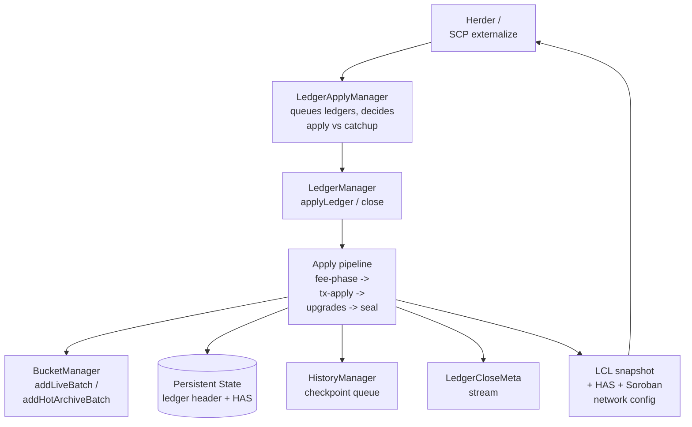
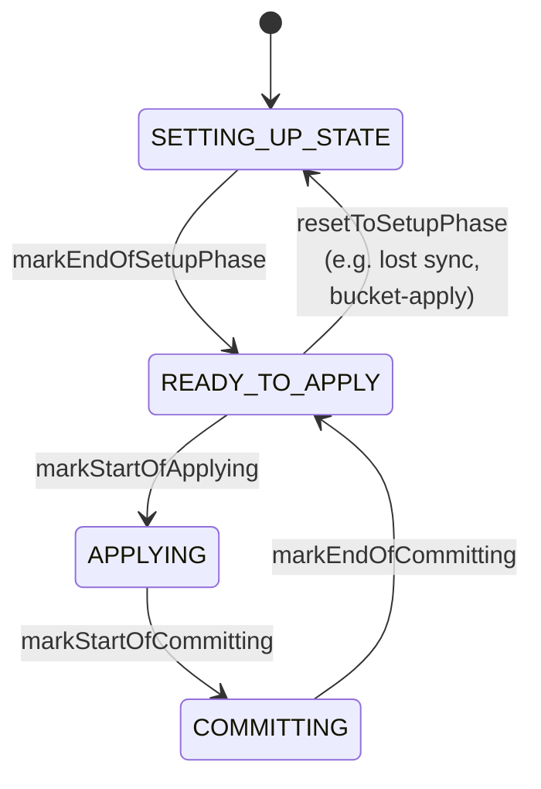

# Stellar Ledger Close Pipeline Specification

**Version:** 27 (stellar-core v27.0.0 / Protocol 27)
**Status:** Informational
**Date:** 2026-06-21

## Table of Contents

1. [Introduction](#1-introduction)
2. [Architecture](#2-architecture)
3. [Data Types](#3-data-types)
4. [Ledger Close Pipeline](#4-ledger-close-pipeline)
5. [Apply State Phase Machine](#5-apply-state-phase-machine)
6. [Transaction Application](#6-transaction-application)
7. [LedgerTxn Nested Transactional State](#7-ledgertxn-nested-transactional-state)
8. [Protocol and Network Upgrades](#8-protocol-and-network-upgrades)
9. [Ledger Header Management](#9-ledger-header-management)
10. [Soroban Network Configuration](#10-soroban-network-configuration)
11. [Soroban State Management](#11-soroban-state-management)
12. [Commit and Persistence](#12-commit-and-persistence)
13. [Ledger Close Meta](#13-ledger-close-meta)
14. [Genesis Ledger](#14-genesis-ledger)
15. [Invariants and Safety Properties](#15-invariants-and-safety-properties)
16. [Constants](#16-constants)
17. [References](#17-references)
18. [Appendix A: LedgerTxn Entry Merge Matrix](#appendix-a-ledgertxn-entry-merge-matrix)
19. [Appendix B: Ledger Close Pipeline Flowchart](#appendix-b-ledger-close-pipeline-flowchart)
20. [Appendix C: Skip-List Construction Example](#appendix-c-skip-list-construction-example)

---

## 1. Introduction

### 1.1 Purpose and Scope

This specification describes the **Stellar ledger close pipeline**: the
deterministic sequence by which a node, having received an externalized
consensus value, transforms the last closed ledger (LCL) into a new closed
ledger by applying a transaction set, optional protocol or network-config
upgrades, eviction, and state archival. It defines the apply-state phase
machine, the nested transactional state model (LedgerTxn), the ledger header
update sequence, the production of `LedgerCloseMeta`, and the persistence of
the resulting state to buckets, the database, and history archives.

This specification is **implementation agnostic**. It is derived exclusively
from the vetted stellar-core C++ implementation (v27.0.0). Any conforming
implementation that produces an identical sequence of `LedgerHeader` hashes,
identical bucket-list contents, identical `TransactionResultSet` contents, and
an identical stream of `LedgerCloseMeta` for all valid inputs is considered
correct.

**Out of scope**:

- Consensus (SCP nomination and ballot protocol): see SCP_SPEC.
- Herder mechanics (transaction queue, candidate combination, transaction
  set construction): see HERDER_SPEC.
- Individual transaction and operation semantics (precondition checking,
  operation effects, Soroban host-side execution): see TX_SPEC.
- Bucket-list internals (merge algorithm, level sizing, hot archive merge
  rules): see BUCKETLISTDB_SPEC.
- Catchup, replay, and history archive publishing: see CATCHUP_SPEC.
- Implementation-internal details: SQL schemas, threading models, caching
  strategies, logging, metrics, file-system layouts.

### 1.2 Conventions and Terminology

The key words "MUST", "MUST NOT", "REQUIRED", "SHALL", "SHALL NOT", "SHOULD",
"SHOULD NOT", "RECOMMENDED", "MAY", and "OPTIONAL" in this document are to be
interpreted as described in RFC 2119 and RFC 8174.

| Term | Definition |
|---|---|
| **Ledger** | A snapshot of the global state at a given sequence number, identified by its `LedgerHeader` and the SHA-256 hash thereof. |
| **LCL** | Last Closed Ledger; the most recent ledger fully committed to the local node. |
| **LedgerSeq** | A 32-bit ledger sequence number; the genesis ledger has sequence 1. |
| **LedgerHeader** | The XDR structure that summarizes a ledger by reference to its transaction set, transaction result set, bucket-list root hash, previous header hash, skip list, close time, total coins, fee pool, and protocol version. |
| **LedgerCloseData** | The unit handed from Herder to the ledger close pipeline: a `(ledgerSeq, txSet, StellarValue, expectedHash?)` tuple. |
| **StellarValue** | The XDR value externalized by SCP, containing the `txSetHash`, `closeTime`, `upgrades`, and ext fields. |
| **txSet** | The set of transactions to apply this ledger, organized into phases and (in protocol 23+) parallel stages. |
| **LedgerTxn** | A nestable in-memory transactional view of ledger state used during transaction application. |
| **LedgerTxnRoot** | The terminal parent in a LedgerTxn chain; commits flush to the database and the live bucket list. |
| **InternalLedgerEntry** | A wrapper around either a `LedgerEntry`, a sponsorship marker, a sponsorship counter, or a `MaxSeqNumToApply` marker. |
| **Sealing** | The act of finalizing a LedgerTxn for read-only inspection (after which mutating operations throw). |
| **HAS** | History Archive State; the JSON-serializable record of the bucket-list state at a checkpoint, persisted to the database and to history archives. |
| **ApplyState** | The mutable working state of the apply thread, comprising the in-memory Soroban state, the module cache, and the apply phase. |
| **InMemorySorobanState** | The in-memory map of `CONTRACT_DATA`, `CONTRACT_CODE`, and TTL entries used to serve Soroban reads during apply (protocol 23+). |
| **Module Cache** | A shared cache of compiled Wasm modules used by the Soroban host (protocol 23+). |
| **Hot Archive** | A separate bucket list, introduced in protocol 23, that retains evicted persistent Soroban entries until restoration. |
| **Restoration** | The act of bringing an expired persistent Soroban entry back into the live state by paying rent. |
| **Eviction** | The act of removing expired Soroban entries from the live bucket list at ledger close; persistent entries are placed in the hot archive, temporary entries are deleted. |

### 1.3 Notation

Algorithms are expressed in `camelCase` pseudocode. XDR enumerators (e.g.,
`LEDGER_ENTRY_CREATED`, `LEDGER_UPGRADE_VERSION`) are written in
`SCREAMING_SNAKE_CASE`. Protocol-version guards are written `@version(>=N)`
or `@version(<N)`; the canonical thresholds used in this specification are
Protocol 9, 11, 19, 20, 22, 23, 24, 25, and 26. Cross-references to peer
specifications use the plain-text form `SPEC_NAME §N.N`.

### 1.4 Relationship to Other Specifications

| Specification | Relationship |
|---|---|
| **HERDER_SPEC** | Produces `LedgerCloseData` and delivers it to the ledger pipeline via the `valueExternalized` entry point; receives the `lastClosedLedgerIncreased` callback after commit. |
| **TX_SPEC** | Defines the per-transaction fee-processing, validation, application, and post-apply behavior driven by the ledger pipeline in §6. |
| **BUCKETLISTDB_SPEC** | Defines the live bucket list and hot archive structures; the ledger pipeline produces `(initEntries, liveEntries, deadEntries)` batches and an `EvictedStateVectors` payload for the bucket manager. |
| **CATCHUP_SPEC** | Drives `setLastClosedLedger` and `applyLedger` via the `LedgerApplyManager`; defines the bucket-apply phase that resets the apply state to `SETTING_UP_STATE`. |
| **SCP_SPEC** | Provides the externalized `StellarValue` that the ledger pipeline consumes; opaque to the pipeline beyond `(txSetHash, closeTime, upgrades, ext)`. |
| **OVERLAY_SPEC** | Independent: the pipeline does not interact with overlay directly. |

---

## 2. Architecture

The ledger close pipeline is a single-writer, multi-reader subsystem with two
logical actors:

- **The main thread**, which receives consensus values from Herder, manages
  the last-closed-ledger (LCL) snapshot, publishes history checkpoints, and
  notifies external subsystems.
- **The apply thread**, which owns the heavy work of applying transactions,
  reading and updating in-memory and on-disk state, and producing the new
  ledger header. A node MAY collapse the two roles onto a single thread; a
  conforming implementation MUST otherwise produce the same observable
  outputs.

The apply thread MAY spawn short-lived **Soroban worker threads** during the
parallel Soroban phase (protocol 23+). These threads operate on an immutable
snapshot of the apply state and do not commit changes; their results are
merged back by the apply thread.



The pipeline is driven by `valueExternalized(ledgerData, isLatestSlot)`,
which delegates to the `LedgerApplyManager` (see CATCHUP_SPEC §6) to either
queue the ledger for the apply thread or trigger catchup. When the
`LedgerApplyManager` releases a `LedgerCloseData` to the apply thread, it
invokes `applyLedger(ledgerData, calledViaExternalize)`. Catchup MAY invoke
`applyLedger` directly with `calledViaExternalize = false`.

The pipeline MUST preserve the following ordering invariant on the four
sequence-number checkpoints maintained by the system:

```
LCL  <=  A  <=  Q  <=  H
```

where `H` is the largest ledger sequence heard from the network, `Q` is the
largest ledger sequence dequeued and posted to the apply thread, `A` is the
ledger sequence currently being applied, and `LCL` is the ledger sequence
reflected in the main thread's last-closed-ledger snapshot. Any conforming
implementation MUST maintain this monotonic ordering.

---

## 3. Data Types

### 3.1 LedgerHeader

The `LedgerHeader` XDR structure is the canonical summary of a closed ledger.
Its fields, in canonical order:

| Field | Type | Description |
|---|---|---|
| `ledgerVersion` | `uint32` | Protocol version active for this ledger. |
| `previousLedgerHash` | `Hash` | SHA-256 of the previous `LedgerHeader`. |
| `scpValue` | `StellarValue` | Embeds `txSetHash`, `closeTime`, `upgrades`, ext. |
| `txSetResultHash` | `Hash` | SHA-256 of the `TransactionResultSet`. |
| `bucketListHash` | `Hash` | Root hash of the live bucket list (protocol 22 and earlier) or `SHA-256(liveBLHash || hotArchiveBLHash)` (protocol 23+). |
| `ledgerSeq` | `uint32` | This ledger's sequence number. |
| `totalCoins` | `int64` | Total lumens in existence in this ledger. |
| `feePool` | `int64` | Accumulated fees not yet distributed. |
| `inflationSeq` | `uint32` | Number of inflation operations applied. |
| `idPool` | `uint64` | Monotonic counter for offer/data IDs. |
| `baseFee` | `uint32` | Per-operation base fee in stroops. |
| `baseReserve` | `uint32` | Per-entry reserve in stroops. |
| `maxTxSetSize` | `uint32` | Maximum classic tx set size (ops in protocol < 11, txs in protocol 11+). |
| `skipList` | `Hash[4]` | Four-level skip list of historic bucket-list hashes (see §9.3). |
| `ext` | union | Reserved for future extension; `ext.v(1).flags` carries the disable-liquidity-pool-trading flag. |

### 3.2 LedgerKey and LedgerEntry

`LedgerKey` is the discriminated union (XDR) keying ledger state. Its types
are: `ACCOUNT`, `TRUSTLINE`, `OFFER`, `DATA`, `CLAIMABLE_BALANCE`,
`LIQUIDITY_POOL`, `CONTRACT_DATA`, `CONTRACT_CODE`, `CONFIG_SETTING`, and
`TTL`. `LedgerEntry` carries the corresponding entry data plus
`lastModifiedLedgerSeq` and an `ext` block (including sponsorship and rent
fields).

A `LedgerEntry`'s `lastModifiedLedgerSeq` MUST equal the `ledgerSeq` of the
ledger in which it was most recently created or modified (see §7.7).

### 3.3 InternalLedgerEntry

An `InternalLedgerEntry` is a non-XDR wrapper used internally by LedgerTxn,
discriminated by `InternalLedgerEntryType`:

| Type | Use |
|---|---|
| `LEDGER_ENTRY` | Wraps a real XDR `LedgerEntry`. |
| `SPONSORSHIP` | Tracks per-account sponsorship relationships within a transaction's bounds. |
| `SPONSORSHIP_COUNTER` | Tracks the number of objects an account sponsors. |
| `MAX_SEQ_NUM_TO_APPLY` | Records, for protocol 19+ ledgers containing `AccountMerge`, the maximum sequence number an account may reach within the same ledger (see §6.2). |

Sponsorship and sponsorship-counter entries MUST be empty across LedgerTxn
seal boundaries that surface to the bucket batch — sponsorship state is
reconciled within the per-transaction LedgerTxn (see TX_SPEC §11).
`MAX_SEQ_NUM_TO_APPLY` entries exist only during the fee-processing phase.

### 3.4 LedgerCloseData

Produced by Herder and consumed by the pipeline. Fields:

| Field | Type | Description |
|---|---|---|
| `ledgerSeq` | `uint32` | Sequence of the ledger being closed. |
| `txSet` | `TxSetXDRFrame` | The transaction set, hash-referenced from `StellarValue`. |
| `value` | `StellarValue` | The externalized SCP value. |
| `expectedHash` | `Hash?` | Optional hash to verify against the locally computed header hash; used in catchup. |
| `expectedResults` (test-only) | `TransactionResultSet?` | Replay-mode expected results. |

### 3.5 LedgerCloseMeta

`LedgerCloseMeta` is an XDR union, currently with three versions (v0, v1, v2),
emitted to subscribers (e.g., Horizon) for every closed ledger.

| Version | Required protocol | Contents |
|---|---|---|
| **v0** | protocol < 20 | `ledgerHeader`, `txSet`, `txProcessing[]` (each with `feeProcessing` and `txApplyProcessing`), `upgradesProcessing[]`, optional ext. |
| **v1** | protocol 20-22 | v0 + `totalByteSizeOfLiveSorobanState`, `evictedKeys[]`, ext v1 carrying `sorobanFeeWrite1KB`. |
| **v2** | protocol 23+ | v1 + per-tx `postTxApplyFeeProcessing` (for Soroban refund accounting). |

A pipeline MUST select the meta version from the protocol version that was
active **at the start** of the ledger (`initialLedgerVers`), not the
potentially upgraded version (see §9.2).

### 3.6 EntryPtrState

Each entry tracked inside a LedgerTxn carries a three-valued state:

| State | Semantics |
|---|---|
| `INIT` | The entry was first created at this LedgerTxn level (no prior version exists in any parent). |
| `LIVE` | The entry was modified at this LedgerTxn level (a prior version exists). |
| `DELETED` | The entry was erased at this LedgerTxn level. |

### 3.7 RestoredEntries

Used in protocol 23+ to track entries restored from the hot archive and from
the live bucket list during a single ledger. Layout:

```
RestoredEntries:
  hotArchive: Map<LedgerKey, LedgerEntry>      // hot-archive restorations
  liveBucketList: Map<LedgerKey, LedgerEntry>  // live-BL TTL-only restorations
```

A key MUST NOT appear in both maps within the same ledger; the maps are
disjoint by construction (see INV-L5).

---

## 4. Ledger Close Pipeline

The pipeline is invoked by `applyLedger(ledgerData, calledViaExternalize)`.
It executes the following numbered steps in order. Each step MUST be
observable-deterministic across conforming implementations.

### 4.1 Entry, Setup, and Header Initialization

1. If the node is stopping, the pipeline returns without action.
2. If a Wasm module compilation was started during the previous ledger
   close, it MUST be finished before continuing (`finishPendingCompilation`).
3. The apply state transitions from `READY_TO_APPLY` to `APPLYING` (§5).
4. A root-level LedgerTxn `ltx` is opened against the LedgerTxnRoot.
5. The previous header is loaded; its SHA-256 is computed as `prevHash`.
6. `header.ledgerSeq` is incremented by 1.
7. `header.previousLedgerHash` is set to `prevHash`.

### 4.2 Validation of LedgerCloseData

8. If `header.ledgerVersion > Config::CURRENT_LEDGER_PROTOCOL_VERSION`, the
   pipeline MUST throw `cannot apply ledger with not supported version`; a
   ledger MUST NOT be applied beyond the implementation's compiled protocol
   support.
9. If `txSet.previousLedgerHash() != prevHash`, the pipeline MUST throw
   `txset mismatch`. This guarantees the txset is rooted at the current LCL.
10. If `txSet.getContentsHash() != ledgerData.value.txSetHash`, the pipeline
    MUST throw `corrupt transaction set`. This guarantees the txset matches
    the consensus value.
11. `header.scpValue` is assigned to `ledgerData.value`.
12. The txset is converted to its applicable form via
    `txSet.prepareForApply(prevHeader)`; if the result is null, the
    pipeline MUST throw `transaction set cannot be processed`.

### 4.3 LedgerCloseMeta Construction

13. If meta streaming is enabled, a `LedgerCloseMetaFrame` is constructed
    at the meta version corresponding to `header.ledgerVersion` (see §13).
    Tx-processing slots are reserved and the txset is populated into the
    meta.

### 4.4 Fee Phase

14. Source-account IDs are prefetched (`prefetchTxSourceIds`).
15. `processFeesSeqNums(txSet, ltx, meta, ledgerData)` is invoked
    (see §6.2). It produces a vector of `MutableTransactionResult` —
    exactly one per transaction in the txset, in `getPhasesInApplyOrder`
    order — with fees already charged and (for protocol 19+) per-source
    `MAX_SEQ_NUM_TO_APPLY` markers committed to `ltx`.

### 4.5 Apply Phase

16. `applyTransactions(txSet, mutableTxResults, ltx, meta)` is invoked
    (see §6.3). It produces a `TransactionResultSet` aligned with the
    apply-order traversal of phases.

### 4.6 Result-Set Hash and History Append

17. If the node is configured to store historical data
    (`MODE_STORES_HISTORY_MISC`), the per-checkpoint transaction set and
    result set are appended via the HistoryManager.
18. `header.txSetResultHash` is set to `xdrSha256(txResultSet)`.

### 4.7 Commit Phase Start

19. The apply state transitions from `APPLYING` to `COMMITTING` (§5).

### 4.8 Upgrades

20. For each `upgrade` in `header.scpValue.upgrades`, in order:
    - The upgrade is validated via `Upgrades::isValidForApply` (see §8).
    - If `XDR_INVALID` or `INVALID`, the upgrade is logged and skipped.
    - If `VALID`, a nested `LedgerTxn` `ltxUpgrade(ltx)` is opened, the
      upgrade is applied via `Upgrades::applyTo`, its `LedgerEntryChanges`
      are pushed into `meta.upgradesProcessing`, and `ltxUpgrade` is
      committed.
    - If `Upgrades::applyTo` throws, the exception is caught and logged;
      the upgrade is skipped. `upgradeApplied` is set to true on success.

### 4.9 Seal and Persist

21. `initialLedgerVers` captures `ledgerVersion` from before any upgrade;
    `maybeNewVersion` is `ledgerVersion` after upgrades.
22. The current `ledgerSeq` is captured.
23. `sealLedgerTxnAndStoreInBucketsAndDB(...)` (see §12.1) is invoked:
    - Snapshots of the live and hot-archive bucket lists from the LCL are
      copied into the call.
    - `finalizeLedgerTxnChanges` is invoked: it resolves the background
      eviction scan, processes hot-archive evictions and restorations
      (protocol 23+), snapshots the Soroban state size into the network
      config window (protocol 20+), loads the post-upgrade Soroban network
      config, seals the LedgerTxn via `getAllEntries`, and feeds
      `(initEntries, liveEntries, deadEntries)` to `addLiveBatch`.
    - The module cache is updated: evicted entries dropped, new contract
      code added.
    - The in-memory Soroban state is updated.
    - The unsealed header is finalized: `snapshotLedger` writes the
      `bucketListHash` and skip list (§9.3), and the header + HAS are
      persisted via `storePersistentStateAndLedgerHeaderInDB`.
    - A new LCL snapshot is produced.

### 4.10 LedgerCloseMeta Finalization and Emission

24. If meta is enabled and the protocol started at SOROBAN_PROTOCOL_VERSION
    or later, `meta.setNetworkConfiguration(sorobanConfig)` is invoked with
    the post-apply Soroban config and the `EMIT_LEDGER_CLOSE_META_EXT_V1`
    flag.
25. If `ledgerData.expectedHash` is set and does not equal the locally
    computed `lastClosedLedgerHeader.hash`, the pipeline MUST throw `Local
    node's ledger corrupted during close`. This is the hash-chain check
    that protects against silent state corruption (see INV-L11).
26. The completed meta is moved to `mNextMetaToEmit`, then emitted via
    `emitNextMeta`.

### 4.11 Subtle 8-Step Sequence after Seal

After §4.9 the pipeline MUST execute the following steps in this exact
order:

| # | Step |
|---|---|
| 1 | `maybeQueueHistoryCheckpoint(ledgerSeq, maybeNewVersion)` — queues the next checkpoint within the current SQL transaction. Uses the **post-upgrade** ledger version. |
| 2 | `ltx.commit()` — persists the SQL transaction. |
| 3 | `maybeCheckpointComplete(ledgerSeq)` — finalizes any newly complete checkpoint files. |
| 4 | If protocol >= 20, start the background eviction scan for the next ledger using the post-commit snapshot. |
| 5 | The apply state transitions from `COMMITTING` to `READY_TO_APPLY` (§5). Copy the in-memory Soroban state if the snapshot invariant is enabled for this ledger. |
| 6 | (in `advanceLedgerStateAndPublish`, on main thread) `publishQueuedHistory` — kicks off history publishing for queued checkpoints. |
| 7 | (in `advanceLedgerStateAndPublish`, on main thread) `forgetUnreferencedBuckets(HAS)` — garbage-collects unreferenced bucket files. |
| 8 | (in `advanceLedgerStateAndPublish`, on main thread) Update LM state via `ledgerCloseComplete` — possibly transition to `LM_SYNCED_STATE`, notify Herder via `lastClosedLedgerIncreased`, and trigger the snapshot invariant. |

The split between steps 1-5 (apply thread, post-seal) and 6-8 (main thread)
exists because LCL is owned by the main thread; the apply thread MUST post
back the new `CompleteConstLedgerState` to the main thread for installation
into `mLastClosedLedgerState`.

---

## 5. Apply State Phase Machine

The apply state cycles through four phases:



Phase semantics:

| Phase | Mutability of ApplyState | Soroban worker threads | Typical work |
|---|---|---|---|
| `SETTING_UP_STATE` | Mutable by primary apply thread. | None. | Startup; post-bucket-apply state setup; populating in-memory Soroban state. |
| `READY_TO_APPLY` | Immutable. | None. | Idle between ledgers; ApplyState is a fixed snapshot. |
| `APPLYING` | Immutable for the primary thread except via the aggregating LedgerTxn. | MAY be live, reading immutable state. | Fee phase, sequential phase, parallel Soroban phase. |
| `COMMITTING` | Mutable by primary apply thread only. | MUST be joined. | Apply upgrades, seal, persist, advance header. |

The pipeline MUST enforce these transitions via runtime assertion. In
particular, while the apply thread is in `APPLYING`, the primary thread MUST
NOT mutate `InMemorySorobanState` or the module cache; Soroban worker
threads MAY only call const methods of `ApplyState`.

A node that has fallen out of sync and is starting catchup MUST reset the
apply state to `SETTING_UP_STATE` (via `markApplyStateReset`) before
performing bucket-apply.

---

## 6. Transaction Application

Transaction application is two-phased: a **fee phase** that charges fees
and binds sequence numbers, followed by an **apply phase** that executes
each transaction's operations. The apply phase itself is structured by
**phases** of the txset (classic and Soroban), and (in protocol 23+) the
Soroban phase MAY be **parallel**, organized into stages and clusters.

### 6.1 Apply Order

The order of phases used during apply is `txSet.getPhasesInApplyOrder()` —
this differs from the consensus order. Within a phase, the per-phase apply
order is defined by `TxSetFrame::getTxsInApplyOrder` (see HERDER_SPEC §6.5):
transactions are sorted such that a given source account's transactions are
strictly sequence-number ordered, while inter-account ordering is
randomized using a seed derived from the txset hash.

### 6.2 Fee Phase (`processFeesSeqNums`)

For each transaction in apply order:

1. A nested `LedgerTxn` `ltxTx` is opened over the outer fee LedgerTxn.
2. `tx.processFeeSeqNum(ltxTx, baseFee)` is invoked (see TX_SPEC §7):
   - The fee is charged from the fee source account.
   - The sequence number of the source account is advanced.
   - Sequence-number preconditions are validated.
3. The transaction's `MutableTransactionResult` is captured into
   `txResults[i]`.
4. @version(>=19) For each transaction whose source-account sequence
   number is being advanced, the maximum sequence number seen this ledger
   is tracked per account in `accToMaxSeq`. If any transaction in the
   txset contains an `ACCOUNT_MERGE` operation, the boolean `mergeSeen`
   is set.
5. If meta is enabled, the fee-processing changes (`ltxTx.getChanges()`)
   are pushed into the meta's `feeProcessing` for this transaction.
6. `ltxTx.commit()`.

After all transactions have been fee-processed:

7. @version(>=19) If `mergeSeen` is true, for each `(accountID, seqNum)`
   in `accToMaxSeq`, an `InternalLedgerEntry` of type
   `MAX_SEQ_NUM_TO_APPLY` is created. If such an entry already exists in
   the outer LedgerTxn, the pipeline MUST throw `found unexpected
   MAX_SEQ_NUM_TO_APPLY`.
8. The outer fee LedgerTxn is committed.

The `MAX_SEQ_NUM_TO_APPLY` entries are consumed by transaction application
to ensure that a transaction whose source account is later merged in the
same ledger still observes its declared sequence number (see TX_SPEC §5.6).

### 6.3 Apply Phase (`applyTransactions`)

For each phase in apply order:

- If `phase.isParallel()` is true, the phase MUST be applied via
  `applyParallelPhase` (§6.5).
- Otherwise, the phase MUST be applied via `applySequentialPhase` (§6.4).

The Soroban network configuration (post-protocol-20) MUST be loaded once
from the LedgerTxn before the loop and reused for the parallel-phase
invocations. The base PRNG seed for Soroban transactions is
`sorobanBasePrngSeed = txSet.getContentsHash()`.

After all phases, `processPostTxSetApply` is invoked to handle Soroban
post-tx-set processing (refunds, post-tx-apply fee meta) for the parallel
phase (see §6.6).

### 6.4 Sequential Phase (`applySequentialPhase`)

For each transaction `tx` in the phase, in apply order:

1. A `TransactionMetaBuilder` is constructed at the current ledger version.
2. A `TRANSACTION_EVENT_STAGE_BEFORE_ALL_TXS` fee event is emitted into
   the meta.
3. A per-tx seed is derived: for Soroban transactions,
   `subSeed = SHA-256(sorobanBasePrngSeed || index)` where `index` is
   the global transaction index encoded as a `uint64`. For classic
   transactions, the base seed is used unchanged.
4. `tx.apply(ltx, tm, mutableTxResult, sorobanConfig, subSeed)` is invoked
   (see TX_SPEC §6).
5. `tx.processPostApply(ltx, tm, mutableTxResult)` is invoked
   (see TX_SPEC §13).
6. Refundable fee meta is set if present.
7. `processResultAndMeta(meta, index, tm, tx, mutableTxResult, txResultSet)`
   appends the result pair, increments success/failure counters, and
   stores the per-tx meta.

### 6.5 Parallel Soroban Phase (`applyParallelPhase`, protocol 23+)

The parallel phase is structured as an ordered list of **stages**; within
each stage, an ordered list of **clusters**; within each cluster, an
ordered list of transactions. Clusters within a stage are guaranteed
footprint-disjoint by the Herder construction (see HERDER_SPEC §6.4) and
MAY thus be applied concurrently. Stages MUST be applied serially.

For each stage:

1. A `GlobalParallelApplyLedgerState` is constructed wrapping
   `(app, ltx, allStages, inMemorySorobanState, sorobanConfig)`.
2. For each cluster `c` in the stage, an independent
   `ThreadParallelApplyLedgerState` is constructed and a Soroban worker
   thread is dispatched to run `applyThread(c, ...)`:
   - For each `txBundle` in the cluster, in cluster-order:
     - `flushRoTTLBumpsInTxWriteFootprint(txBundle)` is invoked.
     - `subSeed = SHA-256(sorobanBasePrngSeed || txNum)`.
     - `txBundle.tx.parallelApply(...)` is invoked (see TX_SPEC §11.5).
     - On success, `commitChangesFromSuccessfulTx` accumulates per-tx
       changes into the thread state.
   - After all bundles, `flushRemainingRoTTLBumps()` is invoked.
3. All worker thread results are gathered (`std::future::get`); any
   exception MUST abort with a fatal error.
4. After the threads join, `checkAllTxBundleInvariants` MUST run
   per-tx invariant checks against the operation-level delta produced by
   the thread.
5. `globalParState.commitChangesFromThreads(threadStates, stage)` merges
   the stage's accumulated state into the global state.

After all stages:

6. `globalParState.commitChangesToLedgerTxn(ltx)` MUST be invoked, which
   transfers the accumulated parallel-phase changes (including
   restorations) into the outer LedgerTxn `ltx`.

Cluster and stage counts MAY be exposed as observability metrics but do
not affect consensus.

### 6.6 Post-Tx-Set Apply (`processPostTxSetApply`)

For the parallel phase, after `applyTransactions` returns:

1. For each `txBundle` in stage/cluster order:
   - A nested LedgerTxn `ltxInner(ltx)` is opened.
   - `tx.processPostTxSetApply(ltxInner, resPayload, txEventManager)` is
     invoked (see TX_SPEC §11.6). This is the Soroban refund pathway.
   - If meta is enabled, `meta.setPostTxApplyFeeProcessing(
     ltxInner.getChanges(), txNum)` records the post-apply fee diff (v2
     meta only).
   - `ltxInner.commit()`.
   - `processResultAndMeta` records the (possibly refund-adjusted) result.

The sequential (classic) phase does not currently use post-tx-set apply.

### 6.7 Source-Account Prefetch and Tx-Data Prefetch

Before the fee phase, `prefetchTxSourceIds` collects the set of keys
implied by `tx.insertKeysForFeeProcessing` across all transactions and
issues a bulk prefetch against the LedgerTxnRoot if `PREFETCH_BATCH_SIZE > 0`
and not all buckets are in memory. Similarly, `prefetchTransactionData`
issues a bulk prefetch of all keys implied by `tx.insertKeysForTxApply`
before the apply loop. Prefetching is advisory and does not affect
consensus.

---

## 7. LedgerTxn Nested Transactional State

`LedgerTxn` is the in-memory transactional view of ledger state used
throughout the pipeline. It is the sole mechanism by which operations,
transactions, and the close pipeline observe and mutate `LedgerEntry`s.

### 7.1 Hierarchy and Nesting Rules

There are three roles:

| Role | Definition |
|---|---|
| `LedgerTxnRoot` | The terminal parent. Reads cascade down into the LCL bucket-list snapshot (or, for offers, into SQL); commits flush to the bucket list and database. |
| `LedgerTxn` (non-root) | An in-memory nested transaction; commits flush into its parent's entry map. |
| `AbstractLedgerTxnParent` | The interface common to both. |

A `LedgerTxn` is constructed with a reference to its parent
(`AbstractLedgerTxnParent`) and is then automatically attached as the
parent's `mChild`. The following invariants MUST hold:

- **INV-L1: Single-child.** At any given time, a parent MUST have at most
  one active child LedgerTxn. Construction of a second child MUST throw.
- **INV-L2: Same-thread access.** A LedgerTxn MUST be accessed only from
  the thread that opened it, until it is committed or rolled back.
  Violation MUST abort the program.
- A `LedgerTxn` MUST NOT be opened against a sealed parent or against a
  parent that already has a child.

### 7.2 Entry State Model

Each entry stored in a LedgerTxn's `mEntry` map is associated with one of
three states (see §3.6): `INIT`, `LIVE`, `DELETED`.

- `create(entry)` produces an `INIT` entry. It throws if any newer version
  of the key (in self or any parent) already exists.
- `load(key)` traverses parents, finds the newest version, and inserts a
  `LIVE` copy into `mEntry` (the entry's state in the parent's map is left
  unchanged). It throws if the key is already active in this LedgerTxn.
- `erase(key)` produces a `DELETED` entry. It throws if no version of the
  key exists in self or any parent. It throws if the key is currently
  active.
- `loadWithoutRecord(key)` is identical to `load` except no record is
  written into `mEntry`; if a record already exists, that record's state
  is retained.

`createWithoutLoading`, `updateWithoutLoading`, `eraseWithoutLoading` are
bulk-loading shortcuts that bypass the "loading" semantics and are used
only by catchup's bucket-apply phase; they MUST NOT be used during
transaction processing. The `eraseWithoutLoading` shortcut weakens the
LedgerTxn's consistency to `EXTRA_DELETES` (see §7.9).

### 7.3 Active-Entry Tracking

A `LedgerTxn` maintains an `mActive` map of currently-handed-out
`LedgerTxnEntry` handles. The handles are weakly linked to internal
records; opening a child MUST deactivate all parent handles, preventing
two concurrency anomalies:

- **Stale reads** of parent entries while a child holds modified versions.
- **Lost updates** when modifying a parent entry that the child has also
  modified.

A double-indirect handle design ensures that the destructor of a
`LedgerTxnEntry` always removes its entry from `mActive` even after
parent-side deactivation. Handles MUST NOT be retained across the lifetime
of a sub-LedgerTxn.

### 7.4 Sealing Semantics

A `LedgerTxn` is **sealed** the first time any of `getChanges()`,
`getDelta()`, or `getAllEntries()` is called, or as part of its own
`commit()`. Sealing has these observable effects:

- `mIsSealed` is set; further mutation throws.
- `lastModifiedLedgerSeq` is updated on every non-deleted, non-sponsorship
  entry to equal `mHeader->ledgerSeq` (if `mShouldUpdateLastModified`).
- The multi-order-book is cleared.
- Active handles are cleared.
- The active header handle is reset.

After sealing, only the header MAY be re-unsealed via `unsealHeader(f)`,
which MUST NOT modify entries. This is used to write the `bucketListHash`
and skip-list values into the header AFTER the entry set has been finalized
(see §12.1).

### 7.5 Commit and Rollback Semantics

`LedgerTxn::commit()` MUST:

1. Run `maybeUpdateLastModifiedThenInvokeThenSeal`, which seals self and
   produces an iterator over `mEntry`.
2. Invoke `parent.commitChild(iter, mRestoredEntries, mConsistency)`.
3. Reset self (the implementation pointer).

`LedgerTxn::Impl::commitChild(iter, restoredEntries, consistency)` MUST:

1. Copy the child header into a unique pointer (for swap-based exception
   safety).
2. If self has any active entries, abort (active parent entries during
   child commit is a logic error).
3. For each `(key, entryPtr)` in the iterator, invoke `updateEntry(key,
   ..., entryPtr, /*effectiveActive=*/false)` on self.
4. Update self's worst-best-offer map via `forAllWorstBestOffers` on the
   child.
5. Merge `restoredEntries` from child into self via `addRestoresFrom`. The
   per-key uniqueness MUST be preserved across the merge: a key restored
   in the child MUST NOT already be restored in self.
6. Update consistency: `mConsistency = max(mConsistency, cons)` where
   `EXTRA_DELETES > EXACT`.
7. Swap in the child header.
8. Clear `mChild`.

`LedgerTxn::rollback()` MUST simply notify the parent (which clears
`mChild`) and reset self. No changes propagate.

### 7.6 Entry Merge Matrix

When committing a child into a parent, each child entry is merged with
the corresponding parent entry (if any) at the same key. The merge rules
are summarized in Appendix A; the key non-trivial cases are:

- **Parent INIT, Child DELETED**: the parent entry is annihilated
  (removed from `mEntry`). This represents an entry that was created and
  immediately deleted within the lifetime of the closer transaction and
  has no observable effect on the database.
- **Parent DELETED, Child INIT**: the merged state is `LIVE`. The entry
  was deleted at the parent level but a child re-creates it; this can
  occur only because the deleted entry must have existed prior to the
  delete (otherwise the delete would have thrown).
- **Parent LIVE, Child INIT**: MUST throw `cannot commit a child init
  entry into a parent live entry`. A child cannot validly INIT an entry
  the parent already considers LIVE.
- **Parent INIT, Child INIT**: not possible by `create` semantics — a
  `create` throws if any parent has the key.
- **Parent DELETED, Child LIVE**: MUST throw `cannot set deleted entry
  to live`.
- **Parent DELETED, Child DELETED**: MUST throw `cannot delete deleted
  entry`.

See Appendix A for the complete 3x3 matrix.

### 7.7 Last-Modified Stamping

Inside the seal-and-store helper, for every non-deleted entry of
`LEDGER_ENTRY` type, `lastModifiedLedgerSeq` MUST be set to the current
`mHeader->ledgerSeq` if the LedgerTxn was constructed with
`shouldUpdateLastModified = true` (the default). This is the unique source
of `lastModifiedLedgerSeq` for normally-applied transactions.

### 7.8 getAllEntries / getChanges / getDelta

These three accessors all seal the LedgerTxn:

- `getAllEntries(initEntries, liveEntries, deadEntries)` partitions
  `LEDGER_ENTRY` entries: `INIT` -> initEntries, `LIVE` -> liveEntries,
  `DELETED` -> deadEntries (as keys). Non-`LEDGER_ENTRY` entries are
  skipped. This is the input to `BucketManager::addLiveBatch`.
- `getChanges()` produces an XDR `LedgerEntryChanges` array in
  (`CREATED` / `STATE` + `UPDATED` / `STATE` + `REMOVED`) form, used for
  the meta. This MUST NOT be called on a LedgerTxn with `EXTRA_DELETES`
  consistency.
- `getDelta()` produces a structured `(current, previous)` pair per entry
  for the Invariants subsystem.

### 7.9 LedgerTxnConsistency

A LedgerTxn's `mConsistency` is one of:

| Value | Meaning |
|---|---|
| `EXACT` | The LedgerTxn faithfully reflects the database. Default. |
| `EXTRA_DELETES` | At least one `eraseWithoutLoading` call has occurred; the LedgerTxn MAY contain spurious deletes for keys that never existed. `getChanges` / `getDelta` / `getDeadEntries` MUST NOT be invoked on such a LedgerTxn. |

`createWithoutLoading` does not weaken consistency — INIT-then-DELETE is
stored the same way as just INIT (and is annihilated naturally).

### 7.10 Configuration Settings Are Immutable

Erasure of a `CONFIG_SETTING` key MUST throw `Configuration settings
cannot be erased`. Config settings MAY only be created (during the V20
upgrade or subsequent upgrades) and updated (via config upgrades).

---

## 8. Protocol and Network Upgrades

`StellarValue.upgrades` is a list of `UpgradeType` opaque XDR blobs.
After transaction application, the pipeline applies upgrades sequentially.

### 8.1 Upgrade Types

`LedgerUpgrade` is an XDR union over the following types:

| Type | Field | Effect |
|---|---|---|
| `LEDGER_UPGRADE_VERSION` | `newLedgerVersion: uint32` | Sets `header.ledgerVersion`. Triggers `applyVersionUpgrade`, which MAY also create new ledger entries (Soroban config in v20+, etc.). |
| `LEDGER_UPGRADE_BASE_FEE` | `newBaseFee: uint32` | Sets `header.baseFee`. |
| `LEDGER_UPGRADE_MAX_TX_SET_SIZE` | `newMaxTxSetSize: uint32` | Sets `header.maxTxSetSize`. |
| `LEDGER_UPGRADE_BASE_RESERVE` | `newBaseReserve: uint32` | Sets `header.baseReserve` and runs the liability-rescaling upgrade. |
| `LEDGER_UPGRADE_FLAGS` | `newFlags: uint32` | Sets `header.ext.v1().flags`. |
| `LEDGER_UPGRADE_CONFIG` | `newConfig: ConfigUpgradeSetKey` | Applies a network-config upgrade encoded as a `ConfigUpgradeSetFrame` retrieved from a `CONTRACT_DATA` entry. |
| `LEDGER_UPGRADE_MAX_SOROBAN_TX_SET_SIZE` | `newMaxSorobanTxSetSize: uint32` | Updates the Soroban max-tx-count config setting. |

### 8.2 Upgrade Validation (`isValidForApply`)

For each `UpgradeType`:

1. Deserialize as `LedgerUpgrade`. If deserialization fails, return
   `XDR_INVALID`.
2. Run type-specific validity checks (e.g., the new protocol version is
   supported and is monotonically increasing; the new flags are
   recognized; the config upgrade key resolves to a valid
   `ConfigUpgradeSet`). On failure, return `INVALID`.
3. Otherwise, return `VALID`.

Invalid upgrades MUST be **skipped, not aborted**. The pipeline logs and
continues with the next upgrade.

### 8.3 Upgrade Application

For each `VALID` upgrade `lupgrade`, the pipeline opens a nested LedgerTxn
`ltxUpgrade(ltx)` and invokes `Upgrades::applyTo(lupgrade, app, ltxUpgrade)`:

- `LEDGER_UPGRADE_VERSION`: `applyVersionUpgrade` sets the new
  `ledgerVersion` and, if upgrading **into** a Soroban-enabled protocol
  version, MAY create the initial `CONFIG_SETTING` entries via
  `SorobanNetworkConfig::createLedgerEntriesForV20`,
  `createCostTypesForV21`, `createCostTypesForV22`,
  `createAndUpdateLedgerEntriesForV23`, `createCostTypesForV25`,
  `updateCostTypesForV26`, `createLedgerEntriesForV26`, as applicable to
  the new version.
- `LEDGER_UPGRADE_BASE_FEE` / `MAX_TX_SET_SIZE` / `FLAGS`: a simple header
  field assignment.
- `LEDGER_UPGRADE_BASE_RESERVE`: updates the reserve and rescales any
  pending liabilities/sponsorships affected by the new reserve.
- `LEDGER_UPGRADE_CONFIG`: loads the `ConfigUpgradeSetFrame` from the
  ledger via the embedded `ConfigUpgradeSetKey`, re-validates it
  (`isValidForApply()` MUST return `VALID`), and applies it to `ltx` via
  `ConfigUpgradeSetFrame::applyTo`.
- `LEDGER_UPGRADE_MAX_SOROBAN_TX_SET_SIZE`: updates the Soroban
  parallel-execution config setting.

After each upgrade, `ltxUpgrade.getChanges()` is captured into
`meta.upgradesProcessing[i]` (as an `UpgradeEntryMeta` with the
canonicalized `lupgrade` and its `LedgerEntryChanges`), then
`ltxUpgrade.commit()` flushes the upgrade into `ltx`.

Exceptions thrown by `Upgrades::applyTo` MUST be caught; the upgrade is
logged and skipped. `upgradeApplied` is set to true iff at least one
upgrade was applied successfully.

### 8.4 Protocol-Version Side Effects on the Pipeline

A protocol-version upgrade may have downstream effects observable later
in the same close cycle:

- The `initialLedgerVers` (captured before upgrades) MUST be used to drive
  the meta version selection and the "in pre-upgrade protocol" branches
  in `finalizeLedgerTxnChanges`. The `maybeNewVersion` MUST be used for
  history-checkpoint queuing (Step 1 of §4.11) and for evaluating
  protocol-version branches that depend on the upgraded version.
- A version upgrade **into** Soroban (P20) MAY emit Soroban-meta fields
  but only if `initialLedgerVers >= SOROBAN_PROTOCOL_VERSION` already;
  otherwise meta is v0 and Soroban fields MUST NOT be set.
- A version upgrade from P23 to P24 on a production network MUST invoke
  the `p23_hot_archive_bug` correction path when adding the hot-archive
  batch.
- If a protocol or config upgrade alters the in-memory Soroban state-size
  formula, `handleUpgradeAffectingSorobanInMemoryStateSize` MUST be
  called to recompute and overwrite all stored state-size snapshots
  before the size-sensitive next step proceeds.

---

## 9. Ledger Header Management

### 9.1 Header Update Sequence

Within `applyLedger`, the header is mutated in the following order:

1. `ledgerSeq += 1` (immediately after opening the root LedgerTxn).
2. `previousLedgerHash = SHA-256(prevHeader)`.
3. `scpValue = ledgerData.value` (which sets `closeTime`, `txSetHash`,
   `upgrades`).
4. Transaction application MAY indirectly mutate header fields via
   operations (e.g., `Inflation` increases `inflationSeq`; account-merge
   and offer creation update `idPool`; fees are added to `feePool`).
5. After tx-apply, `txSetResultHash = SHA-256(txResultSet)`.
6. Upgrades MAY mutate header fields (`ledgerVersion`, `baseFee`,
   `maxTxSetSize`, `baseReserve`, `ext.v1().flags`).
7. The LedgerTxn is sealed; the header is then unsealed via
   `unsealHeader(f)` for the final updates:
   - `bucketListHash` is set by `BucketManager::snapshotLedger(header)`.
   - `skipList` is updated by `calculateSkipValues(header)` (see §9.3).

After `unsealHeader` completes, the header is finalized and its SHA-256 is
the canonical ledger hash.

### 9.2 Validity

A `LedgerHeader` MUST be considered valid (for storage) iff:

- `ledgerSeq <= INT32_MAX`.
- `scpValue.closeTime <= INT64_MAX`.
- `feePool >= 0`.
- `idPool <= INT64_MAX`.

A pipeline MUST refuse to load or persist a header that fails these checks.

### 9.3 Skip List Construction

The `skipList` field is a fixed-size array of 4 hashes. After
`bucketListHash` is set, the skip list is updated according to the current
`ledgerSeq` modulo the skip constants:

```
SKIP_1 =     50
SKIP_2 =   5000
SKIP_3 =  50000
SKIP_4 = 500000
```

Algorithm (`calculateSkipValues`):

```
if (ledgerSeq mod SKIP_1) == 0:
    v1 = ledgerSeq - SKIP_1
    if v1 > 0 and (v1 mod SKIP_2) == 0:
        v2 = ledgerSeq - SKIP_2 - SKIP_1
        if v2 > 0 and (v2 mod SKIP_3) == 0:
            v3 = ledgerSeq - SKIP_3 - SKIP_2 - SKIP_1
            if v3 > 0 and (v3 mod SKIP_4) == 0:
                skipList[3] = skipList[2]
            skipList[2] = skipList[1]
        skipList[1] = skipList[0]
    skipList[0] = bucketListHash
```

Cascading semantics: at every `SKIP_1` boundary, `skipList[0]` is
overwritten with the new `bucketListHash`. At deeper boundaries the older
slots are shifted up by one before the overwrite. See Appendix C for a
worked example.

### 9.4 Hash Computation

The canonical hash of a `LedgerHeader` is `SHA-256(xdr_encode(header))`.
All cross-ledger references — `previousLedgerHash`, the entries in
`skipList`, the `expectedHash` field of `LedgerCloseData`, and references
in archived `LedgerHeaderHistoryEntry`s — use this canonical hash.

@version(>=23) The bucket-list hash that feeds `bucketListHash` is
`SHA-256(liveBLHash || hotArchiveBLHash)`; @version(<23) it is the live
bucket list hash directly.

---

## 10. Soroban Network Configuration

The Soroban network configuration is a set of `CONFIG_SETTING` ledger
entries written at the Protocol 20 upgrade and updated by subsequent
protocol-version and config upgrades. It governs Soroban resource limits,
cost model parameters, rent fees, eviction settings, and (from Protocol 23)
SCP timing.

### 10.1 Setting Categories

| Category | Fields (representative) |
|---|---|
| Contract size | `maxContractSizeBytes`, `maxContractDataKeySizeBytes`, `maxContractDataEntrySizeBytes`. |
| Compute | `ledgerMaxInstructions`, `txMaxInstructions`, `feeRatePerInstructionsIncrement`, `txMemoryLimit`. |
| Ledger access | `ledgerMaxDiskReadEntries`, `ledgerMaxDiskReadBytes`, `ledgerMaxWriteLedgerEntries`, `ledgerMaxWriteBytes`, plus per-tx versions; per-entry and per-1KB read/write fees. |
| Historical | `feeHistorical1KB`. |
| Contract events | `txMaxContractEventsSizeBytes`, `feeContractEventsSize1KB`. |
| Bandwidth | `ledgerMaxTransactionSizesBytes`, `txMaxSizeBytes`, `feeTransactionSize1KB`. |
| State archival | `maxEntriesToArchive`, `minPersistentEntryLifetime`, `minTemporaryEntryLifetime`, `maxEntryLifetime`, eviction iterator, rent-rate denominators, state-size sliding window. |
| Cost model | `cpuCostParams`, `memCostParams` arrays of `(linearTerm, constantTerm)` tuples per host-function cost type. |
| Execution lanes | `ledgerMaxTxCount`. |
| Parallel execution | `ledgerMaxDependentTxClusters` (MUST NOT exceed `MAX_LEDGER_DEPENDENT_TX_CLUSTERS = 128`). |
| Soroban state size | `sorobanStateTargetSizeBytes`, `rentFee1KBSorobanStateSizeLow`, `rentFee1KBSorobanStateSizeHigh`, `sorobanStateRentFeeGrowthFactor`. |
| SCP timing (P23+) | `ledgerTargetCloseTimeMilliseconds`, `nominationTimeoutInitialMs`, `nominationTimeoutIncrementMs`, `ballotTimeoutInitialMs`, `ballotTimeoutIncrementMs` (bounded by `Minimum` / `MaximumSorobanNetworkConfig`). |
| Ledger cost extension (P23+) | `feeFlatRateWrite1KB`, `txMaxFootprintEntries`. |

### 10.2 Minimum Values on Upgrade

The `MinimumSorobanNetworkConfig` struct defines the lower bounds an
upgrade MUST satisfy (e.g., `TX_MAX_READ_LEDGER_ENTRIES >= 3`,
`TX_MAX_SIZE_BYTES >= 10000`, `MAXIMUM_ENTRY_LIFETIME <= 1054080`, ...).
An upgrade that does not satisfy the minimums MUST be rejected by
`isValidConfigSettingEntry`.

### 10.3 Loading

`SorobanNetworkConfig::loadFromLedger(LedgerSnapshot | Snapshot | LedgerTxn)`
reads every relevant `CONFIG_SETTING` entry by `ConfigSettingID` and
populates an in-memory `SorobanNetworkConfig` struct. The pipeline MUST
load the config from the current `ltx` once at the start of the apply
phase (for the parallel-phase invocation) and again at the end of
`finalizeLedgerTxnChanges` (for the post-upgrade meta).

### 10.4 State-Size Sliding Window

A sliding window of `sorobanStateSize` samples is maintained in the
`CONFIG_SETTING_STATE_ARCHIVAL` entry. At each ledger whose `ledgerSeq`
is divisible by the window's `samplePeriod`, the oldest entry is dropped
and a new sample is pushed:

- @version(<23): the sample is `bucketManager.getLiveBucketList().getSize()`.
- @version(>=23): the sample is the in-memory Soroban state size as of the
  start of the ledger (snapshotted **before** the in-memory state is
  updated with this ledger's new entries — see §11.3).

The window provides smoothed input to rent-fee computations.

---

## 11. Soroban State Management

### 11.1 InMemorySorobanState

`InMemorySorobanState` is an in-memory map of all Soroban `CONTRACT_DATA`,
`CONTRACT_CODE`, and TTL entries. It is co-located with the apply state
and is the authoritative source for Soroban reads during transaction
apply.

Co-location of TTL with its data:

- `CONTRACT_DATA` entries are stored in `mContractDataEntries`, keyed by
  the SHA-256 hash of the TTL key (`getTTLKey(contractDataKey).keyHash`).
  Each entry carries its `liveUntilLedgerSeq` and `lastModifiedLedgerSeq`
  inline.
- `CONTRACT_CODE` entries are stored in `mContractCodeEntries`, keyed by
  the TTL key hash. Each entry carries TTL data plus a `sizeBytes` field
  reflecting the in-memory module size (used for the state-size
  computation).
- TTL entries are **not** stored separately; the TTL is folded into the
  data/code entry. Lookup of a `TTL` key MUST reconstruct the TTL entry
  from the underlying data/code entry's TTL fields.

The state MUST be thread-safe for **concurrent reads** (during the
`APPLYING` phase) but is not thread-safe for concurrent writes; the
primary apply thread is the sole writer.

### 11.2 Update Sequence

After all transactions are applied and `getAllEntries(initEntries,
liveEntries, deadEntries)` is invoked on the outer LedgerTxn:

1. New `CONTRACT_CODE` entries are added to the module cache.
2. `bucketManager.addLiveBatch(header, initEntries, liveEntries,
   deadEntries)` is invoked.
3. `applyState.updateInMemorySorobanState(initEntries, liveEntries,
   deadEntries, header, sorobanConfig)` is invoked.

`updateState` MUST process the entries by category:

- For TTL entries (data type `TTL`), look up the data/code entry by key
  hash and update its TTL fields. If a TTL arrives before its data entry
  (only possible during initialization from a snapshot), buffer it in
  `mPendingTTLs`.
- For `CONTRACT_DATA` entries, create or update in `mContractDataEntries`.
- For `CONTRACT_CODE` entries, create or update in `mContractCodeEntries`,
  recomputing `sizeBytes` from the config and protocol version.
- For deleted keys, remove the corresponding entries.

After update, `mLastClosedLedgerSeq = ledgerSeq`.

### 11.3 State-Size Snapshot Ordering

The pipeline MUST snapshot the in-memory state size into the sliding
window **before** the new ledger's entries are flushed into the in-memory
state. As a result, the sample taken at ledger `N` reflects the state
size at the end of ledger `N - 1`. This is a deliberate protocol-level
ordering.

### 11.4 Module Cache

The module cache is a Rust-side cache of compiled Wasm modules (one per
protocol version in `mModuleCacheProtocols`, which spans
`REUSABLE_SOROBAN_MODULE_CACHE_PROTOCOL_VERSION` through
`Config::CURRENT_LEDGER_PROTOCOL_VERSION`). It is the sole compiled-form
of contract code available to the Soroban host during apply.

- On startup or after bucket-apply, `compileAllContractsInLedger(snap,
  ledgerVersion)` populates the cache from the LCL snapshot.
- On every `addLiveBatch`, contract code entries in `initEntries` and
  `liveEntries` are compiled into the cache via
  `addAnyContractsToModuleCache`.
- On eviction or hot-archive transfer, `evictFromModuleCache` removes the
  corresponding compiled modules.
- After commit, `maybeRebuildModuleCache(snapshot, initialLedgerVers)`
  MAY trigger a background recompile if the cache's memory-budget
  estimate exceeds twice the last-recompile size times the per-byte
  worst-case multiplier from `memCostParams[VmInstantiation]`.

A node MUST `finishPendingCompilation` before starting the next
`applyLedger`.

### 11.5 Hot Archive Restoration

When a transaction's `RestoreFootprint` operation references a key that
has been evicted to the hot archive:

- The data and TTL entries are read from the hot archive bucket list
  (see BUCKETLISTDB_SPEC §10), the TTL is recomputed using the current
  network config, and the restored entries are re-created in `ltx`.
- The keys are recorded into `mRestoredEntries.hotArchive`.

When a `RestoreFootprint` references a key still in the live bucket list
but expired (TTL passed), only the TTL is updated; the entries are
recorded into `mRestoredEntries.liveBucketList`.

The two maps MUST be disjoint within a single ledger (`INV-L5`,
restored-entries mutual exclusion).

---

## 12. Commit and Persistence

### 12.1 Seal-and-Store (`sealLedgerTxnAndStoreInBucketsAndDB`)

Under a mutex held against the live bucket list, the pipeline:

1. Loads `ledgerHeader = ltx.loadHeader().current()`.
2. Invokes `finalizeLedgerTxnChanges(lclSnapshot, lclHotArchiveSnapshot,
   ltx, meta, ledgerHeader, initialLedgerVers)`:
   - @version(>=20): resolves the background eviction scan against the
     LCL snapshot and the modified-key set
     (`ltx.getAllKeysWithoutSealing()`), producing
     `EvictedStateVectors{deletedKeys, archivedEntries}`.
   - @version(>=23): checks per-ledger invariants
     (`checkOnLedgerCommit`); if this is the P23 -> P24 upgrade ledger
     on the production network, the `p23_hot_archive_bug` fixup pathway
     is applied; otherwise `bucketManager.addHotArchiveBatch(header,
     archivedEntries, restoredHotArchiveKeys)` is invoked. The optional
     `Protocol23CorruptionDataVerifier` MAY validate evicted entries
     against a pre-loaded corruption dataset.
   - @version(>=20): populates `meta.evictedKeys` (v1/v2 meta).
   - @version(>=20): updates the module cache (evict + add).
   - Snapshots the Soroban state size into the sliding window (§10.4).
   - Loads `finalSorobanConfig` from the post-upgrade ledger.
   - Calls `ltx.getAllEntries(initEntries, liveEntries, deadEntries)` —
     this seals the LedgerTxn.
   - Adds any new contract code to the module cache.
   - Invokes `bucketManager.addLiveBatch(header, initEntries, liveEntries,
     deadEntries)`.
   - Invokes `applyState.updateInMemorySorobanState(...)`.
3. Re-opens the header via `ltx.unsealHeader([&](LedgerHeader& lh){ ... })`
   and:
   - Calls `bucketManager.snapshotLedger(lh)` (sets `bucketListHash` and
     skip-list).
   - Calls `storePersistentStateAndLedgerHeaderInDB(lh,
     /*appendToCheckpoint=*/true)` to persist the HAS, the encoded
     header, and append the header to the current checkpoint.
   - Builds the new `CompleteConstLedgerState` via
     `advanceBucketListSnapshotAndMakeLedgerState(lh, has)` and stores
     it in the local `res`.
4. @version(>=REUSABLE_SOROBAN_MODULE_CACHE_PROTOCOL_VERSION): triggers
   `maybeRebuildModuleCache(snapshot, initialLedgerVers)`.

After return, the pipeline returns to `applyLedger`'s subtle 8-step
sequence (§4.11) starting from Step 1.

### 12.2 Persistent State and HAS

`storePersistentStateAndLedgerHeaderInDB(header, appendToCheckpoint)`:

1. Builds a `HistoryArchiveState` from the live bucket list.
   @version(>=FIRST_PROTOCOL_SUPPORTING_PERSISTENT_EVICTION) the HAS
   additionally includes the hot-archive bucket list.
2. Persists `(kHistoryArchiveState, has.toString())` and
   `(kLastClosedLedgerHeader, base64(xdr_encode(header)))` into
   `PersistentState` (in the LCL table).
3. If `appendToCheckpoint`, appends `header` to the in-progress checkpoint
   file via `HistoryManager::appendLedgerHeader`.

The HAS is the durable serialization of the bucket-list state and is the
unit of recovery: on restart, the bucket manager rehydrates from the
stored HAS, and the LCL is reconstructed by decoding
`kLastClosedLedgerHeader`. The two MUST agree on `ledgerSeq`; a mismatch
MUST be treated as database corruption (see INV-L13).

### 12.3 Last Closed Ledger State

After persistence, the pipeline constructs a `CompleteConstLedgerState`
containing:

| Component | Source |
|---|---|
| `bucketSnapshot` | A new searchable snapshot of the live bucket list. |
| `hotArchiveSnapshot` | A new searchable snapshot of the hot archive bucket list. |
| `lastClosedLedgerHeader` | `(header, SHA-256(header))`. |
| `historyArchiveState` | The HAS computed above. |
| `sorobanConfig` (optional) | Loaded from the post-apply ledger (protocol >= 20). |

This state is shared (immutable) and replaces the previous LCL state on
the main thread (`mLastClosedLedgerState`). It is the snapshot served to
external readers between this close and the next.

---

## 13. Ledger Close Meta

### 13.1 Selection

`LedgerCloseMetaFrame` is constructed at the protocol version active at
the start of the ledger (`initialLedgerVers`). The version selected is:

```
@version(<20)               -> v0
@version(>=20 and <23)      -> v1
@version(>=23)              -> v2
```

A `LEDGER_UPGRADE_VERSION` to a higher meta version within the same
ledger does NOT bump the meta version: the meta MUST remain at the
initial version, because it is structurally shaped at construction time.

### 13.2 Contents

| Field | v0 | v1 | v2 |
|---|---|---|---|
| `ledgerHeader` | yes | yes | yes |
| `txSet` | yes | yes | yes |
| `txProcessing[i].feeProcessing` | yes | yes | yes |
| `txProcessing[i].txApplyProcessing` | yes | yes | yes |
| `txProcessing[i].result` | yes | yes | yes |
| `txProcessing[i].postTxApplyFeeProcessing` | no | no | yes |
| `upgradesProcessing[]` | yes | yes | yes |
| `evictedKeys[]` | no | yes | yes |
| `totalByteSizeOfLiveSorobanState` | no | yes | yes |
| `ext.v1().sorobanFeeWrite1KB` | no | optional | optional |

Eviction-key entries `evictedKeys[]` MUST contain temporary and TTL keys
that were deleted plus the keys of persistent entries that were
archived (NOT the entries themselves).

### 13.3 Construction Order

The pipeline MUST populate the meta in this order:

1. `populateTxSet(txSet)`.
2. Per transaction: `pushTxFeeProcessing(feeChanges)` during the fee phase.
3. Per transaction: `setTxProcessingMetaAndResultPair(tm, result, index)`
   immediately after `processResultAndMeta`.
4. (Parallel phase only, v2 meta) Per tx: `setPostTxApplyFeeProcessing(
   changes, index)`.
5. Per applied upgrade: an `UpgradeEntryMeta` appended to
   `upgradesProcessing`.
6. @version(>=20): `populateEvictedEntries(evictedState)`.
7. @version(>=20): `setNetworkConfiguration(sorobanConfig, emitExtV1)`.
8. `ledgerHeader = appliedLedgerState.lastClosedLedgerHeader`.

### 13.4 Emission

Meta is emitted exactly once per ledger via `emitNextMeta`, which writes
the XDR to the configured output stream and flushes. If a crash occurs
between commit and emit on a subsequent close, the previous meta MAY be
re-emitted (duplicates are tolerated by downstream consumers).

A separate debug meta stream MAY be opened on `METADATA_DEBUG_LEDGERS`
segment boundaries for diagnostics.

---

## 14. Genesis Ledger

The genesis ledger is the starting point of the chain when a node
initializes a new database.

### 14.1 Constants

| Constant | Value |
|---|---|
| `GENESIS_LEDGER_SEQ` | 1 |
| `GENESIS_LEDGER_VERSION` | 0 |
| `GENESIS_LEDGER_BASE_FEE` | 100 |
| `GENESIS_LEDGER_BASE_RESERVE` | 100000000 |
| `GENESIS_LEDGER_MAX_TX_SIZE` | 100 |
| `GENESIS_LEDGER_TOTAL_COINS` | 1000000000000000000 |

### 14.2 Procedure (`startNewLedger`)

1. The apply state MUST be in `SETTING_UP_STATE`.
2. A root LedgerTxn `ltx` is opened with `shouldUpdateLastModified =
   false`.
3. The genesis `LedgerHeader` is installed.
4. A single root `AccountEntry` is created with public key
   `SecretKey::fromSeed(networkID).getPublicKey()`, threshold `[1, 0, 0,
   0]`, and balance equal to `totalCoins`.
5. `sealLedgerTxnAndStoreInBucketsAndDB(...)` is invoked with
   `initialLedgerVers = 0`.
6. The resulting LCL state is installed.

A node MAY override the genesis protocol version, base fee, reserve, and
max-tx-set size via the `USE_CONFIG_FOR_GENESIS` configuration; in that
case `SorobanNetworkConfig::initializeGenesisLedgerForTesting` MAY also
populate the Soroban config setting entries at genesis.

### 14.3 Subsequent Initialization

After `startNewLedger`, `setLastClosedLedger(lastClosed, /*rebuild=*/...)`
is invoked to complete the LCL setup, which optionally rebuilds the
in-memory Soroban state and module cache. The apply state then
transitions from `SETTING_UP_STATE` to `READY_TO_APPLY`.

---

## 15. Invariants and Safety Properties

The following invariants are protocol-deterministic and MUST hold across
all conforming implementations.

**INV-L1: Single-child LedgerTxn.** At any instant, an
`AbstractLedgerTxnParent` SHALL have at most one active child. Attempting
to add a second child MUST throw. Why: prevents stale reads and lost
updates between concurrent overlapping transactions.

**INV-L2: Same-thread LedgerTxn access.** A `LedgerTxn` SHALL be accessed
only from the thread that constructed it, until commit or rollback.
Violation MUST abort. Why: LedgerTxn is intentionally not thread-safe.

**INV-L3: Monotonic ledger sequence and hash chain.** Every applied
ledger MUST have `ledgerSeq = prev.ledgerSeq + 1` and
`previousLedgerHash = SHA-256(prev.header)`. The pipeline MUST verify the
txset's declared `previousLedgerHash` matches the local LCL hash before
applying. Why: the hash chain is the spine of consensus determinism.

**INV-L4: Total coins conservation.** Total coins
(`header.totalCoins + sum_of_all_account_balances + locked_in_offers
+ locked_in_pools + locked_in_claimable_balances`) MUST remain invariant
across ledger close, modulo deliberate inflationary effects (which adjust
`header.totalCoins` themselves). Why: monetary conservation. (Enforced by
the `ConservationOfLumens` invariant.)

**INV-L5: Restored entries mutual exclusion.** Within a single ledger,
the same `LedgerKey` MUST NOT appear in both
`mRestoredEntries.hotArchive` and `mRestoredEntries.liveBucketList`.
Why: an entry was either evicted to the hot archive (paying restoration
cost) or still in the live bucket list (only its TTL is updated) —
never both. Asserted at commit time via `getEntryOpt`.

**INV-L6: Sealed-after-commit.** Once a `LedgerTxn` has been sealed
(via `commit`, `getChanges`, `getDelta`, or `getAllEntries`), all further
mutating operations MUST throw `LedgerTxn is sealed`. The header MAY be
re-unsealed via `unsealHeader(f)` for bucket-list and skip-list updates
ONLY.

**INV-L7: Fee pool non-negative.** `header.feePool >= 0` MUST hold at all
times. The pipeline MUST refuse to encode a header with a negative fee
pool.

**INV-L8: Phase-state safety.** Mutating operations on `ApplyState`
(updating in-memory Soroban state, module cache, etc.) are permitted
only in `SETTING_UP_STATE` or `COMMITTING`. Reads during `APPLYING`
are permitted from any Soroban worker thread. Why: this enforces the
single-writer property of the apply pipeline.

**INV-L9: LedgerHeader validity.** Encoded headers MUST satisfy
`ledgerSeq <= INT32_MAX`, `scpValue.closeTime <= INT64_MAX`,
`feePool >= 0`, `idPool <= INT64_MAX`.

**INV-L10: TxSet rooting.** The applied txset MUST have
`previousLedgerHash == SHA-256(prev_header)` AND
`getContentsHash() == ledgerData.value.txSetHash`. Failure of either
MUST abort apply.

**INV-L11: Expected-hash check.** If `ledgerData.expectedHash` is set
(typically by catchup), the locally computed post-apply header hash MUST
equal it; otherwise the pipeline MUST abort with "ledger corrupted during
close".

**INV-L12: Single SCP value per LCL.** Once an LCL of `ledgerSeq = N` is
committed, no other distinct `LedgerCloseData` for `ledgerSeq = N` MAY be
applied. This is enforced by the LedgerApplyManager's queue ordering
(`LCL <= A <= Q <= H`).

**INV-L13: HAS / LCL agreement.** On reload, the persisted HAS and the
persisted LCL header MUST agree on `ledgerSeq`. Disagreement MUST be
treated as database corruption.

**INV-L14: Configuration immutability.** `CONFIG_SETTING` ledger entries
MUST NOT be erased; they MAY only be created (at the V20 upgrade and
subsequent protocol upgrades) or updated (via `LEDGER_UPGRADE_CONFIG`).

**INV-L15: Header re-seal must not modify entries.** `unsealHeader(f)`
gives `f` mutable access to the header only; `f` MUST NOT modify the
entry map. This invariant is preserved by exposing only `LedgerHeader&`
to the callback.

---

## 16. Constants

| Constant | Value | Description | Section |
|---|---|---|---|
| `GENESIS_LEDGER_SEQ` | 1 | Sequence of the genesis ledger. | [14.1](#141-constants) |
| `GENESIS_LEDGER_VERSION` | 0 | Protocol version at genesis. | [14.1](#141-constants) |
| `GENESIS_LEDGER_BASE_FEE` | 100 | Base fee at genesis (stroops). | [14.1](#141-constants) |
| `GENESIS_LEDGER_BASE_RESERVE` | 100000000 | Base reserve at genesis (stroops). | [14.1](#141-constants) |
| `GENESIS_LEDGER_MAX_TX_SIZE` | 100 | Max txset size at genesis. | [14.1](#141-constants) |
| `GENESIS_LEDGER_TOTAL_COINS` | 1000000000000000000 | Total coins at genesis. | [14.1](#141-constants) |
| `SKIP_1` | 50 | First skip-list cadence. | [9.3](#93-skip-list-construction) |
| `SKIP_2` | 5000 | Second skip-list cadence. | [9.3](#93-skip-list-construction) |
| `SKIP_3` | 50000 | Third skip-list cadence. | [9.3](#93-skip-list-construction) |
| `SKIP_4` | 500000 | Fourth skip-list cadence. | [9.3](#93-skip-list-construction) |
| `LEDGER_ENTRY_BATCH_COMMIT_SIZE` | 4095 (0xfff) | Heuristic bulk-commit batch size (advisory). | [7](#7-ledgertxn-nested-transactional-state) |
| `MAX_LEDGER_DEPENDENT_TX_CLUSTERS` | 128 | Upper bound on `ledgerMaxDependentTxClusters`. | [10.1](#101-setting-categories) |
| `SOROBAN_PROTOCOL_VERSION` | 20 | First Soroban-enabled protocol. | [10](#10-soroban-network-configuration) |
| `REUSABLE_SOROBAN_MODULE_CACHE_PROTOCOL_VERSION` | 23 | First protocol with shared module cache. | [11.4](#114-module-cache) |
| `PARALLEL_SOROBAN_PHASE_PROTOCOL_VERSION` | 23 | First protocol with parallel Soroban phase (and v2 meta). | [13.1](#131-selection) |
| `FIRST_PROTOCOL_SUPPORTING_PERSISTENT_EVICTION` | 23 | First protocol with hot-archive eviction. | [12.2](#122-persistent-state-and-has) |

The Soroban network-configuration constants in §10 (minimums, initial
values, P23-upgraded values) are RECOMMENDED defaults defined in
`InitialSorobanNetworkConfig`, `MinimumSorobanNetworkConfig`,
`MaximumSorobanNetworkConfig`, and `Protcol23UpgradedConfig` of the
reference implementation. Networks MUST satisfy the minimums via
`isValidConfigSettingEntry` during upgrades.

---

## 17. References

| Reference | Description |
|---|---|
| [1] | CAP-0046 "Soroban Smart Contracts" |
| [2] | CAP-0046-12 "Soroban Resource Fees" |
| [3] | CAP-0057 "Hot Archive and Restoration" |
| [4] | CAP-0063 "Parallel Soroban Transaction Apply" |
| [5] | stellar-core v27.0.0 source: `src/ledger/`, `src/main/` |
| [6] | XDR: `Stellar-ledger.x`, `Stellar-ledger-entries.x`, `Stellar-internal.x` |
| [7] | HERDER_SPEC §6 — Transaction set construction and apply ordering |
| [8] | TX_SPEC §6, §7, §11 — Transaction lifecycle, fee processing, parallel apply |
| [9] | BUCKETLISTDB_SPEC §6, §10 — Live bucket list and hot archive |
| [10] | CATCHUP_SPEC §6 — LedgerApplyManager and catchup integration |
| [11] | RFC 2119, RFC 8174 — Key words for use in RFCs |

---

## Appendix A: LedgerTxn Entry Merge Matrix

When `commitChild` merges a child entry at key `K` into a parent's entry
map, the resulting state is determined by the existing parent state and
the child's state. Below: rows are the parent's current state at `K`;
columns are the child's incoming state. An empty parent (no entry at `K`)
results in insertion of the child entry as-is.

| Parent / Child | INIT | LIVE | DELETED |
|---|---|---|---|
| **(none)** | insert INIT | insert LIVE | insert DELETED |
| **INIT** | impossible (`create` would have thrown) | parent becomes LIVE | parent entry **annihilated** (erased from map) |
| **LIVE** | THROW (`cannot commit a child init entry into a parent live entry`) | parent becomes LIVE (entry overwritten) | parent becomes DELETED |
| **DELETED** | parent becomes LIVE (entry restored) | THROW (`cannot set deleted entry to live`) | THROW (`cannot delete deleted entry`) |

Notes:

- The annihilation case (Parent INIT + Child DELETED) is essential to
  bucket-list correctness: an entry created and immediately destroyed
  within a single closer transaction MUST leave no trace in the bucket
  batch.
- The "DELETED + INIT -> LIVE" case occurs when an earlier sibling
  transaction deleted an existing entry (so it must have existed prior)
  and a later sibling re-creates it via `create`. The merged state is
  `LIVE` because the entry pre-existed.
- All "THROW" cases trigger `printErrorAndAbort` at the commit site,
  treating them as fatal logic errors.

---

## Appendix B: Ledger Close Pipeline Flowchart

```mermaid
flowchart TD
  start([valueExternalized]) --> LAM{LAM.processLedger:<br/>contiguous?}
  LAM -- yes --> applyLedger[applyLedger called]
  LAM -- no --> catchup[Trigger catchup<br/>state := LM_CATCHING_UP_STATE]

  applyLedger --> finishComp[Finish pending<br/>module compilation]
  finishComp --> startApply[markStartOfApplying]
  startApply --> openLtx[Open LedgerTxn ltx]
  openLtx --> hdrSetup[Increment ledgerSeq;<br/>set previousLedgerHash;<br/>set scpValue]
  hdrSetup --> validate{Validate:<br/>version OK?<br/>txSet rooted?<br/>txSet hash OK?}
  validate -- no --> abort[THROW]
  validate -- yes --> fees[processFeesSeqNums]
  fees --> apply[applyTransactions:<br/>sequential + parallel]
  apply --> resHash[txSetResultHash :=<br/>SHA-256 of txResultSet]
  resHash --> startCommit[markStartOfCommitting]
  startCommit --> upgrades[For each upgrade:<br/>validate, apply,<br/>capture meta]
  upgrades --> seal[sealLedgerTxnAndStoreInBucketsAndDB]
  seal --> finalize[finalizeLedgerTxnChanges:<br/>eviction, hot archive,<br/>state-size snapshot,<br/>getAllEntries,<br/>addLiveBatch,<br/>updateInMemorySorobanState]
  finalize --> unseal[unsealHeader:<br/>snapshotLedger,<br/>store HAS+header]
  unseal --> hashCheck{expectedHash<br/>matches?}
  hashCheck -- no --> abort
  hashCheck -- yes --> emitMeta[Emit LedgerCloseMeta]
  emitMeta --> step1[Queue history checkpoint]
  step1 --> step2[ltx.commit]
  step2 --> step3[maybeCheckpointComplete]
  step3 --> step4[Start next eviction scan]
  step4 --> step5[markEndOfCommitting;<br/>snapshot invariant state]
  step5 --> postMain[advanceLedgerStateAndPublish on main thread]
  postMain --> step6[publishQueuedHistory]
  step6 --> step7[forgetUnreferencedBuckets]
  step7 --> step8[ledgerCloseComplete:<br/>maybe synced,<br/>notify Herder,<br/>invariant snapshot]
  step8 --> done([Ready for next ledger])
```



---

## Appendix C: Skip-List Construction Example

Suppose `bucketListHash` is freshly computed for each closing ledger. The
skip-list values immediately after `snapshotLedger` are:

| ledgerSeq | Trigger | `skipList[0]` | `skipList[1]` | `skipList[2]` | `skipList[3]` |
|---|---|---|---|---|---|
| 49 | none (49 mod 50 != 0) | (unchanged) | (unchanged) | (unchanged) | (unchanged) |
| 50 | seq mod 50 = 0 | `H_50` | (unchanged) | (unchanged) | (unchanged) |
| 100 | seq mod 50 = 0 | `H_100` | (unchanged) | (unchanged) | (unchanged) |
| 5000 | seq mod 50 = 0; v1 = 4950, 4950 mod 5000 != 0 | `H_5000` | (unchanged) | (unchanged) | (unchanged) |
| 5050 | seq mod 50 = 0; v1 = 5000, 5000 mod 5000 = 0; v2 = 0, halt | `H_5050` | `H_5000` (shifted from slot 0) | (unchanged) | (unchanged) |
| 50050 | seq mod 50 = 0; v1 = 50000, 50000 mod 5000 = 0; v2 = 45000, 45000 mod 50000 != 0 | `H_50050` | shifted | (unchanged) | (unchanged) |
| 55050 | seq mod 50 = 0; v1 = 55000, 55000 mod 5000 = 0; v2 = 50000, 50000 mod 50000 = 0; v3 = 0, halt | `H_55050` | shifted | shifted | (unchanged) |
| 555050 | all three cadence levels divisible; v3 = 500000, 500000 mod 500000 = 0 | `H_555050` | shifted | shifted | shifted |

The exact crossings depend on the precise sequence numbers; the point is
that `skipList[k]` slot is advanced **only** when the running difference
remains a positive multiple of `SKIP_{k+1}`.

Use cases: skip-list slots enable fast historic verification. Slot 0
provides a `bucketListHash` every 50 ledgers, slot 1 every 5050 ledgers,
slot 2 every 55050 ledgers, slot 3 every 555050 ledgers, allowing
logarithmic skip-back traversal of the historic chain.

---

[CAP-0046]: https://github.com/stellar/stellar-protocol/blob/master/core/cap-0046.md
[CAP-0057]: https://github.com/stellar/stellar-protocol/blob/master/core/cap-0057.md
[CAP-0063]: https://github.com/stellar/stellar-protocol/blob/master/core/cap-0063.md
[RFC-2119]: https://www.rfc-editor.org/rfc/rfc2119
[RFC-8174]: https://www.rfc-editor.org/rfc/rfc8174
[stellar-core]: https://github.com/stellar/stellar-core
