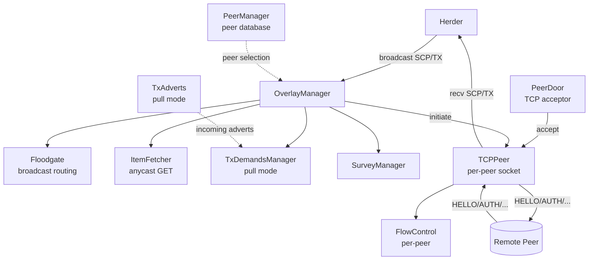
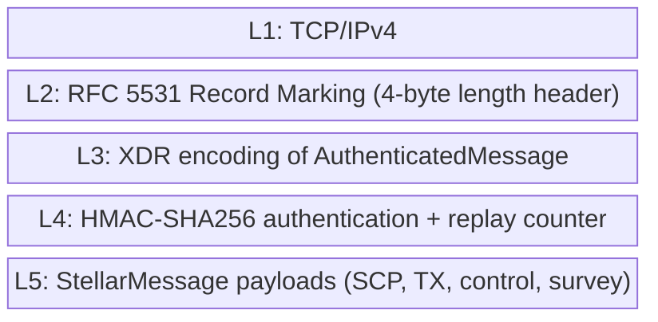
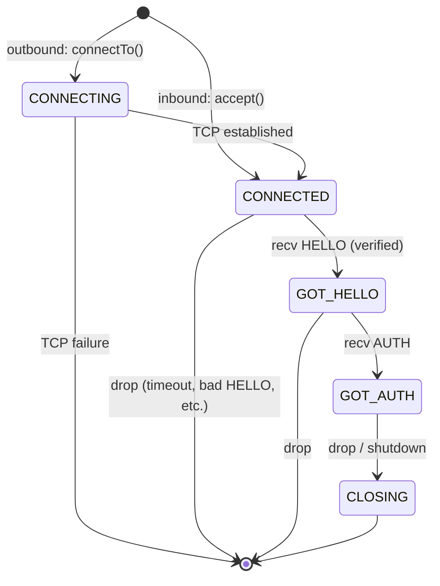
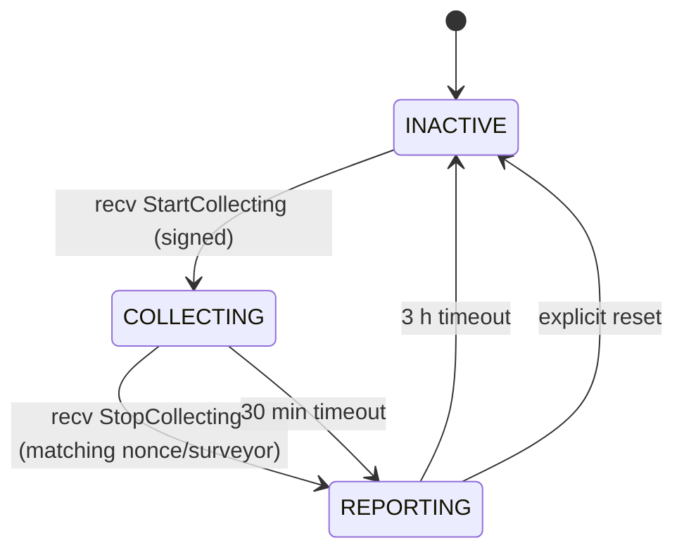

# Stellar Overlay Protocol Specification

**Version:** 26 (Overlay Protocol v38–v39)
**Status:** Informational
**Date:** 2026-05-13

## Table of Contents

1. [Introduction](#1-introduction)
2. [Architecture and Protocol Overview](#2-architecture-and-protocol-overview)
3. [Data Types and Encoding](#3-data-types-and-encoding)
4. [Protocol Stack and Message Framing](#4-protocol-stack-and-message-framing)
5. [Connection Lifecycle and Authentication](#5-connection-lifecycle-and-authentication)
6. [Message Type Registry](#6-message-type-registry)
7. [Flow Control](#7-flow-control)
8. [Transaction Flooding](#8-transaction-flooding)
9. [Broadcast and Fetch Subsystems](#9-broadcast-and-fetch-subsystems)
10. [Peer Management](#10-peer-management)
11. [Survey Protocol](#11-survey-protocol)
12. [Error Handling](#12-error-handling)
13. [Security Considerations](#13-security-considerations)
14. [Invariants](#14-invariants)
15. [Constants](#15-constants)
16. [References](#16-references)
17. [Appendix A: XDR Schema](#appendix-a-xdr-schema)
18. [Appendix B: Handshake Sequence Diagram](#appendix-b-handshake-sequence-diagram)
19. [Appendix C: Flow Control Worked Example](#appendix-c-flow-control-worked-example)

---

## 1. Introduction

### 1.1 Purpose and Scope

This document specifies the Stellar overlay network protocol: the
peer-to-peer transport layer that propagates SCP envelopes, transactions,
transaction sets, quorum sets, and survey data between Stellar nodes.

This specification is **implementation agnostic**. It is derived
exclusively from the vetted stellar-core C++ implementation (v26.0.1).
Any conforming implementation that produces identical wire-observable
behavior — message bytes, sequencing, handshake decisions, flow control
grants, flooding patterns, and peer-management transitions — for all
valid inputs is considered correct.

The overlay protocol carries the network identifier (`networkID`)
inside the handshake but otherwise carries no consensus-deterministic
state: message *delivery* is best-effort and non-deterministic. What
is normative is the *wire format*, the *handshake state machine*,
*authentication*, *flow control*, and the ordering guarantees inside
a single peer-to-peer connection.

**Out of scope:**

- Consensus algorithm semantics (see SCP_SPEC).
- Transaction validation and application semantics (see TX_SPEC).
- Herder-side consumption of overlay messages and decisions about
  retransmission of SCP envelopes (see HERDER_SPEC).
- Persistent ledger state, bucket lists, and history archive layout.
- Local resource accounting that is not communicated on the wire
  (threading, scheduler queues, asynchronous I/O policy, metrics
  registries, logging).
- Database schema for the peer table (the schema is a local
  implementation choice; only the externally observable connection
  decisions matter).

### 1.2 Conventions and Terminology

The key words MUST, MUST NOT, REQUIRED, SHALL, SHALL NOT, SHOULD,
SHOULD NOT, RECOMMENDED, MAY, and OPTIONAL in this document are to be
interpreted as described in RFC 2119.

Glossary:

| Term | Definition |
|---|---|
| Peer | A remote stellar-core node connected over a single TCP connection. |
| Inbound peer | A peer that initiated the TCP connection to the local node (role `REMOTE_CALLED_US`). |
| Outbound peer | A peer the local node initiated the TCP connection to (role `WE_CALLED_REMOTE`). |
| Pending peer | A connected peer that has not yet completed the HELLO/AUTH handshake. |
| Authenticated peer | A peer that has completed the HELLO/AUTH handshake (state `GOT_AUTH`). |
| Preferred peer | A peer whose address or NodeID appears in `PREFERRED_PEERS` or `PREFERRED_PEER_KEYS`. |
| Flood message | A message subject to flow control and gossip: `SCP_MESSAGE`, `TRANSACTION`, `FLOOD_ADVERT`, `FLOOD_DEMAND`. |
| Advert | A `FLOOD_ADVERT` carrying a vector of transaction hashes the sender has and is willing to deliver. |
| Demand | A `FLOOD_DEMAND` carrying a vector of transaction hashes the sender requests delivery for. |
| Surveyor | The node that originates a survey of network topology. |
| Surveyed | The node whose topology a surveyor requests. |
| Nonce | A 32-bit unsigned integer that identifies a survey, or a 256-bit value in handshake messages. |

### 1.3 Notation

Algorithms are expressed as prose with embedded pseudocode using
`camelCase` for variables and functions and `SCREAMING_SNAKE_CASE`
for XDR enum cases (e.g., `ERR_AUTH`, `SCP_MESSAGE`). XDR types are
referenced by name without reproducing definitions in the body;
Appendix A contains the complete XDR schema.

Cross-references to companion specifications use the plain-text form
`SPEC_NAME §N.N` (e.g., `HERDER_SPEC §3`). External links use
footnote-style Markdown definitions placed at the very end of this
file, after the Appendices.

### 1.4 Relationship to Other Specifications

| Specification | Relationship |
|---|---|
| SCP_SPEC | The overlay delivers `SCP_MESSAGE`, `GET_SCP_QUORUMSET`, `SCP_QUORUMSET`, and `GET_SCP_STATE` envelopes on behalf of the consensus layer. |
| HERDER_SPEC | The herder hands the overlay envelopes to broadcast and processes received envelopes; it also exposes `getTxSet`, `getQSet`, and `recvSCPEnvelope` entry points the overlay calls. |
| TX_SPEC | The overlay validates that received `TRANSACTION` messages parse as `TransactionEnvelope` and pre-populates transaction hash and signature caches; semantic validation belongs to TX_SPEC. |
| LEDGER_SPEC | The overlay reads the last-closed ledger version, the maximum transaction size, and Soroban network configuration to set flood capacity and advert/demand rates. |
| CATCHUP_SPEC | While catching up (not synced), the overlay drops incoming `TRANSACTION`, `FLOOD_ADVERT`, and `FLOOD_DEMAND` rather than processing them. |
| BUCKETLISTDB_SPEC | The overlay holds a `SearchableSnapshotConstPtr` for the overlay thread; it does not affect bucket semantics. |

---

## 2. Architecture and Protocol Overview

The overlay network is an unstructured peer-to-peer gossip network of
authenticated TCP connections. Each node maintains:

- A bounded set of outbound connections to peers it dialed.
- A bounded set of inbound connections from peers that dialed it.
- A persistent database of known peer addresses with per-address
  failure counters and exponential back-off.
- A flow-controlled, multi-priority send queue per authenticated peer.
- A floodgate that tracks which peers have delivered (or been
  delivered) each broadcast message.
- An item-fetcher that performs anycast `GET_TX_SET` / `GET_SCP_QUORUMSET`
  / `GET_SCP_STATE` queries against authenticated peers.
- A survey manager that orchestrates topology surveys.



The overlay's send path is asynchronous and load-shedding: messages
that cannot be delivered within bounded queue limits are dropped at
the sender. The receive path is flow-controlled: a peer only sends
flood messages up to the receiver's last advertised capacity, and the
receiver MUST issue `SEND_MORE_EXTENDED` to grant additional capacity.

The protocol has its own version axis independent of the ledger
protocol version. v26.0.1 supports overlay protocol versions 38–40,
with each peer advertising `[overlayMinVersion, overlayVersion]` in
its `HELLO` and aborting on disjoint ranges.

---

## 3. Data Types and Encoding

All wire messages are XDR-encoded per RFC 4506 [XDR]. The complete
XDR schema is reproduced in Appendix A. The following observations
apply throughout:

- All integer fields are big-endian, four-byte aligned.
- Variable-length opaque vectors and strings have explicit length
  prefixes and four-byte zero padding.
- Hash fields are 32 bytes. Signatures are 64-byte Ed25519. Public
  keys are 32-byte Ed25519 or Curve25519 as named.
- The on-wire envelope for every message after `HELLO` is the
  `AuthenticatedMessage` union (only version 0 is defined): a 64-bit
  `sequence`, the inner `StellarMessage`, and a 32-byte
  `HmacSha256Mac`. `HELLO` and `ERROR_MSG` are exceptions and are
  sent with a zeroed sequence and MAC (see §5.4).
- Each XDR `AuthenticatedMessage` is preceded on the TCP byte stream
  by a 4-byte RFC 5531 record-marking header [RM] (see §4.2).

### 3.1 Message Type Codes

The `MessageType` enum defines on-wire type codes. Codes 0, 2–3, 5–13,
16–24 are assigned; codes 1, 4, 14, 15 are reserved (deprecated /
removed). See §6 for the full registry.

### 3.2 Endpoint Addressing

A `PeerAddress` carries an IPv4 or IPv6 address (4-byte or 16-byte
opaque), a 32-bit `port`, and a 32-bit `numFailures` counter. IPv6
addresses are accepted on the wire but, in v26.0.1, are not yet
supported and MUST be silently ignored on receipt (see §10.5).

### 3.3 Wire-Level Size Limits

| Limit | Value | Scope |
|---|---|---|
| `MAX_MESSAGE_SIZE` | 16 MiB | Body length of any single authenticated message after handshake. |
| `MAX_UNAUTH_MESSAGE_SIZE` | 4096 bytes (0x1000) | Body length of any single message accepted from a not-yet-authenticated peer. |
| `MAX_CLASSIC_TX_SIZE_BYTES` | 100 KiB | Maximum size of a classic-protocol `TRANSACTION` body. |
| `MAX_TX_SET_ALLOWANCE` | 10 MiB | Maximum total size budget for a transaction set on the wire. |
| `MAX_SOROBAN_BYTE_ALLOWANCE` | 5 MiB | Soroban-half of `MAX_TX_SET_ALLOWANCE`. |
| `MAX_CLASSIC_BYTE_ALLOWANCE` | 5 MiB | Classic-half of `MAX_TX_SET_ALLOWANCE`. |
| `TX_ADVERT_VECTOR_MAX_SIZE` | 1000 | Max hashes per `FLOOD_ADVERT`. |
| `TX_DEMAND_VECTOR_MAX_SIZE` | 1000 | Max hashes per `FLOOD_DEMAND`. |
| `EncryptedBody` | 64000 bytes | Max ciphertext in survey response. |

A receiver MUST drop the connection if the record-marking header
declares a body length of 0, or a body length greater than the
applicable limit (4096 before authentication, 16 MiB after).

---

## 4. Protocol Stack and Message Framing

### 4.1 Layering



### 4.2 Record Marking

Each XDR message on the wire is preceded by a 4-byte big-endian
header. The high bit of the first byte is the RFC 5531 "last
fragment" marker; the remaining 31 bits are the body length in
bytes. stellar-core sets the high bit on every message
(only complete-fragment encoding is used) and strips it before
interpreting the length.

A receiver computes the body length as:

```
length = ((header[0] & 0x7F) << 24)
       | (header[1] << 16)
       | (header[2] << 8)
       | header[3]
```

If `length == 0`, or if `length > MAX_UNAUTH_MESSAGE_SIZE` while the
peer is not authenticated, or if `length > MAX_MESSAGE_SIZE`, the
receiver MUST drop the connection with reason "error during read".

### 4.3 AuthenticatedMessage Framing

Every `StellarMessage` is wrapped in `AuthenticatedMessage` version 0:

| Field | Type | Description |
|---|---|---|
| `sequence` | `uint64` | Monotonically increasing replay counter. |
| `message` | `StellarMessage` | The inner payload. |
| `mac` | `HmacSha256Mac` | HMAC-SHA256 over `sequence \|\| xdr(message)`. |

The sender MUST NOT include a MAC or sequence number for `HELLO` or
`ERROR_MSG`. For those two message types, the sender transmits the
message with `sequence = 0` and `mac = 0` and the receiver MUST NOT
verify the MAC (see §5.4 and `Hmac::setAuthenticatedMessageBody`).

For every other message type, the sender:

1. Sets `sequence = mSendMacSeq`.
2. Sets `mac = hmacSha256(mSendMacKey, xdr(sequence) || xdr(message))`.
3. Increments `mSendMacSeq` by one.

The receiver verifies in this exact order:

1. `msg.sequence == mRecvMacSeq` — else fail with
   `"unexpected auth sequence"`.
2. `mRecvMacKey != 0` — else fail with `"receive mac key is zero"`.
3. `hmacSha256Verify(msg.mac, mRecvMacKey, xdr(sequence) || xdr(message))`
   — else fail with `"unexpected MAC"`.
4. On success, increment `mRecvMacSeq` by one.

A MAC failure MUST result in sending an `ERROR_MSG` with
`code = ERR_AUTH` and dropping the connection.

---

## 5. Connection Lifecycle and Authentication

### 5.1 Peer State Machine



A peer occupies exactly one state at any time. Inbound peers start
in `CONNECTED` (the TCP socket is already established when the peer
object is constructed). Outbound peers start in `CONNECTING` and
transition to `CONNECTED` when `async_connect` completes
successfully. `CLOSING` is terminal: once entered, no further
messages are processed and the connection is torn down.

### 5.2 Discovery

A node learns peer addresses by:

1. **Configuration**: `KNOWN_PEERS` and `PREFERRED_PEERS` in the
   config file are resolved (DNS-resolved if hostnames) on startup
   and again every 600 s (`PEER_IP_RESOLVE_DELAY`). On resolution
   error the retry interval is `10 * retryCount` seconds, capped at
   600 s; after the cap is reached, retries cease until the next
   normal resolution period.
2. **Inbound `PEERS` messages**: a peer SHOULD send a `PEERS`
   message after responding to `AUTH` (see §5.4). The receiver
   stores any non-private, non-self, non-localhost IPv4 entries in
   its peer database via `PeerManager::ensureExists`.
3. **Crash/restart**: addresses persist in the local peer database
   (SQLite `peers` table with columns `ip`, `port`, `nextattempt`,
   `numfailures`, `type`). The schema is not normative; a conforming
   implementation MAY use any persistent store.

### 5.3 Connection Establishment

Outbound connection initiation:

1. The overlay tick (period `PEER_AUTHENTICATION_TIMEOUT + 1` seconds,
   default 3 s) selects candidate addresses from
   `PeerManager::loadRandomPeers` filtered by `nextattempt <= now`
   and `numfailures <= REALLY_DEAD_NUM_FAILURES_CUTOFF` (120).
2. For each candidate the back-off counter is incremented
   (`PeerManager::update(..., INCREASE)`), shifting `nextattempt`
   forward by a random duration in
   `[1, (1 << min(numFailures, 10)) * 10)` seconds.
3. `TCPPeer::initiate` opens the socket with `TCP_NODELAY` set,
   `SO_LINGER` disabled (linger=false, timeout=0), and a 256 KiB
   buffered read.
4. On TCP connect success, `setState(CONNECTED)` and `sendHello()`.

Inbound connection acceptance:

1. The acceptor listens on `PEER_PORT` (default 11625) with backlog
   100.
2. On accept, the receiving node calls `haveSpaceForConnection(ip)`.
   If the inbound pending capacity is exhausted, the socket is
   closed immediately without creating a `Peer` object.
3. `haveSpaceForConnection` compares the larger of
   `mInboundPeers.mPending.size()` and the live inbound counter to
   `MAX_INBOUND_PENDING_CONNECTIONS`. If the IP matches a
   `PREFERRED_PEERS` entry, an extra `POSSIBLY_PREFERRED_EXTRA = 2`
   slots are allowed.
4. On success, a `TCPPeer` with role `REMOTE_CALLED_US` is created in
   state `CONNECTED`, and `startRead()` is scheduled.

### 5.4 HELLO/AUTH Handshake

The handshake is a two-message exchange in each direction. Order of
events:

1. Outbound peer A sends `HELLO(certA, nonceA)`.
2. Inbound peer B receives `HELLO`, verifies, and sends
   `HELLO(certB, nonceB)`. B must wait for A's `AUTH` before sending
   its own `AUTH`.
3. A receives B's `HELLO`, verifies, and sends `AUTH`.
4. B receives `AUTH`, sets state to `GOT_AUTH`, sends back `AUTH`,
   sends `PEERS`, and sends `SEND_MORE_EXTENDED` with its initial
   flow control credit.
5. A receives B's `AUTH`, sets state to `GOT_AUTH`, sends
   `SEND_MORE_EXTENDED` with its initial flow control credit, and
   sends `GET_SCP_STATE` to bootstrap consensus state.

A detailed sequence diagram is in Appendix B.

#### 5.4.1 The `HELLO` Message

`HELLO` contains:

| Field | Description |
|---|---|
| `ledgerVersion` | The sender's `LEDGER_PROTOCOL_VERSION`. Informational. |
| `overlayVersion` | The sender's maximum supported overlay version. |
| `overlayMinVersion` | The sender's minimum supported overlay version. |
| `networkID` | SHA-256 of the network passphrase. |
| `versionStr` | Free-form version string (≤100 chars). |
| `listeningPort` | Sender's listening port. Must be in `(0, 65535]`. |
| `peerID` | Sender's long-lived Ed25519 public key (NodeID). |
| `cert` | `AuthCert` (see §5.4.2). |
| `nonce` | 32-byte random handshake nonce. |

`HELLO` is sent unauthenticated: the recipient cannot HMAC-verify it
because the MAC keys are derived from `cert.pubkey`, `nonce`, and the
local nonce. Bytes 0–63 of the framed `HELLO` are limited to
`MAX_UNAUTH_MESSAGE_SIZE`; the receiver MUST drop the connection if
the body exceeds 4096 bytes.

The receiver MUST validate `HELLO` in this exact order:

1. Current peer state MUST be less than `GOT_HELLO`; otherwise drop
   with reason "received unexpected HELLO".
2. `verifyRemoteAuthCert(elo.peerID, elo.cert)` MUST succeed —
   otherwise drop with reason "failed to verify auth cert".
3. The sender's `peerID` MUST NOT be banned (see §10.7) — otherwise
   drop with reason "node is banned".
4. The peer's IP address MUST already be known (set by
   `TCPPeer::initiate` or `TCPPeer::accept`); else drop with reason
   "failed to determine remote address".
5. Set `mAddress = (ip, elo.listeningPort)`.
6. If the inbound role, send `HELLO` back immediately.
7. If `overlayMinVersion > overlayVersion`, or
   `overlayVersion < OVERLAY_PROTOCOL_MIN_VERSION` (local), or
   `overlayMinVersion > OVERLAY_PROTOCOL_VERSION` (local), the
   ranges are disjoint: send `ERROR_MSG(ERR_CONF, "wrong protocol
   version")` and drop.
8. If `elo.peerID == ourNodeSeed.publicKey`, send
   `ERROR_MSG(ERR_CONF, "connecting to self")` and drop.
9. If `elo.networkID != localNetworkID`, send
   `ERROR_MSG(ERR_CONF, "wrong network passphrase")` and drop.
10. If `elo.listeningPort <= 0 || > UINT16_MAX`, send
    `ERROR_MSG(ERR_CONF, "bad address")` and drop.
11. Run `updatePeerRecordAfterEcho` to set the DB-stored peer type
    based on whether the peer is preferred / outbound / inbound.
12. If an already-authenticated peer with the same `peerID` exists,
    send `ERROR_MSG(ERR_CONF, "already-connected peer: <id>")` and
    drop.
13. If any other pending peer also has this `peerID`, drop with the
    same error.
14. If the role is `WE_CALLED_REMOTE`, send `AUTH` now.

The state transitions to `GOT_HELLO` after the cert/ban/version/network
checks pass (between steps 4 and 5).

#### 5.4.2 AuthCert and Key Derivation

`AuthCert`:

| Field | Description |
|---|---|
| `pubkey` | Sender's ephemeral Curve25519 public key. |
| `expiration` | Unix seconds when the cert expires. |
| `sig` | Ed25519 signature by `peerID` over `xdr(networkID, ENVELOPE_TYPE_AUTH, expiration, pubkey)`. |

A node generates a fresh ephemeral Curve25519 keypair at startup and
holds it for the process lifetime. The certificate is regenerated
every 30 minutes (when `expiration < now + 1800`) with a 1-hour
expiration window (`expirationLimit = 3600`). The cert is signed
using the long-lived Ed25519 node seed.

`verifyRemoteAuthCert`:

1. MUST reject if `cert.expiration < now`.
2. MUST verify the Ed25519 signature on
   `hash = sha256(xdr(networkID, ENVELOPE_TYPE_AUTH, expiration, pubkey))`.

#### 5.4.3 MAC Key Derivation

Once both `HELLO` messages have been exchanged, each peer derives two
HMAC-SHA256 keys per connection: a sending key and a receiving key.

Let A be the dialer (`WE_CALLED_REMOTE`) and B be the acceptor
(`REMOTE_CALLED_US`). Let `K_shared = HKDF_extract(ECDH(secA, pubB)
|| pubA || pubB)`, where `ECDH` is the X25519 shared secret and
`HKDF` is per RFC 5869 with empty salt. The per-peer shared key is
cached in a `RandomEvictionCache` (`mSharedKeyCache`) keyed by
`(remotePublic, role)`.

Per-connection keys are:

```
K_AB = HKDF_expand(K_shared, 0 || nonceA || nonceB)   # A sends, B receives
K_BA = HKDF_expand(K_shared, 1 || nonceB || nonceA)   # B sends, A receives
```

Each node computes both keys from its local point of view:

- A: `sendingKey = K_AB` (prefix 0, localNonce=A, remoteNonce=B);
  `receivingKey = K_BA` (prefix 1, remoteNonce=B, localNonce=A).
- B: `sendingKey = K_BA` (prefix 1, localNonce=B, remoteNonce=A);
  `receivingKey = K_AB` (prefix 0, remoteNonce=A, localNonce=B).

Once set, `Hmac::setSendMackey` and `Hmac::setRecvMackey` MUST refuse
to overwrite a previously-set non-zero key (return `false`). This
guards against late-arriving `HELLO` reprocessing.

#### 5.4.4 The `AUTH` Message

`AUTH` carries one 32-bit `flags` field. Conforming peers MUST set
`flags == AUTH_MSG_FLAG_FLOW_CONTROL_BYTES_REQUESTED` (decimal 200).
A receiver MUST drop the peer with `ERROR_MSG(ERR_CONF, "flow control
bytes disabled")` if it receives an `AUTH` with any other value.
This requirement enforces that the byte-granular flow control variant
(see §7) is mandatory in overlay protocol v38 and later.

`AUTH` handling order (`Peer::recvAuth`):

1. Current state MUST be exactly `GOT_HELLO`; otherwise send
   `ERROR_MSG(ERR_MISC, "out-of-order AUTH message")` and drop.
2. Set state to `GOT_AUTH`.
3. If the local role is `REMOTE_CALLED_US`, immediately send `AUTH`,
   then `PEERS` (up to 50 entries, see §10.6).
4. `updatePeerRecordAfterAuthentication`: if outbound, RESET the
   peer's `numFailures` to 0 in the DB.
5. `OverlayManager::acceptAuthenticatedPeer` decides whether to
   admit the peer (see §10.3); if rejected, send
   `ERROR_MSG(ERR_LOAD, "peer rejected")` and drop.
6. Verify `auth.flags == 200`; else `ERR_CONF` + drop.
7. Send `SEND_MORE_EXTENDED(numMessages=PEER_FLOOD_READING_CAPACITY,
   numBytes=getFlowControlBytesTotal())` to grant initial flow
   control credit.
8. Start the TxAdverts subsystem for this peer.
9. Send `GET_SCP_STATE(getMinLedgerSeqToAskPeers())`.

The initial `SEND_MORE_EXTENDED` MUST be sent before any other
flood-controlled traffic on this connection. The peer's outbound
flood credit is zero until it has received this grant.

### 5.5 Pre-Authentication Message Discipline

Before the local state reaches `GOT_AUTH`, only `HELLO`, `AUTH`, and
`ERROR_MSG` are accepted from the remote peer (see
`Peer::recvRawMessage`). Any other message type received before
`GOT_AUTH` causes the receiver to drop the connection with reason
`"received <type> before completed handshake"`.

Additionally:

- An inbound role peer (`REMOTE_CALLED_US`) MUST NOT receive `PEERS`
  (this implies the remote thinks the local node is the inbound
  side, which is contradictory). Receiving `PEERS` in that role is a
  drop.
- All pre-authentication messages are dispatched on a single
  scheduler queue (`AUTH_ACTION_QUEUE`) to preserve ordering.

### 5.6 Timeouts

| Timeout | Default | Trigger |
|---|---|---|
| `PEER_AUTHENTICATION_TIMEOUT` | 2 s | Maximum time to complete handshake; recurring timer fires every 5 s and drops if `now - max(lastRead, lastWrite) >= timeout`. |
| `PEER_TIMEOUT` | 30 s | Maximum idle time between reads/writes once authenticated. |
| `PEER_STRAGGLER_TIMEOUT` | 120 s | Maximum age of the oldest enqueued outbound write. |
| `PEER_SEND_MODE_IDLE_TIMEOUT` | 60 s | Maximum time without receiving `SEND_MORE_EXTENDED` capacity grants when the local node has flood traffic queued. |
| `MS_TO_WAIT_FOR_FETCH_REPLY` | 1500 ms | Time to wait before trying the next peer in an item-fetcher anycast. |

On `PEER_TIMEOUT` expiry the peer is dropped with reason "idle
timeout". On `PEER_STRAGGLER_TIMEOUT` expiry, "straggling (cannot
keep up)". On `PEER_SEND_MODE_IDLE_TIMEOUT`, "idle timeout (no new
flood requests)".

The recurring timer also sends a ping: it picks a hash derived from
the current time, sends `GET_SCP_QUORUMSET(hash)`, and waits for a
`SCP_QUORUMSET` or `DONT_HAVE` echo to measure round-trip latency.
This is purely informational; the response is reported to the survey
subsystem as `mLatencyMsHistogram`.

---

## 6. Message Type Registry

This section enumerates every assigned `MessageType` code with its
semantics. Codes 1, 4, 14, 15 are reserved.

| Code | Type | Direction | Authenticated | Flooded | Purpose |
|---|---|---|---|---|---|
| 0 | `ERROR_MSG` | bidir | No (unauthenticated allowed) | No | Signal error and drop. |
| 2 | `AUTH` | bidir | Yes (first authenticated message) | No | Confirm handshake; carry flow-control feature flag. |
| 3 | `DONT_HAVE` | response | Yes | No | Reply when an anycast item is not held. |
| 5 | `PEERS` | response to `AUTH` | Yes | No | Up to 100 peer addresses for discovery. |
| 6 | `GET_TX_SET` | request | Yes | No | Anycast: request a transaction set by hash. |
| 7 | `TX_SET` | response | Yes | No (production) | Reply with a legacy transaction set. |
| 8 | `TRANSACTION` | bidir | Yes | Yes | A transaction envelope to flood. |
| 9 | `GET_SCP_QUORUMSET` | request | Yes | No | Anycast: request a quorum set by hash. |
| 10 | `SCP_QUORUMSET` | response | Yes | No | Reply with a quorum set. |
| 11 | `SCP_MESSAGE` | bidir | Yes | Yes | An SCP envelope. |
| 12 | `GET_SCP_STATE` | request | Yes | No | Request the peer's SCP envelopes from a given ledger seq. |
| 13 | `HELLO` | bidir (first) | No (unauthenticated) | No | Handshake intro. |
| 16 | `SEND_MORE` | bidir | Yes | No | Legacy message-only flow control; receiving it in v38+ is a drop (the byte-extended variant is mandatory). |
| 17 | `GENERALIZED_TX_SET` | response | Yes | No | Reply with a generalized (Soroban-aware) transaction set. |
| 18 | `FLOOD_ADVERT` | bidir | Yes | Yes (subject to flow control) | Advertise transaction hashes. |
| 19 | `FLOOD_DEMAND` | bidir | Yes | Yes (subject to flow control) | Demand transaction hashes. |
| 20 | `SEND_MORE_EXTENDED` | bidir | Yes | No | Grant additional message and byte capacity. |
| 21 | `TIME_SLICED_SURVEY_REQUEST` | flood | Yes | Yes | Survey topology request. |
| 22 | `TIME_SLICED_SURVEY_RESPONSE` | flood | Yes | Yes | Survey topology response. |
| 23 | `TIME_SLICED_SURVEY_START_COLLECTING` | flood | Yes | Yes | Begin the survey collecting phase. |
| 24 | `TIME_SLICED_SURVEY_STOP_COLLECTING` | flood | Yes | Yes | End the survey collecting phase. |

The set of flood-eligible types is fixed and is determined by
`OverlayManager::isFloodMessage`:

```
isFloodMessage(msg) ==
    msg.type in { SCP_MESSAGE, TRANSACTION, FLOOD_DEMAND, FLOOD_ADVERT }
```

Survey messages are forwarded by the survey manager via
`broadcastMessage` but are not classified as flood for flow-control
purposes; they pass through the floodgate's deduplication.

### 6.1 Scheduling Category Mapping

When dispatching received messages to the per-peer scheduler, the
following category mapping is used (`Peer::recvAuthenticatedMessage`):

| Message types | Category | Drop-policy |
|---|---|---|
| `HELLO`, `AUTH` | `AUTH` | NORMAL |
| `PEERS`, `ERROR_MSG`, `SEND_MORE`, `SEND_MORE_EXTENDED` | `CTRL` | NORMAL |
| `TRANSACTION`, `FLOOD_ADVERT`, `FLOOD_DEMAND` | `TX` | DROPPABLE |
| `GET_TX_SET`, `GET_SCP_QUORUMSET`, `GET_SCP_STATE` | `SCPQ` | DROPPABLE |
| `DONT_HAVE`, `TX_SET`, `GENERALIZED_TX_SET`, `SCP_QUORUMSET`, `SCP_MESSAGE` | `SCP` | NORMAL |
| any survey type | (survey-specific) | NORMAL |

While the peer is not yet `GOT_AUTH`, all messages are forced onto
the `AUTH` queue regardless of type, so handshake-period messages
are processed strictly in order.

---

## 7. Flow Control

### 7.1 Model

Once a peer is authenticated, all flood messages flowing in both
directions are subject to a dual-axis credit-based flow control: one
axis counts messages, the other counts bytes. The receiver issues
grants via `SEND_MORE_EXTENDED` after processing batches of incoming
flood traffic; the sender MUST NOT exceed the granted credit on
either axis.

Each peer maintains, on each axis, two capacity values:

- **Reading capacity** (local, what *we* are willing to read from the
  peer): split into a `floodCapacity` and an optional `totalCapacity`.
  `floodCapacity` is consumed by flood messages; `totalCapacity` is
  consumed by every message (counts both flood and non-flood).
- **Outbound capacity** (what the *peer* is willing to read from us):
  a single counter incremented by received `SEND_MORE_EXTENDED`
  grants and decremented when a flood message is sent.

Concretely:

| Capacity object | Reading flood limit | Reading total limit | Outbound counter |
|---|---|---|---|
| `FlowControlMessageCapacity` (messages) | `PEER_FLOOD_READING_CAPACITY` (default 200) | `PEER_READING_CAPACITY` (default 201) | from `SEND_MORE_EXTENDED.numMessages` |
| `FlowControlByteCapacity` (bytes) | initial flood byte limit (see §7.2) | unbounded (no totalCapacity) | from `SEND_MORE_EXTENDED.numBytes` |

A flood message MAY be sent only when **both** the outbound message
counter and the outbound byte counter are ≥ the message's cost
(1 message; `xdr_size(msg)` bytes).

### 7.2 Initial Capacity Grant

Immediately after handshake the receiver sends:

```
SEND_MORE_EXTENDED {
    numMessages = PEER_FLOOD_READING_CAPACITY,   // default 200
    numBytes    = getFlowControlBytesTotal()
}
```

`getFlowControlBytesTotal()` computes:

1. If both `PEER_FLOOD_READING_CAPACITY_BYTES == 0` and
   `FLOW_CONTROL_SEND_MORE_BATCH_SIZE_BYTES == 0`:
   - Define
     `INITIAL_PEER_FLOOD_READING_CAPACITY_BYTES = 300_000` and
     `INITIAL_FLOW_CONTROL_SEND_MORE_BATCH_SIZE_BYTES = 100_000`.
   - If `(INITIAL_PEER_FLOOD_READING_CAPACITY_BYTES -
     INITIAL_FLOW_CONTROL_SEND_MORE_BATCH_SIZE_BYTES) >= maxTxSize`,
     return `INITIAL_PEER_FLOOD_READING_CAPACITY_BYTES`.
   - Otherwise return
     `maxTxSize + INITIAL_FLOW_CONTROL_SEND_MORE_BATCH_SIZE_BYTES`.
2. Otherwise return `PEER_FLOOD_READING_CAPACITY_BYTES`.

`getFlowControlBytesBatch()` returns
`INITIAL_FLOW_CONTROL_SEND_MORE_BATCH_SIZE_BYTES` (100,000) by
default, or `FLOW_CONTROL_SEND_MORE_BATCH_SIZE_BYTES` if configured.

### 7.3 Reading Side: Lock and Release

When a complete authenticated flood message is read off the socket
(`Peer::recvAuthenticatedMessage`), the receiver constructs a
`CapacityTrackedMessage` which calls `beginMessageProcessing`:

1. If neither the byte axis nor the message axis can accommodate the
   message (`canLockLocalCapacity` would return false), the receiver
   MUST drop the peer with reason "unexpected flood message, peer at
   capacity". This protects against a peer sending more flood data
   than it was granted.
2. Otherwise, decrement both flood (if applicable) and total reading
   capacity by the message's cost.

When message processing completes (`CapacityTrackedMessage`
destructor → `endMessageProcessing`):

1. Increment both axes' reading capacity by the message's cost
   (flood credit only restored for flood-typed messages).
2. Accumulate the released flood-message count into
   `mFloodDataProcessed` and the released flood bytes into
   `mFloodDataProcessedBytes`. Increment `mTotalMsgsProcessed`.
3. Compute `shouldSendMore`:
   - If `mFloodDataProcessed == FLOW_CONTROL_SEND_MORE_BATCH_SIZE`
     (default 40), or
   - If `mFloodDataProcessedBytes >= getFlowControlBytesBatch()`,
   send a `SEND_MORE_EXTENDED(numMessages=mFloodDataProcessed,
   numBytes=mFloodDataProcessedBytes)` and reset both counters.
4. If `mTotalMsgsProcessed == PEER_READING_CAPACITY`, return the
   counter to the caller (used to detect when a full batch has been
   processed and resume reading after throttling).

`releaseAssert(mFloodDataProcessed <=
FLOW_CONTROL_SEND_MORE_BATCH_SIZE)` enforces that grants are never
issued for more credit than the batch size.

### 7.4 Reading Throttling

A peer that has consumed its `totalCapacity` (message axis only —
the byte axis has no total limit) is throttled: the read loop
returns without issuing the next `async_read`. When subsequent
`endMessageProcessing` calls free enough capacity such that
`canRead()` is true again and a full `PEER_READING_CAPACITY` batch
has been processed, reading is rescheduled.

`canRead()` is true iff both axes can read:

- byte axis: always true (no total reading limit).
- message axis: `*mCapacity.mTotalCapacity > 0`.

### 7.5 Sending Side: Outbound Queues

Each peer holds four FIFO outbound queues, indexed by priority:

| Priority | Queue | Drop policy when over limit |
|---|---|---|
| 0 (highest) | `SCP_MESSAGE` | Drop SCP messages for slots below `minLedgerSeqToRemember` (except `mostRecentCheckpointSeq`). When a newer NOMINATE/BALLOT for the same slot+validator arrives, replace the older one (`isNewerNominationOrBallotSt`). |
| 1 | `TRANSACTION` | If total queue length exceeds `getLastMaxTxSetSizeOps()`, or aggregate bytes exceed `OUTBOUND_TX_QUEUE_BYTE_LIMIT` (default 3 MiB), drop the entire queue. Transactions whose size exceeds `getMaxTxSize()` are not enqueued in the first place. |
| 2 | `FLOOD_DEMAND` | If aggregate `txHashes` count exceeds `getLastMaxTxSetSizeOps()`, drop the entire queue. |
| 3 (lowest) | `FLOOD_ADVERT` | Same as `FLOOD_DEMAND`. |

`getNextBatchToSend` iterates queues in priority order. For each
message at the head of its queue:

1. Check outbound capacity on both axes; if either is insufficient,
   set `mNoOutboundCapacity = now` (start the no-outbound timer) and
   stop iterating.
2. Skip messages already marked `mBeingSent`.
3. Add to the send batch; mark `mBeingSent = true`; decrement
   outbound capacity on both axes.

`processSentMessages` is invoked from the write completion handler;
it pops the corresponding entries from each queue and updates the
queue-specific byte/hash counters. If a queue was cleared (e.g., by
load shedding) between dispatch and completion, the matched entry is
silently skipped.

### 7.6 `SEND_MORE_EXTENDED` Validation

On receipt of `SEND_MORE` or `SEND_MORE_EXTENDED`:

1. The message type MUST be `SEND_MORE_EXTENDED`; receiving
   `SEND_MORE` (legacy, message-only) is rejected with reason
   `"unexpected message type SEND_MORE"`.
2. `numBytes` MUST be non-zero (the byte axis is mandatory).
3. Neither `outboundCapacity + numMessages` nor
   `outboundByteCapacity + numBytes` may overflow `UINT64_MAX`; if
   either does, drop with `"Peer capacity overflow"`.

On success, the receiver increments its outbound capacities and
clears `mNoOutboundCapacity`. Sending resumes via
`getNextBatchToSend`.

### 7.7 Tx-Size Increase Handling

When a network upgrade raises the maximum transaction size (a
Soroban `txMaxSizeBytes` increase, observed in LEDGER_SPEC §6), the
overlay calls `Peer::handleMaxTxSizeIncrease(increase)`:

1. Add `increase` to the flood byte capacity limit
   (`FlowControlByteCapacity::handleTxSizeIncrease`).
2. Send `SEND_MORE_EXTENDED(numMessages=0, numBytes=increase)` to
   immediately propagate the new capacity to the peer. Note that
   `numMessages == 0` is permitted only on this path (and the
   receiver MUST accept it because `numBytes > 0`).

---

## 8. Transaction Flooding

Transaction propagation uses a **pull (advert/demand)** model in
v26.0.1: the holder of a transaction advertises its hash, and
interested peers explicitly request (demand) it.

### 8.1 Advert Phase

When `Floodgate::broadcast` is invoked with a `TRANSACTION` message
and its hash, for every authenticated peer that has not already been
recorded as having seen the message, the sender calls
`peer.sendAdvert(hash)`:

1. If the hash is already in the advert history cache (50,000-entry
   `RandomEvictionCache`), it is dropped (already advertised).
2. Otherwise, enqueue on the peer's outgoing advert vector.
3. When the vector is empty and a hash is appended, start a timer
   for `FLOOD_ADVERT_PERIOD_MS` (default 100 ms).
4. Flush the vector immediately when its size reaches
   `getMaxAdvertSize()`; otherwise flush on timer expiry.

`getMaxAdvertSize()`:

```
opsToFlood = floor(FLOOD_OP_RATE_PER_LEDGER * lastMaxTxSetSizeOps)
if ledgerVersion >= SOROBAN_PROTOCOL_VERSION:
    opsToFlood += floor(FLOOD_SOROBAN_RATE_PER_LEDGER *
                        sorobanLedgerMaxTxCount)
res = ceil(opsToFlood * FLOOD_ADVERT_PERIOD_MS / ledgerCloseTime)
return clamp(res, 1, TX_ADVERT_VECTOR_MAX_SIZE)
```

A `FLOOD_ADVERT` message is then sent via the normal outbound queue
(priority 3) and is subject to flow control.

### 8.2 Demand Phase

The receiver of `FLOOD_ADVERT` runs `TxAdverts::queueIncomingAdvert`:

1. For each hash, record it in the advert history at the current
   tracking consensus ledger.
2. If the advert vector exceeds `getLastMaxTxSetSizeOps()`, drop the
   leading prefix so only the most recent N entries remain.
3. Append the entries to `mIncomingTxHashes`.
4. While `mIncomingTxHashes.size() + mTxHashesToRetry.size() >
   limit`, pop the oldest.

The demand scheduler (`TxDemandsManager`) wakes every
`FLOOD_DEMAND_PERIOD_MS` (default 200 ms). On each tick:

1. Drop history entries older than
   `2 * MAX_DELAY_DEMAND * MAX_RETRY_COUNT = 60 s` from
   `mPendingDemands` (with `MAX_DELAY_DEMAND = 2 s`, `MAX_RETRY_COUNT
   = 15`).
2. Snapshot a random shuffle of authenticated peers.
3. Round-robin across peers, popping one advert per peer per
   iteration and classifying via `demandStatus`:
   - `DISCARD` if the tx is banned or already in the herder's queue.
   - `DISCARD` if this peer has already been demanded for this hash.
   - `DEMAND` if not yet demanded, or if at least
     `numDemanded * FLOOD_DEMAND_BACKOFF_DELAY_MS` has elapsed since
     the last demand (capped at 2 s).
   - `RETRY_LATER` otherwise.
4. Group demands per peer; cap each group at `getMaxDemandSize()`:

```
opsToFlood = floor(FLOOD_OP_RATE_PER_LEDGER * maxQueueSizeOps)
            + floor(FLOOD_SOROBAN_RATE_PER_LEDGER * maxQueueSorobanOps)
res = ceil(opsToFlood * FLOOD_DEMAND_PERIOD_MS / ledgerCloseTime)
return clamp(res, 1, TX_DEMAND_VECTOR_MAX_SIZE)
```

5. For each peer, send `FLOOD_DEMAND(txHashes)` and call
   `retryAdvert(retryList)` to put `RETRY_LATER` hashes back at the
   front of the retry queue.
6. After `MAX_RETRY_COUNT = 15` failed attempts, the hash is
   discarded — the network is assumed to no longer hold it.

### 8.3 Demand Service

A peer receiving `FLOOD_DEMAND` (`TxDemandsManager::recvTxDemand`)
iterates each hash:

- If the herder holds the transaction, send the full `TRANSACTION`
  message back and increment `mMessagesFulfilled`.
- Otherwise, do not respond. Increment `mBannedMessageUnfulfilled`
  if the hash is in the banned set, else
  `mUnknownMessageUnfulfilled`.

### 8.4 Transaction Reception

`OverlayManager::recvTransaction` is invoked once the herder has
parsed the `TRANSACTION` body:

1. Record this peer as having the message in the floodgate.
2. Record pull latency (`recordTxPullLatency`).
3. Submit the transaction to the herder's tx queue
   (`recvTransaction(tx, isInternal=false)`).
4. If the result code is **not** `ADD_STATUS_PENDING` and **not**
   `ADD_STATUS_DUPLICATE`, forget the flood record so the message
   could be advertised again if reintroduced. Otherwise the peer
   continues to receive credit and the transaction is treated as
   propagated.

While the local node is not synced (`!isSynced()`), all incoming
`TRANSACTION`, `FLOOD_ADVERT`, and `FLOOD_DEMAND` messages MUST be
discarded without further processing.

---

## 9. Broadcast and Fetch Subsystems

### 9.1 Floodgate (Broadcast)

The floodgate tracks, for each broadcast message (identified by its
BLAKE2 hash), the set of peers known to have seen it.
`Floodgate::broadcast(msg, hash)`:

1. If the local node is shutting down, return false.
2. For `TRANSACTION`, the caller MUST supply a hash; for SCP, the
   hash is computed as `xdrBlake2(msg)`.
3. Look up or insert a `FloodRecord` for `index = xdrBlake2(msg)`,
   tagged with the current consensus ledger index.
4. Snapshot the authenticated peer set (copy, because peers may be
   dropped concurrently).
5. For each peer not already in `peersTold`:
   - If type is `TRANSACTION`, call `peer.sendAdvert(hash)`.
   - Else if type is `SCP_MESSAGE`, call `peer.sendMessage(msg, log)`
     directly (synchronously on the main thread).
   - Else (e.g., survey messages) post the send to the main thread.
6. Mark `broadcasted = true` if any peer was scheduled.

`recvFloodedMsgID(peer, msgID)` registers that `peer` has shown the
local node a particular broadcast — both inhibiting send-back and
returning `true` only if the record is new (for SCP, used by the
herder to decide whether to process the envelope).

`forgetFloodedMsg(msgID)` allows the floodgate entry to be evicted
when the message is determined to be invalid; subsequent broadcasts
of an equivalent message MAY then propagate.

`clearBelow(maxLedger)` is invoked when a ledger closes and removes
all flood records with `mLedgerSeq < maxLedger`.

### 9.2 ItemFetcher (Anycast)

For `GET_TX_SET` and `GET_SCP_QUORUMSET`, the herder calls
`ItemFetcher::fetch(itemHash, envelope)`. Per item hash, a `Tracker`
is created the first time:

1. The tracker records all envelopes waiting on this item.
2. `tryNextPeer` picks a random authenticated peer that has not yet
   been asked (or, if all peers have been asked, rebuilds the list —
   up to `MAX_REBUILD_FETCH_LIST = 10` rebuilds).
3. The tracker calls the `AskPeer` callback (`peer.sendGetTxSet` or
   `peer.sendGetQuorumSet`) and starts a timer of
   `MS_TO_WAIT_FOR_FETCH_REPLY = 1500 ms`.
4. On timer expiry or on `DONT_HAVE`, call `tryNextPeer` again.
5. On receipt of the matching `TX_SET` / `GENERALIZED_TX_SET` /
   `SCP_QUORUMSET`, the herder is notified for each waiting envelope
   and the tracker is cancelled.

`stopFetchingOutsideRange(minSlot, maxSlot, slotToKeep)` is called
when ledgers close to garbage-collect envelopes for slots that fall
outside the current range.

### 9.3 Anycast Responses and Rate Limits

For `GET_TX_SET`, `GET_SCP_QUORUMSET`, and `GET_SCP_STATE`, each peer
enforces a per-window rate limit (`QueryInfo`):

- The window length is
  `expectedLedgerCloseTime * MAX_SLOTS_TO_REMEMBER` seconds.
- The per-window cap is `windowSeconds * QUERY_RESPONSE_MULTIPLIER
  (5)` queries, except `GET_SCP_STATE` which uses a fixed
  `GET_SCP_STATE_MAX_RATE = 10` per window.
- When the window expires (last-timestamp older than the window
  length), the counter resets.
- Queries above the cap are silently dropped (no `DONT_HAVE`).

For accepted queries:

- If the requested item is held, send the corresponding response
  message.
- Otherwise send `DONT_HAVE(type, hash)`. For `GET_TX_SET` before the
  Soroban protocol version, the response type is `TX_SET`; from
  Soroban onward it is `GENERALIZED_TX_SET`.

For `GET_SCP_STATE`, the herder is asked to send all envelopes from
the requested ledger seq forward.

### 9.4 `PEERS` Broadcasting

When a peer transitions to `GOT_AUTH` in the inbound role, it sends a
`PEERS` message with up to 50 entries (and the wire structure caps
the vector at 100). The selected addresses come from
`PeerManager::getPeersToSend(50, peerAddress)`:

1. Filter out private and self-address entries.
2. Randomly sample up to 50 from the outbound-eligible pool; if
   fewer than 50 found, top up from the inbound pool.

The receiver of `PEERS` (`Peer::recvPeers`):

1. Drop the connection with `"too many msgs PEERS"` if a second
   `PEERS` is received from the same peer.
2. For each entry: skip if `port == 0 || port > UINT16_MAX`, IPv6,
   private, the local node's own address, or localhost (unless
   `ALLOW_LOCALHOST_FOR_TESTING`).
3. Otherwise call `PeerManager::ensureExists` (insert with default
   inbound type if missing, preserving any existing type).

---

## 10. Peer Management

### 10.1 Peer Database

The `PeerManager` persists each known address with:

| Column | Type | Description |
|---|---|---|
| `ip` | string(15) | IPv4 as dotted-quad. |
| `port` | int (0–65535) | Listening port. |
| `nextattempt` | timestamp | Earliest time to attempt outbound connection. |
| `numfailures` | int (≥0) | Consecutive failure count. |
| `type` | int (0=INBOUND, 1=OUTBOUND, 2=PREFERRED) | Highest observed type. |

The `type` cell is a monotonic-ish lattice:

- Observed `PREFERRED` ⇒ `SET_PREFERRED` (always upgrade).
- Observed `OUTBOUND` ⇒ if currently `PREFERRED` and the preferred
  status is definitively known to be false, downgrade to `OUTBOUND`;
  otherwise `ENSURE_OUTBOUND` (upgrade inbound to outbound but leave
  preferred alone).
- Observed `INBOUND` ⇒ `ENSURE_NOT_PREFERRED` (downgrade preferred
  to outbound; never promote).

### 10.2 Connection Slot Limits

| Slot | Default | Meaning |
|---|---|---|
| `TARGET_PEER_CONNECTIONS` | 8 | Desired authenticated outbound count. |
| `MAX_ADDITIONAL_PEER_CONNECTIONS` | -1 (auto) | Maximum authenticated inbound count. |
| `MAX_PENDING_CONNECTIONS` | 500 | Aggregate pending-cap budget. |
| `MAX_OUTBOUND_PENDING_CONNECTIONS` | 0 (auto) | Outbound pending cap. |
| `MAX_INBOUND_PENDING_CONNECTIONS` | 0 (auto) | Inbound pending cap. |
| `MIN_INBOUND_FACTOR` | 3 | Minimum effective outbound target when no inbound connections are present. |
| `POSSIBLY_PREFERRED_EXTRA` | 2 | Extra inbound pending slots reserved for IPs that match a configured preferred peer. |

`availableOutboundAuthenticatedSlots()` returns
`adjustedTarget - currentAuthenticatedOutbound`, where
`adjustedTarget = MIN_INBOUND_FACTOR` (3) if no inbound peers are
authenticated, else `TARGET_PEER_CONNECTIONS`.

`availableOutboundPendingSlots()` returns
`MAX_OUTBOUND_PENDING_CONNECTIONS - currentPending`.

### 10.3 Authenticated Peer Admission

`OverlayManager::acceptAuthenticatedPeer` decides whether to admit a
newly handshaked peer:

1. If the peer is preferred:
   - If the appropriate (inbound/outbound) authenticated list has a
     free slot, admit immediately.
   - Otherwise scan the authenticated list for any non-preferred
     peer; if found, evict it with `ERR_LOAD, "preferred peer
     selected instead"` and admit the new peer.
   - If all authenticated peers are preferred and the list is full,
     fall through.
2. If `!PREFERRED_PEERS_ONLY` and a slot is free, admit.
3. Otherwise reject (return false) — the caller responds with
   `ERROR_MSG(ERR_LOAD, "peer rejected")` and drops.

### 10.4 Outbound Peer Selection (`tick`)

Every `PEER_AUTHENTICATION_TIMEOUT + 1 = 3` seconds:

1. Garbage-collect dropped peer references whose `use_count` is 1.
2. If a DNS resolution future is ready, store the new known/preferred
   peer lists and schedule the next resolution (600 s normally, or
   linear back-off if errors occurred).
3. Update the survey phase.
4. If no pending outbound slots, return.
5. Connect to up to `min(availablePendingSlots,
   availableAuthSlots + nonPreferredAuthenticatedCount)` preferred
   peers.
6. If `availableAuthSlots == 0` and pending slots remain, run
   `updateTimerAndMaybeDropRandomPeer`: when the node has been out
   of sync for at least `OUT_OF_SYNC_RECONNECT_DELAY = 60 s`, drop
   one random non-preferred authenticated outbound peer with
   `ERR_LOAD, "random disconnect due to out of sync"`.
7. If `PREFERRED_PEERS_ONLY` is not set, fill remaining slots from
   the general outbound pool, reserving 1 pending slot for promotion.
8. Promote inbound peers (open a parallel outbound connection to
   their address) to fill any leftover pending slots.

### 10.5 IPv6 and Private Addresses

In v26.0.1:

- IPv6 entries in any `PEERS` message MUST be silently ignored.
- Private RFC 1918 addresses MUST be silently ignored unless the
  peer is the directly connected one.
- Localhost MUST be ignored except when `ALLOW_LOCALHOST_FOR_TESTING`
  is configured.

### 10.6 `PEERS` Sharing

A peer sends `PEERS` exactly once per connection: at the moment the
inbound role transitions to `GOT_AUTH`. The message carries up to 50
addresses sampled randomly from the local peer database, excluding
private addresses and the recipient's own address. The XDR allows
up to 100 entries.

### 10.7 Banning

`BanManager` maintains a persistent list of banned `NodeID`s. The
overlay rejects a `HELLO` from a banned node with reason "node is
banned"; the banned set is not communicated on the wire. There is no
TTL semantics on the ban — explicit `banNode` / `unbanNode` API
calls on the local node govern the set.

---

## 11. Survey Protocol

The survey protocol gathers topology information from a subset of the
network in a privacy-preserving manner. A *surveyor* node initiates a
survey of named *surveyed* nodes.

### 11.1 Phases



A survey has a single 32-bit `nonce` chosen by the surveyor. While
in `COLLECTING`, each node accumulates statistics on its connected
peers (message counts, byte counts, flood vs fetch breakdown,
latency). When `StopCollecting` is received with the matching nonce
and `surveyorID`, the node transitions to `REPORTING` and freezes the
data; subsequent `TIME_SLICED_SURVEY_REQUEST` messages can retrieve
slices of it.

`COLLECTING_PHASE_MAX_DURATION = 30 minutes`. If `StopCollecting` is
not received within 30 minutes, the node automatically transitions
to `REPORTING`.

`REPORTING_PHASE_MAX_DURATION = 3 hours`. After 3 h the node clears
all survey state and returns to `INACTIVE`.

### 11.2 Start/Stop Collecting

`TimeSlicedSurveyStartCollectingMessage`:

| Field | Description |
|---|---|
| `surveyorID` | NodeID of the surveyor. |
| `nonce` | Unique 32-bit survey identifier. |
| `ledgerNum` | Ledger number when the message was created. |

The message is wrapped in
`SignedTimeSlicedSurveyStartCollectingMessage` with an Ed25519
signature by `surveyorID` over `xdr(startCollecting)`.

On receipt:

1. If `surveyorID != ourNode`, the surveyor MUST be permitted by
   `surveyorPermitted` (see §11.5). If not permitted, drop the
   message.
2. `surveyLedgerNumValid` rejects messages where
   `ledgerNum + NUM_LEDGERS_BEFORE_IGNORE (6) < localLedger` or
   `ledgerNum > localLedger + max(NUM_LEDGERS_BEFORE_IGNORE, 1)`.
3. If a survey is already active in `SurveyDataManager`, drop.
4. Verify the surveyor's signature.
5. Transition `SurveyPhase` to `COLLECTING`, snapshot the current
   authenticated inbound and outbound peer maps, and initialize
   per-peer metric baselines.
6. Mark the flood record for this peer (so the survey message is not
   sent back to its sender) and broadcast the message to other
   peers.

`StopCollecting` is processed analogously; on success
`startReportingPhase` finalizes per-peer and node-level statistics,
then broadcasts the message onward.

### 11.3 Survey Request/Response

A surveyor issues a survey request via the local administrative API
which:

1. Calls `startSurveyReporting` to enter the reporting phase
   locally, generate a fresh Curve25519 keypair, and queue the
   surveyor's own data into the result set.
2. Calls `addNodeToRunningSurveyBacklog(nodeToSurvey,
   inboundPeerIndex, outboundPeerIndex)` for each node to survey.
3. Starts the `topOffRequests` timer: every
   `3 * targetLedgerCloseTime` ms, send up to
   `MAX_REQUEST_LIMIT_PER_LEDGER = 10` `TIME_SLICED_SURVEY_REQUEST`
   messages.

A `SurveyRequestMessage` contains the surveyor's NodeID, the
surveyed NodeID, ledger number, the surveyor's ephemeral Curve25519
public key (`encryptionKey`), and a command type
(`TIME_SLICED_SURVEY_TOPOLOGY` is the only defined value).
`TimeSlicedSurveyRequestMessage` adds the survey nonce and the
inbound/outbound peer-list start indices. The signed envelope
carries an Ed25519 signature by `surveyorPeerID`.

When a peer receives `TIME_SLICED_SURVEY_REQUEST`:

1. Apply `surveyorPermitted` check (skip if surveyorID is self).
2. `SurveyMessageLimiter::addAndValidateRequest` rejects:
   - `commandType != TIME_SLICED_SURVEY_TOPOLOGY` ⇒ drop.
   - Invalid ledger window ⇒ drop.
   - Surveyor map at limit (`mMaxRequestLimit = 10` unique surveyors
     per ledger) for a non-self surveyor ⇒ drop.
   - For a given (surveyor, ledger), more than 10 (surveyed) entries
     ⇒ drop.
   - Duplicate (surveyor, surveyed, ledger) ⇒ drop.
3. Verify nonce is reporting (`mPhase == REPORTING && mNonce ==
   request.nonce`) and verify the surveyor's signature.
4. Record the message in the floodgate as having come from this
   peer.
5. If `surveyedPeerID == ourNode`, fill in
   `TopologyResponseBodyV2`, encrypt it with the surveyor's
   `encryptionKey` via Curve25519 sealed-box, sign the response, and
   broadcast it.
6. Otherwise, broadcast the request unmodified.

Survey responses are processed by `relayOrProcessResponse`:

1. Validate via `recordAndValidateResponse`: the request must have
   been previously seen, the response must not be a duplicate, and
   the signature must verify.
2. If `surveyorPeerID == ourNode`, decrypt with the local Curve25519
   key, parse the `TopologyResponseBodyV2`, and merge into results.
3. Otherwise, broadcast the response onward.

### 11.4 Topology Response Contents

`TopologyResponseBodyV2`:

| Field | Description |
|---|---|
| `nodeData` | `TimeSlicedNodeData` (see §11.6). |
| `inboundPeers` | Up to 25 `TimeSlicedPeerData` entries starting at `inboundPeersIndex`. |
| `outboundPeers` | Up to 25 `TimeSlicedPeerData` entries starting at `outboundPeersIndex`. |

The surveyor pages through inbound and outbound peers separately by
re-issuing requests with incremented indices.

### 11.5 `surveyorPermitted`

A node permits a surveyor iff:

- `SURVEYOR_KEYS` is non-empty in config and contains the surveyor,
  or
- `SURVEYOR_KEYS` is empty *and* the surveyor is in the currently
  tracked quorum (`getCurrentlyTrackedQuorum`).

Self-originated surveys bypass the check.

### 11.6 Time-Sliced Statistics

Each `CollectingPeerData` records baseline counter values at the
start of `COLLECTING`. On `startReportingPhase`, the per-peer
`PeerStats` is `current - baseline` for the message and byte
counters, plus the latency histogram median. `TimeSlicedNodeData`
records:

- `addedAuthenticatedPeers` / `droppedAuthenticatedPeers` during the
  collecting window.
- `totalInboundPeerCount` / `totalOutboundPeerCount` at the end of
  collecting.
- `p75SCPFirstToSelfLatencyMs` and `p75SCPSelfToOtherLatencyMs`
  (75th percentile latencies populated by the herder during the
  window).
- `lostSyncCount`: the diff in the lost-sync meter over the window;
  if the node started in `APP_ACQUIRING_CONSENSUS_STATE` or
  `APP_CATCHING_UP_STATE`, increment by one to record that it began
  out of sync.
- `isValidator`, `maxInboundPeerCount`, `maxOutboundPeerCount`:
  static config snapshots.

If the surveyed node receives a request whose `inboundPeersIndex >=
len(inboundPeers)`, the response slice is empty.

---

## 12. Error Handling

### 12.1 `ERROR_MSG`

`ERROR_MSG` carries:

| Field | Description |
|---|---|
| `code` | One of `ERR_MISC (0)`, `ERR_DATA (1)`, `ERR_CONF (2)`, `ERR_AUTH (3)`, `ERR_LOAD (4)`. |
| `msg` | UTF-8 text (≤100 bytes). |

`ERROR_MSG` is the only authenticated-or-not message: after `HELLO`
has set up keys, the sender includes a normal HMAC; before keys are
set up, it is sent with zero `sequence` and `mac` (per
`Hmac::setAuthenticatedMessageBody`). The receiver does NOT verify
the MAC on `ERROR_MSG`. This allows the peer to communicate the
reason for a drop even when key state is uncertain.

On receipt of `ERROR_MSG`, the receiver sanitizes `msg` by replacing
any non-alphanumeric, non-space character with `*` for logging, then
drops the connection (direction `REMOTE_DROPPED_US`). No further
processing occurs.

### 12.2 Error Code Semantics

| Code | When used |
|---|---|
| `ERR_MISC` | Unspecified protocol violation (e.g., out-of-order `AUTH`, shutdown). |
| `ERR_DATA` | Malformed XDR, decryption failure (`recvMessage` parse error). |
| `ERR_CONF` | Configuration mismatch (wrong network passphrase, version mismatch, flow control feature flag disabled, "bad address", self-connection, already-connected peer). |
| `ERR_AUTH` | HMAC sequence or MAC verification failure on any authenticated message. |
| `ERR_LOAD` | Local node has no slot for this peer or is shedding load (e.g., `acceptAuthenticatedPeer` returned false, random disconnect during out-of-sync recovery). |

### 12.3 Connection Drop Discipline

Any drop:

1. Atomically sets `mDropStarted = true`. Subsequent `drop` calls are
   no-ops, so the drop logic runs exactly once per connection.
2. Schedules `shutdownAndRemovePeer` on the main thread:
   - Transition state to `CLOSING`.
   - Remove from inbound/outbound `mPending` or `mAuthenticated`
     lists, moving the peer reference into `mDropped`.
   - Notify the survey manager (`recordDroppedPeer`).
3. After 5 seconds, post `TCPPeer::shutdown` which performs
   `shutdown(SHUT_RDWR)` then `close()` on the socket. The 5-second
   delay allows the final `ERROR_MSG` to drain to the kernel.

While in `CLOSING`, `Peer::shouldAbort` returns true and all message
processing exits early; outgoing messages are not enqueued.

---

## 13. Security Considerations

### 13.1 Authentication Properties

- **Identity binding**: A peer's `peerID` (Ed25519 NodeID) is bound
  to the per-connection MAC keys via the signed `AuthCert`.
  Impersonation requires compromise of the long-lived Ed25519 node
  key.
- **Forward secrecy (within a connection)**: Per-connection MAC keys
  derive from ephemeral Curve25519 secrets generated per process
  start. They are not stored on disk and a process restart breaks
  any retention.
- **Cert freshness**: Certificates expire after 1 hour and are
  re-issued every 30 minutes (§5.4.2). A pre-recorded `HELLO`
  becomes useless after the cert expires.
- **Replay protection within a connection**: Sender and receiver
  sequence counters increment in lockstep starting from 0. Any
  reorder or replay causes an immediate `ERR_AUTH` drop. There is no
  cross-connection replay protection beyond the per-connection MAC
  key freshness; the same `HELLO` and `AUTH` could be replayed on a
  fresh TCP connection, but the attacker still cannot derive the
  per-connection MAC keys without the corresponding ephemeral
  Curve25519 secret.

### 13.2 Integrity

Every byte of every authenticated payload is covered by a 32-byte
HMAC-SHA256 with a per-connection key. Tampering with `sequence`,
`message`, or `mac` results in MAC failure and drop.

### 13.3 Confidentiality

The overlay protocol does NOT encrypt payloads. All flood traffic
(SCP, transactions) is public by design. The only confidential
payload is the survey response body, which is sealed-box encrypted
with the surveyor's ephemeral Curve25519 public key via
`curve25519Encrypt` and decrypted by the surveyor with
`curve25519Decrypt`.

### 13.4 Denial-of-Service Mitigations

- **Pre-auth payload limit** (`MAX_UNAUTH_MESSAGE_SIZE = 4 KiB`):
  prevents an unauthenticated peer from forcing 16 MiB allocations.
- **Pending connection caps** (`MAX_INBOUND_PENDING_CONNECTIONS`,
  `MAX_OUTBOUND_PENDING_CONNECTIONS`): cap the half-open connection
  state.
- **Handshake timeout** (`PEER_AUTHENTICATION_TIMEOUT = 2 s`):
  ensures stalled handshakes are pruned quickly.
- **Flow control** (§7): a peer can never force the receiver to read
  faster than it processes. Receivers MUST drop any peer that
  exceeds advertised capacity.
- **Per-query rate limits** (§9.3): `GET_TX_SET`,
  `GET_SCP_QUORUMSET`, `GET_SCP_STATE` are rate-capped per peer per
  window.
- **Outbound queue load shedding** (§7.5): when an outbound queue
  exceeds its byte or count limit, the entire queue (or stale slot
  entries) is dropped rather than allowing unbounded backlog.
- **Demand-side back-off** (§8.2): demands have linear back-off
  capped at 2 s and a 15-retry limit.
- **Crypto-error drop**: any `xdr_runtime_error` or `CryptoError`
  during message receive triggers `ERR_DATA` and drop.
- **Failure-driven peer eviction**: peers with `numfailures >=
  REALLY_DEAD_NUM_FAILURES_CUTOFF (120)` are removed from the
  database. Active outbound dialing uses exponential back-off
  `[1, 10 · 2^min(numFailures, 10))` seconds.

### 13.5 Sybil and Eclipse Mitigations

- **Preferred peers**: an operator can pin trusted addresses
  (`PREFERRED_PEERS`) and NodeIDs (`PREFERRED_PEER_KEYS`). Preferred
  peers preempt non-preferred peers at admission time and are not
  evicted by the out-of-sync random-drop heuristic.
- **`PREFERRED_PEERS_ONLY` mode**: rejects all non-preferred peers
  at the authenticated-acceptance step.
- **Self-connection rejection**: a peer reporting the local NodeID
  is rejected with `ERR_CONF`.
- **Duplicate-NodeID rejection**: a second connection from a NodeID
  that is already in `mAuthenticated` or `mPending` is rejected.
- **Out-of-sync random drop**: when no outbound slots are available
  and the node has been out of sync for ≥ 60 s, a random
  non-preferred outbound peer is dropped to give other addresses a
  chance.

### 13.6 Threat Model Out-of-Scope Items

- **Network-layer attacks (TCP RST injection, BGP hijack)**: relies
  on the underlying transport. The overlay's HMAC will detect any
  bit-level tampering of payloads, but cannot prevent connection
  termination.
- **Resource exhaustion via socket flooding** below the kernel-level
  accept queue: handled by `LISTEN_QUEUE_LIMIT = 100` and OS-level
  controls.
- **Node-key compromise**: long-lived Ed25519 node-seed compromise
  permits full impersonation; out of scope.

---

## 14. Invariants

The following invariants MUST hold at all times in any conforming
implementation. They are stable identifiers usable from code
comments (e.g., `// Invariant: INV-O3`).

- **INV-O1 (Send sequence monotonicity).** For any authenticated
  message other than `HELLO` and `ERROR_MSG`, `sequence` strictly
  increases by 1 per send. The receiver SHALL reject any
  authenticated message whose `sequence` does not equal its expected
  `mRecvMacSeq`.

- **INV-O2 (MAC coverage).** For any authenticated message other
  than `HELLO` and `ERROR_MSG`, the MAC equals
  `hmacSha256(K_recv, xdr(sequence, message))`. The receiver SHALL
  drop the connection on MAC mismatch.

- **INV-O3 (MAC key immutability).** Once a per-connection MAC key
  is set (post-`HELLO`), the key SHALL NOT be overwritten for the
  remaining lifetime of the connection. `setSendMackey` and
  `setRecvMackey` return false on any second invocation with a
  non-zero current key.

- **INV-O4 (Handshake order).** The receiver SHALL drop the
  connection if `AUTH` arrives in any state other than `GOT_HELLO`,
  if a second `HELLO` arrives in any state ≥ `GOT_HELLO`, or if any
  non-handshake message arrives before `GOT_AUTH` (other than
  `ERROR_MSG`).

- **INV-O5 (Network ID match).** The receiver SHALL drop the
  connection (with `ERR_CONF`) if the `HELLO.networkID` differs from
  the local node's network ID.

- **INV-O6 (Self-rejection).** The receiver SHALL drop the
  connection (with `ERR_CONF`) if `HELLO.peerID` equals the local
  node's public key.

- **INV-O7 (Mandatory byte flow control).** The receiver SHALL drop
  any `AUTH` whose `flags != AUTH_MSG_FLAG_FLOW_CONTROL_BYTES_REQUESTED
  (200)` with `ERR_CONF`.

- **INV-O8 (Initial credit precedence).** Once an authenticated peer
  is admitted, the local node SHALL send `SEND_MORE_EXTENDED` to the
  peer **before** any flood-controlled traffic.

- **INV-O9 (Capacity non-overshoot).** A sender SHALL NOT transmit a
  flood message whose cost exceeds the remaining outbound message
  *or* byte capacity. The receiver SHALL drop any peer that
  transmits flood traffic in excess of the granted capacity (with
  reason "unexpected flood message, peer at capacity").

- **INV-O10 (`SEND_MORE_EXTENDED` validation).** A receiver SHALL
  drop any `SEND_MORE_EXTENDED` whose `numBytes == 0`, or whose
  cumulative grant would overflow the outbound capacity counter,
  with `ERR_DATA`.

- **INV-O11 (Receive-side capacity bookkeeping).** For every
  reading-side flood-credit batch of
  `FLOW_CONTROL_SEND_MORE_BATCH_SIZE` messages or
  `getFlowControlBytesBatch()` bytes processed, the receiver SHALL
  issue exactly one `SEND_MORE_EXTENDED` returning that credit.

- **INV-O12 (One PEERS per connection).** A peer SHALL NOT send more
  than one `PEERS` message per connection; receipt of a second
  `PEERS` is a drop.

- **INV-O13 (Outbound PEERS rejection).** A peer in the
  `WE_CALLED_REMOTE` role SHALL NOT receive `PEERS` (it would
  contradict the role assignment); receipt is a drop.

- **INV-O14 (No flood while not synced).** While the local node is
  not synced, received `TRANSACTION`, `FLOOD_ADVERT`, and
  `FLOOD_DEMAND` messages SHALL be discarded without processing.

- **INV-O15 (Survey signature requirement).** Every survey message
  (start, stop, request, response) is signed by its originator with
  an Ed25519 signature over the canonical XDR of the embedded body.
  Verification failure SHALL result in dropping the messenger.

- **INV-O16 (Survey rate limit).** A node SHALL NOT accept more than
  `MAX_REQUEST_LIMIT_PER_LEDGER (10)` unique surveyors per ledger,
  nor more than 10 distinct surveyed targets per (surveyor, ledger),
  nor any duplicate (surveyor, surveyed, ledger) request.

- **INV-O17 (One survey at a time).** At most one survey may be
  active on any node. A `StartCollecting` whose nonce arrives while
  a survey is active (in any phase) SHALL be ignored.

- **INV-O18 (Banned peer rejection).** A `HELLO` from a banned
  NodeID SHALL be rejected without further processing.

- **INV-O19 (Connection drop idempotence).** A peer's drop logic
  SHALL execute exactly once over the peer's lifetime, regardless of
  the number of concurrent drop invocations.

---

## 15. Constants

### 15.1 Wire Constants

| Constant | Value | Description | Section |
|---|---|---|---|
| `MAX_MESSAGE_SIZE` | 16 MiB | Max authenticated message body. | [3.3](#33-wire-level-size-limits) |
| `MAX_UNAUTH_MESSAGE_SIZE` | 4096 bytes | Max pre-auth message body. | [3.3](#33-wire-level-size-limits) |
| `MAX_CLASSIC_TX_SIZE_BYTES` | 102 400 | Max classic-protocol transaction. | [3.3](#33-wire-level-size-limits) |
| `MAX_TX_SET_ALLOWANCE` | 10 MiB | Max transaction set wire budget. | [3.3](#33-wire-level-size-limits) |
| `MAX_SOROBAN_BYTE_ALLOWANCE` | 5 MiB | Soroban half of tx set budget. | [3.3](#33-wire-level-size-limits) |
| `MAX_CLASSIC_BYTE_ALLOWANCE` | 5 MiB | Classic half of tx set budget. | [3.3](#33-wire-level-size-limits) |
| `TX_ADVERT_VECTOR_MAX_SIZE` | 1000 | Max hashes per `FLOOD_ADVERT`. | [3.3](#33-wire-level-size-limits) |
| `TX_DEMAND_VECTOR_MAX_SIZE` | 1000 | Max hashes per `FLOOD_DEMAND`. | [3.3](#33-wire-level-size-limits) |
| `EncryptedBody max_size` | 64 000 | Max ciphertext in survey response. | [3.3](#33-wire-level-size-limits) |
| `DEFAULT_PEER_PORT` | 11 625 | Default `PEER_PORT`. | [5.3](#53-connection-establishment) |
| `LISTEN_QUEUE_LIMIT` | 100 | TCP listen backlog. | [5.3](#53-connection-establishment) |
| `BUFSZ` | 256 KiB | Per-socket buffered_read_stream. | [5.3](#53-connection-establishment) |
| `HDRSZ` | 4 bytes | Record-marking header length. | [4.2](#42-record-marking) |
| `AUTH_MSG_FLAG_FLOW_CONTROL_BYTES_REQUESTED` | 200 | Mandatory `AUTH.flags` value. | [5.4.4](#544-the-auth-message) |
| `OVERLAY_PROTOCOL_MIN_VERSION` (default) | 38 | Min supported overlay version. | [5.4.1](#541-the-hello-message) |
| `OVERLAY_PROTOCOL_VERSION` (default) | 40 | Max supported overlay version. | [5.4.1](#541-the-hello-message) |

### 15.2 Timing Constants

| Constant | Value | Description | Section |
|---|---|---|---|
| `PEER_AUTHENTICATION_TIMEOUT` | 2 s | Handshake timeout. | [5.6](#56-timeouts) |
| `PEER_TIMEOUT` | 30 s | Idle timeout after auth. | [5.6](#56-timeouts) |
| `PEER_STRAGGLER_TIMEOUT` | 120 s | Outbound queue staleness limit. | [5.6](#56-timeouts) |
| `PEER_SEND_MODE_IDLE_TIMEOUT` | 60 s | No-outbound-capacity timeout. | [5.6](#56-timeouts) |
| `RECURRENT_TIMER_PERIOD` | 5 s | Per-peer maintenance tick. | [5.6](#56-timeouts) |
| `Overlay tick period` | 3 s | `PEER_AUTHENTICATION_TIMEOUT + 1`. | [10.4](#104-outbound-peer-selection-tick) |
| `PEER_IP_RESOLVE_DELAY` | 600 s | DNS resolution refresh interval. | [5.2](#52-discovery) |
| `PEER_IP_RESOLVE_RETRY_DELAY` | 10 s | Multiplied by retry count on error. | [5.2](#52-discovery) |
| `OUT_OF_SYNC_RECONNECT_DELAY` | 60 s | Out-of-sync random-drop delay. | [10.4](#104-outbound-peer-selection-tick) |
| `MS_TO_WAIT_FOR_FETCH_REPLY` | 1500 ms | Item fetcher retry timeout. | [9.2](#92-itemfetcher-anycast) |
| `MAX_REBUILD_FETCH_LIST` | 10 | Item fetcher rebuild cap. | [9.2](#92-itemfetcher-anycast) |
| `Cert expiration window` | 3600 s | `AuthCert.expiration` duration. | [5.4.2](#542-authcert-and-key-derivation) |
| `Cert refresh threshold` | 1800 s | Re-issue when expiration ≤ now + 1800. | [5.4.2](#542-authcert-and-key-derivation) |
| `Drop-to-close delay` | 5 s | Delay between `drop()` and socket close. | [12.3](#123-connection-drop-discipline) |
| `COLLECTING_PHASE_MAX_DURATION` | 30 min | Survey collecting phase cap. | [11.1](#111-phases) |
| `REPORTING_PHASE_MAX_DURATION` | 3 h | Survey reporting phase cap. | [11.1](#111-phases) |
| `SURVEY_THROTTLE_TIMEOUT_MULT` | 3 | Survey request top-off = 3 × ledger close time. | [11.3](#113-survey-requestresponse) |

### 15.3 Capacity Constants

| Constant | Value | Description | Section |
|---|---|---|---|
| `PEER_READING_CAPACITY` (default) | 201 | Reading total message capacity. | [7.1](#71-model) |
| `PEER_FLOOD_READING_CAPACITY` (default) | 200 | Reading flood message capacity. | [7.1](#71-model) |
| `FLOW_CONTROL_SEND_MORE_BATCH_SIZE` (default) | 40 | Message-axis credit batch. | [7.3](#73-reading-side-lock-and-release) |
| `INITIAL_PEER_FLOOD_READING_CAPACITY_BYTES` | 300 000 | Auto byte capacity. | [7.2](#72-initial-capacity-grant) |
| `INITIAL_FLOW_CONTROL_SEND_MORE_BATCH_SIZE_BYTES` | 100 000 | Auto byte batch. | [7.2](#72-initial-capacity-grant) |
| `OUTBOUND_TX_QUEUE_BYTE_LIMIT` (default) | 3 MiB | Per-peer outbound tx byte cap. | [7.5](#75-sending-side-outbound-queues) |
| `TARGET_PEER_CONNECTIONS` (default) | 8 | Outbound auth target. | [10.2](#102-connection-slot-limits) |
| `MAX_PENDING_CONNECTIONS` (default) | 500 | Aggregate pending budget. | [10.2](#102-connection-slot-limits) |
| `MAX_ADDITIONAL_PEER_CONNECTIONS` (default) | -1 (auto) | Inbound auth cap. | [10.2](#102-connection-slot-limits) |
| `MAX_OUTBOUND_PENDING_CONNECTIONS` (default) | 0 (auto) | Outbound pending cap. | [10.2](#102-connection-slot-limits) |
| `MAX_INBOUND_PENDING_CONNECTIONS` (default) | 0 (auto) | Inbound pending cap. | [10.2](#102-connection-slot-limits) |
| `MIN_INBOUND_FACTOR` | 3 | Floor on outbound target when no inbound peers. | [10.2](#102-connection-slot-limits) |
| `POSSIBLY_PREFERRED_EXTRA` | 2 | Extra inbound slots for preferred IPs. | [10.2](#102-connection-slot-limits) |
| `REALLY_DEAD_NUM_FAILURES_CUTOFF` | 120 | Peer DB pruning threshold. | [13.4](#134-denial-of-service-mitigations) |
| `MAX_FAILURES` (peer-to-send filter) | 10 | Cap for `PEERS` candidate selection. | [9.4](#94-peers-broadcasting) |
| `MAX_BATCH_WRITE_COUNT` (default) | 1024 | Max messages per `async_write`. | [13.4](#134-denial-of-service-mitigations) |
| `MAX_BATCH_WRITE_BYTES` (default) | 1 MiB | Max bytes per `async_write`. | [13.4](#134-denial-of-service-mitigations) |
| `GET_SCP_STATE_MAX_RATE` | 10 per window | `GET_SCP_STATE` per-peer rate cap. | [9.3](#93-anycast-responses-and-rate-limits) |
| `QUERY_RESPONSE_MULTIPLIER` | 5 | Other anycast rate cap factor. | [9.3](#93-anycast-responses-and-rate-limits) |

### 15.4 Flooding Constants

| Constant | Value | Description | Section |
|---|---|---|---|
| `FLOOD_OP_RATE_PER_LEDGER` (default) | 1.0 | Fraction of classic ops to flood per ledger. | [8.1](#81-advert-phase) |
| `FLOOD_SOROBAN_RATE_PER_LEDGER` (default) | 1.0 | Fraction of Soroban txs to flood per ledger. | [8.1](#81-advert-phase) |
| `FLOOD_ADVERT_PERIOD_MS` (default) | 100 ms | Advert batch interval. | [8.1](#81-advert-phase) |
| `FLOOD_DEMAND_PERIOD_MS` (default) | 200 ms | Demand scheduler interval. | [8.2](#82-demand-phase) |
| `FLOOD_DEMAND_BACKOFF_DELAY_MS` (default) | 500 ms | Linear back-off step. | [8.2](#82-demand-phase) |
| `MAX_DELAY_DEMAND` | 2 s | Per-attempt back-off cap. | [8.2](#82-demand-phase) |
| `MAX_RETRY_COUNT` | 15 | Demand retry cap before discard. | [8.2](#82-demand-phase) |
| `ADVERT_CACHE_SIZE` | 50 000 | Per-peer advert history cache. | [8.1](#81-advert-phase) |
| `Floodgate message cache size` | 65 535 (`0xffff`) | Per-node message-seen cache. | [9.1](#91-floodgate-broadcast) |
| `Scheduled messages cache size` | 100 000 | Per-node post-decode dedup cache. | [6.1](#61-scheduling-category-mapping) |

---

## 16. References

| Reference | Description |
|---|---|
| [RFC 2119] | Key words for use in RFCs to Indicate Requirement Levels |
| [RFC 4506] | XDR: External Data Representation Standard |
| [RFC 5531] | Remote Procedure Call Protocol Specification Version 2 |
| [RFC 5869] | HMAC-based Extract-and-Expand Key Derivation Function (HKDF) |
| [RFC 7748] | Elliptic Curves for Security (Curve25519, X25519) |
| [RFC 8032] | Edwards-Curve Digital Signature Algorithm (EdDSA) |
| [FIPS 198-1] | The Keyed-Hash Message Authentication Code (HMAC) |
| [BLAKE2] | BLAKE2 cryptographic hash function |
| SCP_SPEC | Stellar Consensus Protocol Specification |
| HERDER_SPEC | Stellar Herder Specification |
| TX_SPEC | Stellar Transaction Specification |
| LEDGER_SPEC | Stellar Ledger Close Pipeline Specification |
| CATCHUP_SPEC | Stellar Catchup, Replay, and History Publishing Specification |

---

## Appendix A: XDR Schema

The complete XDR schema for overlay messages is reproduced below
(from `stellar-core/src/protocol-curr/xdr/Stellar-overlay.x`,
v26.0.1). Field semantics are described in §3 through §11.

```xdr
namespace stellar
{

enum ErrorCode
{
    ERR_MISC = 0,
    ERR_DATA = 1,
    ERR_CONF = 2,
    ERR_AUTH = 3,
    ERR_LOAD = 4
};

struct Error
{
    ErrorCode code;
    string msg<100>;
};

struct SendMore
{
    uint32 numMessages;
};

struct SendMoreExtended
{
    uint32 numMessages;
    uint32 numBytes;
};

struct AuthCert
{
    Curve25519Public pubkey;
    uint64 expiration;
    Signature sig;
};

struct Hello
{
    uint32 ledgerVersion;
    uint32 overlayVersion;
    uint32 overlayMinVersion;
    Hash networkID;
    string versionStr<100>;
    int listeningPort;
    NodeID peerID;
    AuthCert cert;
    uint256 nonce;
};

const AUTH_MSG_FLAG_FLOW_CONTROL_BYTES_REQUESTED = 200;

struct Auth
{
    int flags;
};

enum IPAddrType
{
    IPv4 = 0,
    IPv6 = 1
};

struct PeerAddress
{
    union switch (IPAddrType type)
    {
    case IPv4:
        opaque ipv4[4];
    case IPv6:
        opaque ipv6[16];
    } ip;
    uint32 port;
    uint32 numFailures;
};

enum MessageType
{
    ERROR_MSG = 0,
    AUTH = 2,
    DONT_HAVE = 3,
    PEERS = 5,
    GET_TX_SET = 6,
    TX_SET = 7,
    GENERALIZED_TX_SET = 17,
    TRANSACTION = 8,
    GET_SCP_QUORUMSET = 9,
    SCP_QUORUMSET = 10,
    SCP_MESSAGE = 11,
    GET_SCP_STATE = 12,
    HELLO = 13,
    SEND_MORE = 16,
    SEND_MORE_EXTENDED = 20,
    FLOOD_ADVERT = 18,
    FLOOD_DEMAND = 19,
    TIME_SLICED_SURVEY_REQUEST = 21,
    TIME_SLICED_SURVEY_RESPONSE = 22,
    TIME_SLICED_SURVEY_START_COLLECTING = 23,
    TIME_SLICED_SURVEY_STOP_COLLECTING = 24
};

struct DontHave
{
    MessageType type;
    uint256 reqHash;
};

enum SurveyMessageCommandType
{
    TIME_SLICED_SURVEY_TOPOLOGY = 1
};

enum SurveyMessageResponseType
{
    SURVEY_TOPOLOGY_RESPONSE_V2 = 2
};

struct TimeSlicedSurveyStartCollectingMessage
{
    NodeID surveyorID;
    uint32 nonce;
    uint32 ledgerNum;
};

struct SignedTimeSlicedSurveyStartCollectingMessage
{
    Signature signature;
    TimeSlicedSurveyStartCollectingMessage startCollecting;
};

struct TimeSlicedSurveyStopCollectingMessage
{
    NodeID surveyorID;
    uint32 nonce;
    uint32 ledgerNum;
};

struct SignedTimeSlicedSurveyStopCollectingMessage
{
    Signature signature;
    TimeSlicedSurveyStopCollectingMessage stopCollecting;
};

struct SurveyRequestMessage
{
    NodeID surveyorPeerID;
    NodeID surveyedPeerID;
    uint32 ledgerNum;
    Curve25519Public encryptionKey;
    SurveyMessageCommandType commandType;
};

struct TimeSlicedSurveyRequestMessage
{
    SurveyRequestMessage request;
    uint32 nonce;
    uint32 inboundPeersIndex;
    uint32 outboundPeersIndex;
};

struct SignedTimeSlicedSurveyRequestMessage
{
    Signature requestSignature;
    TimeSlicedSurveyRequestMessage request;
};

typedef opaque EncryptedBody<64000>;

struct SurveyResponseMessage
{
    NodeID surveyorPeerID;
    NodeID surveyedPeerID;
    uint32 ledgerNum;
    SurveyMessageCommandType commandType;
    EncryptedBody encryptedBody;
};

struct TimeSlicedSurveyResponseMessage
{
    SurveyResponseMessage response;
    uint32 nonce;
};

struct SignedTimeSlicedSurveyResponseMessage
{
    Signature responseSignature;
    TimeSlicedSurveyResponseMessage response;
};

struct PeerStats
{
    NodeID id;
    string versionStr<100>;
    uint64 messagesRead;
    uint64 messagesWritten;
    uint64 bytesRead;
    uint64 bytesWritten;
    uint64 secondsConnected;

    uint64 uniqueFloodBytesRecv;
    uint64 duplicateFloodBytesRecv;
    uint64 uniqueFetchBytesRecv;
    uint64 duplicateFetchBytesRecv;

    uint64 uniqueFloodMessageRecv;
    uint64 duplicateFloodMessageRecv;
    uint64 uniqueFetchMessageRecv;
    uint64 duplicateFetchMessageRecv;
};

struct TimeSlicedNodeData
{
    uint32 addedAuthenticatedPeers;
    uint32 droppedAuthenticatedPeers;
    uint32 totalInboundPeerCount;
    uint32 totalOutboundPeerCount;
    uint32 p75SCPFirstToSelfLatencyMs;
    uint32 p75SCPSelfToOtherLatencyMs;
    uint32 lostSyncCount;
    bool isValidator;
    uint32 maxInboundPeerCount;
    uint32 maxOutboundPeerCount;
};

struct TimeSlicedPeerData
{
    PeerStats peerStats;
    uint32 averageLatencyMs;
};

typedef TimeSlicedPeerData TimeSlicedPeerDataList<25>;

struct TopologyResponseBodyV2
{
    TimeSlicedPeerDataList inboundPeers;
    TimeSlicedPeerDataList outboundPeers;
    TimeSlicedNodeData nodeData;
};

union SurveyResponseBody switch (SurveyMessageResponseType type)
{
case SURVEY_TOPOLOGY_RESPONSE_V2:
    TopologyResponseBodyV2 topologyResponseBodyV2;
};

const TX_ADVERT_VECTOR_MAX_SIZE = 1000;
typedef Hash TxAdvertVector<TX_ADVERT_VECTOR_MAX_SIZE>;

struct FloodAdvert
{
    TxAdvertVector txHashes;
};

const TX_DEMAND_VECTOR_MAX_SIZE = 1000;
typedef Hash TxDemandVector<TX_DEMAND_VECTOR_MAX_SIZE>;

struct FloodDemand
{
    TxDemandVector txHashes;
};

union StellarMessage switch (MessageType type)
{
case ERROR_MSG:           Error error;
case HELLO:               Hello hello;
case AUTH:                Auth auth;
case DONT_HAVE:           DontHave dontHave;
case PEERS:               PeerAddress peers<100>;
case GET_TX_SET:          uint256 txSetHash;
case TX_SET:              TransactionSet txSet;
case GENERALIZED_TX_SET:  GeneralizedTransactionSet generalizedTxSet;
case TRANSACTION:         TransactionEnvelope transaction;
case TIME_SLICED_SURVEY_REQUEST:
    SignedTimeSlicedSurveyRequestMessage signedTimeSlicedSurveyRequestMessage;
case TIME_SLICED_SURVEY_RESPONSE:
    SignedTimeSlicedSurveyResponseMessage signedTimeSlicedSurveyResponseMessage;
case TIME_SLICED_SURVEY_START_COLLECTING:
    SignedTimeSlicedSurveyStartCollectingMessage
        signedTimeSlicedSurveyStartCollectingMessage;
case TIME_SLICED_SURVEY_STOP_COLLECTING:
    SignedTimeSlicedSurveyStopCollectingMessage
        signedTimeSlicedSurveyStopCollectingMessage;
case GET_SCP_QUORUMSET:   uint256 qSetHash;
case SCP_QUORUMSET:       SCPQuorumSet qSet;
case SCP_MESSAGE:         SCPEnvelope envelope;
case GET_SCP_STATE:       uint32 getSCPLedgerSeq;
case SEND_MORE:           SendMore sendMoreMessage;
case SEND_MORE_EXTENDED:  SendMoreExtended sendMoreExtendedMessage;
case FLOOD_ADVERT:        FloodAdvert floodAdvert;
case FLOOD_DEMAND:        FloodDemand floodDemand;
};

union AuthenticatedMessage switch (uint32 v)
{
case 0:
    struct
    {
        uint64 sequence;
        StellarMessage message;
        HmacSha256Mac mac;
    } v0;
};

}
```

---

## Appendix B: Handshake Sequence Diagram

The following diagram shows a complete handshake between dialer A
(role `WE_CALLED_REMOTE`) and acceptor B (role `REMOTE_CALLED_US`).

```mermaid
sequenceDiagram
    participant A as A (WE_CALLED_REMOTE)
    participant B as B (REMOTE_CALLED_US)

    Note over A,B: TCP three-way handshake
    A->>B: TCP SYN
    B->>A: TCP SYN-ACK
    A->>B: TCP ACK

    Note over A: state = CONNECTED
    Note over B: state = CONNECTED
    A->>B: HELLO(certA, nonceA, peerID=A, ...)
    Note over B: verify certA, networkID, version<br/>derive K_AB (recv), K_BA (send)<br/>state = GOT_HELLO
    B->>A: HELLO(certB, nonceB, peerID=B, ...)
    Note over A: verify certB, networkID, version<br/>derive K_AB (send), K_BA (recv)<br/>state = GOT_HELLO

    A->>B: AUTH(flags=200)
    Note over B: verify state=GOT_HELLO, flags<br/>state = GOT_AUTH
    B->>A: AUTH(flags=200)
    B->>A: PEERS(<=50 entries)
    B->>A: SEND_MORE_EXTENDED(numMessages, numBytes)
    Note over A: verify state=GOT_HELLO, flags<br/>state = GOT_AUTH
    A->>B: SEND_MORE_EXTENDED(numMessages, numBytes)
    A->>B: GET_SCP_STATE(minLedger)

    Note over A,B: Handshake complete; flood traffic now permitted<br/>up to advertised capacity
```

A failed validation at any step produces an `ERROR_MSG` and an
immediate drop. If the failure occurs before MAC keys are
established (e.g., during `HELLO` validation), the `ERROR_MSG` is
sent with `sequence=0, mac=0` and the receiver does not verify it
(see §12.1).

---

## Appendix C: Flow Control Worked Example

This appendix illustrates a single flow-control batch cycle. All
values are in the default configuration:
`PEER_FLOOD_READING_CAPACITY = 200`,
`FLOW_CONTROL_SEND_MORE_BATCH_SIZE = 40`,
`INITIAL_PEER_FLOOD_READING_CAPACITY_BYTES = 300 000`,
`INITIAL_FLOW_CONTROL_SEND_MORE_BATCH_SIZE_BYTES = 100 000`.

| Step | A action | B action | A.outbound (msgs, bytes) | B.local floodCapacity (msgs, bytes) |
|---|---|---|---|---|
| 0 | (handshake completes) | sends `SEND_MORE_EXTENDED(200, 300000)` | (0, 0) → (200, 300000) | (200, 300000) |
| 1 | sends `TRANSACTION` (size 4 KB) | recv, `beginMessageProcessing` | (200, 300000) → (199, 295904) | (200, 300000) → (199, 295904) |
| 2 | sends 39 more TXs (size 4 KB each) | recv, processes each | (199, 295904) → (160, 140160) | (199, 295904) → (160, 140160) |
| 3 | (next TX would exceed) | after 40th TX: `endMessageProcessing` releases credit; `mFloodDataProcessed = 40`, equals batch ⇒ send `SEND_MORE_EXTENDED(40, 159840)` | (160, 140160) → (200, 300000) | (160, 140160) → (200, 300000) |

If between step 2 and step 3 the receiver's reading-side total
capacity (counted across *all* message types, not just flood) hits
`PEER_READING_CAPACITY = 201`, the read loop stops and only resumes
when capacity is freed. Independently, if B's byte budget is the
binding constraint, `mFloodDataProcessedBytes >= 100 000` triggers
`SEND_MORE_EXTENDED` earlier than the message-axis threshold.

A peer that sends a 41st flood message before receiving the grant
violates INV-O9 and MUST be dropped by the receiver with reason
"unexpected flood message, peer at capacity".

---

[RFC 2119]: https://www.rfc-editor.org/rfc/rfc2119
[RFC 4506]: https://www.rfc-editor.org/rfc/rfc4506
[RFC 5531]: https://www.rfc-editor.org/rfc/rfc5531
[RFC 5869]: https://www.rfc-editor.org/rfc/rfc5869
[RFC 7748]: https://www.rfc-editor.org/rfc/rfc7748
[RFC 8032]: https://www.rfc-editor.org/rfc/rfc8032
[FIPS 198-1]: https://csrc.nist.gov/publications/detail/fips/198/1/final
[BLAKE2]: https://www.blake2.net/blake2.pdf
[XDR]: https://www.rfc-editor.org/rfc/rfc4506
[RM]: https://www.rfc-editor.org/rfc/rfc5531
