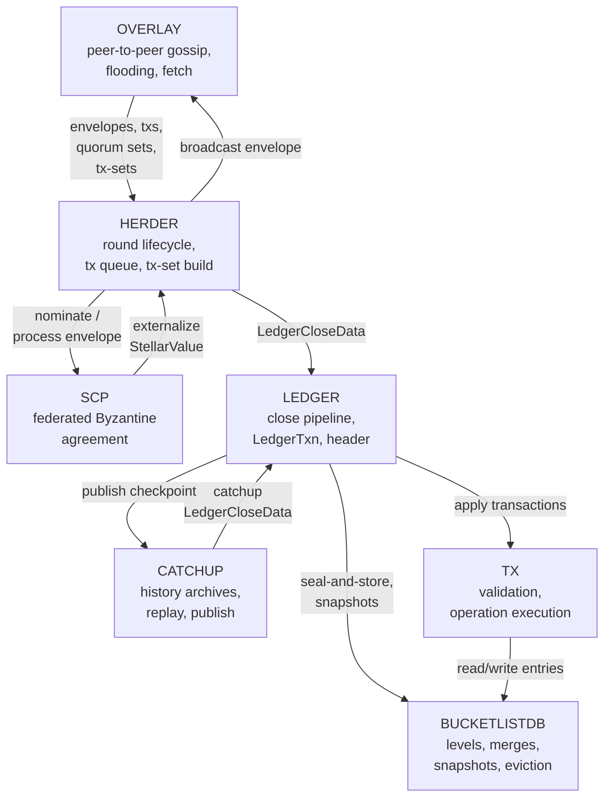

# Stellar Protocol Specification Suite

**Version:** 26 (stellar-core v26.0.1 / Protocol 26)
**Status:** Informational
**Date:** 2026-05-13

---

## Table of Contents

1. [Purpose](#1-purpose)
2. [Architecture](#2-architecture)
3. [Specifications](#3-specifications)
4. [Data Flow](#4-data-flow)
5. [Shared Conventions](#5-shared-conventions)
6. [Scope and Boundaries](#6-scope-and-boundaries)
7. [References](#7-references)

---

## 1. Purpose

This suite collects seven implementation-agnostic specifications that
together describe the observable behavior of the Stellar network at
Protocol 26. Each document is derived exclusively from the vetted
stellar-core C++ reference implementation (v26.0.1) and isolates the
subset of behavior that is consensus-deterministic — that is, the
behavior any conforming node MUST reproduce bit-for-bit in order to
remain interoperable with the existing validator quorum.

The specifications are organized by subsystem boundary rather than by
binary or process. A conforming implementation MAY restructure its
internal modules freely as long as the externally visible artifacts —
SCP envelopes, overlay messages, ledger headers, bucket hashes,
transaction results, ledger close meta, and history archive contents
— are byte-identical to those produced by stellar-core for the same
inputs.

The key words **MUST**, **MUST NOT**, **REQUIRED**, **SHALL**, **SHALL
NOT**, **SHOULD**, **SHOULD NOT**, **RECOMMENDED**, **MAY**, and
**OPTIONAL** in the specifications are to be interpreted as described
in [RFC 2119][rfc2119] and [RFC 8174][rfc8174] when, and only when,
they appear in all capitals.

This README is informational. It indexes the seven subsystem
specifications, sketches the end-to-end data flow that ties them
together, and records the conventions that apply uniformly across the
suite. It is **not** itself a normative specification — every
normative requirement lives in one of the subsystem documents.

---

## 2. Architecture

The Stellar node is partitioned into seven cooperating subsystems.
The diagram below shows the high-level data and control flow:
overlay sits at the network edge, herder mediates between overlay
and consensus, SCP produces externalized values, catchup reconciles
local state with history archives, and the ledger close pipeline
applies externalized values to persistent state. Transactions and
the bucket-based on-disk state are sub-modules of the ledger
pipeline.

Arrows denote the principal data flow during steady-state operation;
they do not enumerate every cross-module call. Each subsystem
document defines its own interface contract in its §1.x
*Relationship to Other Specifications* table.

---

## 3. Specifications

| Document | Subsystem | Description |
|----------|-----------|-------------|
| [SCP_SPEC.md](./SCP_SPEC.md) | Stellar Consensus Protocol | Federated Byzantine agreement: quorum sets, federated voting primitives, slot lifecycle, nomination and ballot protocols, EXTERNALIZE finality. Defines invariants `INV-S1`..`INV-S18`. |
| [OVERLAY_SPEC.md](./OVERLAY_SPEC.md) | Peer-to-Peer Overlay | Wire protocol: connection lifecycle, authenticated framing, flow control, transaction flooding (push/pull adverts and demands), peer management, survey protocol. Overlay Protocol v38–v39; invariants `INV-O1`..`INV-O19`. |
| [HERDER_SPEC.md](./HERDER_SPEC.md) | Consensus Driver | Consensus round lifecycle, `StellarValue` construction and validation, transaction set construction (classic and parallel Soroban), candidate combination, transaction queue, surge pricing, SCP envelope cache, protocol upgrade scheduling. Invariants `INV-H1`..`INV-H9`. |
| [LEDGER_SPEC.md](./LEDGER_SPEC.md) | Ledger Close Pipeline | Multi-phase ledger close: fee phase, apply phase, upgrades, seal-and-store; nested `LedgerTxn` model; header management and skip list; Soroban network configuration and state; ledger close meta. Invariants `INV-L1`..`INV-L15`. |
| [TX_SPEC.md](./TX_SPEC.md) | Transaction Processing | Transaction lifecycle, signature checking, operation execution (all op types), sponsorship, DEX conversion engine, Soroban execution and fee model, metadata and event emission, result codes. Invariants `INV-T1`..`INV-T15`. |
| [BUCKETLISTDB_SPEC.md](./BUCKETLISTDB_SPEC.md) | On-Disk State | BucketList structure and level sizing, bucket lifecycle, merge algorithm (including INITENTRY rules), FutureBucket asynchronous merges, indexing and Bloom filters, Hot Archive BucketList, eviction iterator, serialization to history archives. Invariants `INV-B1`..`INV-B16`. |
| [CATCHUP_SPEC.md](./CATCHUP_SPEC.md) | Catchup and History | History archive layout, checkpoint publishing pipeline, catchup strategies (minimal/recent/complete), ledger apply manager, ledger-chain and transaction-results verification, bucket and replay application. Invariants `INV-C1`..`INV-C15`. |

The seven specs are normative on disjoint subject matter; together
they cover every observable artifact the Stellar protocol produces.

---

## 4. Data Flow

This section traces the end-to-end path of a single user transaction
from submission through the close of the next ledger and the
publishing of the enclosing history checkpoint. Cross-references use
the plain-text `SPEC_NAME §N.N` form and point to the section in the
target spec that owns the step.

1. **Submission and flooding.** A client submits a
   `TransactionEnvelope` to any node, or a peer adverts a tx hash
   and the node demands it. The receiving node performs preliminary
   wire validation, then enters the transaction-flooding state
   machine: it batches advertisements, schedules outgoing demands,
   and gossips the transaction to its authenticated peers under
   per-peer flow-control credits. See OVERLAY_SPEC §5 (connection
   lifecycle and authentication), OVERLAY_SPEC §7 (flow control),
   and OVERLAY_SPEC §8 (transaction flooding).

2. **Queue admission and validation.** The transaction enters the
   herder's per-account transaction queue. Each candidate is
   subjected to structural and semantic validation, fee-source
   balance checks, signature verification, and (for Soroban)
   resource-limit checks; surge pricing assigns it to a lane and
   may evict lower-fee transactions. The validation rules are
   defined in TX_SPEC §5 (transaction validation) and applied via
   the reception pipeline in HERDER_SPEC §12.2 (`tryAdd`), with
   surge pricing in HERDER_SPEC §13.

3. **Trigger and tx-set construction.** When the round timer fires,
   the herder transitions through its state machine and constructs
   a `TransactionSet`. The set is partitioned into a sequential
   classic phase and (Protocol 23+) a parallel Soroban phase whose
   stages and clusters are computed from declared footprints. See
   HERDER_SPEC §5.1 (trigger), HERDER_SPEC §7 (transaction set
   construction), and HERDER_SPEC §8 (parallel Soroban packing).

4. **StellarValue construction.** The tx-set hash, close time,
   upgrade votes, and (Protocol 20+) txSetType are packaged into a
   `StellarValue`. The herder signs the value if nominating and
   submits it to the local SCP instance. See HERDER_SPEC §6.1
   (StellarValue construction) and HERDER_SPEC §6.2 (validation on
   receipt).

5. **Consensus.** SCP runs federated voting in two phases per slot.
   The nomination protocol elects round leaders and converges on a
   composite candidate value (SCP_SPEC §8); the ballot protocol
   advances through PREPARE → CONFIRM → EXTERNALIZE according to
   the `advanceSlot` decision tree (SCP_SPEC §9.5). Quorum tests
   over the local quorum set determine when statements become
   *accepted* or *confirmed* via the federated voting primitives
   in SCP_SPEC §5.

6. **Externalize and ledger close.** On EXTERNALIZE, the herder
   constructs `LedgerCloseData` from the externalized
   `StellarValue` plus the resolved transaction set and hands it to
   the ledger close pipeline. The pipeline runs the apply-state
   machine through `SETTING_UP_STATE → READY_TO_APPLY → APPLYING →
   COMMITTING`: it validates inputs, runs the fee phase, applies
   transactions sequentially and in parallel Soroban stages, then
   applies upgrades. See LEDGER_SPEC §4 (close pipeline) and
   LEDGER_SPEC §5 (apply state machine).

7. **Transaction application.** For each transaction the apply
   pipeline charges the fee, checks `commonValid` post-seqNum,
   resolves the source account, then iterates operations through
   `OperationFrame::apply`. Each operation reads and writes ledger
   entries through nested `LedgerTxn` scopes whose merge rules
   determine the final entry state on commit. See TX_SPEC §7
   (apply pipeline), TX_SPEC §8 (operation execution), and
   TX_SPEC §12 (state management).

8. **Seal and persist.** The ledger close pipeline seals the root
   `LedgerTxn`, hashes the new bucket list, updates the
   `LedgerHeader` (including the skip list), constructs
   `LedgerCloseMeta`, and writes the new buckets into the on-disk
   `BucketList`. Snapshots take the new tip; level spills,
   asynchronous merges, and tombstone elision proceed per the
   merge algorithm. See LEDGER_SPEC §12 (commit and persistence),
   BUCKETLISTDB_SPEC §5 (bucket lifecycle), and
   BUCKETLISTDB_SPEC §6 (merge algorithm).

9. **Checkpoint publishing and next round.** Every 64 ledgers the
   node finalizes a history checkpoint: it queues a
   `HistoryArchiveState`, computes the differing buckets relative
   to the previous checkpoint, and uploads them with backpressure
   and crash recovery to the configured archives. The herder then
   schedules the next round's trigger timer and the cycle returns
   to step 1. See CATCHUP_SPEC §5 (publishing pipeline) and
   HERDER_SPEC §5.4 (timers).

Catchup is the symmetric inverse of this flow: when a node lags, it
fetches HAS files and ledger-chain checkpoints, verifies the chain
back to a trust anchor, applies buckets, replays transactions, and
finally drains SCP-buffered ledgers (CATCHUP_SPEC §8 through §13).

---

## 5. Shared Conventions

The following conventions apply uniformly to all seven specs.

### 5.1 XDR Encoding

All wire-format and on-disk types are defined by the XDR schema
distributed in the [`stellar/stellar-xdr`][stellar-xdr] repository.
Every byte sequence that participates in consensus — `StellarValue`,
`TransactionEnvelope`, `LedgerHeader`, `BucketEntry`, history archive
artifacts, and SCP envelopes — is encoded using canonical XDR
([RFC 4506][rfc4506]) with the canonicalisations specified per type.
Specs cite XDR types by their schema name (e.g.
`TransactionEnvelope`, `LedgerCloseMeta`) and MUST NOT reproduce the
schema; consult stellar-xdr for the field definitions.

### 5.2 Cryptographic Primitives

| Primitive | Algorithm | Used For |
|-----------|-----------|----------|
| Digital signature | Ed25519 ([RFC 8032][rfc8032]) | Account signatures, SCP envelope signatures, `StellarValue` signatures, overlay `AuthCert` |
| Cryptographic hash | SHA-256 ([FIPS 180-4][fips180]) | `LedgerHeader.hash`, `previousLedgerHash`, `skipList`, tx-set hash, bucket hash, BucketList hash, transaction hashes, signer hint, history checkpoint hashes |
| Key exchange | Curve25519 / X25519 ([RFC 7748][rfc7748]) | Overlay handshake (HELLO/AUTH), per-direction message-MAC key derivation |
| Message authentication | HMAC-SHA-256 ([RFC 2104][rfc2104]) | `AuthenticatedMessage` MAC; sequence-number replay protection |

Pre-shared and ephemeral keys, key derivation, and the precise input
encodings for each MAC and signature operation are defined in the
relevant subsystem spec (overlay handshake in OVERLAY_SPEC §5;
signature checking in TX_SPEC §5.5; envelope signatures in
SCP_SPEC §3).

### 5.3 Network ID

Every signing and MAC operation that is sensitive to the deployed
network includes the *network ID* as a domain separator. The network
ID is the SHA-256 hash of the deployed network's passphrase string
(e.g., `"Public Global Stellar Network ; September 2015"` for
mainnet). Implementations MUST compute the network ID exactly once
at startup and use it consistently; mismatched network IDs cause
signature verification to fail.

### 5.4 Hash Chaining and Determinism

Consensus determinism is enforced by hash chaining. The ledger header
binds the previous header, the externalized value, the new
bucket-list hash, and the transaction-results hash; the bucket-list
hash binds all active buckets; the transaction-results hash binds
every transaction-result-pair in deterministic order. Two nodes that
close the same ledger MUST therefore produce the same
`LedgerHeader.hash` — this byte-level identity is the litmus test
for parity.

Determinism extends to every observable artifact:

- **SCP envelopes.** Statement contents are functions of state and
  inputs; envelope signatures cover the canonical XDR encoding.
- **Tx-sets.** Sort order within each phase, cluster assignment, and
  surge-pricing eviction are deterministic; see HERDER_SPEC §7.4
  and HERDER_SPEC §8.4.
- **Apply order.** Sequential and parallel apply order is fully
  determined by tx-set contents and footprints; see
  HERDER_SPEC §10 and LEDGER_SPEC §6.1.
- **State writes.** Each transaction's reads and writes are scoped
  through `LedgerTxn` with explicit commit and rollback semantics;
  see LEDGER_SPEC §7 and TX_SPEC §12.
- **Persisted state.** Bucket contents and the BucketList hash are
  deterministic functions of the applied ledger; see
  BUCKETLISTDB_SPEC §4.7 and BUCKETLISTDB_SPEC §6.
- **History.** Checkpoint contents are byte-identical across
  conforming publishers for the same ledger range; see
  CATCHUP_SPEC §5.

Any implementation difference that causes one of these artifacts to
diverge from stellar-core's output for the same inputs is a parity
defect.

---

## 6. Scope and Boundaries

Each subsystem spec scopes itself precisely in its own §1.1. The
table below summarises what the suite as a whole does and does not
cover.

| In Scope | Out of Scope |
|----------|--------------|
| Observable wire formats (overlay messages, SCP envelopes, history archive files) | XDR schema definitions themselves — owned by [`stellar/stellar-xdr`][stellar-xdr] |
| Ledger state transitions: every read and write that affects the bucket list, ledger header, or transaction results | Internal database schemas (SQLite tables, indexes), file system layout, on-disk caching |
| Validation rules and the exact ordering of validation checks | Error logging, metric names, debug instrumentation |
| Transaction application semantics: classic operations, Soroban host-function execution, fee model, refunds | The Soroban virtual machine (host-function internals, WASM execution) — owned by the soroban-env specification |
| Consensus protocol: federated voting primitives, nomination, ballot, EXTERNALIZE finality | Threading model, executor strategies, work-stealing or scheduler choices |
| Tx-set construction and apply ordering, including parallel Soroban clustering | Configuration knobs that do not affect consensus output (peer slots, log levels, RPC settings) |
| Header hash, skip list, transaction-results hash, bucket hash, BucketList hash | Telemetry, tracing, alerting, operational tooling |
| Catchup and history publishing pipelines, including verification of trust anchors | Specific HTTP/S3 archive transport implementations, retry policies beyond what affects safety |
| Protocol upgrade lifecycle and validation | Operator UX for proposing or voting upgrades |
| Determinism guarantees and their byte-level implications | Performance, memory footprint, build configuration |

Behavior that is consensus-deterministic but resides in an unmapped
subsystem (e.g., `crypto/`, `util/`, `database/`) is folded into the
nearest applicable subsystem spec rather than given its own
document.

---

## 7. References

| Reference | Description |
|-----------|-------------|
| [RFC 2119][rfc2119] | Key words for use in RFCs to indicate requirement levels. |
| [RFC 8174][rfc8174] | Ambiguity of uppercase vs lowercase in RFC 2119 key words. |
| [RFC 4506][rfc4506] | XDR: External Data Representation Standard. |
| [RFC 8032][rfc8032] | Edwards-Curve Digital Signature Algorithm (EdDSA), including Ed25519. |
| [RFC 7748][rfc7748] | Elliptic Curves for Security (Curve25519, X25519). |
| [RFC 2104][rfc2104] | HMAC: Keyed-Hashing for Message Authentication. |
| [FIPS 180-4][fips180] | Secure Hash Standard (SHA-256). |
| [stellar-core v26.0.1][stellar-core] | Reference implementation pinned in the `stellar-core/` submodule and the source from which every spec in this suite is derived. |
| [stellar-xdr][stellar-xdr] | Canonical XDR schema for all wire-format and on-disk types referenced from this suite. |
| [CAP catalog][cap-index] | Core Advancement Proposals — the protocol-evolution change record referenced from individual spec sections. |

[rfc2119]: https://www.rfc-editor.org/rfc/rfc2119
[rfc8174]: https://www.rfc-editor.org/rfc/rfc8174
[rfc4506]: https://www.rfc-editor.org/rfc/rfc4506
[rfc8032]: https://www.rfc-editor.org/rfc/rfc8032
[rfc7748]: https://www.rfc-editor.org/rfc/rfc7748
[rfc2104]: https://www.rfc-editor.org/rfc/rfc2104
[fips180]: https://csrc.nist.gov/publications/detail/fips/180/4/final
[stellar-core]: https://github.com/stellar/stellar-core/tree/v26.0.1
[stellar-xdr]: https://github.com/stellar/stellar-xdr
[cap-index]: https://github.com/stellar/stellar-protocol/tree/master/core
