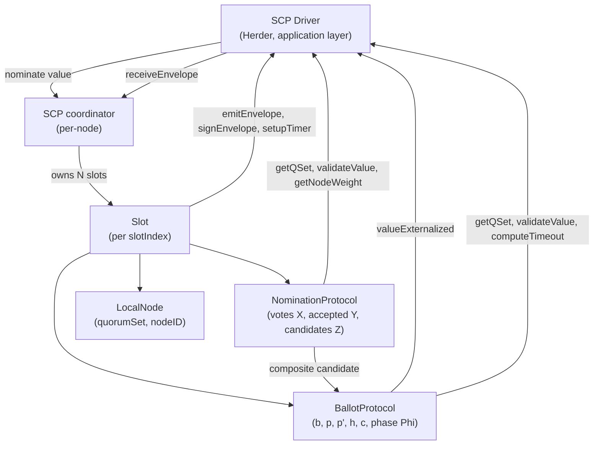
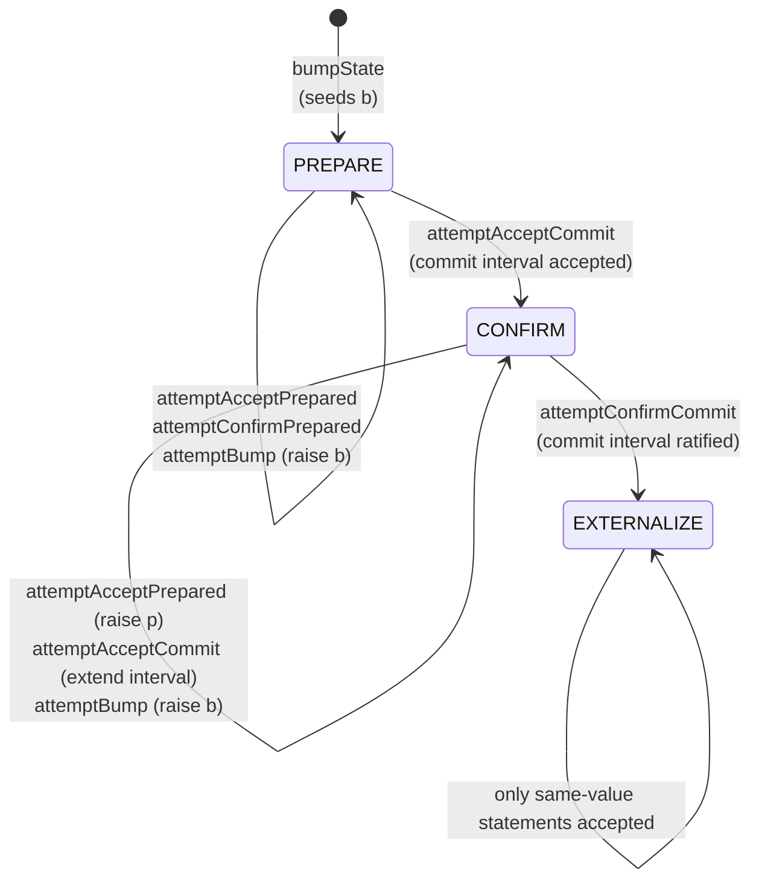
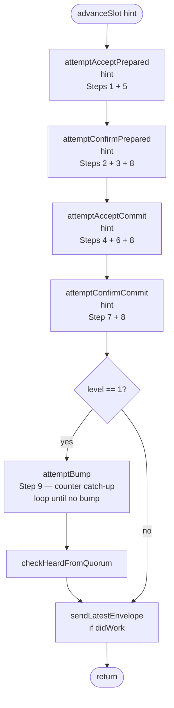
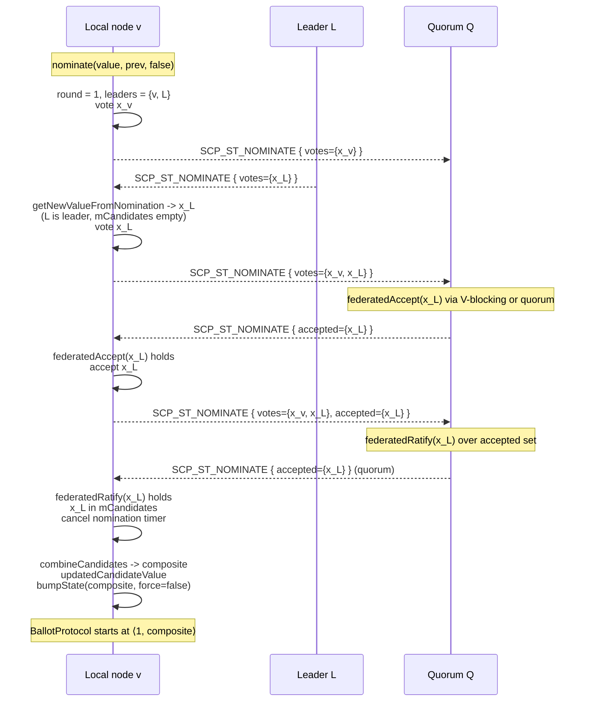
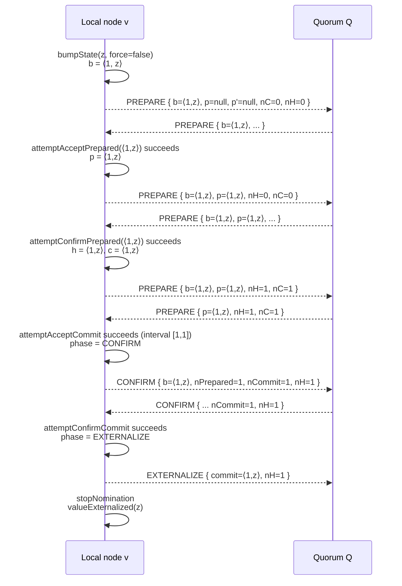

# Stellar Consensus Protocol (SCP) Specification

**Version:** 27 (stellar-core v27.0.0 / Protocol 27)
**Status:** Informational
**Date:** 2026-06-21

---

## Table of Contents

1. [Introduction](#1-introduction)
2. [Protocol Overview](#2-protocol-overview)
3. [Data Types](#3-data-types)
4. [Quorum Sets](#4-quorum-sets)
5. [Federated Voting Primitives](#5-federated-voting-primitives)
6. [Driver Interface](#6-driver-interface)
7. [Slot Model](#7-slot-model)
8. [Nomination Protocol](#8-nomination-protocol)
9. [Ballot Protocol](#9-ballot-protocol)
10. [Message Processing and Statement Ordering](#10-message-processing-and-statement-ordering)
11. [Timers](#11-timers)
12. [Invariants and Safety Properties](#12-invariants-and-safety-properties)
13. [Constants](#13-constants)
14. [References](#14-references)
15. [Appendices](#15-appendices)

---

## 1. Introduction

### 1.1 Purpose and Scope

This document specifies the Stellar Consensus Protocol (SCP) as it is
realized in the Stellar network: a two-phase federated Byzantine
agreement protocol that allows a set of mutually-distrusting validators
to agree on a sequence of values (one per slot). The specification
covers message formats, state machines, federated voting primitives,
nomination and ballot algorithms, and the invariants that any
conforming implementation MUST maintain.

This specification is **implementation agnostic**. It is derived
exclusively from the vetted stellar-core C++ implementation (v27.0.0).
Any conforming implementation that produces identical externalized
values and SCP envelopes for all valid inputs is considered correct.

The protocol is defined abstractly without reference to any specific
interpretation of "slot" or "value", nor to any specific network
transport. The mapping of slots to ledgers, of values to candidate
ledger close states, and the wiring of SCP into a broadcast medium is
the responsibility of a host module (the SCP Driver). For the Stellar
ledger, that role is filled by the Herder (see `HERDER_SPEC §1`).

**In scope:**

- The XDR wire format of SCP messages.
- The Nomination and Ballot state machines and their transitions.
- Quorum set semantics, sanity, normalization, and the three core
  set-theoretic tests (quorum slice, V-blocking, transitive quorum).
- The federated accept and federated ratify primitives.
- The Driver interface, including all virtual hooks SCP invokes.
- Slot lifecycle, envelope routing, and statement ordering rules.
- Timer behavior for nomination and ballot rounds.
- Safety and liveness invariants that conforming implementations MUST
  preserve.

**Out of scope:**

- The transport / overlay layer that floods SCP envelopes
  (see `OVERLAY_SPEC §1`).
- The construction, validation, and combination of concrete values
  (`StellarValue`), which is the Driver's responsibility
  (see `HERDER_SPEC §3`–`§5`).
- The ledger-close pipeline that consumes externalized values
  (see `LEDGER_SPEC §3`).
- Implementation internals such as memory management, threading,
  logging, metrics, and persistence formats.
- Quorum set discovery, distribution, and configuration policy.

### 1.2 Conventions and Terminology

The key words "MUST", "MUST NOT", "REQUIRED", "SHALL", "SHALL NOT",
"SHOULD", "SHOULD NOT", "RECOMMENDED", "MAY", and "OPTIONAL" in this
document are to be interpreted as described in RFC 2119 [rfc2119].

**Glossary:**

| Term | Definition |
|------|------------|
| Node | A participant in the consensus protocol, identified by a `NodeID` (Ed25519 public key). |
| Validator | A node that actively emits SCP envelopes (signs and broadcasts statements). Non-validator nodes process envelopes but do not produce them. |
| Local node | The node executing this specification. |
| Slot | A logically-distinct consensus instance, identified by `slotIndex` (a `uint64`). The Stellar network uses one slot per ledger sequence number. |
| Value | Opaque byte string the protocol agrees on. SCP imposes only a strict total order on values; their semantics are Driver-defined. |
| Ballot | A pair `(counter, value)` written `<n, x>`, where `counter` ≥ 1 (except in synthetic uninitialized states) and `value` is a Value. |
| Statement | The payload of an envelope: PREPARE, CONFIRM, EXTERNALIZE, or NOMINATE, all tagged with `nodeID` and `slotIndex`. |
| Envelope | A signed statement (`SCPEnvelope`). |
| Quorum set | A node's local description of whom it trusts: a recursive structure of validators and inner sets, gated by a `threshold`. |
| Quorum slice | A subset of nodes (and inner sets) that meets a quorum set's threshold. |
| Quorum (for a set `S`) | A non-empty set `U` of nodes such that for every `v ∈ U`, some slice of `v`'s quorum set is contained in `U`. |
| V-blocking set | A set of nodes that intersects every quorum slice of the local node — i.e., enough nodes that, if they all decline a statement, the local node cannot reach quorum on the opposite. |
| Federated accept | A node `v` accepts a statement `a` when either (a) a V-blocking set already accepts `a`, or (b) a quorum of nodes (including `v`) votes for or accepts `a`. |
| Federated ratify | A statement is ratified when a quorum of nodes votes for it. |
| Composite candidate | The Driver-produced combination of all accepted nomination values, used as the initial ballot value. |
| Phase | One of PREPARE, CONFIRM, EXTERNALIZE — the three ballot-protocol phases. |
| Externalize | Terminal phase in which a slot's value is fixed; the slot has reached consensus. |

This specification cross-references companion specs using the form
`SPEC_NAME §N.N`.

#### 1.2.1 Relationship to Other Specifications

| Specification | Relationship |
|---------------|--------------|
| `OVERLAY_SPEC` | Defines the gossip transport that floods `SCPEnvelope` messages between nodes. SCP delegates emission and reception to overlay via the Driver. |
| `HERDER_SPEC` | The concrete SCP Driver in stellar-core. Defines how `Value` is encoded (`StellarValue`), how candidates are combined, how `validateValue` decides, and how slots map to ledger close. |
| `LEDGER_SPEC` | Consumes externalized values and runs the ledger close pipeline. SCP terminates one slot before the ledger close pipeline begins. |
| `TX_SPEC` | The transactions referenced inside `StellarValue` are validated and applied here; SCP is value-agnostic and never inspects them. |

### 1.3 Notation

Algorithms in this document are expressed as prose with embedded
pseudocode using the following conventions:

- Variables and functions use `camelCase`
  (`mCurrentBallot`, `federatedRatify()`).
- XDR enum values use `SCREAMING_SNAKE_CASE` (`SCP_ST_PREPARE`).
- Ballots are written `<n, x>` where `n` is the counter and `x` the
  value.
- The notation `b1 ~ b2` means ballots `b1` and `b2` are compatible
  (have the same value).
- The notation `b1 ≲ b2` (less-and-compatible) means
  `b1 ≤ b2 ∧ b1 ~ b2`.
- The notation `b1 ≨ b2` (less-and-incompatible) means
  `b1 ≤ b2 ∧ b1 !~ b2`.
- Single-letter SCP-paper names are kept as aliases where useful:
  `b` (current ballot), `p` (highest accepted prepared), `p'` (second
  highest accepted prepared, incompatible with `p`), `h` (high
  ballot), `c` (commit ballot), `z` (value override), `M` (latest
  envelopes), `Φ` (phase).
- Protocol-version conditionals are annotated `@version(≥N)`,
  `@version(<N)`, or `@version(=N)`. The current SCP wire format and
  algorithms do not branch on the ledger protocol version; SCP itself
  is protocol-stable across the supported range (Protocol 24+).

---

## 2. Protocol Overview

SCP is a federated Byzantine agreement protocol that proceeds in two
phases per slot:

1. **Nomination**: Validators converge on a set of candidate values,
   driven by deterministically-selected round leaders.
2. **Ballot Protocol**: Validators run a three-phase voting protocol
   (PREPARE → CONFIRM → EXTERNALIZE) on ballots derived from the
   composite candidate value to fix a single externalized value.

Both phases rely on two federated voting primitives — `federatedAccept`
and `federatedRatify` — which are defined in terms of quorum slice,
quorum, and V-blocking set tests over the local quorum set.



A node's lifecycle for a single slot, at a high level:

1. The Driver hands a candidate value and the previous slot's value
   to the local node via `nominate(slotIndex, value, previousValue)`.
2. The node computes round leaders, votes for its own value (if
   leader) and any values picked from existing leaders'
   nominations, and emits an `SCP_ST_NOMINATE` envelope.
3. Incoming nominations promote values into the local `accepted` and
   `candidates` sets via `federatedAccept` and `federatedRatify`.
4. The first time a value enters `candidates`, the Driver combines
   all candidates into a single composite value, which seeds the
   ballot protocol with ballot `<1, compositeValue>`.
5. The ballot protocol issues PREPARE statements, then CONFIRM
   statements when a ballot is confirmed prepared and a commit
   interval can be accepted, and finally EXTERNALIZE when the commit
   interval is ratified.
6. On EXTERNALIZE, nomination stops and the Driver is notified via
   `valueExternalized`.

---

## 3. Data Types

All SCP wire types are defined in XDR. Implementations MUST encode and
decode using the canonical XDR rules used elsewhere in the Stellar
protocol.

### 3.1 SCPBallot

```
struct SCPBallot {
    uint32 counter;  // n
    Value  value;    // x
}
```

| Field | Type | Description |
|-------|------|-------------|
| `counter` | `uint32` | Ballot counter; strictly positive in emitted statements. A counter of `0` is reserved for synthetic uninitialized states inside the implementation and MUST NOT appear in emitted envelopes. The sentinel value `UINT32_MAX` represents "all ballots with this value" in EXTERNALIZE and is used internally during commit-interval scanning. |
| `value` | `opaque` | The value being voted on. The total order on `Value` is lexicographic byte order. |

Ballots are totally ordered: `b1 < b2` iff
`b1.counter < b2.counter`, or `b1.counter == b2.counter` and
`b1.value < b2.value`. Two ballots are **compatible** iff they share
the same `value`.

### 3.2 SCPStatementType

```
enum SCPStatementType {
    SCP_ST_PREPARE     = 0,
    SCP_ST_CONFIRM     = 1,
    SCP_ST_EXTERNALIZE = 2,
    SCP_ST_NOMINATE    = 3
}
```

Note: The numeric ordering of `SCP_ST_PREPARE < SCP_ST_CONFIRM <
SCP_ST_EXTERNALIZE` is **load-bearing**: statement ordering for
staleness checks compares by this enum value when types differ
(see §10.2).

### 3.3 SCPNomination

```
struct SCPNomination {
    Hash  quorumSetHash;   // D
    Value votes<>;         // X
    Value accepted<>;      // Y
}
```

| Field | Type | Description |
|-------|------|-------------|
| `quorumSetHash` | `Hash` | SHA-256 of the emitter's `SCPQuorumSet`. The receiver MUST fetch the qset out-of-band via the Driver before processing the envelope. |
| `votes` | `Value<>` | Values the emitter currently votes to nominate (set `X` in the paper). MUST be strictly sorted in ascending byte order. |
| `accepted` | `Value<>` | Values the emitter has federated-accepted (set `Y`). MUST be strictly sorted. Semantically a subset of the union of `votes` and values accepted from others. |

### 3.4 SCPStatement

```
struct SCPStatement {
    NodeID nodeID;        // v
    uint64 slotIndex;     // i
    union switch (SCPStatementType type) {
        case SCP_ST_PREPARE:     PrepareBody     prepare;
        case SCP_ST_CONFIRM:     ConfirmBody     confirm;
        case SCP_ST_EXTERNALIZE: ExternalizeBody externalize;
        case SCP_ST_NOMINATE:    SCPNomination   nominate;
    } pledges;
}
```

The four ballot-protocol bodies carry the local ballot-protocol state.

**PREPARE body:**

| Field | Type | Description |
|-------|------|-------------|
| `quorumSetHash` | `Hash` | Hash of the emitter's qset (`D`). |
| `ballot` | `SCPBallot` | Current ballot `b`. |
| `prepared` | `SCPBallot*` | Highest accepted-prepared ballot `p`, or null. |
| `preparedPrime` | `SCPBallot*` | Second-highest accepted-prepared ballot `p'`, incompatible with `p`, or null. |
| `nC` | `uint32` | Counter of the commit ballot `c.n`; `0` if no commit ballot. |
| `nH` | `uint32` | Counter of the high ballot `h.n`; `0` if no high ballot. |

**CONFIRM body** (issued during the CONFIRM phase, when commit has
been federated-accepted):

| Field | Type | Description |
|-------|------|-------------|
| `ballot` | `SCPBallot` | Current ballot `b`. Its `value` is the value committed. |
| `nPrepared` | `uint32` | Counter of `p`. |
| `nCommit` | `uint32` | Counter of `c`. |
| `nH` | `uint32` | Counter of `h`. |
| `quorumSetHash` | `Hash` | Hash of the emitter's qset. |

**EXTERNALIZE body** (issued once the slot is externalized):

| Field | Type | Description |
|-------|------|-------------|
| `commit` | `SCPBallot` | The committed ballot `c`. Its `value` is the externalized value. |
| `nH` | `uint32` | Counter of `h` at externalization time. |
| `commitQuorumSetHash` | `Hash` | Hash of the qset in effect during commit. The companion qset for replay purposes is the **singleton qset** `{{emitterNodeID}}`, **not** this hash; see §7.4. |

### 3.5 SCPEnvelope

```
struct SCPEnvelope {
    SCPStatement statement;
    Signature    signature;
}
```

`signature` is an Ed25519 signature over the canonical XDR encoding of
`statement` using the emitter's secret key. The Driver is responsible
for producing and verifying signatures.

### 3.6 SCPQuorumSet

```
struct SCPQuorumSet {
    uint32       threshold;
    NodeID       validators<>;
    SCPQuorumSet innerSets<>;
}
```

A `SCPQuorumSet` recursively describes a node's quorum function (see
§4). The nesting depth (where an outermost qset is depth 0) MUST NOT
exceed `MAXIMUM_QUORUM_NESTING_LEVEL` (4). The total number of
validators (summed across all levels) MUST be at least 1 and at most
1000.

### 3.7 Statement Companion Quorum Set

When an envelope arrives, the implementation MUST be able to resolve
the emitter's `SCPQuorumSet`. The companion qset hash extracted from
a statement depends on type:

| Type | Companion qset hash |
|------|---------------------|
| `SCP_ST_PREPARE` | `prepare.quorumSetHash` |
| `SCP_ST_CONFIRM` | `confirm.quorumSetHash` |
| `SCP_ST_EXTERNALIZE` | `externalize.commitQuorumSetHash` |
| `SCP_ST_NOMINATE` | `nominate.quorumSetHash` |

For `SCP_ST_EXTERNALIZE`, this hash is the **historical** quorum set
that was active during commit; for the purpose of evaluating the
emitter's current quorum (which trivially contains itself), the
implementation uses a **singleton quorum set** `{ threshold: 1,
validators: [emitterNodeID] }` (see §7.4). The `commitQuorumSetHash`
is retained for diagnostic and replay purposes.

---

## 4. Quorum Sets

### 4.1 Semantics

A quorum set `Q(v)` is `v`'s local statement of trust. `Q(v)` is
satisfied by any subset of nodes (a slice) that meets the threshold,
where:

- Each validator in `validators` counts as one entry.
- Each inner set in `innerSets` counts as one entry; an inner set is
  "satisfied" by a slice when the slice itself satisfies that inner
  set's threshold (recursively).

A quorum slice of `v` is any minimal nodeSet for which `Q(v)` is
satisfied. A **quorum** for `v` is a non-empty set `U` of nodes such
that for every `v' ∈ U`, `U` contains a quorum slice of `v'`.

### 4.2 Sanity Validation (`isQuorumSetSane`)

A `SCPQuorumSet` is **sane** if and only if all of the following hold
(checked recursively starting at depth 0):

1. The nesting depth is at most `MAXIMUM_QUORUM_NESTING_LEVEL` (4).
2. `threshold ≥ 1`.
3. `threshold ≤ validators.size + innerSets.size`.
4. If extra-checks are enabled, `threshold ≥ vBlockingSize`, where
   `vBlockingSize = (validators.size + innerSets.size) - threshold + 1`.
   This means the threshold MUST be strictly greater than 50% of
   entries (so any two slices intersect — quorum intersection is
   locally guaranteed).
5. No `NodeID` appears more than once anywhere in the tree (validators
   in nested inner sets are tracked in a global set during recursion).
6. After recursing through all inner sets, the **total** count of
   validators across the entire tree is between 1 and 1000 inclusive.

Implementations MUST treat an envelope whose companion qset is null or
fails the (non-extra-checks) sanity test as **invalid** (and ignore
it). Extra-checks are applied at the node-configuration boundary, not
on inbound envelopes.

### 4.3 Normalization (`normalizeQSet`)

Before storing the local node's qset or evaluating priorities, the
qset MUST be normalized. Normalization is two passes:

**Simplify pass** (`normalizeQSetSimplify`), optionally removing a
target `idToRemove`:

1. If `idToRemove` is provided, remove every occurrence of that node
   from `validators` and decrement `threshold` by the number of
   occurrences removed.
2. Recurse simplify into each inner set.
3. For each inner set that, after recursion, has `threshold == 1`,
   exactly one validator, and no further inner sets: hoist its
   validator into the parent's `validators` and remove the inner set.
4. After processing all inner sets, if the qset itself has
   `threshold == 1`, no top-level `validators`, and exactly one inner
   set: replace the qset with that inner set.

**Reorder pass** (`normalizeQuorumSetReorder`):

1. Sort `validators` in ascending `NodeID` byte order.
2. Recurse into each inner set.
3. Sort `innerSets` lexicographically using
   `qSetCompareInt`: compare validator lists first
   (element-wise by `NodeID`), then inner-sets lists (recursively
   with the same comparator), and finally `threshold`. The longer
   list compares larger when lists share a common prefix.

Normalization is deterministic and idempotent. Two semantically
equivalent qsets normalize to byte-identical XDR.

The local node's stored quorum set is normalized without removal at
construction and on every `updateQuorumSet`. Nomination priority
computation normalizes with `idToRemove = localNodeID` (so the local
node never elects itself merely by mechanical recursion; see §8.2).

### 4.4 Quorum Slice Test (`isQuorumSlice`)

`isQuorumSlice(qSet, nodeSet)` returns true iff `nodeSet` satisfies
the threshold of `qSet`, evaluated recursively:

```
isQuorumSliceInternal(qset, nodeSet):
  thresholdLeft = qset.threshold
  for each validator v in qset.validators:
    if v in nodeSet:
      thresholdLeft = thresholdLeft - 1
      if thresholdLeft <= 0: return true
  for each inner in qset.innerSets:
    if isQuorumSliceInternal(inner, nodeSet):
      thresholdLeft = thresholdLeft - 1
      if thresholdLeft <= 0: return true
  return false
```

### 4.5 V-Blocking Test (`isVBlocking`)

A set `S` is V-blocking for the local node iff every quorum slice of
the local node contains at least one element of `S`. Equivalently,
`S` intersects every slice. The constructive test counts how many
top-level entries must be absent (or unsatisfied) to make the
threshold unreachable:

```
isVBlockingInternal(qset, nodeSet):
  if qset.threshold == 0: return false  // empty qset has no v-blocking set
  leftTillBlock = (1 + validators.size + innerSets.size) - threshold
  for each validator v in qset.validators:
    if v in nodeSet:
      leftTillBlock = leftTillBlock - 1
      if leftTillBlock <= 0: return true
  for each inner in qset.innerSets:
    if isVBlockingInternal(inner, nodeSet):
      leftTillBlock = leftTillBlock - 1
      if leftTillBlock <= 0: return true
  return false
```

The seed value `leftTillBlock = (n - t + 1)` where `n` is the entry
count and `t` is `threshold`: this is the smallest cardinality of a
V-blocking subset.

### 4.6 Transitive Quorum Test (`isQuorum`)

Given a map of `NodeID → SCPEnvelopeWrapper`, a filter `f` over
statements, and a function `qfun` extracting the relevant qset from
a statement, `isQuorum(qSet, map, qfun, f)` returns true iff the
local node has a quorum on the filtered nodes. The algorithm
iteratively removes nodes whose own qset (resolved via `qfun`) is
not satisfied by the surviving filtered set, until a fixed point is
reached, and then checks whether the remaining set is a quorum slice
for the local `qSet`:

```
isQuorum(qSet, map, qfun, filter):
  pNodes = { n | filter(map[n].statement) }
  repeat:
    prevSize = pNodes.size
    fNodes = { n in pNodes |
                 qfun(map[n].statement) is non-null AND
                 isQuorumSlice(qfun(map[n].statement), pNodes) }
    pNodes = fNodes
  until pNodes.size == prevSize
  return isQuorumSlice(qSet, pNodes)
```

If `qfun` returns null for a node (the implementation never resolved
that node's qset), that node is pruned. This guarantees that a
quorum is reported only when every member can independently witness
it from its own slices.

### 4.7 Closest V-Blocking Set (`findClosestVBlocking`)

Diagnostic utility: given a qset and a set of "agreeing" nodes,
returns the smallest list of agreeing nodes that, if removed from
their respective slices, would render the agreement no longer
constitute a quorum. Used for reporting and is not part of the
normative protocol logic, but is invoked during state classification
(see §7.5).

---

## 5. Federated Voting Primitives

SCP makes progress through two federated voting primitives operating
over the set `M` of latest envelopes for the current slot.

### 5.1 Federated Accept (`federatedAccept`)

A node MUST federate-accept a statement `a` iff at least one of:

1. **V-blocking acceptance**: The set of nodes whose latest statement
   already `accepted(a)` forms a V-blocking set for the local quorum
   set.
2. **Quorum vote**: The set of nodes whose latest statement either
   `voted(a)` or `accepted(a)` forms a quorum (under the transitive
   `isQuorum` test), and the local node itself is part of it.

```
federatedAccept(voted, accepted, M):
  if isVBlocking(Q_local, M, filter = accepted):
    return true
  if isQuorum(Q_local, M,
              qfun = statementCompanionQSet,
              filter = (s -> accepted(s) OR voted(s))):
    return true
  return false
```

The accepted-predicate and voted-predicate are statement-specific
(see §8 and §9 for the concrete predicates used by nomination and
ballot protocols).

### 5.2 Federated Ratify (`federatedRatify`)

A statement is ratified iff a quorum of nodes votes for it:

```
federatedRatify(voted, M):
  return isQuorum(Q_local, M,
                  qfun = statementCompanionQSet,
                  filter = voted)
```

Ratification is strictly stronger than acceptance: any ratified
statement is also accepted (because a quorum is itself a quorum of
voters, hence satisfies the second clause of `federatedAccept`).

---

## 6. Driver Interface

The SCP coordinator interacts with its host through a small set of
hook methods, collectively called the **Driver interface**. A
conforming implementation MUST expose semantically equivalent
behavior for each.

### 6.1 Wiring and Identity

| Method | Semantics |
|--------|-----------|
| `signEnvelope(envelope)` | Produce the signature over the canonical XDR encoding of `envelope.statement` using the local node's secret key, and assign it to `envelope.signature`. |
| `getQSet(qSetHash)` | Resolve a quorum set by SHA-256 hash. Returning null causes any statement whose companion qset hashes to that value to be treated as invalid. The Driver is responsible for fetching qsets over the overlay; SCP does not cache them. |
| `emitEnvelope(envelope)` | Hand a freshly-signed envelope to the host for broadcast. SCP calls this only after the slot is fully validated (see §7.3). |
| `getHashOf(byteVectors)` | SHA-256 of the concatenation of the byte vectors. Used for `quorumSetHash` and for nomination hash-helpers. |
| `wrapEnvelope(envelope)` | Wrap an `SCPEnvelope` in an implementation-specific container. The default implementation creates a fresh wrapper per call. |
| `wrapValue(value)` | Wrap a `Value` similarly. Defaults to a fresh wrapper. |

### 6.2 Value Validation

```
enum ValidationLevel {
    kInvalidValue        = 0,
    kMaybeValidValue     = 1,
    kFullyValidatedValue = 2
}
```

| Method | Semantics |
|--------|-----------|
| `validateValue(slotIndex, value, nomination)` | Return a validation level. Implementations MAY be stricter when `nomination = true`. Levels are totally ordered. Defaults to `kMaybeValidValue`. |
| `extractValidValue(slotIndex, value)` | Attempt to transform `value` into a fully-valid value the local node could nominate. Used during nomination when an incoming value is only maybe-valid. Returning null means no extraction was possible. |
| `hasUpgrades(value)` | Returns true iff `value` contains protocol upgrade votes; used during nomination timeout-limit handling. |
| `stripAllUpgrades(value)` | Returns a value identical to `value` but with all upgrade votes removed. |
| `combineCandidates(slotIndex, candidates)` | Produce the composite candidate from the set of federated-ratified candidate values. Driver-defined; deterministic. Called when `candidates` (Z) grows. |

A statement carrying any `kInvalidValue` value MUST be rejected. A
statement carrying a `kMaybeValidValue` value during ballot processing
MUST NOT be rejected, but the slot MUST transition out of "fully
validated" (see §7.3), which suppresses outbound envelopes from the
local node for that slot.

### 6.3 Nomination Hashing

The nomination protocol uses two deterministic hash helpers,
parameterized by the slot, the previous slot's value, the round
number, and a discriminator:

```
hashHelper(slotIndex, prev, extraBytes):
  bytes = xdr(slotIndex) || xdr(prev) || extraBytes
  h = getHashOf(bytes)
  // big-endian read of the first 8 bytes
  return uint64 of h[0..7]
```

| Method | Discriminator | Inputs |
|--------|---------------|--------|
| `computeHashNode(slotIndex, prev, isPriority, roundNumber, nodeID)` | `2` if `isPriority`, else `1` | `slotIndex, prev, discr, roundNumber, nodeID` |
| `computeValueHash(slotIndex, prev, roundNumber, value)` | `3` | `slotIndex, prev, discr, roundNumber, value` |

Discriminators `1` (`hash_N` — neighborhood) and `2` (`hash_P` —
priority) are used in node priority computation; discriminator `3`
(`hash_K`) is used to rank values within a leader's nomination.

### 6.4 Node Weight

Given a quorum set and a `NodeID`, `getNodeWeight(nodeID, qset,
isLocalNode)` returns a normalized weight in `[0, UINT64_MAX]`,
interpreted as the probability that a uniformly-distributed `uint64`
falls below `weight`:

```
getNodeWeight(nodeID, qset, isLocalNode):
  if isLocalNode:
    return UINT64_MAX               // local node is in every slice
  n = qset.threshold
  d = qset.validators.size + qset.innerSets.size
  for each validator v in qset.validators:
    if v == nodeID:
      return ceil(UINT64_MAX * n / d)
  for each inner in qset.innerSets:
    leafW = getNodeWeight(nodeID, inner, false)
    if leafW > 0:
      return ceil(leafW * n / d)
  return 0
```

A duplicate `nodeID` in a qset has weight equal to its first
occurrence (the recursion returns on the first hit). This is the
reason `isQuorumSetSane` forbids duplicates (see §4.2). Weight `0`
means the node is not present anywhere in the qset.

### 6.5 Timer Hooks

| Method | Semantics |
|--------|-----------|
| `setupTimer(slotIndex, timerID, timeout, cb)` | Schedule `cb` to fire `timeout` ms in the future for the given `(slotIndex, timerID)`. If `cb` is null, cancel the timer. Reinvocation replaces any pending callback for the same `(slotIndex, timerID)`. |
| `stopTimer(slotIndex, timerID)` | Cancel the timer with the given `(slotIndex, timerID)`. Equivalent to `setupTimer` with a null callback. |
| `computeTimeout(roundNumber, isNomination)` | Return the timeout (in ms) for a given round/counter. MUST be large enough that nodes in a quorum can exchange 4 messages within the timeout. The Driver chooses the schedule; the protocol is correct for any monotone unbounded schedule, but lower bounds matter for liveness. |

The two timer IDs SCP uses are:

| Constant | Value | Role |
|----------|-------|------|
| `NOMINATION_TIMER` | 0 | Re-arms nomination on timeout (see §8.4). |
| `BALLOT_PROTOCOL_TIMER` | 1 | Triggers `abandonBallot(0)` on timeout (see §9.7). |

### 6.6 Upgrade Nomination Limit

`getUpgradeNominationTimeoutLimit()` returns a `uint32_t` that bounds
how many nomination timeouts may elapse before the local node strips
upgrades from its own vote (see §8.5.1). Defaults to `UINT32_MAX`
(effectively unlimited) if the host has no upgrade policy.

### 6.7 Event Callbacks

These hooks notify the host of state transitions; they are advisory
and have no return value:

| Hook | Trigger |
|------|---------|
| `nominatingValue(slotIndex, value)` | Local node adds `value` to its nomination `votes`. |
| `updatedCandidateValue(slotIndex, value)` | A new composite candidate is produced (after `combineCandidates`). |
| `startedBallotProtocol(slotIndex, ballot)` | `mCurrentBallot` is set for the first time on this slot. |
| `acceptedBallotPrepared(slotIndex, ballot)` | A ballot is federated-accepted as prepared. |
| `confirmedBallotPrepared(slotIndex, ballot)` | A ballot is federated-ratified as prepared (becomes `h`). |
| `acceptedCommit(slotIndex, ballot)` | The slot enters CONFIRM phase. |
| `ballotDidHearFromQuorum(slotIndex, ballot)` | The local node first heard ballot-protocol messages from a transitive quorum at counter ≥ `mCurrentBallot.counter`. |
| `valueExternalized(slotIndex, value)` | The slot externalized. Called at most once per slot. |

---

## 7. Slot Model

### 7.1 Lifecycle and Ownership

The SCP coordinator owns a map from `slotIndex` to `Slot`. A slot is
created lazily on the first envelope referencing its index (or on the
first call to `nominate` for that index). Each slot owns one
`NominationProtocol` instance and one `BallotProtocol` instance,
sharing the same `LocalNode`.

The lifetime of a slot extends until purged explicitly via
`purgeSlotsOutsideRange(min, max, slotToKeep)`. The purge keeps slots
in `[min, max]` (with both bounds optional) plus the `slotToKeep`
slot, which is never purged regardless of bounds.

### 7.2 Envelope Entry Point (`receiveEnvelope`)

`receiveEnvelope(envelope)` is the sole external entry point for
incoming SCP messages:

1. Extract `slotIndex` from `envelope.statement.slotIndex`.
2. Look up or create the slot at that index.
3. Dispatch to `Slot::processEnvelope(envelope, self = false)`.

`Slot::processEnvelope` routes to `NominationProtocol::processEnvelope`
if the statement type is `SCP_ST_NOMINATE`, otherwise to
`BallotProtocol::processEnvelope`. The slot tracks whether this is
the first message from that node and may flip `gotVBlocking` on
success (see §7.5).

`processEnvelope` returns:

| Value | Meaning |
|-------|---------|
| `VALID` | The envelope was accepted and integrated. |
| `INVALID` | The envelope was rejected (stale, malformed, invalid value, or wrong-slot externalize value). |

### 7.3 Fully-Validated State

Each slot tracks a `mFullyValidated` boolean, initialized to
`isValidator` at slot creation. When ballot-protocol envelope
processing encounters a `kMaybeValidValue` value (and the slot is not
yet in EXTERNALIZE), the slot is marked as not fully validated. While
not fully validated, the local node MUST NOT broadcast its own
envelopes for that slot (calls to `emitEnvelope` are suppressed in
the latest-envelope sender). Internal state still advances so that
once full validation is recovered, the local node can emit its
current state.

Self-emitted envelopes (`self = true` in `processEnvelope`) MUST NOT
recheck for staleness in a way that causes loops; the implementation
rejects stale or invalid self-statements with an error trace rather
than silently dropping them, because that condition indicates an
internal inconsistency.

### 7.4 Quorum Set Resolution per Statement

Given a statement `st`, the qset used for V-blocking and quorum
evaluation depends on `st.type`:

- `SCP_ST_PREPARE`, `SCP_ST_CONFIRM`, `SCP_ST_NOMINATE`: resolve via
  `Driver::getQSet(companionHash)`. Null means the qset is unknown
  and the envelope is rejected.
- `SCP_ST_EXTERNALIZE`: the qset is the **singleton qset**
  `{ threshold: 1, validators: [st.nodeID] }`. Once a node has
  externalized, only it can affirm a different value for itself, so
  its self-vouching slice suffices for ratification/acceptance
  evaluation by downstream nodes.

### 7.5 V-Blocking Watermark (`gotVBlocking`)

A slot tracks `mGotVBlocking` (sticky boolean). After successfully
storing an envelope from a previously-unseen node, the slot
re-evaluates: collect the set of `NodeID`s for which the slot has any
latest message (nomination or ballot), test
`isVBlocking(Q_local, theseNodes)`. Once true, the flag never resets.
This flag is exposed via `SCP::gotVBlocking` and is used by the
Driver/Herder to decide when sufficient peer information has arrived
to make local progress.

### 7.6 Statement History

Each slot retains a list of `(timestamp, statement, fullyValidated)`
records for every statement integrated into either protocol. This
history is diagnostic; no protocol logic depends on its contents. An
implementation MAY bound or omit history as long as it preserves the
latest envelope per `(nodeID, slot)`.

---

## 8. Nomination Protocol

### 8.1 State Variables

| Variable | Symbol | Description |
|----------|--------|-------------|
| `mRoundNumber` | round | Monotonically nondecreasing round counter, starting at 0 and incremented on each `nominate` call or fast-timeout (see §8.2). |
| `mVotes` | X | Values the local node currently votes to nominate. Ordered set. |
| `mAccepted` | Y | Values the local node has federated-accepted. Ordered set; subset of `mVotes` plus values picked up from others. |
| `mCandidates` | Z | Values the local node has federated-ratified. Ordered set. |
| `mLatestNominations` | N | `NodeID -> latest SCP_ST_NOMINATE envelope`. |
| `mLastEnvelope` | | Last nomination envelope emitted by the local node. |
| `mRoundLeaders` | | Set of `NodeID`s elected as leaders for the current round. |
| `mNominationStarted` | | True after the first `nominate` call (or after `setStateFromEnvelope`). Reset by `stopNomination`. |
| `mLatestCompositeCandidate` | | Driver-produced combination of `mCandidates`. |
| `mPreviousValue` | prev | The externalized value from `slotIndex - 1`, used for hashing. |
| `mTimerExpCount` | | Number of times the nomination timer has fired. Used to gate upgrade-stripping and to mark nodes as MISSING for reporting. |

### 8.2 Round Leader Election

Before each nomination round, leaders are recomputed:

1. Make a working copy of `Q_local` and normalize it with
   `idToRemove = localNodeID`. This removes the local node from
   wherever it appears as a validator, so its mechanical position in
   the qset does not influence leader counts. The local node is
   still considered for leadership but with its weight forced to
   `UINT64_MAX`.
2. Compute `maxLeaderCount` = number of distinct nodes (including
   self) in the working qset with non-zero `getNodeWeight`.
3. While `mRoundLeaders.size < maxLeaderCount`:
   a. For each candidate `cur` (self plus all nodes in `Q_local`),
      compute `priority = getNodePriority(cur, Q_local')`.
   b. Track the maximum `topPriority` over all candidates, and the
      set of candidates achieving it.
   c. If `topPriority == 0` (no candidate had `hashNode(false, cur) ≤
      getNodeWeight(cur)`), clear the new round-leaders set,
      increment `mRoundNumber` (fast timeout), and loop.
   d. If `topPriority > 0`, union the achieving candidates into
      `mRoundLeaders`. If this enlarged the set, return; else
      increment `mRoundNumber` and loop.
4. Cap loop iterations at 1000; throw if exceeded (defensive — a sane
   qset cannot exhaust this).

#### 8.2.1 Priority Function

```
getNodePriority(nodeID, qset):
  w = getNodeWeight(nodeID, qset, isLocalNode = (nodeID == localID))
  if w > 0 AND hashNode(isPriority=false, nodeID) <= w:
    return hashNode(isPriority=true, nodeID)
  else:
    return 0
```

The `hashNode(false, …) ≤ w` check is the "neighborhood" test from
the SCP paper; only neighbors are eligible to lead, and among
neighbors the priority is the priority-hash. Both hashes depend on
`(slotIndex, mPreviousValue, mRoundNumber, nodeID)`, so leader sets
are deterministic per slot and round.

### 8.3 Value Selection (`getNewValueFromNomination`)

Given an incoming `SCPNomination nom`, select at most one new value
to add to local votes:

1. Iterate `nom.accepted` first, then (only if no value was selected
   from `accepted`) iterate `nom.votes`.
2. For each candidate value `v`, call `validateValue(slotIndex, v,
   nomination = true)`.
   - If `kFullyValidatedValue`, wrap `v` directly.
   - Otherwise, call `extractValidValue(slotIndex, v)`; if null, skip.
3. Among all valid candidates not already in `mVotes`, pick the one
   with the **highest** `computeValueHash` (ties broken by order — the
   last seen wins).
4. Return that value (or null if nothing eligible).

The asymmetric preference for `accepted` over `votes` accelerates
convergence: any value reaching `accepted` at some leader has stronger
signal than mere `votes`.

### 8.4 Nomination Entry (`nominate`)

`nominate(value, previousValue, timedout)`:

1. If `mCandidates` is non-empty, return `false` (the whitepaper
   requirement: "as soon as `v` has a candidate value, it MUST cease
   voting to nominate `x` for any new values `x`").
2. If `timedout`: increment `mTimerExpCount`. If also
   `mNominationStarted == false`, return `false` — a stale timer from
   before nomination started SHALL be ignored.
3. Set `mNominationStarted = true`, `mPreviousValue = previousValue`.
4. Increment `mRoundNumber`; recompute `mRoundLeaders` (§8.2).
5. Compute `timeout = computeTimeout(mRoundNumber, isNomination = true)`.
6. For each leader (other than self) for which a latest nomination is
   known, run `getNewValueFromNomination` (§8.3); if it returns a
   non-null value, insert into `mVotes` and call `nominatingValue`.
7. If the local node is a leader for this round:
   a. Determine `shouldVoteForValue`:
      - If `mVotes` is empty, set `true`.
      - If `mTimerExpCount >= getUpgradeNominationTimeoutLimit()`:
        check whether every current `mVotes` element has upgrades
        (via `hasUpgrades`). If so, `stripAllUpgrades` from the input
        `value` and set `true`. (Rationale: under heavy upgrade
        contention, fall back to a non-upgrade vote.)
   b. If `shouldVoteForValue`, insert `value` into `mVotes` and call
      `nominatingValue`.
8. Re-arm the nomination timer: `setupTimer(slotIndex,
   NOMINATION_TIMER, timeout, slot.nominate(value, previousValue,
   true))`.
9. If `mVotes` changed at all during this call, `emitNomination()`.
10. Return whether `mVotes` was updated.

`stopNomination()` simply sets `mNominationStarted = false`. It is
called automatically when the slot externalizes (see §9.6).

### 8.5 Envelope Processing

`NominationProtocol::processEnvelope(envelope)`:

1. **Newness check**: Look up the previous latest nomination from
   `envelope.statement.nodeID`. The new statement is newer iff:
   - Its `votes` set is a (proper or equal) superset of the old
     `votes`, AND
   - Its `accepted` set is a (proper or equal) superset of the old
     `accepted`, AND
   - At least one of the two sets has strictly grown.
   If not newer, return `INVALID`.
2. **Sanity check** (`isSane`):
   - `votes.size + accepted.size > 0` (no empty nominations).
   - `votes` is strictly sorted ascending.
   - `accepted` is strictly sorted ascending.
   If any check fails, return `INVALID`.
3. **Record** the envelope (replace prior entry in
   `mLatestNominations`; append to statement history).
4. If `mNominationStarted` is false, return `VALID` without further
   processing.
5. **Vote-to-accepted promotion**: For each `v` in the new
   statement's `votes`:
   - If `v` is already in `mAccepted`, skip.
   - Compute `federatedAccept(votedPredicate, acceptedPredicate,
     mLatestNominations)` where `votedPredicate(st) := v ∈
     st.nominate.votes` and `acceptedPredicate(st) := v ∈
     st.nominate.accepted`.
   - If accepted:
     - If `validateValue(slotIndex, v, nomination = true) ==
       kFullyValidatedValue`, insert `v` into both `mAccepted` and
       `mVotes`, and mark the envelope-emit pending.
     - Else if `extractValidValue(slotIndex, v)` returns a non-null
       extracted value `v'` not in `mVotes`, insert `v'` into
       `mVotes` and mark pending.
6. **Accepted-to-candidate promotion**: For each `a` in `mAccepted`:
   - If `a` is already in `mCandidates`, skip.
   - Compute `federatedRatify(acceptedPredicate(a),
     mLatestNominations)`.
   - If ratified:
     - Insert `a` into `mCandidates` and set
       `newCandidates = true`.
     - Cancel the nomination timer.
7. **Round-leader value pickup**: If `mCandidates` is empty AND the
   envelope's sender is a member of `mRoundLeaders`, run
   `getNewValueFromNomination` on the envelope's nomination and, if
   non-null, insert into `mVotes` and call `nominatingValue`.
8. If any state changed during steps 5–7, call `emitNomination()`.
9. If `newCandidates`:
   a. `mLatestCompositeCandidate = combineCandidates(slotIndex,
      mCandidates)`.
   b. Call `updatedCandidateValue(slotIndex,
      mLatestCompositeCandidate)`.
   c. Call `Slot::bumpState(mLatestCompositeCandidate, force=false)`
      — this seeds the ballot protocol with the composite value
      (see §9.4).
10. Return `VALID`.

#### 8.5.1 Upgrade Stripping

If high timeouts occur (`mTimerExpCount` reaches
`getUpgradeNominationTimeoutLimit()`) AND every vote currently held
includes upgrade votes, the local node MUST strip upgrades from its
about-to-be-nominated value before voting. This prevents persistent
deadlock when validators disagree about which upgrade to apply.

### 8.6 Emission (`emitNomination`)

1. Build an `SCP_ST_NOMINATE` statement with the local node's qset
   hash, the current `mVotes`, and `mAccepted`.
2. Create an envelope (`Slot::createEnvelope` sets `nodeID`,
   `slotIndex`, and calls `signEnvelope`).
3. Wrap and re-process locally as `self = true`:
   `slot.processEnvelope(envelope, true)`. MUST result in `VALID`; if
   not, this is a violation of internal invariants and the
   implementation MUST raise an error.
4. If the resulting statement is strictly newer than the
   previously-tracked self emission (`mLastEnvelope` test using the
   same superset rule), update `mLastEnvelope`. If the slot is fully
   validated, call `Driver::emitEnvelope` to broadcast.

---

## 9. Ballot Protocol

The ballot protocol drives a slot through three phases: PREPARE,
CONFIRM, and EXTERNALIZE.

### 9.1 State Variables

| Variable | Symbol | Description |
|----------|--------|-------------|
| `mCurrentBallot` | b | Current ballot. Monotonically nondecreasing in `compareBallots`. |
| `mPrepared` | p | Highest accepted-prepared ballot, or null. |
| `mPreparedPrime` | p' | Second-highest accepted-prepared ballot, incompatible with `p`. Null when no second exists. |
| `mHighBallot` | h | Highest confirmed-prepared ballot whose value is the local commit candidate. Compatible with `b` and `c`. |
| `mCommit` | c | Lowest commit ballot (commit interval base). Compatible with `b` and `h`. |
| `mValueOverride` | z | Value the local node fixates on once a high ballot is set: used by `bumpState` to overwrite caller-supplied values. |
| `mLatestEnvelopes` | M | `NodeID -> latest ballot-protocol envelope`. |
| `mPhase` | Phi | One of `SCP_PHASE_PREPARE`, `SCP_PHASE_CONFIRM`, `SCP_PHASE_EXTERNALIZE`. |
| `mHeardFromQuorum` | | True iff a quorum of nodes is at counter ≥ `b.counter`. Drives ballot-timer start. |
| `mLastEnvelope`, `mLastEnvelopeEmit` | | Tracks the freshest self statement vs. the last one actually emitted to the network. |
| `mTimerExpCount` | | Number of times the ballot timer has fired. |
| `mCurrentMessageLevel` | | Recursion depth of `advanceSlot`. Bounded by `MAX_ADVANCE_SLOT_RECURSION` (50). |

### 9.2 Phase State Diagram



Once in EXTERNALIZE, the slot's committed value is fixed and the
phase MUST NOT change.

### 9.3 Ballot Ordering and Compatibility

```
compareBallots(b1, b2):
  if b1.counter < b2.counter: return -1
  if b2.counter < b1.counter: return 1
  if b1.value < b2.value:     return -1
  if b2.value < b1.value:     return 1
  return 0

areBallotsCompatible(b1, b2)          := b1.value == b2.value
areBallotsLessAndCompatible(b1, b2)   := compareBallots(b1, b2) <= 0 AND
                                         areBallotsCompatible(b1, b2)
areBallotsLessAndIncompatible(b1, b2) := compareBallots(b1, b2) <= 0 AND
                                         NOT areBallotsCompatible(b1, b2)
```

The pointer-aware overload treats a null pointer as smaller than any
present ballot.

### 9.4 Seeding the Ballot Protocol (`bumpState`)

The ballot protocol is seeded indirectly from nomination
(via `Slot::bumpState(compositeValue, force = false)`) and may be
triggered re-entrantly via `abandonBallot`.

`bumpState(value, force)`:

1. If `force = false` and `mCurrentBallot != null`, return `false`.
2. Compute target counter `n`: if `mCurrentBallot` exists,
   `mCurrentBallot.counter + 1`; else `1`.
3. Call `bumpState(value, n)`.

`bumpState(value, n)`:

1. If `mPhase` is `EXTERNALIZE`, return `false` (ballots are frozen).
2. Construct `newb = <n, (mValueOverride or value)>`. If
   `mValueOverride` is set, it takes precedence — the local node
   never abandons a value it has confirmed prepared or accepted
   commit on.
3. Call `updateCurrentValue(newb)`.
4. If updated, `emitCurrentStateStatement()` and
   `checkHeardFromQuorum()`.

`updateCurrentValue(ballot)`:

1. If `mPhase` is `EXTERNALIZE`, return `false`.
2. If `mCurrentBallot` is null, `bumpToBallot(ballot, check=true)`.
3. Else if `compareBallots(mCurrentBallot, ballot) < 0` AND (`mCommit`
   is null OR `areBallotsCompatible(mCommit, ballot)`):
   `bumpToBallot(ballot, check=true)`.
4. If a non-null `mCommit` is incompatible with `ballot`, return
   `false` — the local node MUST NOT bump to a counter under an
   incompatible value once it has committed.
5. If `compareBallots(mCurrentBallot, ballot) > 0` (backward bump):
   return `false`. Backward bumps are forbidden; the local statement
   may already be at the higher counter.
6. `checkInvariants()`.

`bumpToBallot(ballot, check)`:

1. The slot MUST NOT be in EXTERNALIZE.
2. If `check`, assert monotonicity vs. the previous `mCurrentBallot`.
3. If `mHighBallot` is incompatible with the new ballot, reset both
   `mHighBallot` and `mCommit` to null. (Invariant: `h.value =
   b.value` and `c` is only set when `h` is.)
4. If the counter changed, clear `mHeardFromQuorum` and on the
   first-ever bump emit `startedBallotProtocol`.

### 9.5 The `advanceSlot` Decision Tree

After every accepted incoming envelope (other than a `kInvalidValue`
case) and after `emitCurrentStateStatement`, the implementation calls
`advanceSlot(hint)` where `hint` is the triggering statement.
`advanceSlot` is the five-step procedure that drives the ballot phase
forward:

```
advanceSlot(hint):
  mCurrentMessageLevel = mCurrentMessageLevel + 1
  assert mCurrentMessageLevel < MAX_ADVANCE_SLOT_RECURSION
  didWork = attemptAcceptPrepared(hint)   // step 1 + 5
  didWork |= attemptConfirmPrepared(hint) // steps 2 + 3 + 8
  didWork |= attemptAcceptCommit(hint)    // steps 4 + 6 + 8
  didWork |= attemptConfirmCommit(hint)   // step 7 + 8
  if mCurrentMessageLevel == 1:
    while attemptBump():                  // step 9
      didWork = true
    checkHeardFromQuorum()
  mCurrentMessageLevel = mCurrentMessageLevel - 1
  if didWork: sendLatestEnvelope()
```

The four `attempt*` methods are idempotent: invoking them twice from
the same state produces no further changes. They consult only the
local state and `mLatestEnvelopes`. Each may trigger a re-entrant call
to `advanceSlot` through `emitCurrentStateStatement` (the local node
processes its own envelope with `self = true` to drive further
transitions); recursion is bounded by
`MAX_ADVANCE_SLOT_RECURSION = 50`.

#### 9.5.1 attemptAcceptPrepared (Steps 1 + 5)

Conditions: `mPhase` is PREPARE or CONFIRM.

1. Collect `candidates = getPrepareCandidates(hint)`. The hint
   contributes its visible ballots; for each, scan `mLatestEnvelopes`
   for ballots ≲ `topVote` (less-or-equal AND compatible) drawn from
   each statement type:
   - PREPARE: `ballot`, `prepared`, `preparedPrime`.
   - CONFIRM: `(ballot.value, ballot.counter)` and
     `(ballot.value, nPrepared)`.
   - EXTERNALIZE: `(commit.value, UINT32_MAX)`.
2. Iterate candidates from highest to lowest:
   a. If `mPhase == CONFIRM`, skip ballots that don't extend `p`
      (`!areBallotsLessAndCompatible(p, ballot)`), and assert
      `areBallotsCompatible(c, ballot)`.
   b. Skip ballots ≤ `p'` (cannot improve `p` or `p'`).
   c. Skip ballots ≲ `p` (already covered).
   d. Run `federatedAccept(votedForBallot, hasPreparedBallot)` where
      - `votedForBallot` matches: PREPARE statements with
        `areBallotsLessAndCompatible(ballot, st.prepare.ballot)`,
        CONFIRM with `areBallotsCompatible(ballot, st.confirm.ballot)`,
        EXTERNALIZE with `areBallotsCompatible(ballot,
        st.externalize.commit)`.
      - `hasPreparedBallot(ballot, st)` is in §9.5.1.1.
   e. If accepted, call `setAcceptPrepared(ballot)` and return.

##### 9.5.1.1 hasPreparedBallot

```
hasPreparedBallot(ballot, st):
  case st.type of
    PREPARE:
      return (st.prepared and ballot <~ st.prepared) or
             (st.preparedPrime and ballot <~ st.preparedPrime)
    CONFIRM:
      // CONFIRM implies all ballots compatible-and-up-to <nPrepared, value>
      // are prepared
      let prepared = SCPBallot(st.nPrepared, st.ballot.value)
      return ballot <~ prepared
    EXTERNALIZE:
      return areBallotsCompatible(ballot, st.commit)
```

(`<~` denotes `areBallotsLessAndCompatible`.)

##### 9.5.1.2 setAcceptPrepared

1. `setPrepared(ballot)`: updates `(p, p')` to keep the two highest
   accepted-prepared ballots with `p' < p` and `p`, `p'` incompatible
   if both present.
2. If `mCommit` exists and either of:
   - `mHighBallot ≨ mPrepared` (new `p` excludes `h`), or
   - `mHighBallot ≨ mPreparedPrime` (new `p'` excludes `h`),
   then **commit voiding**: clear `mCommit` (only valid in PREPARE
   phase — the implementation asserts the phase invariant).
3. Notify `acceptedBallotPrepared`; `emitCurrentStateStatement`.

#### 9.5.2 attemptConfirmPrepared (Steps 2 + 3 + 8)

Conditions: `mPhase == PREPARE` AND `mPrepared` is non-null.

1. Collect candidates as in §9.5.1.
2. Iterate from highest; stop at the first ballot ≤ `mHighBallot`
   (cannot raise `h`).
3. For each ballot, run `federatedRatify(hasPreparedBallot(ballot,
   _))`. The first ratified ballot becomes the new `newH`.
4. If a `newH` was found, search for `newC` (the largest ratified
   ballot ≥ `mCurrentBallot` that is ≲ `newH` and that does not
   include either `mPrepared` or `mPreparedPrime` overshooting
   `newH`):
   - Only attempted when `mCommit` is null.
   - Iterate continuing from `newH` downward through candidates,
     stopping at the first ballot < `b` or first non-ratified ballot.
   - The largest such ratified ballot ≲ `newH` is `newC`.
5. Call `setConfirmPrepared(newC, newH)`.

`setConfirmPrepared(newC, newH)`:

1. Set `mValueOverride = newH.value`.
2. If `mCurrentBallot` is null OR `areBallotsCompatible(b, newH)`:
   a. If `newH > mHighBallot`, `mHighBallot = newH`; record didWork.
   b. If `newC.counter != 0`: assert `mCommit` was null;
      `mCommit = newC`; record didWork.
   c. If anything changed, `confirmedBallotPrepared(newH)`.
3. **Step 8**: `updateCurrentIfNeeded(newH)` — if `b < newH`, bump
   `b` to `newH`.
4. `emitCurrentStateStatement` if anything changed.

#### 9.5.3 attemptAcceptCommit (Steps 4 + 6 + 8)

Conditions: `mPhase` is PREPARE or CONFIRM.

1. Extract a candidate ballot value from `hint`:
   - PREPARE: only if `hint.nC != 0`, use `<nH, hint.ballot.value>`.
   - CONFIRM: `<nH, hint.ballot.value>`.
   - EXTERNALIZE: `<nH, hint.commit.value>`.
2. If `mPhase == CONFIRM` AND not `areBallotsCompatible(ballot,
   mHighBallot)`, return `false` (cannot accept a commit on an
   incompatible value).
3. Gather boundary counters `getCommitBoundariesFromStatements(ballot)`:
   - PREPARE statements with same value, where `nC != 0`: include
     both `nC` and `nH`.
   - CONFIRM with same value: include `nCommit` and `nH`.
   - EXTERNALIZE with same value: include `commit.counter`, `nH`,
     and `UINT32_MAX`.
4. If boundaries is empty, return `false`.
5. Call `findExtendedInterval(candidate, boundaries, pred)` where
   `pred(interval)` = `federatedAccept` on the predicates that a
   statement votes-for or accepts-commit on the interval
   `[interval.first, interval.second]` for the candidate value
   (matching PREPARE's `[nC, nH]`, CONFIRM's `nCommit <= first`, and
   EXTERNALIZE's `commit.counter <= first`).
6. `findExtendedInterval` walks boundaries from highest to lowest:
   - First boundary anchors `cur = [b, b]`.
   - Subsequent boundaries lower `first` to extend the accepted
     interval; if `pred(cur)` continues to hold, the candidate
     widens; on the first failure after a successful extension, stop.
7. If a non-empty interval `[low, high]` was found and either the
   slot is not yet in CONFIRM OR `high > mHighBallot.counter`:
   - Build `c = <low, value>` and `h = <high, value>`.
   - Call `setAcceptCommit(c, h)`.

`setAcceptCommit(c, h)`:

1. Set `mValueOverride = h.value`.
2. If `(mHighBallot, mCommit) != (h, c)`, set both; record didWork.
3. If `mPhase == PREPARE`:
   a. `mPhase = CONFIRM`.
   b. If `mCurrentBallot` exists AND NOT `h ≲ mCurrentBallot`,
      `bumpToBallot(h, check=false)`. The `check=false` is required
      because the bump may be forward in counter under an unchanged
      compatible value.
   c. Clear `mPreparedPrime` (any incompatible second prepared is
      now irrelevant — the slot has accepted to commit `h.value`).
   d. Record didWork.
4. If didWork: `updateCurrentIfNeeded(h)` (step 8);
   `acceptedCommit(h)`; `emitCurrentStateStatement`.

#### 9.5.4 attemptConfirmCommit (Step 7 + 8)

Conditions: `mPhase == CONFIRM` AND `mHighBallot != null` AND
`mCommit != null`.

1. Extract the candidate ballot from `hint`:
   - PREPARE: not applicable, return `false`.
   - CONFIRM: `<nH, hint.ballot.value>`.
   - EXTERNALIZE: `<nH, hint.commit.value>`.
2. If `ballot` is incompatible with `mCommit`, return `false`.
3. Gather boundaries as in §9.5.3.
4. `findExtendedInterval(candidate, boundaries, pred)` where
   `pred(interval)` = `federatedRatify(commitPredicate(ballot,
   interval, _))`. `commitPredicate` returns true for:
   - CONFIRM same-value with `[nCommit, nH]` containing the interval.
   - EXTERNALIZE same-value with `commit.counter <= interval.first`.
5. If a non-empty interval `[low, high]` is found, call
   `setConfirmCommit(<low, value>, <high, value>)`.

`setConfirmCommit(c, h)`:

1. `mCommit = c`; `mHighBallot = h`; `updateCurrentIfNeeded(h)`.
2. `mPhase = SCP_PHASE_EXTERNALIZE`.
3. `emitCurrentStateStatement` (emits the final EXTERNALIZE).
4. `slot.stopNomination()`.
5. `Driver::valueExternalized(slotIndex, mCommit.value)`.
6. Return `true`.

#### 9.5.5 attemptBump (Step 9 — Counter Catch-Up)

Conditions: `mPhase` is PREPARE or CONFIRM. Triggered only at
`mCurrentMessageLevel == 1` (top-level `advanceSlot`).

The "blocking threshold" rule from the SCP draft: if a V-blocking
subset of `mLatestEnvelopes` is strictly ahead of the local
`b.counter`, bump `b.counter` to the smallest value that breaks this:

```
attemptBump():
  localCounter = b.counter (or 0 if b is null)
  if NOT hasVBlockingSubsetStrictlyAheadOf(localCounter):
    return false
  allCounters = { c | c = statementBallotCounter(st), c > localCounter,
                       st in mLatestEnvelopes }
  for each n in allCounters sorted ascending:
    if NOT hasVBlockingSubsetStrictlyAheadOf(n):
      return abandonBallot(n)
  return false
```

Where `statementBallotCounter(st)` is `prepare.ballot.counter` for
PREPARE, `confirm.ballot.counter` for CONFIRM, and `UINT32_MAX` for
EXTERNALIZE. `hasVBlockingSubsetStrictlyAheadOf(n)` is `isVBlocking`
on the subset of `mLatestEnvelopes` whose
`statementBallotCounter > n`.

`abandonBallot(n)`:

1. Pick the override value: prefer `Slot::getLatestCompositeCandidate`
   (non-empty), else fall back to `mCurrentBallot.value` if any.
2. If a non-empty value is available:
   - `n == 0`: `bumpState(value, force = true)` (increment counter).
   - `n != 0`: `bumpState(value, n)` (jump to `n`).
3. Return whether a bump happened.

#### 9.5.6 sendLatestEnvelope

After any state-updating method, `emitCurrentStateStatement` is
called: it builds a fresh statement from the current state, processes
it locally as `self = true` (which may re-enter `advanceSlot`),
and stages it as `mLastEnvelope`. The actual broadcast is deferred to
`sendLatestEnvelope`, which fires only when:

- `mCurrentMessageLevel == 0` (we've finished the recursive cascade),
- `mLastEnvelope` is set,
- `mLastEnvelopeEmit != mLastEnvelope`, AND
- The slot is fully validated.

This consolidation ensures that, per top-level external event, the
network sees at most one outbound envelope reflecting the slot's
post-cascade state.

### 9.6 Stopping Nomination on Externalize

When `setConfirmCommit` transitions to EXTERNALIZE, the slot
immediately calls `Slot::stopNomination()`, which sets the
nomination protocol's `mNominationStarted = false`. The nomination
timer is **not** cancelled here; it is cancelled when a value is
federated-ratified into `mCandidates` (§8.5 step 6). On externalize,
the nomination timer's previously-scheduled callback, if it fires,
is a no-op because `nominate(_, _, timedout=true)` returns
early when `mNominationStarted` is false.

### 9.7 Ballot Timer (`checkHeardFromQuorum`)

`checkHeardFromQuorum` is called from `advanceSlot` (top level only)
and from `bumpState`:

1. If `mCurrentBallot` is null, return.
2. Run `isQuorum(Q_local, mLatestEnvelopes, statementCompanionQSet,
   filter)` where `filter(st)` is:
   - For PREPARE: `b.counter <= st.prepare.ballot.counter`.
   - For CONFIRM, EXTERNALIZE: always true (the counters of these
     statements are implicitly at or above `b.counter` once
     compatible).
3. If a quorum is present:
   a. If `mHeardFromQuorum` was false, transition it to true.
   b. On the false→true transition, call
      `Driver::ballotDidHearFromQuorum(slot, b)`.
   c. If `mPhase != EXTERNALIZE`, **start** the ballot timer:
      `setupTimer(slot, BALLOT_PROTOCOL_TIMER,
      computeTimeout(b.counter, isNomination=false),
      ballotProtocolTimerExpired)`.
   d. If `mPhase == EXTERNALIZE`, stop the ballot timer.
4. If not present:
   a. `mHeardFromQuorum = false`.
   b. Stop the ballot timer.

`ballotProtocolTimerExpired`:

1. `mTimerExpCount = mTimerExpCount + 1`.
2. `abandonBallot(0)` — increment `b.counter` to push consensus
   forward.

### 9.8 Statement Sanity

`isStatementSane(st, self)`:

1. `getQuorumSetFromStatement(st)` is non-null AND
   `isQuorumSetSane(qset, extraChecks = false)`.
2. By type:
   - PREPARE:
     - `self == true OR p.ballot.counter > 0` (counter 0 is reserved
       for the synthetic uninitialized state).
     - If `p.preparedPrime` AND `p.prepared` are both present:
       `areBallotsLessAndIncompatible(p.preparedPrime, p.prepared)`.
     - If `p.nH != 0`: `p.prepared` MUST be present AND
       `p.nH <= p.prepared.counter`.
     - If `p.nC != 0`: `p.nH != 0` AND `p.ballot.counter >= p.nH >=
       p.nC`.
   - CONFIRM: `c.ballot.counter > 0` AND `c.nH <= c.ballot.counter`
     AND `c.nCommit <= c.nH`.
   - EXTERNALIZE: `e.commit.counter > 0` AND `e.nH >=
     e.commit.counter`.

A statement failing any sanity check MUST be rejected (return
`INVALID`).

### 9.9 EXTERNALIZE Phase Filter

Once in `SCP_PHASE_EXTERNALIZE`, `processEnvelope` accepts only
envelopes whose **working ballot** value equals the externalized
value:

```
getWorkingBallot(st):
  case st.type of
    PREPARE:     st.prepare.ballot
    CONFIRM:     SCPBallot(st.confirm.nCommit, st.confirm.ballot.value)
    EXTERNALIZE: st.externalize.commit
```

Envelopes whose working-ballot value matches `mCommit.value` are
recorded (so the externalizing-state diagnostic can return them)
without further state advancement. Envelopes with a different value
are rejected as `INVALID`. A self-emitted envelope with an
incompatible value MUST be flagged as an internal error.

---

## 10. Message Processing and Statement Ordering

### 10.1 Envelope Recording

Both `NominationProtocol::recordEnvelope` and
`BallotProtocol::recordEnvelope` overwrite the prior envelope from
the same emitter for the same slot. Implementations MUST retain
exactly the latest envelope per `(slot, nodeID)` for each protocol
(nomination and ballot are tracked independently in
`mLatestNominations` and `mLatestEnvelopes`).

### 10.2 Staleness Test (`isNewerStatement`)

For **nomination** statements (`SCP_ST_NOMINATE`), `st` is newer than
`oldst` iff:

- `oldst.votes` is a subset of `st.votes`, AND
- `oldst.accepted` is a subset of `st.accepted`, AND
- At least one of the two sets has grown strictly.

For **ballot** statements:

1. If types differ, the higher type wins (PREPARE < CONFIRM <
   EXTERNALIZE).
2. If types are equal:
   - `SCP_ST_EXTERNALIZE`: never newer than itself; duplicate
     EXTERNALIZE statements from the same emitter are rejected.
   - `SCP_ST_CONFIRM`: lexicographic order on
     `(ballot, nPrepared, nH)`. (`nCommit` is **not** part of the
     order — only the prepared/high counters can grow once a
     ballot+value are fixed.)
   - `SCP_ST_PREPARE`: lexicographic order on
     `(ballot, prepared, preparedPrime, nH)` using
     `compareBallots`. (`nC` is **not** part of the order — it can
     be unset later via commit-voiding.)

A statement that is not strictly newer than the stored latest MUST be
rejected as `INVALID`.

### 10.3 Cross-Protocol Newness (`isNewerNominationOrBallotSt`)

When comparing two statements from the same node and slot:

- If one is nomination and the other is not, they are not comparable
  and the function returns `false`.
- Otherwise, defer to the per-protocol `isNewerStatement`.

### 10.4 Self-Statement Recovery (`setStateFromEnvelope`)

`Slot::setStateFromEnvelope` restores SCP state from a previously
persisted self-envelope (e.g., after a crash). Pre-conditions:

- The envelope's `nodeID` MUST equal the local node ID.
- The envelope's `slotIndex` MUST equal this slot's index.

Behavior:

- NOMINATE: requires `mNominationStarted == false`; pushes the
  envelope's votes and accepted sets into the local state; sets
  `mLastEnvelope`.
- PREPARE/CONFIRM/EXTERNALIZE: requires `mCurrentBallot == null`;
  pushes the envelope's ballot/prepared/high/commit fields into
  `mPrepared/mPreparedPrime/mHighBallot/mCommit` and sets `mPhase`
  accordingly. For EXTERNALIZE, the ballot is set to
  `<UINT32_MAX, value>` and `mPrepared` to the same.

Calling `setStateFromEnvelope` from inappropriate state MUST raise
an error (an implementation MUST NOT silently drop or merge the
incoming state).

---

## 11. Timers

SCP uses exactly two timers per slot, identified by integer IDs:

| ID | Constant | Purpose |
|----|----------|---------|
| `0` | `NOMINATION_TIMER` | Re-fires `nominate(value, previousValue, timedout=true)`. Set on every `nominate` entry. Cancelled when a candidate is found (`mCandidates` becomes non-empty). |
| `1` | `BALLOT_PROTOCOL_TIMER` | Fires `ballotProtocolTimerExpired`. Started when `mHeardFromQuorum` flips false→true. Stopped on flip to false, and stopped on entering EXTERNALIZE. |

Timer duration is determined by the Driver via
`computeTimeout(roundNumber, isNomination)`. The protocol is correct
for any timeout schedule that is monotonically non-decreasing in
`roundNumber` and eventually grows unbounded; specific timeouts are
out of scope.

A `(slotIndex, timerID)` MUST identify at most one in-flight callback
at any time. Restarting a timer cancels the previous callback.

---

## 12. Invariants and Safety Properties

The following invariants MUST hold in every conforming implementation.
Violation indicates a protocol-level safety failure and (for those
marked SHALL) the implementation MUST refuse to continue.

| ID | Statement |
|----|-----------|
| INV-S1 | **Phase monotonicity**: A slot's phase SHALL transition only in the order PREPARE → CONFIRM → EXTERNALIZE. Once EXTERNALIZE is entered, the phase MUST NOT regress. |
| INV-S2 | **Externalize finality**: Once a slot reaches `SCP_PHASE_EXTERNALIZE` with `mCommit.value = x`, the slot MUST NOT externalize a different value. All subsequently accepted envelopes for the slot MUST be value-compatible with `x`, and the same value MUST be reported via `valueExternalized` exactly once. |
| INV-S3 | **Ballot counter monotonicity**: `mCurrentBallot.counter` MUST be monotonically non-decreasing over the slot's lifetime once set. Direct counter regression is forbidden; counter advancement happens only via `bumpToBallot` (with a monotonicity assertion) or `setAcceptCommit` (with `check=false` for compatible-value bumps). |
| INV-S4 | **Ballot pair ordering**: When both `mPrepared` and `mPreparedPrime` are set, `mPreparedPrime ≨ mPrepared` (less-than and incompatible). The two highest accepted-prepared ballots with distinct values are tracked here. |
| INV-S5 | **High-ballot compatibility with current**: When `mHighBallot` is set, `mHighBallot ≲ mCurrentBallot` (`mHighBallot ≤ mCurrentBallot` AND same value). |
| INV-S6 | **Commit-high-current chain**: When `mCommit` is set, both `mCommit ≲ mHighBallot` AND `mHighBallot ≲ mCurrentBallot`. The commit, high, and current ballots all share a value and form `c.n ≤ h.n ≤ b.n`. |
| INV-S7 | **Commit only with high**: `mCommit` MUST be null whenever `mHighBallot` is null. Setting `mCommit` without simultaneously having (or setting) `mHighBallot` is forbidden. |
| INV-S8 | **CONFIRM/EXTERNALIZE require complete state**: In `SCP_PHASE_CONFIRM` and `SCP_PHASE_EXTERNALIZE`, all of `mCurrentBallot, mPrepared, mCommit, mHighBallot` MUST be non-null. |
| INV-S9 | **Commit voiding correctness**: When a new accept-prepared transition makes `mHighBallot ≨ mPrepared` or `mHighBallot ≨ mPreparedPrime`, `mCommit` MUST be cleared. This MUST happen only in `SCP_PHASE_PREPARE`; voiding in CONFIRM or EXTERNALIZE is forbidden. |
| INV-S10 | **Value locking via `mValueOverride`**: Once `mValueOverride` is set (by `setConfirmPrepared` or `setAcceptCommit`), `bumpState` MUST use `mValueOverride` as the ballot value, ignoring caller-supplied values. |
| INV-S11 | **Singleton qset for EXTERNALIZE**: Quorum-set resolution for an `SCP_ST_EXTERNALIZE` statement MUST yield the singleton qset `{ threshold: 1, validators: [st.nodeID] }`. The `commitQuorumSetHash` is informational and MUST NOT be used to gate quorum/V-blocking tests of the externalize itself. |
| INV-S12 | **Nomination set monotonicity**: A nomination statement is accepted only if its `votes` is a superset of the previously stored `votes` from that emitter AND its `accepted` is a superset of the previously stored `accepted`, AND at least one of the two has strictly grown. |
| INV-S13 | **Stop nomination on externalize**: Entering `SCP_PHASE_EXTERNALIZE` MUST stop nomination on the slot (`mNominationStarted = false`). No new `SCP_ST_NOMINATE` envelope MUST be emitted by the local node for that slot thereafter. |
| INV-S14 | **No backward bump under incompatible commit**: If `mCommit` is non-null, `updateCurrentValue` MUST reject any ballot whose value is incompatible with `mCommit.value`. The local node cannot move under a value it has voted to commit. |
| INV-S15 | **No envelope emit when not fully validated**: A slot with `mFullyValidated = false` MUST NOT call `Driver::emitEnvelope`. Internal state advances normally; only outbound flooding is suppressed. |
| INV-S16 | **No emission of un-prepared self-state**: `BallotProtocol::emitCurrentStateStatement` MUST NOT emit unless `mCurrentBallot` is non-null. A zero-counter ballot MUST NOT appear in any emitted PREPARE statement. |
| INV-S17 | **Bounded recursion**: `mCurrentMessageLevel` MUST NOT reach `MAX_ADVANCE_SLOT_RECURSION` (50). Exceeding this limit indicates a protocol bug; the implementation MUST raise an error. |
| INV-S18 | **Quorum set sanity**: Every emitted envelope MUST reference a qset whose XDR encoding is sane under `isQuorumSetSane(_, extraChecks=false, _)`. Implementations SHOULD additionally validate `extraChecks=true` (threshold > 50%) at the node-configuration boundary before adopting a qset locally. |

---

## 13. Constants

| Constant | Value | Description | Section |
|----------|-------|-------------|---------|
| `MAXIMUM_QUORUM_NESTING_LEVEL` | 4 | Maximum depth of nested `innerSets` permitted in any `SCPQuorumSet`. | [§4.2](#42-sanity-validation-isquorumsetsane) |
| `MIN_QSET_VALIDATORS` | 1 | Minimum total validator count across all levels of a single qset. | [§4.2](#42-sanity-validation-isquorumsetsane) |
| `MAX_QSET_VALIDATORS` | 1000 | Maximum total validator count across all levels of a single qset. | [§4.2](#42-sanity-validation-isquorumsetsane) |
| `MAX_ADVANCE_SLOT_RECURSION` | 50 | Maximum recursion depth in `advanceSlot`. | [§9.5](#95-the-advanceslot-decision-tree) |
| `NUM_TIMEOUTS_THRESHOLD_FOR_REPORTING` | 2 | Number of nomination/ballot timer expirations after which a missing node may be reported MISSING. | [§11](#11-timers) |
| `NOMINATION_TIMER` | 0 | Timer ID for the nomination round timer. | [§11](#11-timers) |
| `BALLOT_PROTOCOL_TIMER` | 1 | Timer ID for the ballot protocol timer. | [§11](#11-timers) |
| `hash_N` | 1 | Discriminator for the "neighborhood" node-hash. | [§6.3](#63-nomination-hashing) |
| `hash_P` | 2 | Discriminator for the "priority" node-hash. | [§6.3](#63-nomination-hashing) |
| `hash_K` | 3 | Discriminator for the value-hash. | [§6.3](#63-nomination-hashing) |
| `UINT32_MAX` (sentinel) | 4294967295 | Sentinel counter representing "all ballots with this value" in EXTERNALIZE handling and commit-boundary scans. | [§3.1](#31-scpballot) |

---

## 14. References

| Reference | Description |
|-----------|-------------|
| [SCP][sd-scp] | Mazières, D. "The Stellar Consensus Protocol: A Federated Model for Internet-level Consensus." Stellar Development Foundation, 2016. |
| [Internet-Draft][draft-scp] | Lokhava, M., Losa, G., Mazières, D., et al. "Fast and Secure Global Payments with Stellar." IETF Internet-Draft. |
| [RFC 2119][rfc2119] | Bradner, S. "Key words for use in RFCs to Indicate Requirement Levels." RFC 2119, March 1997. |
| `HERDER_SPEC` | Stellar Herder Specification (companion subsystem; SCP Driver). |
| `OVERLAY_SPEC` | Stellar Overlay Network Specification (envelope transport). |
| `LEDGER_SPEC` | Stellar Ledger Close Pipeline Specification (consumer of externalized values). |
| `TX_SPEC` | Stellar Transaction Specification (defines the `Value` payload semantics). |

---

## 15. Appendices

### Appendix A. advanceSlot Decision Tree



### Appendix B. Federated Accept — Worked Example

Consider a node `v` with quorum set
`{ threshold: 3, validators: [A, B, C, D] }` (a flat qset with 3-of-4
threshold). V-blocking subsets have size `4 - 3 + 1 = 2`.

**Scenario 1 — V-blocking acceptance**: Suppose nodes `A` and `C`
have both sent statements that `accepted(x)`. The set `{A, C}` has
size 2 = V-blocking size, so `isVBlocking({A,B,C,D@t=3}, {A,C})`
returns true. Node `v` federates-accepts `x` immediately via clause
(1) of `federatedAccept` — regardless of what `B` or `D` say, the
local node cannot reach a quorum that excludes both `A` and `C`, so
trusting `A` and `C` is forced.

**Scenario 2 — Quorum vote**: Suppose only `A` has `accepted(x)`,
but `A`, `B`, and `C` all `voted(x)`. The set `{A, B, C}` satisfies
the local threshold of 3, and if each of `A`, `B`, `C`'s own qsets
report the others as voting or accepting `x`, the transitive
`isQuorum` test succeeds. Node `v` federates-accepts `x` via clause
(2). Note: a quorum needs the local node itself, but `v` is
implicitly in every quorum because its own qset is satisfied by any
slice that includes `v` (or by transitivity through nodes that
satisfy `v`'s slice condition).

### Appendix C. Nomination Round Convergence



### Appendix D. Ballot Protocol Sequence — Happy Path



[rfc2119]: https://www.rfc-editor.org/rfc/rfc2119
[sd-scp]: https://www.stellar.org/papers/stellar-consensus-protocol.pdf
[draft-scp]: https://datatracker.ietf.org/doc/draft-mazieres-dinrg-scp/
