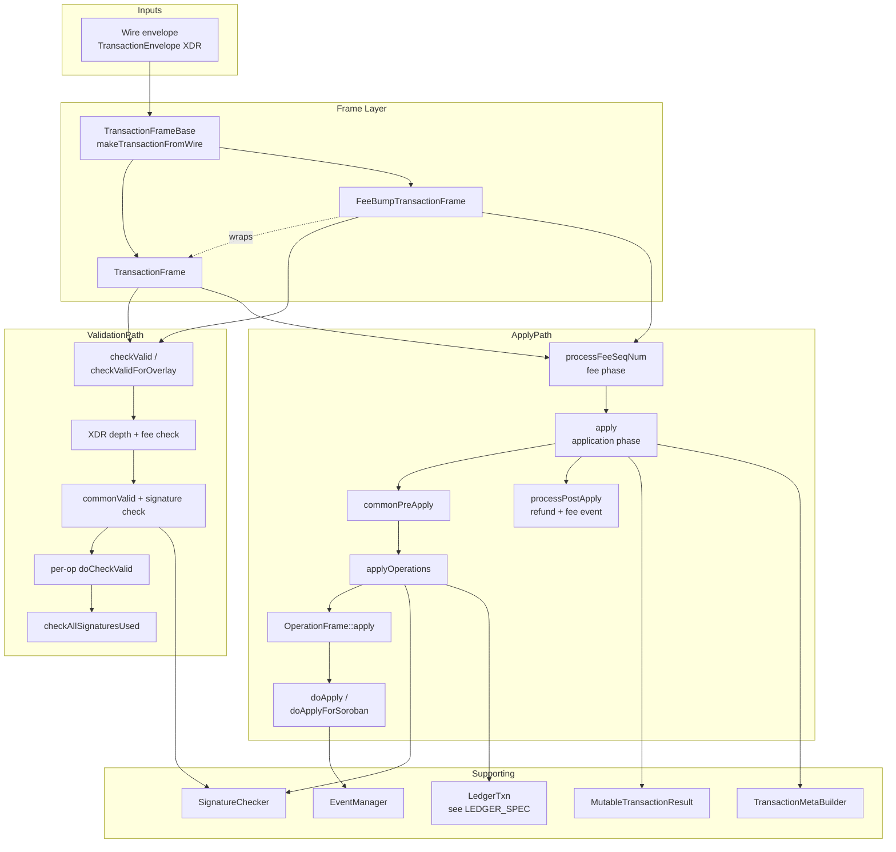
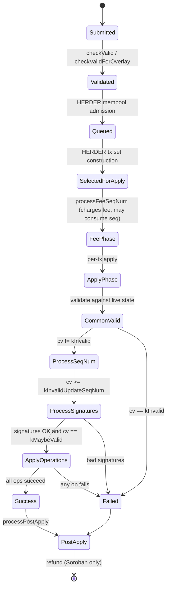
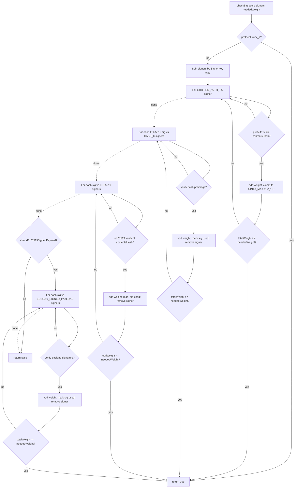
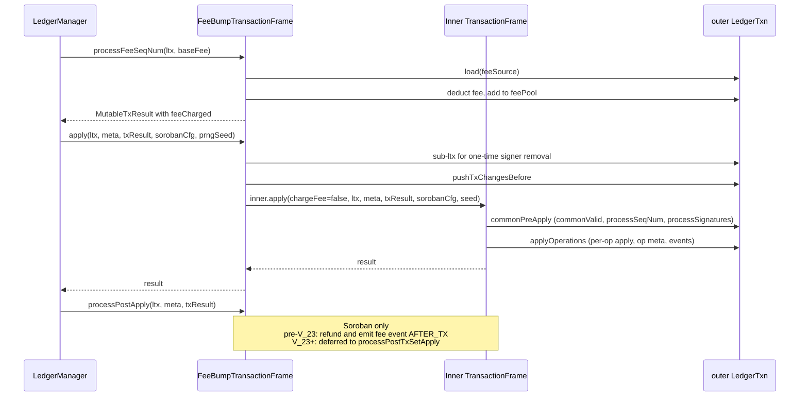
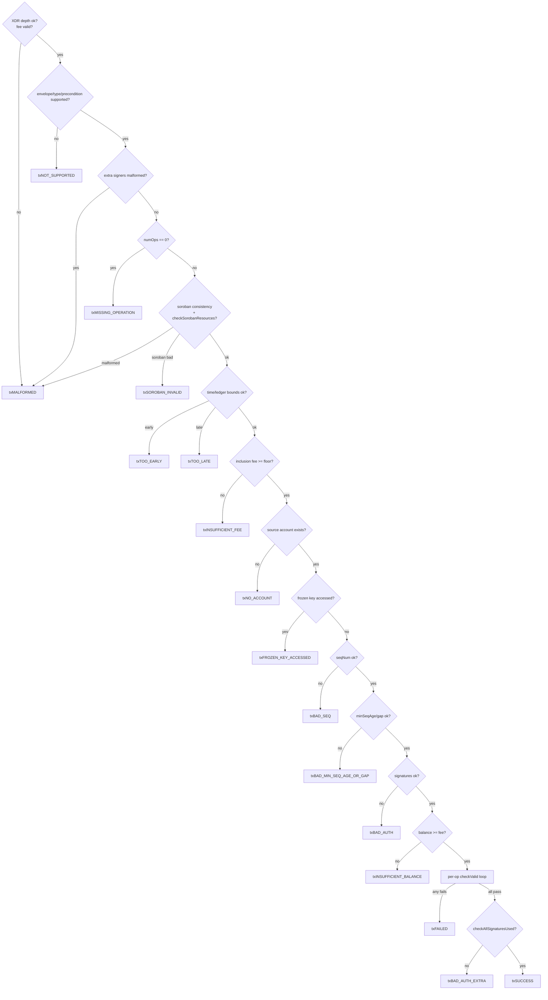

# Stellar Transaction Processing Specification

**Version:** 27 (stellar-core v27.0.0 / Protocol 27)
**Status:** Informational
**Date:** 2026-06-21

---

## Table of Contents

1. [Introduction](#1-introduction)
2. [Architecture](#2-architecture)
3. [Data Types](#3-data-types)
4. [Transaction Lifecycle](#4-transaction-lifecycle)
5. [Transaction Validation](#5-transaction-validation)
6. [Fee Framework](#6-fee-framework)
7. [Transaction Application Pipeline](#7-transaction-application-pipeline)
8. [Operation Execution](#8-operation-execution)
9. [Sponsorship Framework](#9-sponsorship-framework)
10. [DEX Conversion Engine](#10-dex-conversion-engine)
11. [Soroban Execution](#11-soroban-execution)
12. [State Management](#12-state-management)
13. [Metadata Construction](#13-metadata-construction)
14. [Event Emission](#14-event-emission)
15. [Error Handling](#15-error-handling)
16. [Invariants and Safety Properties](#16-invariants-and-safety-properties)
17. [Constants](#17-constants)
18. [References](#18-references)
19. [Appendices](#19-appendices)

---

## 1. Introduction

### 1.1 Purpose and Scope

This document specifies the Stellar transaction processing subsystem: the
parsing, validation, fee handling, signature checking, two-phase application,
and result/metadata production logic that any conforming implementation MUST
reproduce to maintain ledger consensus parity with stellar-core.

This specification is **implementation agnostic**. It is derived exclusively
from the vetted stellar-core C++ implementation (v27.0.0). Any conforming
implementation that produces identical post-apply ledger state, transaction
results, transaction meta, and emitted events for all valid inputs is
considered correct.

**In scope:**

- The `TransactionFrame` and `FeeBumpTransactionFrame` validation and apply
  pipelines.
- The 25 classic and 3 Soroban operation types, including their structural
  validation, semantic validation, and application logic in exact source
  order.
- The fee framework: full fee, inclusion fee, fee-bump semantics, surge
  pricing inputs, Soroban resource fees, and refunds.
- The signature checker weight-accumulation algorithm and signer consumption
  semantics.
- The sponsorship framework: numSponsoring / numSponsored counters, signer
  sponsorship IDs, sponsorship transfer / establish / remove.
- The DEX conversion engine: offer crossing order, rounding modes,
  cross-self detection, liquidity-pool interaction.
- The Soroban execution path: host-function invocation, footprint
  accounting, parallel apply, refundable resources, autorestore.
- Transaction meta construction, version selection, ledger-change ordering.
- Event emission: classic SAC-style events, Soroban contract events,
  XLM reconciliation, fee events.
- Tx-level and op-level result codes.

**Out of scope:**

- Wire-level XDR framing (covered in `OVERLAY_SPEC §3`).
- Transaction-set construction, surge pricing selection, broadcast, and
  the mempool (covered in `HERDER_SPEC §4–§7`).
- Ledger close coordination, header update, BucketList flushing
  (covered in `LEDGER_SPEC §3–§5`).
- BucketList persistence and snapshot semantics (covered in
  `BUCKETLISTDB_SPEC`).
- Catchup and replay (covered in `CATCHUP_SPEC`).
- Implementation internals: caching, memory management, threading,
  SQL schemas, metrics, logging.

### 1.2 Conventions and Terminology

The key words "MUST", "MUST NOT", "REQUIRED", "SHALL", "SHALL NOT",
"SHOULD", "SHOULD NOT", "RECOMMENDED", "MAY", and "OPTIONAL" in this
document are to be interpreted as described in RFC 2119.

**Glossary:**

| Term | Definition |
|------|------------|
| Transaction | An indivisible, atomic unit of state change submitted to the network, consisting of a source account, sequence number, fee, optional preconditions, memo, and 1–100 operations. |
| Fee-bump transaction | An outer transaction whose only purpose is to pay the fee for an enclosed inner transaction, allowing a different account to fund execution. |
| Operation | A single primitive action (payment, offer, contract invocation, etc.); a transaction is a sequence of operations applied in order. |
| Inner transaction | The `Transaction` wrapped inside a `FeeBumpTransaction`. |
| Source account | The Stellar account against which a transaction's sequence number is consumed and whose signature authorizes the transaction. |
| Fee source | The account that pays the transaction fee. Equal to the source for non-fee-bump transactions; equal to the fee-bump source for fee-bump transactions. |
| Inclusion fee | The portion of the full fee used for inclusion-priority comparisons; full fee minus declared Soroban resource fee for Soroban txs. |
| Full fee | The total fee declared in the envelope's `fee` field. |
| Effective fee | The fee actually charged at apply time, after surge-pricing reductions. |
| Threshold level | One of LOW / MEDIUM / HIGH determining the signer weight required to authorize an operation. |
| commonValid | A composite validation predicate executed both at `checkValid` time and at apply time; produces one of four validation outcomes. |
| LedgerTxn | A nested transactional view over ledger state; see `LEDGER_SPEC §6`. |
| Signature checker | A stateful object that tracks which of the up to 20 envelope signatures have been consumed during weight accumulation. |
| Footprint | The static set of `LedgerKey` entries a Soroban transaction declares it will read and/or write, split into `readOnly` and `readWrite` keysets. |
| Refundable fee | The portion of a Soroban resource fee returned to the fee source after apply if not consumed by rent or events. |
| Surge pricing | The mechanism by which lane-level demand raises the effective base fee per operation; see `HERDER_SPEC §6`. |
| TTL | Time-to-live for Soroban entries, expressed as a `liveUntilLedgerSeq`. |
| Hot Archive | Persistent storage of evicted Soroban entries; see `BUCKETLISTDB_SPEC §10`. |
| Autorestore | Implicit restoration of archived persistent Soroban entries by an `InvokeHostFunction` op that marks them in `archivedSorobanEntries` (v23+). |

#### Relationship to Other Specifications

| Specification | Relationship |
|---------------|--------------|
| `LEDGER_SPEC` | TX is invoked from the apply pipeline; uses LedgerTxn and ledger header from LEDGER. |
| `HERDER_SPEC` | HERDER constructs tx sets, surge-prices and validates txs via `checkValid` / `checkValidForOverlay`. |
| `OVERLAY_SPEC` | OVERLAY framing carries `TRANSACTION` messages; overlay flooding calls `checkValidForOverlay`. |
| `BUCKETLISTDB_SPEC` | TX reads state via LedgerTxn-backed BucketList snapshots; writes commit through LedgerTxn. |
| `CATCHUP_SPEC` | Catchup replays transactions through the same `TransactionFrameBase::apply` entry point. |
| `SCP_SPEC` | TX outcomes are not consensed directly; only the apply-ordered tx set is consensed. |

### 1.3 Notation

This document uses prose with embedded `camelCase` pseudocode. XDR result
codes are written in `SCREAMING_SNAKE_CASE`. Protocol-version guards are
annotated `@version(≥N)`, `@version(<N)`, or `@version(=N)`. Where the order
of validation checks affects observable behavior (in particular, the result
code returned for an invalid transaction), checks are listed in **exact
source order**.

Cross-references to other specs use the form `SPEC_NAME §N.N`. References
to XDR types use the type name without reproducing the full XDR definition;
see `protocol-curr/xdr/Stellar-transaction.x` in the pinned stellar-core
submodule.

---

## 2. Architecture

The transaction subsystem is invoked from two callers: the **apply
pipeline** (driven by `LedgerManagerImpl` during ledger close) and the
**validation pipeline** (driven by `HerderImpl` and overlay flooding).
Both share the same `TransactionFrameBase` polymorphic interface; the two
concrete implementations are `TransactionFrame` (envelope types
`ENVELOPE_TYPE_TX_V0` and `ENVELOPE_TYPE_TX`) and
`FeeBumpTransactionFrame` (envelope type `ENVELOPE_TYPE_TX_FEE_BUMP`).



The frame layer provides exactly two entry points to the apply pipeline:

- `processFeeSeqNum(ltx, baseFee)` — **fee phase**: deducts the effective
  fee from the fee source, consumes the sequence number on protocols
  before V_10 (for non-fee-bump txs), and returns a fresh
  `MutableTransactionResult` initialized with the charged fee.
- `apply(app, ltx, meta, txResult, sorobanConfig, prngSeed)` —
  **application phase**: runs `commonValid` again under the live
  `LedgerTxn`, consumes the sequence number on protocol V_10+, removes
  one-time signers, validates and applies each operation, and processes
  post-apply refunds.

For parallel Soroban transactions (`@version(≥23)`), the apply phase is
split into `preParallelApply` (sequential pre-work under the apply ltx)
and `parallelApply` (concurrent execution against a thread-local
`ThreadParallelApplyLedgerState`). See `HERDER_SPEC §5` and §11.6 below.

The validation pipeline `checkValid` (and its overlay sibling
`checkValidForOverlay`) is a pure read-only computation against a
`LedgerSnapshot`; it does not mutate ledger state and is invoked from
multiple contexts (the herder mempool, overlay flooding, RPC submission).
It runs the same `commonValid` predicate as apply but with `applying=false`
and `chargeFee=true`.

A transaction's outputs are:

- A `TransactionResult` (the tx-level success/failure code plus a vector
  of per-operation results).
- A `TransactionMeta` (the ledger-entry changes produced).
- A vector of emitted events (fee events at the tx level; classic SAC
  events and Soroban contract events at the op level).

---

## 3. Data Types

This section enumerates the XDR types observed by the transaction subsystem.
Definitions are in `protocol-curr/xdr/Stellar-transaction.x` and
`Stellar-ledger.x`; this section names types and their roles without
reproducing the schemas.

### 3.1 Envelope Types

| XDR type | Envelope tag | Description |
|----------|--------------|-------------|
| `TransactionV0Envelope` | `ENVELOPE_TYPE_TX_V0` | Legacy pre-V_13 envelope with raw `ed25519` source account bytes; rejected at protocol V_13+. |
| `TransactionV1Envelope` | `ENVELOPE_TYPE_TX` | Current envelope using `MuxedAccount` source. Required for protocol V_13+. |
| `FeeBumpTransactionEnvelope` | `ENVELOPE_TYPE_TX_FEE_BUMP` | Fee-bump wrapper; supported from protocol V_13. |

An envelope contains a `Transaction` (or `FeeBumpTransaction`) plus an
`xdr::xvector<DecoratedSignature, 20>` of up to 20 signatures.

### 3.2 Transaction Body

A `Transaction` carries:

| Field | Type | Description |
|-------|------|-------------|
| `sourceAccount` | `MuxedAccount` | Source / sequence-bearing account. |
| `fee` | `uint32` | Full fee in stroops. |
| `seqNum` | `int64` (`SequenceNumber`) | Sequence number; MUST equal `account.seqNum + 1` (or relaxed per `minSeqNum`). |
| `cond` | `Preconditions` | Time / ledger / sequence / signer preconditions. |
| `memo` | `Memo` | Up to 32 bytes of memo (text/id/hash/return). |
| `operations` | `xvector<Operation,100>` | 1–100 operations. |
| `ext` | union | Carries `SorobanTransactionData` when present (v1). |

A `FeeBumpTransaction` carries:

| Field | Type | Description |
|-------|------|-------------|
| `feeSource` | `MuxedAccount` | Account paying the fee. |
| `fee` | `int64` | Full fee in stroops (signed, MUST be ≥ 0). |
| `innerTx` | union | Wraps an inner `TransactionV1Envelope`. |
| `ext` | union | Reserved. |

### 3.3 Preconditions

`Preconditions` is a union over `PRECOND_NONE`, `PRECOND_TIME`, and
`PRECOND_V2`. The V2 form contains:

| Field | Type | Description |
|-------|------|-------------|
| `timeBounds` | optional `TimeBounds` | `minTime` / `maxTime` close-time bounds. |
| `ledgerBounds` | optional `LedgerBounds` | `minLedger` / `maxLedger` sequence bounds. |
| `minSeqNum` | optional `SequenceNumber` | If set, relaxes the strict `seq = current+1` check. |
| `minSeqAge` | `Duration` | Required age of source account's `seqTime` (V3 ext). |
| `minSeqLedgerGap` | `uint32` | Required gap from source account's `seqLedger` (V3 ext). |
| `extraSigners` | `xvector<SignerKey,2>` | Up to 2 additional signers whose signatures MUST be present. |

`PRECOND_V2` is rejected for protocol `<V_19`.

### 3.4 Operations

The body of an `Operation` is a tagged union over `OperationType`. The
following 25 classic types and 3 Soroban types are supported by the
current protocol:

| `OperationType` | Threshold | First Supported | Description (see §8) |
|-----------------|-----------|-----------------|----------------------|
| `CREATE_ACCOUNT` | MEDIUM | V_1 | Create new account with starting balance. |
| `PAYMENT` | MEDIUM | V_1 | Native or credit payment. |
| `PATH_PAYMENT_STRICT_RECEIVE` | MEDIUM | V_1 | Path payment with fixed receive amount. |
| `PATH_PAYMENT_STRICT_SEND` | MEDIUM | V_12 | Path payment with fixed send amount. |
| `MANAGE_SELL_OFFER` | MEDIUM | V_1 | Create / update / delete sell offer. |
| `MANAGE_BUY_OFFER` | MEDIUM | V_11 | Create / update / delete buy offer. |
| `CREATE_PASSIVE_SELL_OFFER` | MEDIUM | V_1 | Sell offer that doesn't auto-fill on equal price. |
| `SET_OPTIONS` | MEDIUM / HIGH | V_1 | Modify thresholds, flags, signers, home domain, inflation dest. HIGH if thresholds/signers are changed. |
| `CHANGE_TRUST` | MEDIUM | V_1 | Create / update / delete trustline (or pool-share trustline). |
| `ALLOW_TRUST` | LOW | V_1 | Issuer flips auth flags on a trustline. |
| `ACCOUNT_MERGE` | HIGH | V_1 | Delete source account, transfer XLM to destination. |
| `INFLATION` | LOW | V_1 (disabled in V_12+) | Distribute inflation; disabled at V_12+. |
| `MANAGE_DATA` | MEDIUM | V_2 | Create / update / delete data entry. |
| `BUMP_SEQUENCE` | LOW | V_10 | Bump source account's sequence number. |
| `CREATE_CLAIMABLE_BALANCE` | MEDIUM | V_14 | Lock asset into a claimable balance entry. |
| `CLAIM_CLAIMABLE_BALANCE` | LOW | V_14 | Claim and delete a claimable balance. |
| `BEGIN_SPONSORING_FUTURE_RESERVES` | MEDIUM | V_14 | Mark next reserves as sponsored. |
| `END_SPONSORING_FUTURE_RESERVES` | MEDIUM | V_14 | End sponsorship; consume sponsorship entry. |
| `REVOKE_SPONSORSHIP` | MEDIUM | V_14 | Transfer / remove / establish sponsorship for an entry or signer. |
| `CLAWBACK` | MEDIUM | V_17 | Issuer claws back asset from a trustline. |
| `CLAWBACK_CLAIMABLE_BALANCE` | MEDIUM | V_17 | Issuer claws back a claimable balance. |
| `SET_TRUST_LINE_FLAGS` | MEDIUM | V_17 | Issuer sets / clears auth flags on a trustline. |
| `LIQUIDITY_POOL_DEPOSIT` | MEDIUM | V_18 | Add liquidity to constant-product pool. |
| `LIQUIDITY_POOL_WITHDRAW` | MEDIUM | V_18 | Withdraw liquidity from pool. |
| `INVOKE_HOST_FUNCTION` | MEDIUM | V_20 (SOROBAN) | Invoke Soroban contract / upload Wasm / create contract. |
| `EXTEND_FOOTPRINT_TTL` | LOW | V_20 | Extend TTL of read-only footprint entries. |
| `RESTORE_FOOTPRINT` | LOW | V_20 | Restore archived persistent Soroban entries. |

A Soroban transaction MUST contain **exactly one** operation, and that
operation MUST be one of the three Soroban types
(see `validateSorobanOpsConsistency`, §5.2). Classic transactions MUST NOT
mix Soroban and non-Soroban operations.

### 3.5 SorobanTransactionData

When `Transaction.ext.v() == 1`, the envelope carries
`SorobanTransactionData`:

| Field | Type | Description |
|-------|------|-------------|
| `resources.footprint.readOnly` | `xvector<LedgerKey>` | Read-only footprint keys. |
| `resources.footprint.readWrite` | `xvector<LedgerKey>` | Read-write footprint keys. |
| `resources.instructions` | `uint32` | Declared CPU instruction budget. |
| `resources.diskReadBytes` | `uint32` | Declared disk-read byte budget. |
| `resources.writeBytes` | `uint32` | Declared write-byte budget. |
| `resourceFee` | `int64` | Declared resource fee in stroops; MUST satisfy `0 ≤ resourceFee ≤ MAX_RESOURCE_FEE` (1 << 50). |
| `ext` | union | V0 or V1; V1 carries `archivedSorobanEntries` for autorestore (v23+). |

### 3.6 Result Types

A `TransactionResult` is:

```
{ feeCharged: int64,
  result: union { code: TransactionResultCode,
                  innerResultPair: optional InnerTransactionResultPair,
                  operationResults: optional xvector<OperationResult,100> } }
```

For fee-bump transactions, the outer result holds the `feeCharged` (full
charged fee including inner op fees) and the inner pair holds the inner
transaction's hash and `InnerTransactionResult`. See §15 for the full
result-code enumeration.

---

## 4. Transaction Lifecycle

A transaction passes through the following phases. Phase 5 (post-apply)
runs immediately after apply for protocols `<V_23`, and only after all
transactions in the set have applied for `@version(≥23)`.



The four `ValidationType` values returned by `commonValid` are:

- `kInvalid` — transaction is invalid; sequence number is NOT consumed.
- `kInvalidUpdateSeqNum` — invalid but sequence number IS consumed
  (e.g., `txBAD_AUTH` from V_10+).
- `kInvalidPostAuth` — invalid after auth succeeded; one-time signers
  MUST be removed.
- `kMaybeValid` — passes all checks; operations MAY be applied.

The fee-bump variant uses a 2-state model (`kInvalid` / `kInvalidPostAuth`
/ `kFullyValid`) on a `FeeBumpTransactionFrame::ValidationType`, but
otherwise mirrors the same flow over its outer fee-source account, then
delegates to the inner `TransactionFrame::checkValidWithOptionallyChargedFee`
with `chargeFee=false`.

---

## 5. Transaction Validation

`TransactionFrameBase::checkValid` (and `checkValidForOverlay`) MUST be a
pure function over a read-only `LedgerSnapshot`. It SHALL NOT mutate
ledger state.

### 5.1 Envelope and Fee Pre-checks

The outermost `checkValidImpl` performs (in this order):

1. **XDR depth check** — `xdr::check_xdr_depth(envelope, 500)` MUST
   succeed; otherwise return `txMALFORMED`. This bound applies the same
   500-level depth limit to nested XDR structures observed at the
   envelope.
2. **`XDRProvidesValidFee`** — for Soroban transactions: the envelope
   MUST be `ENVELOPE_TYPE_TX`, `tx.ext.v() == 1`, and
   `0 ≤ resourceFee ≤ MAX_RESOURCE_FEE` (where `MAX_RESOURCE_FEE = 1 <<
   50`). For fee-bump txs, the outer `fee` MUST be ≥ 0. Failure ⇒
   `txMALFORMED`.
3. **Initialise feeCharged** — set `result.feeCharged = getFee(header,
   baseFee=header.baseFee, applying=false)` as a presentational estimate
   (this value may differ from the actually-charged fee).
4. Construct a `SignatureChecker` over `tx.signatures` with
   `isOverlayValidation=true` for `checkValidForOverlay` and `false`
   otherwise; load `sorobanConfig` if at `@version(≥SOROBAN)`.
5. Run `commonValid(app, sorobanConfig, sigChecker, ls, current=current,
   applying=false, chargeFee=true, ..., diagnosticEvents)`. If it returns
   anything other than `kMaybeValid`, stop.
6. For each operation in order: call
   `op.checkValid(app, sigChecker, sorobanConfig, ls, forApply=false,
   opResult, diagEvents)`. On the first failure, set the outer code to
   `txFAILED` and stop.
7. Call `sigChecker.checkAllSignaturesUsed()`. If it returns false, set
   the outer code to `txBAD_AUTH_EXTRA`.

### 5.2 commonValidPreSeqNum

`commonValidPreSeqNum` performs envelope-format and structural checks in
this exact order:

1. **Envelope-type / muxed-account version gate.**
   - `@version(<V_13)` MUST reject `ENVELOPE_TYPE_TX` and any envelope
     containing a muxed source account ⇒ `txNOT_SUPPORTED`.
   - `@version(≥V_13)` MUST reject `ENVELOPE_TYPE_TX_V0` ⇒
     `txNOT_SUPPORTED`.
2. **PreconditionsV2 gate.** `@version(<V_19)` MUST reject `PRECOND_V2`
   ⇒ `txNOT_SUPPORTED`.
3. **Extra-signers malformed checks** (when `PRECOND_V2.extraSigners`
   is non-empty):
   - If the two extra signers are equal ⇒ `txMALFORMED`.
   - If any extra signer is of type
     `SIGNER_KEY_TYPE_ED25519_SIGNED_PAYLOAD` with empty payload ⇒
     `txMALFORMED`.
4. **At least one operation.** `getNumOperations() == 0` ⇒
   `txMISSING_OPERATION`.
5. **Soroban ops consistency.** `validateSorobanOpsConsistency` ⇒
   `txMALFORMED` if classic + Soroban ops are mixed or if a Soroban tx
   contains more than one op.
6. **Soroban-specific structural checks** (if `isSoroban()`):
   - `@version(<SOROBAN_PROTOCOL_VERSION)` (= V_20) ⇒ `txMALFORMED`.
   - `@version(≥V_25)`: `validateSorobanMemo()` MUST hold — the memo
     MUST be `MEMO_NONE`, the tx source account MUST NOT be muxed, and
     the op source account (if present) MUST NOT be muxed. Violation ⇒
     `txSOROBAN_INVALID`.
   - `checkSorobanResources(sorobanConfig, ledgerVersion)` MUST pass.
     The check order is:
     1. `instructions ≤ txMaxInstructions`.
     2. `diskReadBytes ≤ txMaxDiskReadBytes`.
     3. `writeBytes ≤ txMaxWriteBytes`.
     4. `@version(≥V_23)`: `numDiskReads ≤ txMaxDiskReadEntries`
        where `numDiskReads = getNumDiskReadEntries(resources, ext,
        isRestoreFootprintTx)` counts (a) classic keys in either
        footprint, plus (b) entries from `archivedSorobanEntries`, plus
        (c) for restore ops, all `readWrite` entries.
        Total footprint entry count `readOnly + readWrite ≤
        txMaxFootprintEntries`.
     5. `@version(<V_23)`: `readOnly.size + readWrite.size ≤
        txMaxDiskReadEntries`.
     6. `writeEntries.size ≤ txMaxWriteLedgerEntries`.
     7. Each footprint key MUST be a valid type:
        - `ACCOUNT`, `CONTRACT_DATA`, `CONTRACT_CODE` are accepted.
        - `TRUSTLINE`: asset MUST be valid, non-native, and account
          MUST NOT be the issuer.
        - `OFFER`, `DATA`, `CLAIMABLE_BALANCE`, `LIQUIDITY_POOL`,
          `CONFIG_SETTING`, `TTL` are rejected.
     8. Each footprint key's serialized size ≤
        `maxContractDataKeySizeBytes`.
     9. `txSize ≤ txMaxSizeBytes`.
     10. If `ext.v() == 1`: `@version(≥AUTO_RESTORE_PROTOCOL_VERSION)`
         (= V_23) is required; the `archivedSorobanEntries` indices MUST
         be strictly ascending, MUST be in bounds, and MUST point to
         persistent entries.
   - **Resource-fee structural checks**:
     1. `@version(<V_23)` or `chargeFee=true`:
        `sorobanData.resourceFee ≤ getFullFee()` ⇒ else
        `txSOROBAN_INVALID`.
     2. Adding the computed `non_refundable_fee` and `refundable_fee`
        MUST NOT overflow `int64` ⇒ else `txSOROBAN_INVALID`.
     3. `sorobanData.resourceFee ≥ (non_refundable_fee +
        refundable_fee)` ⇒ else `txSOROBAN_INVALID`.
   - **Footprint disjointness**: every key across `readOnly ∪
     readWrite` MUST be unique. Duplicates ⇒ `txSOROBAN_INVALID`.
7. **Classic tx ext gate.** `@version(≥V_21)` and classic tx: if
   `ENVELOPE_TYPE_TX` and `tx.ext.v() != 0` ⇒ `txMALFORMED` (Soroban
   data is forbidden on classic transactions starting at V_21).
8. **Time / ledger preconditions.**
   - `isTooEarly`: if a `minTime` precondition is set and `closeTime +
     lowerBoundCloseTimeOffset < minTime` ⇒ `txTOO_EARLY`.
     Additionally `@version(≥V_19)`: if a `LedgerBounds.minLedger >
     header.ledgerSeq` ⇒ `txTOO_EARLY`.
   - `isTooLate`: if `maxTime` is set and `closeTime +
     upperBoundCloseTimeOffset > maxTime` ⇒ `txTOO_LATE`.
     `@version(≥V_19)`: if `LedgerBounds.maxLedger != 0` and
     `maxLedger ≤ header.ledgerSeq` ⇒ `txTOO_LATE`.
9. **Minimum inclusion fee.**
   - If `chargeFee` is true: `getInclusionFee() ≥ getMinInclusionFee(tx,
     header)` ⇒ else `txINSUFFICIENT_FEE`. `getMinInclusionFee` returns
     `effectiveBaseFee * max(1, numOperations)` where `effectiveBaseFee
     = max(header.baseFee, optional caller baseFee)`.
   - `@version(<V_23)`: if `chargeFee=false` and `getInclusionFee() < 0`
     ⇒ `txINSUFFICIENT_FEE`. (Fee-bump inner txs are allowed to have
     non-positive inner inclusion fee from V_23+.)
10. **Source account existence.** Load the tx source account; if absent
    ⇒ `txNO_ACCOUNT`.
11. **CAP-77 frozen-key gate** (`@version(≥V_23)`, when `cfg != nullptr`
    and `cfg.hasFrozenKeys()`): if `accessesFrozenKey(*cfg)` is true and
    the envelope hash is not in `cfg.isFreezeBypassTx(envHash)` ⇒
    `txFROZEN_KEY_ACCESSED`. This visits the tx source, every op source,
    every footprint key, and per-op frozen-key predicates.

Returns the source account on success.

### 5.3 commonValid Post-SeqNum

After `commonValidPreSeqNum` returns the source account, `commonValid`
performs:

1. **Sequence-number check.**
   `@version(≥V_10)` or `applying=false`: if `current == 0`, set
   `current = sourceAccount.seqNum`; if `isBadSeq(header, current)` ⇒
   `txBAD_SEQ`. `isBadSeq` semantics:
   - If `getSeqNum() == getStartingSequenceNumber(header)` (a freshly
     created account's starting seqnum) ⇒ bad.
   - `@version(≥V_19)`: if `minSeqNum` is set, accept iff `minSeqNum
     ≤ current < getSeqNum()`.
   - Otherwise accept iff `current == getSeqNum() - 1`.

   After this check, `res = kInvalidUpdateSeqNum`.
2. **isTooEarlyForAccount** (`@version(≥V_19)`): consults the
   `AccountEntry.ext.v3.seqTime` / `seqLedger`. Let
   `minSeqAge / minSeqLedgerGap` come from the V2 preconditions; let
   `lowerBoundCloseTime = closeTime + lowerBoundCloseTimeOffset`. If
   `minSeqAge > lowerBoundCloseTime` or `lowerBoundCloseTime - minSeqAge
   < accSeqTime`, OR if `minSeqLedgerGap > ledgerSeq` or `ledgerSeq -
   minSeqLedgerGap < accSeqLedger`, ⇒ `txBAD_MIN_SEQ_AGE_OR_GAP`.
3. **Transaction-level signature check.**
   `checkAllTransactionSignatures(sigChecker, sourceAccount, ledgerVer)`:
   - Source account MUST exist.
   - Master signer (`thresholds[THRESHOLD_LOW]` if `thresholds[0] != 0`)
     plus all extra `signers` on the account MUST collectively satisfy
     `THRESHOLD_LOW` weight. The full signature-check algorithm is
     given in §5.5.
   - `@version(≥V_19)`: every key in `PRECOND_V2.extraSigners` MUST
     have a matching signature, weighted 1 each, threshold equal to the
     set size.

   Failure ⇒ `txBAD_AUTH`. After success, `res = kInvalidPostAuth`.
4. **Fee source balance check.** Let `feeToPay = 0` if
   `applying=true && @version(≥V_9)`; otherwise `feeToPay = full fee`.
   If `chargeFee=true` and `availableBalance(header, sourceAccount) <
   feeToPay` ⇒ `txINSUFFICIENT_BALANCE`. `availableBalance` excludes
   reserve and any selling liabilities.

   On success, `res = kMaybeValid`.

For `@version(<V_8)` and `applying=true`, `commonValid` MUST run the
above block inside an inner-snapshot LedgerTxn to mimic the legacy buggy
account loading; for all later versions it runs directly against the
read-only snapshot.

### 5.4 FeeBumpTransactionFrame commonValid

`FeeBumpTransactionFrame::commonValid` runs (in order):

1. `@version(<V_13)` ⇒ `txNOT_SUPPORTED`.
2. **Fee-bump inclusion fee gate.** `getInclusionFee() ≥
   getMinInclusionFee(this, header)` ⇒ else `txINSUFFICIENT_FEE`.
3. **Inner-fee comparison.** Let `inner = innerTx.getInclusionFee()`,
   `minOuter = getMinInclusionFee(this, header)`,
   `minInner = getMinInclusionFee(innerTx, header)`.

   When `inner ≥ 0`, the outer per-op inclusion fee MUST exceed the
   inner per-op inclusion fee, i.e.
   `outerInclusionFee * minInner ≥ inner * minOuter`. If not, set
   `txINSUFFICIENT_FEE` with `feeCharged = ceilDiv(inner * minOuter,
   minInner)` (clamped to `INT64_MAX`).

   When `inner < 0`: `@version(≥V_23) && innerTx.isSoroban()` permits
   non-positive inner inclusion fee. Otherwise ⇒
   `txFEE_BUMP_INNER_FAILED`.
4. Load fee source account; absent ⇒ `txNO_ACCOUNT`.
5. **Fee source signature check** at `THRESHOLD_LOW` ⇒ else `txBAD_AUTH`.
6. **Fee source balance check.** `feeToPay = applying ? 0 : getFullFee()`;
   `availableBalance < feeToPay` ⇒ `txINSUFFICIENT_BALANCE`.
7. **CAP-77 frozen-fee-source gate** (`@version(≥V_23)`): if
   `sorobanConfig.hasFrozenKeys()` and `isKeyFrozen(accountKey(feeSource))`
   and not `isFreezeBypassTx(getContentsHash())` ⇒ `txFROZEN_KEY_ACCESSED`.
8. `checkAllSignaturesUsed` ⇒ else `txBAD_AUTH_EXTRA`.
9. Delegate to `innerTx.checkValidWithOptionallyChargedFee(..., chargeFee=false, ...)`.
   The inner tx is validated against its own envelope-contents hash.

### 5.5 Signature Checking Algorithm

`SignatureChecker` accumulates signer weight from the transaction's up-to-20
signatures and a list of `Signer`s sorted by `SignerKey` type.

**Algorithm** (see Appendix A for a decision tree):

```
function checkSignature(signers, neededWeight, checkEd25519SignedPayload):
    if protocolVersion == V_7:                          # buggy legacy
        return true
    totalWeight = 0
    # 1. PRE_AUTH_TX signers: match by transaction contents hash.
    for s in signers[SIGNER_KEY_TYPE_PRE_AUTH_TX]:
        if s.key.preAuthTx == contentsHash:
            w = s.weight; @version(≥V_10) clamp w to UINT8_MAX
            totalWeight += w
            if totalWeight >= neededWeight: return true
    # 2. HASH_X signers: signature payload is the preimage; hash matches the key.
    if verifyAll(signers[HASH_X], verifyHashX): return true
    # 3. ED25519 signers: ed25519 signature over contentsHash.
    if verifyAll(signers[ED25519], verifyEd25519): return true
    # 4. ED25519_SIGNED_PAYLOAD: ed25519 signature over key's embedded payload.
    if checkEd25519SignedPayload:
       if verifyAll(signers[ED25519_SIGNED_PAYLOAD],
                    verifyEd25519SignedPayload): return true
    return false
```

`verifyAll` iterates the signature vector outer-to-inner over a (mutable)
copy of `signers`; on first match, the signature is marked used in
`mUsedSignatures`, its weight is added (clamped at V_10+ to `UINT8_MAX`),
and the signer is removed from the list to prevent reuse. If
`totalWeight ≥ neededWeight`, return true.

`checkEd25519SignedPayload = false` is used **only** in
`checkValidForOverlay` (background flooding validation) to avoid the
overhead of signed-payload verification.

`checkAllSignaturesUsed()`: every entry in `mUsedSignatures` MUST be true;
otherwise the tx is rejected with `txBAD_AUTH_EXTRA`. The check is
suppressed `@version(=V_7)`.

### 5.6 Operation-Level Validation

Each `OperationFrame::checkValid` runs (in order):

1. `isOpSupported(header)`: if false ⇒ `opNOT_SUPPORTED`. Per-op
   protocol-version gates are listed in §3.4.
2. **Signature gate** (only when `forApply=false` OR `@version(<V_10)`):
   `checkSignature(sigChecker, ls, &res, forApply)`. This loads the op
   source account, applies the threshold level (`getThresholdLevel`),
   and accumulates weight. Failures: `opNO_ACCOUNT` if source missing
   and `forApply || !op.sourceAccount`; `opBAD_AUTH` otherwise.
3. **Op source existence re-check** (only when `forApply` and
   `@version(≥V_10)`): if `op.sourceAccount || forApply` and the op
   source is not loadable ⇒ `opNO_ACCOUNT`.
4. **Body-specific validation**:
   - For Soroban ops `@version(≥SOROBAN)`: dispatch to
     `doCheckValidForSoroban(networkConfig, appConfig, ledgerVersion,
     res, diagEvents)`.
   - Otherwise: dispatch to `doCheckValid(ledgerVersion, res)`.

For `@version(<V_8)` and `forApply=true`, this entire procedure runs
inside an inner snapshot to mimic legacy account-loading bugs.

### 5.7 Cross-Spec Validation Inputs

`checkValid` is also invoked by:

- `HERDER_SPEC §6.1` — tx-set construction and surge pricing.
- `HERDER_SPEC §8` — mempool admission and replace-by-fee.
- `OVERLAY_SPEC §7.1` — flooding (`checkValidForOverlay`).
- RPC ingestion / catchup (replay) — runs `checkValid` with
  `lowerBoundCloseTimeOffset = upperBoundCloseTimeOffset = 0`.

---

## 6. Fee Framework

### 6.1 Fee Components

For a non-fee-bump transaction:

- **Full fee** = `tx.fee` (uint32).
- **Inclusion fee** = `fullFee` (classic) or `fullFee - declaredSorobanResourceFee` (Soroban).
- **Declared Soroban resource fee** = `tx.ext.sorobanData().resourceFee`
  (zero for classic).

For a fee-bump transaction:

- **Full fee** = `feeBump.fee` (int64).
- **Inclusion fee** = `fullFee - declaredSorobanResourceFee`.
- **Min inclusion fee** (per fee-bump tx) is computed using
  `getNumOperations() = innerOps + 1` (the +1 is the conceptual fee-bump
  op).

### 6.2 getFee(header, baseFee, applying)

```
function getFee(header, baseFee, applying):
    if not baseFee: return getFullFee()
    if @version(≥V_11) OR not applying:
        adjustedFee = saturatingMultiply(baseFee, max(1, numOperations))
        maybeResourceFee = isSoroban ? declaredSorobanResourceFee : 0
        if applying:
            return saturatingAdd(maybeResourceFee,
                                 min(getInclusionFee(), adjustedFee))
        else:
            return saturatingAdd(maybeResourceFee, adjustedFee)
    else:
        return getFullFee()
```

The applying path caps the inclusion-fee component at the surge-priced
per-op rate (`adjustedFee = baseFee * numOps`), implementing the
charge-the-floor surge pricing semantics from V_11+: the tx pays no more
than its inclusion fee, but no more than the surge-priced floor either.

For fee-bump txs, `getFee` always uses the V_11+ formula (no protocol gate)
and adds the inner Soroban resource fee as a flat component.

### 6.3 Surge Pricing Input

The `baseFee` parameter is supplied by the herder (see `HERDER_SPEC §6`)
based on the tx set's lane occupancy. The transaction subsystem itself
does not select baseFee; it only honors the value passed.

### 6.4 processFeeSeqNum (Fee Phase)

For non-fee-bump:

1. Reset legacy pre-V_8 account cache.
2. Load source account; absent ⇒ runtime error (the herder MUST have
   admitted only well-formed txs).
3. Compute `fee = getFee(header, baseFee, applying=true)`.
4. If `fee > 0`: clamp to `min(account.balance, fee)`, deduct from
   account balance, add to `header.feePool`.
5. `@version(<V_10)`: assert `acc.seqNum + 1 == getSeqNum()`; consume
   the sequence number here. `@version(≥V_10)` defers seq consumption
   to `processSeqNum` inside apply.

For fee-bump:

1. Load fee source; deduct fee clamped to balance; add to fee pool.
2. `@version(<V_25)`: also compute the inner per-op fee
   (`innerFeeCharged = innerTx.getFee(header, baseFee, applying=true)`)
   and stash it in the inner result. `@version(≥V_25)` skips this; the
   inner fee is no longer reported separately.

Returns a `MutableTxResultPtr` with `feeCharged` set.

### 6.5 Soroban Refundable Fees

A Soroban resource fee splits into:

- **Non-refundable fee** — the deterministic component computed up-front
  via `rust_bridge::compute_transaction_resource_fee` over the declared
  resources (`instructions`, `disk_read_entries`, `write_entries`,
  `disk_read_bytes`, `write_bytes`, `transaction_size_bytes`,
  `contract_events_size_bytes=0`). It is charged in full at fee phase.
- **Refundable fee** — `declaredResourceFee - nonRefundableFee`.
  Initialized on a `RefundableFeeTracker` at pre-apply time. During
  apply, host-computed `rent_fee` and the actual `contract_events_size`
  are consumed (`consumeRefundableSorobanResources`); any remainder is
  refunded.

The refund is applied to the **fee source** (not the tx source, which
matters for fee-bump):

```
function refundSorobanFee(ltx, feeSource, txResult):
    refund = refundableFeeTracker.getFeeRefund()
    if refund == 0: return 0
    feeAcc = loadAccount(ltx, feeSource)
    if !feeAcc: return 0     # account merged
    if !addBalance(header, feeAcc, refund):
        return 0             # liabilities block refund
    txResult.finalizeFeeRefund(ledgerVersion)
    header.feePool -= refund
    return refund
```

A fee event reflecting `-refund` is emitted with stage
`TRANSACTION_EVENT_STAGE_AFTER_TX` (`@version(<V_23)`) or
`TRANSACTION_EVENT_STAGE_AFTER_ALL_TXS` (`@version(≥V_23)`).

### 6.6 Fee-Bump Fee Charging

The outer fee-bump pays the full charged fee in `processFeeSeqNum`. The
inner transaction has its inclusion-fee floor checked in
`FeeBumpTransactionFrame::commonValid` using the cross-multiplication
(see §5.4). The inner inclusion fee MUST exceed the inner minimum
**per-op** rate, computed against the outer min rate:

```
outerInclusion * minInner ≥ innerInclusion * minOuter
```

This guarantees fee-bumps actually raise the inclusion priority above
the original.

---

## 7. Transaction Application Pipeline

### 7.1 Entry Point

`LedgerManagerImpl::applyTransactions` (`LEDGER_SPEC §3.3`) calls, for
each transaction in apply order:

1. `tx.processFeeSeqNum(ltx, txSet.getTxBaseFee(tx))` — fee phase under
   the outer ledger ltx.
2. `tx.apply(app, ltx, tm, mutableResult, sorobanConfig, prngSeed)` —
   apply phase.
3. `tx.processPostApply(app, ltx, tm, mutableResult)` — refund (Soroban,
   `@version(<V_23)`).

For Soroban transactions in `@version(≥V_23)`, parallel apply replaces
step 2 with `preParallelApply` + `parallelApply` per `HERDER_SPEC §5.3`.

### 7.2 commonPreApply

`TransactionFrame::commonPreApply` runs (inside a sub-LedgerTxn to allow
rollback on failure):

1. Reset legacy pre-V_8 account cache.
2. Construct `SignatureChecker` over the tx signatures.
3. If Soroban (`@version(≥SOROBAN)`):
   - Recompute the per-apply Soroban resource fee.
   - `meta.setNonRefundableResourceFee(nonRefundableFee)`.
   - Initialize the `RefundableFeeTracker` with
     `declaredResourceFee - nonRefundableFee`.
4. Run `commonValid(..., applying=true, chargeFee=chargeFee, ...)` and
   capture the validation type `cv`.
5. If `cv >= kInvalidUpdateSeqNum`: run `processSeqNum(ltx)` — for
   `@version(≥V_10)`, set `account.seqNum = getSeqNum()` and call
   `maybeUpdateAccountOnLedgerSeqUpdate` to refresh `accountExtV3.seqTime
   / seqLedger`.
6. Run `processSignatures(cv, sigChecker, ltx, txResult)`:
   - `@version(<V_10)`: only consume signatures when `cv == kMaybeValid`.
   - `@version(<V_13)` and `cv < kInvalidPostAuth`: fast-fail, do not
     remove signers.
   - `@version(≥V_13)` and `cv != kMaybeValid`: remove one-time signers
     and return false.
   - Otherwise: validate operation signatures
     (`checkOperationSignatures`) when the tx result code is
     `txSUCCESS` or `txFAILED`, remove one-time signers from all source
     accounts (tx + each op source), and verify
     `checkAllSignaturesUsed` ⇒ else `txBAD_AUTH_EXTRA`.
7. Push the sub-ltx's accumulated entry changes as
   `pushTxChangesBefore` into the meta builder, then commit the sub-ltx.

Returns the constructed `SignatureChecker` if successful (so it can be
reused for op application without re-loading signers).

### 7.3 applyOperations

For each operation index `i` from 0 to `numOperations - 1`:

1. Open a sub-LedgerTxn `ltxOp` over `ltxTx` (which is itself a sub-ltx
   over the outer apply ltx).
2. Compute the per-op PRNG seed: `subSeed = subSha256(basePrngSeed, opNum)`
   if the op is Soroban, else inherit the base seed.
3. Call `op.apply(app, sigChecker, ltxOp, sorobanConfig, subSeed,
   opResult, refundableFeeTracker, opMeta)`.
4. If `txRes` (the per-op result) is true:
   - `@version(<V_8)` and op is not `INFLATION`: call
     `reconcileEvents(txSourceID, op, delta, opEventManager)` — see §14.3.
   - Call `app.checkOnOperationApply(operation, opResult, delta, events)`
     for invariants (`LEDGER_SPEC §10`).
   - Set op meta from the sub-ltx delta.
5. **Commit policy**:
   - `txRes == true` or `@version(<V_14)`: commit `ltxOp`.
   - `@version(≥V_14)` and `txRes == false`: discard `ltxOp` (rollback).

If any op fails, the tx is marked `txFAILED` and the outer `ltxTx`
discards. If all ops succeed:

- `@version(<V_10)`: `checkAllSignaturesUsed` re-runs; failure ⇒
  `txBAD_AUTH_EXTRA`. Then a fresh sub-ltx removes one-time signers and
  is pushed as `pushTxChangesAfter` into the meta.
- `@version(≥V_14)`: if `ltxTx.hasSponsorshipEntry()` (i.e., any
  sponsorship temporary entries remain) ⇒ `txBAD_SPONSORSHIP`.

Commit `ltxTx` on success.

### 7.4 OperationFrame::apply

Polymorphic; for each op:

1. Re-run `op.checkValid(..., forApply=true, ...)` against the live
   sub-ltx state (this is necessary because earlier ops may have
   modified the op source account or other state). Failure returns
   false.
2. If Soroban: dispatch to `doApplyForSoroban` (pre-V_23) or has its
   `doParallelApply` invoked by `preParallelApply` (V_23+).
3. Otherwise: dispatch to `doApply(app, ltx, sorobanConfig, res,
   opMeta)`. The classic path uses the sorobanConfig-aware overload
   solely for CAP-77 frozen-key checks against offer counterparties
   during DEX crossing (see §10).

### 7.5 Source Account Resolution

For each op, `getSourceID()` returns either `op.sourceAccount` (if
present) or `parentTx.getSourceID()`. The op source account is loaded
via `loadSourceAccount`, which on `@version(<V_8)` re-applies the
legacy cached-account behavior tracked by `mCachedAccountPreProtocol8`
(this is a deliberate parity-preserving bug; see source comment).

### 7.6 Threshold Levels

`OperationFrame::getThresholdLevel` returns:

- `ThresholdLevel::LOW` for `ALLOW_TRUST`, `INFLATION`, `BUMP_SEQUENCE`,
  `CLAIM_CLAIMABLE_BALANCE`, `EXTEND_FOOTPRINT_TTL`, `RESTORE_FOOTPRINT`.
- `ThresholdLevel::HIGH` for `ACCOUNT_MERGE`, and `SET_OPTIONS` when
  any of `masterWeight`, `lowThreshold`, `medThreshold`, `highThreshold`,
  or `signer` is set.
- `ThresholdLevel::MEDIUM` for all other operations.

The needed weight comes from `account.thresholds[level]`. The master
signer's weight is taken from `account.thresholds[THRESHOLD_MASTER_WEIGHT
= 0]`.

---

## 8. Operation Execution

Each subsection lists the `doCheckValid` checks in **exact source order**
(this order determines which result code a malformed op receives), then
the `doApply` execution logic with all protocol-version branches.

Result codes are written `SCREAMING_SNAKE_CASE`. Op-level wrapper codes
`opBAD_AUTH`, `opNO_ACCOUNT`, `opNOT_SUPPORTED`, `opTOO_MANY_SUBENTRIES`,
`opEXCEEDED_WORK_LIMIT`, `opTOO_MANY_SPONSORING` are emitted by the
common machinery and are not repeated per-op below.

### 8.1 CreateAccount

**doCheckValid:**
1. `startingBalance < minStartingBalance` where
   `minStartingBalance = @version(≥V_14) ? 0 : 1` ⇒
   `CREATE_ACCOUNT_MALFORMED`.
2. `destination == getSourceID()` ⇒ `CREATE_ACCOUNT_MALFORMED`.

**doApply:**
1. If destination already exists ⇒ `CREATE_ACCOUNT_ALREADY_EXIST`.
2. `@version(<V_14)`:
   - `startingBalance < getMinBalance(header, 0, 0, 0)` ⇒
     `CREATE_ACCOUNT_LOW_RESERVE`.
   - `availableBalance(source) < startingBalance` ⇒
     `CREATE_ACCOUNT_UNDERFUNDED`.
   - Deduct from source, create the new account with
     `thresholds[0]=1`, starting balance and starting seqnum.
3. `@version(≥V_14)`: invoke `createEntryWithPossibleSponsorship` to
   set up reserves with potential sponsorship; map results
   `LOW_RESERVE → CREATE_ACCOUNT_LOW_RESERVE`. Then check
   `availableBalance < startingBalance` ⇒ `CREATE_ACCOUNT_UNDERFUNDED`,
   deduct, and `ltx.create`.
4. Emit a transfer event for the native asset from source to destination.

### 8.2 Payment

**doCheckValid:**
1. `amount ≤ 0` ⇒ `PAYMENT_MALFORMED`.
2. `!isAssetValid(asset, ledgerVersion)` ⇒ `PAYMENT_MALFORMED`.

**doApply:**
1. If `instantSuccess` — `@version(≥V_3)`: `dest == source &&
   asset.type == NATIVE`; `@version(<V_3)`: `dest == source` regardless
   of asset — emit transfer event and return `PAYMENT_SUCCESS`.
2. Otherwise: synthesize a `PATH_PAYMENT_STRICT_RECEIVE` operation
   with `sendMax = destAmount = amount`, run its `doCheckValid` and
   `doApply`. On failure, translate the inner result codes
   (see source for the mapping). On success ⇒ `PAYMENT_SUCCESS`.

### 8.3 PathPaymentStrictReceive

**doCheckValid:**
1. `destAmount ≤ 0 || sendMax ≤ 0` ⇒
   `PATH_PAYMENT_STRICT_RECEIVE_MALFORMED`.
2. `!isAssetValid(sendAsset) || !isAssetValid(destAsset)` ⇒ ditto.
3. Any element of `path` invalid ⇒ ditto.

**doApply:**
1. `@version(<V_8)`: `doesSourceAccountExist = (loadAccount(source) !=
   null)`; otherwise `true`.
2. `bypassIssuerCheck = shouldBypassIssuerCheck(path)` — true iff
   `destAsset` is non-native, `path` empty, `sendAsset == destAsset`,
   and `destAsset.issuer == destID`.
3. If `!bypassIssuerCheck`: load destination account; missing ⇒
   `PATH_PAYMENT_STRICT_RECEIVE_NO_DESTINATION`.
4. `updateDestBalance(ltx, destAmount, bypassIssuerCheck, res)`:
   - Native: `addBalance(dest, destAmount)`; on failure
     `@version(≥V_11)` ⇒ `..._LINE_FULL`, else `..._MALFORMED`.
   - Non-native: `checkIssuer` (`@version(<V_13)` requires issuer
     existence ⇒ `..._NO_ISSUER`); load trustline ⇒
     `..._NO_TRUST`; trustline must be authorized ⇒
     `..._NOT_AUTHORIZED`; `addBalance` ⇒ `..._LINE_FULL`.
5. Walk `fullPath = reverse(path) + [sourceAsset]` from destAsset:
   For each `sendAsset` in path:
   - Skip if `sendAsset == recvAsset`.
   - `checkIssuer(sendAsset)`.
   - `maxOffersToCross = @version(≥V_11) ? getMaxOffersToCross() -
     offersClaimed.size() : INT64_MAX`.
   - `convert(app, sorobanConfig, ltx, maxOffersToCross, sendAsset,
     INT64_MAX, amountSend, recvAsset, maxAmountRecv, amountRecv,
     RoundingType::PATH_PAYMENT_STRICT_RECEIVE, offerTrail, res)`.
   - On convert result:
     - `eFilterStopCrossSelf` ⇒ `..._OFFER_CROSS_SELF`.
     - `eOK` and `!checkTransfer(maxSend=INT64_MAX, amountSend,
       maxRecv=maxAmountRecv, amountRecv)` where checkTransfer here
       requires `maxRecv == amountRecv` ⇒ `..._TOO_FEW_OFFERS`.
     - `ePartial` ⇒ `..._TOO_FEW_OFFERS`.
     - `eCrossedTooMany` ⇒ `opEXCEEDED_WORK_LIMIT`.
   - Insert claimed offers at the **front** of the result's offers
     vector (reverse-path order).
6. If `maxAmountRecv > sendMax` ⇒ `..._OVER_SENDMAX`.
7. `updateSourceBalance(ltx, res, maxAmountRecv, bypassIssuerCheck,
   doesSourceAccountExist)`:
   - Native: load source; `getAvailableBalance < amount` ⇒
     `..._UNDERFUNDED`; deduct.
   - Non-native: `checkIssuer` (unless bypass); load source trustline ⇒
     `..._SRC_NO_TRUST`; trustline must be authorized ⇒
     `..._SRC_NOT_AUTHORIZED`; `addBalance` ⇒ `..._UNDERFUNDED`.
8. Emit per-claim-atom events; emit final transfer event from source
   to destination for `destAsset / destAmount`.

### 8.4 PathPaymentStrictSend

`isOpSupported`: `@version(≥V_12)`.

**doCheckValid:** mirrors §8.3 with `sendAmount ≤ 0 || destMin ≤ 0` ⇒
`PATH_PAYMENT_STRICT_SEND_MALFORMED`.

**doApply:** mirrors §8.3 reading forward through
`fullPath = path + [destAsset]`:

1. `bypassIssuerCheck = shouldBypassIssuerCheck(path)`.
2. If `!bypassIssuerCheck`: load destination ⇒ `..._NO_DESTINATION`.
3. `updateSourceBalance(ltx, res, sendAmount, bypassIssuerCheck, true)`.
4. For each `recvAsset` in fullPath (skip equal to current sendAsset):
   `convert(... maxAmountSend, amountSend, recvAsset, INT64_MAX,
   amountRecv, RoundingType::PATH_PAYMENT_STRICT_SEND, ...,
   maxOffersToCross = getMaxOffersToCross() - claimed.size())`.
   `checkTransfer` here requires `maxSend == amountSend`.
   Append claim atoms to the **back** of offers vector (forward order).
5. If `maxAmountSend < destMin` ⇒ `..._UNDER_DESTMIN`.
6. `updateDestBalance(ltx, maxAmountSend, bypassIssuerCheck, res)`.
7. Emit events.

### 8.5 ManageSellOffer / ManageBuyOffer / CreatePassiveSellOffer

All three share `ManageOfferOpFrameBase`. They differ only in:

- `ManageSellOffer`: sell-side amount fixed.
- `ManageBuyOffer`: buy-side amount fixed (price stored as inverse
  internally).
- `CreatePassiveSellOffer`: sell-side fixed with `passive=true` so the
  offer doesn't auto-fill equal-priced counter offers.

**doCheckValid:**
1. `!isAssetValid(sheep) || !isAssetValid(wheat)` ⇒ `MALFORMED`.
2. `compareAsset(sheep, wheat)` (same asset) ⇒ `MALFORMED`.
3. `!isAmountValid() || price.d ≤ 0 || price.n ≤ 0` ⇒ `MALFORMED`.
4. `offerID == 0 && isDeleteOffer()`:
   - `@version(≥V_11)` ⇒ `MALFORMED`.
   - `@version(≥V_3)` ⇒ `NOT_FOUND`.
5. `@version(≥V_15)` and `offerID < 0` ⇒ `MALFORMED`.

**doApply:**
1. `checkOfferValid` (under a rolled-back sub-ltx):
   - For non-native `sheep`:
     - `@version(<V_13)`: issuer must exist ⇒ `SELL_NO_ISSUER`.
     - Trustline missing ⇒ `SELL_NO_TRUST`.
     - `getBalance == 0` ⇒ `UNDERFUNDED`.
     - Not authorized ⇒ `SELL_NOT_AUTHORIZED`.
   - For non-native `wheat`:
     - `@version(<V_13)`: issuer must exist ⇒ `BUY_NO_ISSUER`.
     - Trustline missing ⇒ `BUY_NO_TRUST`.
     - Not authorized ⇒ `BUY_NOT_AUTHORIZED`.
2. If `offerID != 0`: load offer; missing ⇒ `NOT_FOUND`. Capture
   flags & sponsorship extension; release liabilities
   (`@version(≥V_10)`); erase the offer (numSubEntries and sponsorship
   updates are deferred).
3. Else if creating new offer `@version(≥V_14)`:
   `createEntryWithPossibleSponsorship` to reserve the slot; map results
   `LOW_RESERVE → LOW_RESERVE`, `TOO_MANY_SUBENTRIES → opTOO_MANY_SUBENTRIES`, etc.
4. Compute exchange parameters (`computeOfferExchangeParameters`):
   - `@version(<V_14) && creatingNewOffer && (V_10+ || (sheep==NATIVE &&
     V_9+))`: precheck `canCreateEntryWithoutSponsorship` ⇒
     `LOW_RESERVE` or `opTOO_MANY_SUBENTRIES`.
   - Compute `maxWheatReceive = canBuyAtMost(...)`, `maxSheepSend =
     canSellAtMost(...)`.
   - `@version(≥V_10)`: if `availableLimit < offerBuyingLiabilities`
     ⇒ `LINE_FULL`; if `availableBalance < offerSellingLiabilities` ⇒
     `UNDERFUNDED`; then `applyOperationSpecificLimits`.
   - `@version(<V_10)`: `getExchangeParametersBeforeV10`.
5. `maxWheatReceive == 0` ⇒ `LINE_FULL`.
6. Convert: `convertWithOffersAndPools(sheep, maxSheepSend, sheepSent,
   wheat, maxWheatReceive, wheatReceived, RoundingType::NORMAL,
   filter, offerTrail, maxOffersToCross)`. Filter logic:
   - If `(passive && o.price >= maxWheatPrice) || o.price > maxWheatPrice`
     ⇒ `eStopBadPrice`.
   - If `o.sellerID == getSourceID()` ⇒ `eStopCrossSelf`
     (`MANAGE_SELL_OFFER_CROSS_SELF` / `MANAGE_BUY_OFFER_CROSS_SELF`).
   - `@version(≥V_23) && offerAccessesFrozenKey(o, *sorobanConfig)`
     ⇒ `eSkipFrozen`.
   - Else `eKeep`.
7. Map convert result:
   - `eOK` ⇒ `sheepStays = false`.
   - `ePartial` or `eFilterStopBadPrice` ⇒ `sheepStays = true`.
   - `eFilterStopCrossSelf` ⇒ `CROSS_SELF`.
   - `eCrossedTooMany` ⇒ `opEXCEEDED_WORK_LIMIT`.
8. Append claimed offers to result.
9. If `wheatReceived > 0`: add `wheatReceived` to source's wheat
   balance and subtract `sheepSent` from source's sheep balance
   (native or trustline as appropriate; runtime error on overflow,
   indicating an `OfferExchange` bug).
10. Compute remaining offer `amount`:
    - `@version(≥V_10)`: if `sheepStays`, reload limits and call
      `adjustOffer(price, sheepSendLimit, wheatReceiveLimit)`;
      else `amount = 0`.
    - `@version(<V_10)`: `amount = maxSheepSend - sheepSent`.
11. If `amount > 0`:
    - `@version(<V_14) && creatingNewOffer`: precheck
      `canCreateEntryWithoutSponsorship`.
    - Generate fresh `offerID = generateID(header)` if creating.
    - `ltx.create(newOffer)`; `@version(≥V_10)`: `acquireLiabilities`.
    - Result: `MANAGE_OFFER_CREATED` or `MANAGE_OFFER_UPDATED`.
12. Else (`amount == 0`):
    - Result: `MANAGE_OFFER_DELETED`.
    - If `!creatingNewOffer || @version(≥V_14)`:
      `removeEntryWithPossibleSponsorship` to release reserves.
13. Commit; emit per-claim-atom events.

`ManageBuyOffer` and `CreatePassiveSellOffer` reuse this body with the
appropriate flags. `CreatePassiveSellOffer` sets `setPassiveOnCreate=true`
so that newly-created offers have `PASSIVE_FLAG`.

### 8.6 SetOptions

`getThresholdLevel`: HIGH if any of `masterWeight`, `lowThreshold`,
`medThreshold`, `highThreshold`, `signer` is set; else MEDIUM.

**doCheckValid** (order):
1. `setFlags` / `clearFlags` validity (`accountFlagMaskCheckIsValid`) ⇒
   `UNKNOWN_FLAG`.
2. `setFlags & clearFlags != 0` ⇒ `BAD_FLAGS`.
3. `masterWeight > UINT8_MAX` ⇒ `THRESHOLD_OUT_OF_RANGE`.
4. `lowThreshold > UINT8_MAX` ⇒ `THRESHOLD_OUT_OF_RANGE`.
5. `medThreshold > UINT8_MAX` ⇒ `THRESHOLD_OUT_OF_RANGE`.
6. `highThreshold > UINT8_MAX` ⇒ `THRESHOLD_OUT_OF_RANGE`.
7. Signer checks (when `signer` is set):
   - Self-key (signer key equals source) ⇒ `BAD_SIGNER`.
   - `@version(<V_3)` and `!canConvert<PublicKey>(key)` ⇒ `BAD_SIGNER`.
   - `@version(≥V_10)` and `weight > UINT8_MAX` ⇒ `BAD_SIGNER`.
   - Signer key type `ED25519_SIGNED_PAYLOAD`:
     `@version(<V_19)` or empty payload ⇒ `BAD_SIGNER`.
8. `!isStringValid(homeDomain)` ⇒ `INVALID_HOME_DOMAIN`.

**doApply** (order):
1. `inflationDest` set: if `!= source`, load it without record; missing
   ⇒ `INVALID_INFLATION`. Activate.
2. `clearFlags` set: if affects auth flags and `isImmutableAuth(source)`
   ⇒ `CANT_CHANGE`. Otherwise clear bits.
3. `setFlags` set: same immutable check; otherwise set bits.
4. If flags changed: `!accountFlagClawbackIsValid(account.flags,
   ledgerVersion)` ⇒ `AUTH_REVOCABLE_REQUIRED` (auth_clawback requires
   auth_revocable).
5. Apply `homeDomain`, `masterWeight`, `lowThreshold`, `medThreshold`,
   `highThreshold` (all masked to UINT8_MAX).
6. Signer: if `weight > 0`, `addOrChangeSigner` (under sub-ltx):
   - Existing signer: update weight in place.
   - Else if `signers.full()` ⇒ `TOO_MANY_SIGNERS`.
   - Else insert sorted; reserve sponsorship slot if account has ext_v2;
     `createSignerWithPossibleSponsorship` ⇒ `LOW_RESERVE`,
     `opTOO_MANY_SUBENTRIES`, `opTOO_MANY_SPONSORING`.
7. Signer with `weight == 0`: `deleteSigner` (with possible sponsorship
   release).

### 8.7 ChangeTrust

**doCheckValid:**
1. `limit < 0` ⇒ `MALFORMED`.
2. `!isAssetValid(line, ledgerVersion)` ⇒ `MALFORMED`.
3. `@version(≥V_10)` and `line.type == NATIVE` ⇒ `MALFORMED`.
4. `@version(≥V_16)` and `isIssuer(source, line)` ⇒ `MALFORMED`.

**doApply:**
1. Native asset ⇒ runtime error (caught by checkValid in V_10+).
2. Self-trust handling:
   - `@version(≥V_3) && isIssuer(source, line)` ⇒ `SELF_NOT_ALLOWED`.
   - `@version(<V_3)`: if `limit < INT64_MAX` ⇒ `INVALID_LIMIT`; if
     source missing ⇒ `NO_ISSUER`; else success (no actual trustline
     mutation).
3. Load existing trustline.
4. **Existing trustline**:
   - `limit < minimumLimit(trustline)` (balance + buying liab) ⇒
     `INVALID_LIMIT`.
   - `limit == 0` (delete): for non-pool-share, check
     `trustLineExtV2.liquidityPoolUseCount == 0` ⇒
     `CANNOT_DELETE`; release reserves; erase; for pool-share:
     `managePoolOnDeletedTrustLine` decrements pool counters.
   - `limit > 0`: for non-pool-share, verify issuer exists ⇒
     `NO_ISSUER`. Update `trustLine.limit`.
5. **New trustline**:
   - `limit == 0` ⇒ `INVALID_LIMIT`.
   - Non-pool-share: load issuer ⇒ `NO_ISSUER`; set
     `AUTHORIZED_FLAG` if issuer doesn't require auth; set
     `TRUSTLINE_CLAWBACK_ENABLED_FLAG` if issuer has clawback enabled.
   - `tryManagePoolOnNewTrustLine`: for pool-shares, increment
     pool-use-count on both underlying assets' trustlines; create or
     update the liquidity pool entry.
   - `createEntryWithPossibleSponsorship` ⇒ `LOW_RESERVE`,
     `opTOO_MANY_SUBENTRIES`, `opTOO_MANY_SPONSORING`.

### 8.8 AllowTrust

`getThresholdLevel`: LOW.

**doCheckValid** (in `AllowTrustOpFrame::doCheckValid`):
1. `asset.type == NATIVE` ⇒ `MALFORMED`.
2. `authorize > AUTHORIZED_TO_MAINTAIN_LIABILITIES_FLAG` ⇒ `MALFORMED`.
3. `!trustLineFlagIsValid(authorize, ledgerVersion)` ⇒ `MALFORMED`.
4. `!isAssetValid(mAsset)` ⇒ `MALFORMED`.
5. `@version(≥V_16)` and `trustor == source` ⇒ `MALFORMED`.

**doApply** (shared in `TrustFlagsOpFrameBase`):
1. `isAuthRevocationValid`: `@version(<V_16)` source MUST have
   `AUTH_REQUIRED_FLAG` ⇒ `TRUST_NOT_REQUIRED`. If `!authRevocable &&
   authorize == 0` ⇒ `CANT_REVOKE`.
2. Load trustline (issuer-side, key = `{trustor, asset}`); missing ⇒
   `NO_TRUST_LINE`.
3. Compute `expectedVal = (current.flags & ~TRUSTLINE_AUTH_FLAGS) |
   authorize`.
4. `isRevocationToMaintainLiabilitiesValid`: if `!authRevocable` and
   transitioning AUTHORIZED → AUTH_TO_MAINTAIN_LIABS ⇒ `CANT_REVOKE`.
5. If revoking authorization: `removeOffersByAccountAndAsset(trustor,
   asset)` — delete all offers and pull liquidity pool stakes (this is
   the heavy lift; see `TrustFlagsOpFrameBase` source).
6. Set the flag value.

### 8.9 SetTrustLineFlags

`isOpSupported`: `@version(≥V_17)`. Shares `TrustFlagsOpFrameBase` with
AllowTrust.

**doCheckValid:**
1. `asset.type == NATIVE` ⇒ `MALFORMED`.
2. `!isAssetValid(asset)` ⇒ `MALFORMED`.
3. `source != getIssuer(asset)` ⇒ `MALFORMED`.
4. `trustor == source` ⇒ `MALFORMED`.
5. `setFlags & clearFlags != 0` ⇒ `MALFORMED`.
6. `!trustLineFlagIsValid(setFlags) || setFlags &
   TRUSTLINE_CLAWBACK_ENABLED_FLAG` ⇒ `MALFORMED` (cannot set
   clawback via this op).
7. `!trustLineFlagMaskCheckIsValid(clearFlags)` ⇒ `MALFORMED`.

**calcExpectedFlagValue** returns `INVALID_STATE` if the resulting
combination has both `AUTHORIZED` and
`AUTHORIZED_TO_MAINTAIN_LIABILITIES`.

### 8.10 AccountMerge

`getThresholdLevel`: HIGH.

**doCheckValid:** `source == destination` ⇒ `MALFORMED`.

**doApply** branches by protocol:

**`@version(<V_16)` (`doApplyBeforeV16`):**
1. Load destination account; missing ⇒ `NO_ACCOUNT`.
2. `@version(V_5..<V_8)`: load source via `loadWithoutRecord` and use
   that balance (stale-account bug).
3. `@version(<V_6) || @version(≥V_8)`: use the source account's
   current balance.
4. `isImmutableAuth(source)` ⇒ `IMMUTABLE_SET`.
5. `source.numSubEntries != source.signers.size()` ⇒ `HAS_SUB_ENTRIES`.
6. `@version(≥V_10)` and `isSeqnumTooFar` ⇒ `SEQNUM_TOO_FAR`.
   `isSeqnumTooFar`: at `@version(≥V_19)`, also checks the
   `maxSeqNumToApplyEntry.maxSeqNum`; in all cases checks
   `source.seqNum ≥ getStartingSequenceNumber(header)`.
7. `@version(≥V_14)`: `loadSponsorshipCounter(source)` ⇒ `IS_SPONSOR`;
   `numSponsoring(source) > 0` ⇒ `IS_SPONSOR`; remove every signer via
   `removeSignerWithPossibleSponsorship`.
8. `addBalance(dest, sourceBalance)` ⇒ `DEST_FULL` on overflow.
9. `removeEntryWithPossibleSponsorship` on the source; erase the source
   account.
10. Emit native transfer event from source to destination.
11. Result: `SUCCESS`, `sourceAccountBalance = sourceBalance`.

**`@version(≥V_16)` (`doApplyFromV16`):** Same logic, simpler control
flow (no version branches), no IMMUTABLE_SET pre-V_16 short-circuit on
load order.

### 8.11 Inflation

`isOpSupported`: `@version(<V_12)` — inflation is permanently disabled
from V_12 onward. `getThresholdLevel`: LOW.

**doCheckValid:** always true (no parameters).

**doApply:**
1. `closeTime < INFLATION_START_TIME + inflationSeq * INFLATION_FREQUENCY`
   ⇒ `NOT_TIME`.
2. Query inflation winners: top `INFLATION_NUM_WINNERS = 2000` accounts
   by `inflationDest` votes that received at least
   `totalCoins * INFLATION_WIN_MIN_PERCENT / TRILLION` (.05%).
3. `inflationAmount = totalCoins * INFLATION_RATE_TRILLIONTHS / TRILLION`
   (1% per year).
4. `amountToDole = inflationAmount + feePool`; reset `feePool = 0`;
   increment `inflationSeq`.
5. For each winner: `toDoleThisWinner = amountToDole * w.votes /
   totalVotes` (`ROUND_DOWN`); `@version(≥V_10)`: cap at
   `getMaxAmountReceive`. If the winner exists, add balance,
   `@version(<V_8)` increment `totalCoins`, record the payout.
6. `feePool += leftAfterDole`; `@version(≥V_8)` increment
   `totalCoins += inflationAmount`.
7. Emit a mint event per payout (native asset).

### 8.12 ManageData

**doCheckValid:**
1. `@version(<V_2)` ⇒ `NOT_SUPPORTED_YET`.
2. `dataName.size < 1 || !isStringValid(dataName)` ⇒ `INVALID_NAME`.

**doApply:**
1. `@version(=V_3)` ⇒ runtime error (ManageData was temporarily
   disabled at exactly V_3).
2. If `dataValue` is set:
   - New: `createEntryWithPossibleSponsorship` ⇒ `LOW_RESERVE`,
     `opTOO_MANY_*`; create entry.
   - Existing: overwrite the value.
3. Else (delete): if no entry ⇒ `NAME_NOT_FOUND`; else
   `removeEntryWithPossibleSponsorship` and erase.

### 8.13 BumpSequence

`isOpSupported`: `@version(≥V_10)`. `getThresholdLevel`: LOW.

**doCheckValid:** `bumpTo < 0` ⇒ `BAD_SEQ`.

**doApply:**
1. Load source account, call `maybeUpdateAccountOnLedgerSeqUpdate`
   (refreshes ext.v3 seqTime/seqLedger).
2. If `bumpTo > current.seqNum`: `seqNum = bumpTo`, commit.
3. Else if `@version(≥V_19)`: still commit (only to persist the
   seqLedger update).
4. Result: `SUCCESS` (bump succeeds silently if `bumpTo ≤ current`).

### 8.14 CreateClaimableBalance

`isOpSupported`: `@version(≥V_14)`.

**doCheckValid:**
1. `!isAssetValid(asset) || amount ≤ 0 || claimants.empty()` ⇒
   `MALFORMED`.
2. Duplicate destination in `claimants` ⇒ `MALFORMED`.
3. For each claimant: `validatePredicate(predicate, depth=1)` —
   recursive depth ≤ 5, AND/OR predicates require both branches valid,
   NOT requires non-null, `BEFORE_ABSOLUTE_TIME`/`BEFORE_RELATIVE_TIME`
   require non-negative values. Failure ⇒ `MALFORMED`.

**doApply:**
1. Load source.
2. **Native asset**: `availableBalance < amount` ⇒ `UNDERFUNDED`;
   deduct.
3. **Non-native**: trustline missing ⇒ `NO_TRUST`; not authorized ⇒
   `NOT_AUTHORIZED`; `addBalance(-amount)` ⇒ `UNDERFUNDED`. At
   `@version(≥V_17)`: if `source == issuer` and account has clawback
   enabled, or if trustline has clawback enabled, mark the new CB with
   `CLAIMABLE_BALANCE_CLAWBACK_ENABLED_FLAG`.
4. Populate balance entry: `amount`, `asset`, `balanceID = sha256(OpID
   preimage)`, claimants (with relative predicates converted to absolute
   via `updatePredicatesForApply` over `closeTime`).
5. `createEntryWithPossibleSponsorship` ⇒ `LOW_RESERVE`,
   `opTOO_MANY_SPONSORING`.
6. Emit transfer event from source to CB address.
7. Result: `SUCCESS` with `balanceID`.

### 8.15 ClaimClaimableBalance

`isOpSupported`: `@version(≥V_14)`. `getThresholdLevel`: LOW.

**doCheckValid:** always true.

**doApply:**
1. Load CB; missing ⇒ `DOES_NOT_EXIST`.
2. Find claimant matching `source`; if none, or
   `!validatePredicate(predicate, closeTime)` ⇒ `CANNOT_CLAIM`. The
   apply-time predicate validator evaluates AND/OR semantically, NOT
   negates, `BEFORE_ABSOLUTE_TIME` requires `absBefore > closeTime`,
   `UNCONDITIONAL` always true.
3. `@version(≥V_23)` CAP-77: `accessesFrozenKeyAtApplyTime(sorobanConfig,
   asset)` ⇒ `TRUSTLINE_FROZEN`. Checks frozen status of
   `accountKey(source)` (native) or `trustlineKey(source, asset)`.
4. Credit source: native ⇒ `addBalance` ⇒ `LINE_FULL`; non-native ⇒
   trustline absent `NO_TRUST`; not authorized `NOT_AUTHORIZED`;
   `addBalance` `LINE_FULL`.
5. `removeEntryWithPossibleSponsorship`; erase CB.
6. Emit transfer event from CB address to source.

### 8.16 BeginSponsoringFutureReserves

`isOpSupported`: `@version(≥V_14)`.

**doCheckValid:** `sponsoredID == source` ⇒ `MALFORMED`.

**doApply:**
1. If sponsorship exists for `sponsoredID` ⇒ `ALREADY_SPONSORED`.
2. If sponsorship exists for `source` (i.e., source is already
   sponsored by someone else) ⇒ `RECURSIVE`.
3. If sponsorship counter exists for `sponsoredID` (sponsored is
   already sponsoring someone else) ⇒ `RECURSIVE`.
4. Create the `SPONSORSHIP` internal entry.
5. Increment (or create) the source's `SPONSORSHIP_COUNTER` entry.

### 8.17 EndSponsoringFutureReserves

`isOpSupported`: `@version(≥V_14)`.

**doCheckValid:** always true.

**doApply:**
1. Load source's sponsorship; missing ⇒ `NOT_SPONSORED`.
2. Decrement sponsoring's counter; erase counter if reaches 0.
3. Erase sponsorship.

### 8.18 RevokeSponsorship

`isOpSupported`: `@version(≥V_14)`.

**doCheckValid** for `REVOKE_SPONSORSHIP_LEDGER_ENTRY`:
- `ACCOUNT`, `CLAIMABLE_BALANCE`: always valid.
- `TRUSTLINE`: asset must be valid, non-native, account not issuer ⇒
  else `MALFORMED`.
- `OFFER`: `offerID > 0` ⇒ else `MALFORMED`.
- `DATA`: `dataName.size ≥ 1 && isStringValid` ⇒ else `MALFORMED`.
- `LIQUIDITY_POOL`, `CONTRACT_DATA`, `CONTRACT_CODE`, `CONFIG_SETTING`,
  `TTL` ⇒ `MALFORMED`.

**doApply** dispatches on type:

**LEDGER_ENTRY case (`updateLedgerEntrySponsorship`):**
1. Load entry; missing ⇒ `DOES_NOT_EXIST`.
2. Determine current sponsorship from `le.ext`. Required: if
   sponsored ⇒ source MUST be current sponsor; else ⇒ source MUST be
   the entry's owner (`getAccountID(le)`). Else ⇒ `NOT_SPONSOR`.
3. Determine future sponsorship: a `SPONSORSHIP` entry for source
   that targets a different account ⇒ entry will be sponsored.
4. Special case: claimable balance with `!willBeSponsored` ⇒
   `ONLY_TRANSFERABLE`.
5. Four transitions:
   - was+will: `canTransferEntrySponsorship`, then `transferEntrySponsorship`.
   - was+!will: `canRemoveEntrySponsorship`, then `removeEntrySponsorship`.
   - !was+will: `canEstablishEntrySponsorship`, then
     `establishEntrySponsorship`.
   - !was+!will: no-op.
6. Each `can*` call may return `LOW_RESERVE → REVOKE_SPONSORSHIP_LOW_RESERVE`
   or `TOO_MANY_SPONSORING → opTOO_MANY_SPONSORING`.

**SIGNER case (`updateSignerSponsorship`):**
Same structure over `signerSponsoringIDs[index]` from `account.ext.v1.ext.v2`.
Result code `DOES_NOT_EXIST` if account or signer missing.

### 8.19 Clawback / ClawbackClaimableBalance

Both `isOpSupported`: `@version(≥V_17)`.

**Clawback doCheckValid:**
1. `from == toMuxedAccount(source)` ⇒ `MALFORMED`.
2. `amount < 1` ⇒ `MALFORMED`.
3. `asset.type == NATIVE` ⇒ `MALFORMED`.
4. `!isAssetValid(asset)` ⇒ `MALFORMED`.
5. `source != getIssuer(asset)` ⇒ `MALFORMED`.

**Clawback doApply:**
1. Load `{from, asset}` trustline; missing ⇒ `NO_TRUST`.
2. `!isClawbackEnabledOnTrustline` ⇒ `NOT_CLAWBACK_ENABLED`.
3. `addBalanceSkipAuthorization(-amount)` ⇒ `UNDERFUNDED` on failure.
4. Emit clawback event.

**ClawbackClaimableBalance doApply:**
1. Load CB by ID; missing ⇒ `DOES_NOT_EXIST`.
2. Asset native ⇒ `NOT_ISSUER`.
3. `source != issuer(asset)` ⇒ `NOT_ISSUER`.
4. `!isClawbackEnabledOnClaimableBalance` ⇒ `NOT_CLAWBACK_ENABLED`.
5. Emit clawback event for `(asset, balanceID, amount)`.
6. `removeEntryWithPossibleSponsorship`, erase.

### 8.20 LiquidityPoolDeposit

`isOpSupported`: `@version(≥V_18) && !isPoolDepositDisabled(header)`.

**doCheckValid:**
1. `maxAmountA ≤ 0 || maxAmountB ≤ 0` ⇒ `MALFORMED`.
2. `minPrice.n ≤ 0 || minPrice.d ≤ 0` ⇒ `MALFORMED`.
3. `maxPrice.n ≤ 0 || maxPrice.d ≤ 0` ⇒ `MALFORMED`.
4. `minPrice > maxPrice` (cross-multiplied, no rounding) ⇒ `MALFORMED`.

**doApply:**
1. Load pool-share trustline; missing ⇒ `NO_TRUST`.
2. Load liquidity pool (must exist if trustline exists).
3. Load underlying trustlines `tlA`, `tlB` (if non-native).
4. Either trustline not authorized ⇒ `NOT_AUTHORIZED`.
5. CAP-77 (`@version(≥V_23)`): `accessesFrozenKeyAtApplyTime` for
   either underlying ⇒ `TRUSTLINE_FROZEN`.
6. Compute available balances and shares limit.
7. **Empty pool**: amounts = max; check available; check price bounds
   ⇒ `BAD_PRICE`; shares = `bigSquareRoot(amountA, amountB)`;
   `availableLimitShares < shares` ⇒ `LINE_FULL`.
8. **Non-empty pool**: `sharesA = totalPoolShares * maxAmountA / reserveA`
   (ROUND_DOWN), `sharesB` similarly; pick min as `amountPoolShares`;
   recompute `amountA = amountPoolShares * reserveA / totalPoolShares`
   (ROUND_UP), `amountB` similarly; check available ⇒ `UNDERFUNDED`;
   price bounds ⇒ `BAD_PRICE`; shares limit ⇒ `LINE_FULL`.
9. Overflow check on reserves and totalPoolShares ⇒ `POOL_FULL`.
10. Transfer assetA / assetB from source; bump pool reserves; mint
    shares.
11. Emit per-asset transfer events from source to pool.

### 8.21 LiquidityPoolWithdraw

`isOpSupported`: `@version(≥V_18) && !isPoolWithdrawalDisabled(header)`.

**doCheckValid:** `amount ≤ 0 || minAmountA < 0 || minAmountB < 0` ⇒
`MALFORMED`.

**doApply:**
1. Load pool-share trustline; missing ⇒ `NO_TRUST`.
2. `getAvailableBalance(tlPool) < amount` ⇒ `UNDERFUNDED`.
3. Load pool. CAP-77 (`@version(≥V_23)`): frozen underlying ⇒
   `TRUSTLINE_FROZEN`.
4. `amountA = getPoolWithdrawalAmount(amount, totalShares, reserveA)`;
   `tryAddAssetBalance` ⇒ `UNDER_MINIMUM` or `LINE_FULL`.
5. Same for `amountB`.
6. Decrement `tlPool` balance, `totalPoolShares`, `reserveA`, `reserveB`.
7. Emit transfer events from pool to source.

### 8.22 InvokeHostFunction

`isOpSupported`: `@version(≥SOROBAN_PROTOCOL_VERSION)`. `isSoroban`: true.
`getThresholdLevel`: MEDIUM (default).

**doCheckValidForSoroban:**
1. For `HOST_FUNCTION_TYPE_UPLOAD_CONTRACT_WASM`: `wasm.size >
   maxContractSizeBytes` ⇒ diagnostic error, return false (op result
   code is set later by the apply path).
2. For `HOST_FUNCTION_TYPE_CREATE_CONTRACT`: if `preimage.type ==
   FROM_ASSET` and `!isAssetValid(fromAsset)` ⇒ diagnostic error,
   return false.

**doApplyForSoroban** (sequential path, `@version(<V_23)`):
Delegated to `InvokeHostFunctionPreV23ApplyHelper`:

1. **Add footprint** (read-only then read-write):
   For each `lk`:
   - If Soroban entry: load TTL key; if expired and temporary, skip;
     if expired and persistent ⇒ `ENTRY_ARCHIVED` (pre-V_23 archived
     entries are not restorable in-line).
   - Validate `validateContractLedgerEntry`: code size ≤
     `maxContractSizeBytes`, data entry size ≤
     `maxContractDataEntrySizeBytes` ⇒ else
     `RESOURCE_LIMIT_EXCEEDED`.
   - Meter disk read; if `diskReadBytes` exceeded ⇒
     `RESOURCE_LIMIT_EXCEEDED`.
2. **Invoke host function** via `rust_bridge::invoke_host_function`.
   On host return: if `!success`, map `cpu_insns > limit` or
   `mem_bytes > txMemoryLimit` to `RESOURCE_LIMIT_EXCEEDED`, else
   `TRAPPED`. `is_internal_error` ⇒ runtime error (propagates as
   `txINTERNAL_ERROR`).
3. **Record storage changes**:
   - For each entry in `out.modified_ledger_entries`: validate; meter
     write; upsert. Track created keys.
   - Every newly-created `CONTRACT_CODE`/`CONTRACT_DATA` MUST have a
     matching new `TTL` entry. `@version(≥V_26)`: also allow new
     `ACCOUNT`/`TRUSTLINE` from the Stellar Asset Contract.
   - For every readWrite key not present in modified set: erase if
     present (and erase its TTL).
4. **Collect events**: each contract event accumulates into
   `EmitEventByte`; over `txMaxContractEventsSizeBytes` ⇒
   `RESOURCE_LIMIT_EXCEEDED`. Same check after including
   `result_value`.
5. **Consume refundable resources**: charge events bytes + rent fee;
   over budget ⇒ `INSUFFICIENT_REFUNDABLE_FEE`.
6. **Finalize**: set return value, success code, events on op meta.

**doParallelApply** (`@version(≥V_23)`):
Same algorithm under `InvokeHostFunctionParallelApplyHelper`. Key
additions:

- Reads of archived persistent Soroban entries marked in
  `archivedSorobanEntries` are auto-restored from the Hot Archive or
  Live BucketList; disk reads are metered identically (CAP-0066).
- The thread-local `TxParallelApplyLedgerState` accumulates entry
  upserts and restored keys; these are surfaced as `ParallelTxSuccessVal`
  on success and merged into the global state.
- Protocol-23 corruption verifier checks restored entries against the
  known-bad set; reconciliation events are emitted for SAC accounts
  whose balance disagrees with the autorestored snapshot.

### 8.23 ExtendFootprintTTL

`isOpSupported`: `@version(≥SOROBAN)`. `getThresholdLevel`: LOW.
`isSoroban`: true.

**doCheckValidForSoroban:**
1. `readWrite` MUST be empty ⇒ `MALFORMED`.
2. Every `readOnly` key MUST be a Soroban entry ⇒ `MALFORMED`.
3. `extendTo > maxEntryTTL - 1` ⇒ `MALFORMED`.

**doApply** (both sequential and parallel helpers):
For each `lk` in `readOnly`:
1. Load TTL; missing or expired ⇒ skip (extend is best-effort).
2. If `currLiveUntil ≥ newLiveUntil = ledgerSeq + extendTo` ⇒ skip.
3. Load entry; `validateContractLedgerEntry` ⇒
   `RESOURCE_LIMIT_EXCEEDED`.
4. `@version(<V_23)`: meter `mLedgerReadByte += entrySize`; over
   `diskReadBytes` ⇒ `RESOURCE_LIMIT_EXCEEDED`. `@version(≥V_23)`:
   no metering (in-memory state).
5. Record rent change; update TTL.

After loop: `rentFee = rust_bridge::compute_rent_fee(...)`;
`consumeRefundableSorobanResources(0, rentFee, ...)` ⇒
`INSUFFICIENT_REFUNDABLE_FEE`.

### 8.24 RestoreFootprint

`isOpSupported`: `@version(≥SOROBAN)`. `getThresholdLevel`: LOW.
`isSoroban`: true.

**doCheckValidForSoroban:**
1. `readOnly` MUST be empty ⇒ `MALFORMED`.
2. Every `readWrite` key MUST be a persistent Soroban entry ⇒
   `MALFORMED`.

**doApply:** For each `lk` in `readWrite`:
1. Load TTL: if absent, check `entryWasRestored` (parallel state only)
   ⇒ skip if already restored; else fetch from Hot Archive
   (`@version(≥V_23)`; pre-V_23 returns null) ⇒ skip if neither.
2. If TTL exists and `isLive(ttl, ledgerSeq)` ⇒ skip.
3. Determine source: hot archive entry overrides live. Update
   `lastModifiedLedgerSeq = ledgerSeq` for hot-archive restores.
4. Meter `mLedgerReadByte += entrySize` (`diskReadBytes` cap).
5. `validateContractLedgerEntry` ⇒ `RESOURCE_LIMIT_EXCEEDED`.
6. Meter `mLedgerWriteByte += entrySize` (`writeBytes` cap).
7. Record rent change with `entryLiveUntilLedger = nullopt` (treated as
   fresh).
8. Restore: pre-V_23 calls `ltx.restoreFromLiveBucketList(entry,
   restoredLiveUntilLedger)`; V_23+ upserts via thread state and
   records the restore (hot vs. live).

After loop: rent fee via `rust_bridge::compute_rent_fee`,
`consumeRefundableSorobanResources` ⇒ `INSUFFICIENT_REFUNDABLE_FEE`.

`restoredLiveUntilLedger = ledgerSeq + minPersistentTTL - 1`.

---

## 9. Sponsorship Framework

Sponsorship lets one account pay the base reserve for another account's
ledger entries (signers, trustlines, offers, data entries, claimable
balances, account itself).

### 9.1 Internal Entry Types

Two `InternalLedgerEntry` types live within the LedgerTxn temporary
scope:

| Type | Purpose |
|------|---------|
| `SPONSORSHIP` | `(sponsoredID, sponsoringID)` — active sponsorship contract for the duration of the transaction. |
| `SPONSORSHIP_COUNTER` | `(sponsoringID, numSponsoring)` — running count of sponsorships established by this source. |

At tx end, `applyOperations` asserts `!ltxTx.hasSponsorshipEntry()` for
`@version(≥V_14)`. Any leftover `SPONSORSHIP` or `SPONSORSHIP_COUNTER`
(produced by an unpaired `BeginSponsoringFutureReserves`) ⇒
`txBAD_SPONSORSHIP`.

### 9.2 Per-Entry Sponsorship Fields

Every sponsorable `LedgerEntry` carries an `ext.v1.sponsoringID` field
holding the sponsor's account ID (null if not sponsored). Account
entries additionally carry `ext.v1.ext.v2`:

| Field | Type | Description |
|-------|------|-------------|
| `numSponsored` | uint32 | How many entries this account has paid reserves for that another account owns. |
| `numSponsoring` | uint32 | How many entries this account owns whose reserves are paid by another. |
| `signerSponsoringIDs` | xvector<optional AccountID> | Per-signer sponsor IDs, indexed parallel to `signers`. |

### 9.3 Reserve Math

`getMinBalance` accounts for `numSubentries + numSponsoring -
numSponsored` (`@version(≥V_14)`). The effective reserve grows with
sponsoring, shrinks with sponsored entries.

### 9.4 Limits

- `numSponsoring ≤ UINT32_MAX` — overflow ⇒
  `SponsorshipResult::TOO_MANY_SPONSORING` ⇒ `opTOO_MANY_SPONSORING`.
- `numSubentries ≤ 1000` (uint8 limit through max sub-entries
  field) ⇒ `opTOO_MANY_SUBENTRIES`.
- Sponsored cannot itself sponsor (the BeginSponsoringFutureReserves
  recursive checks; §8.16).

### 9.5 Operations

- `BeginSponsoringFutureReserves` opens a sponsorship slot for the
  source.
- `EndSponsoringFutureReserves` closes it; MUST match a Begin.
- `RevokeSponsorship` transfers, removes, or establishes sponsorship on
  an existing entry or signer.

---

## 10. DEX Conversion Engine

`OfferExchange.cpp` implements offer crossing for path payments and
manage-offer operations.

### 10.1 Rounding Modes

```
enum class RoundingType { NORMAL, PATH_PAYMENT_STRICT_SEND, PATH_PAYMENT_STRICT_RECEIVE }
```

- `NORMAL` (manage-offer): cross-multiplications use balanced rounding;
  see `exchangeV10`.
- `PATH_PAYMENT_STRICT_RECEIVE`: round in favor of wheat receiver
  (consume more sheep).
- `PATH_PAYMENT_STRICT_SEND`: round in favor of sheep sender (yield
  less wheat).

### 10.2 convertWithOffersAndPools

```
function convertWithOffersAndPools(ltx, sheep, maxSheepSent, sheepSend,
                                   wheat, maxWheatReceive, wheatReceived,
                                   round, filter, offerTrail, maxOffersToCross):
    while sheepSend < maxSheepSent and wheatReceived < maxWheatReceive:
        bestOffer = loadBestOffer(ltx, wheat, sheep)
        bestPool = loadLiquidityPool(ltx, wheat, sheep)
        if bestOffer:
            filterResult = filter(bestOffer)
            if filterResult == eStopBadPrice: return eFilterStopBadPrice
            if filterResult == eStopCrossSelf: return eFilterStopCrossSelf
            if filterResult == eSkipFrozen: skip and continue
            # cross offer or pool whichever has better price (pre/post-V_18)
        crossesSoFar += 1
        if crossesSoFar > maxOffersToCross: return eCrossedTooMany
        ...
    return eOK if reached maxes, ePartial otherwise
```

The exchange engine has been the subject of multiple protocol-version
fixes (see `exchangeV2`, `exchangeV3`, `exchangeV10` in
`OfferExchange.cpp`); the rounding rules are stable from V_10 onward.

### 10.3 Cross-Self

When an offer's `sellerID == source`, the entire conversion fails with
`eStopCrossSelf` ⇒ caller emits `..._OFFER_CROSS_SELF` /
`..._CROSS_SELF`.

### 10.4 Pool Crossing

Liquidity pools participate alongside offers from V_18+. The chosen
counterparty per step is whichever offers a better effective price.
Pool fee is encoded in `params.fee` (basis points). Conversion uses
`exchangeWithPool` and produces `ClaimAtom` of type
`CLAIM_ATOM_TYPE_LIQUIDITY_POOL`.

### 10.5 Cross Limit

`getMaxOffersToCross()` returns a fixed protocol-wide cap (1000 in
v27.0.0). When exceeded, the operation fails with
`opEXCEEDED_WORK_LIMIT`. This applies from
`FIRST_PROTOCOL_SUPPORTING_OPERATION_LIMITS = V_11`.

`@version(≥V_27)`: the cross-limit accounting additionally charges for
offers crossed only while comparing offer and liquidity-pool prices at
each step — crossings that are discarded when the pool is ultimately
selected. At each step where the pool counterparty wins, the engine
counts the number of such non-committed offer crossings and compares it
against the remaining budget: if that count is greater than or equal to
the remaining `maxOffersToCross`, the operation fails with
`eCrossedTooMany` ⇒ `opEXCEEDED_WORK_LIMIT`; otherwise the remaining
budget is reduced by that count (the `≥` test reserves at least one unit
for the pool's own `ClaimAtom`). The committed offer trail decrements the
budget independently. Before V_27 these comparison-only crossings did not
consume the work budget, so a path payment or manage-offer operation that
repeatedly compares against many offers but crosses pools instead can now
fail with `opEXCEEDED_WORK_LIMIT` where it previously succeeded.

---

## 11. Soroban Execution

### 11.1 Structure

A Soroban tx carries exactly one operation
(`INVOKE_HOST_FUNCTION`, `EXTEND_FOOTPRINT_TTL`, or
`RESTORE_FOOTPRINT`) plus `SorobanTransactionData` in the envelope
extension. The op MUST be supported at `@version(≥SOROBAN_PROTOCOL_VERSION
= V_20)`.

### 11.2 Fee Model

Resource fee = `non_refundable_fee + refundable_fee` where
`non_refundable_fee` covers fixed costs (instructions, footprint reads,
disk reads, writes, tx size) and `refundable_fee` covers metered
runtime costs (rent + event bytes). The
`rust_bridge::compute_transaction_resource_fee` function returns these
two scalars based on
`(protocolVersion, currentLedgerProtocolVersion, CxxTransactionResources,
rustBridgeFeeConfiguration)`. See §6.5 for refund handling.

`CxxTransactionResources` fields populated at fee phase:
- `instructions`
- `disk_read_entries` — V_23+: `getNumDiskReadEntries`; pre-V_23: just
  `readOnly.size()`
- `write_entries` — `readWrite.size()`
- `disk_read_bytes`, `write_bytes` — declared
- `transaction_size_bytes` — xdr_size of the envelope
- `contract_events_size_bytes` — 0 at fee phase (refunded later)

### 11.3 Validation

`checkSorobanResources` (§5.2 step 6) enforces resource caps,
footprint validity, footprint disjointness, archived-entry index
validity, and tx size cap.

`doCheckValidForSoroban` per op (§§8.22–8.24) does op-specific
structural checks.

### 11.4 Host Function Invocation

`rust_bridge::invoke_host_function` is the boundary into the Rust
Soroban host. It takes:

- Protocol version (current + target).
- ENABLE_SOROBAN_DIAGNOSTIC_EVENTS flag.
- Declared `instructions` budget.
- The serialized `HostFunction` (Invoke / Upload / CreateContract /
  CreateContractV2).
- Serialized `SorobanResources`.
- Auto-restored RW entry indices.
- Source account ID.
- Auth entries (`SorobanAuthorizationEntry`; credential variants in §11.7).
- `CxxLedgerInfo`: protocol version, ledger seq, base reserve, close
  time, memory limit, min/max TTLs, network ID, cost params.
- Ledger entry buffers + TTL buffers (parallel arrays).
- Base PRNG seed.
- Rent fee config.
- Module cache (shared compiled Wasm).

Returns `InvokeHostFunctionOutput` containing: success flag, modified
entries, contract events, return value, CPU/mem usage, rent fee,
diagnostic events.

### 11.5 Diagnostic Events

When `ENABLE_SOROBAN_DIAGNOSTIC_EVENTS` is on, the host's diagnostic
events plus implementation-injected `core_metrics` events are appended
to the diagnostic buffer in op meta. These are advisory only and not
part of consensus.

### 11.6 Parallel Execution

`@version(≥V_23)` Soroban transactions in tx-set parallel stages run
under `ThreadParallelApplyLedgerState`. The flow is:

1. **preParallelApply** (sequential): per tx, charges fee, processes
   seq num, validates signatures, runs the op's `checkValid`. Sets up
   the refundable-fee tracker. Pushes `pushTxChangesBefore` to meta.
2. **parallelApply** (concurrent): per tx, runs `doParallelApply`
   against the thread state. On success, returns a
   `ParallelTxSuccessVal{ modifiedEntryMap, restoredEntries }` that the
   thread merges back.
3. **Merge** (sequential, post-stage): thread-state successes update
   the global parallel state; only on the next stage do the writes
   become visible.
4. **processPostApply** (sequential): refunds (no-op pre-V_23) plus
   meta finalization.
5. **processPostTxSetApply** (sequential, post-everything,
   `@version(≥V_23)`): emits Soroban refund fee events with
   `STAGE_AFTER_ALL_TXS`.

Conflict detection (footprint-based) is the herder's responsibility
(`HERDER_SPEC §5.3`).

### 11.7 Authorization Credentials

Each `SorobanAuthorizationEntry` carries a `SorobanCredentials` union
selecting how the authorization is proven. The credential type is
observable on the wire and determines which signature payload, if any, a
conforming node MUST accept; the cryptographic verification, nonce
consumption, and expiration enforcement are performed deterministically
by the protocol-version Soroban host (§11.4) and are authoritative.

The credential variants are:

| Variant | Value | Availability | Payload |
|---------|-------|--------------|---------|
| `SOROBAN_CREDENTIALS_SOURCE_ACCOUNT` | 0 | all | none (covered by the transaction's own signatures) |
| `SOROBAN_CREDENTIALS_ADDRESS` | 1 | all | `SorobanAddressCredentials` (address, nonce, `signatureExpirationLedger`, signature) |
| `SOROBAN_CREDENTIALS_ADDRESS_V2` | 2 | `@version(≥V_27)` | `SorobanAddressCredentials` (CAP-71) |
| `SOROBAN_CREDENTIALS_ADDRESS_WITH_DELEGATES` | 3 | `@version(≥V_27)` | `SorobanAddressCredentialsWithDelegates`: a base `SorobanAddressCredentials` plus a vector of `SorobanDelegateSignature` (CAP-71) |

`@version(≥V_27)` (CAP-71): a `SorobanDelegateSignature` carries an
`SCAddress`, an `SCVal` signature, and a recursive `nestedDelegates`
vector, allowing an authorizing address to delegate proof of
authorization to one or more other addresses, each of which MAY in turn
delegate further. A node before V_27 MUST reject the `ADDRESS_V2` and
`ADDRESS_WITH_DELEGATES` credential types.

The signature payload is identified by a `HashIDPreimage` variant:

- `ENVELOPE_TYPE_SOROBAN_AUTHORIZATION` (pre-existing) binds
  `networkID`, `nonce`, `signatureExpirationLedger`, and the
  `SorobanAuthorizedInvocation` tree.
- `@version(≥V_27)` `ENVELOPE_TYPE_SOROBAN_AUTHORIZATION_WITH_ADDRESS`
  additionally binds the credential `SCAddress` into the signed preimage
  (`networkID`, `nonce`, `signatureExpirationLedger`, `address`,
  `invocation`), so that a signature is bound to the specific
  authorizing address. This preimage is used by the V_27 credential
  variants.

---

## 12. State Management

### 12.1 LedgerTxn Layering

A transaction operates within a hierarchy of `LedgerTxn` nested
transactions:

```
LedgerManagerImpl::applyTransactions
  └─ outer ltx (per-ledger)
      └─ ltxTx                      (TransactionFrame::applyOperations)
          └─ ltxOp                  (per-op sub-ltx)
              └─ inner sub-ltx      (often, e.g., addOrChangeSigner)
```

See `LEDGER_SPEC §6.2` for the LedgerTxn nesting and single-child
invariant.

### 12.2 Entry Operations from Op Code

- `ltx.create(entry)` — INIT state; new entry that doesn't exist.
- `ltx.load(key)` / `ltx.loadWithoutRecord(key)` — read live entry
  (recorded vs. not recorded for change tracking).
- `entry.erase()` — mark as DELETED.

Inner-snapshot reads (`@version(<V_8)`) intentionally preserve a buggy
account cache; see §7.5 and `TransactionFrame::loadSourceAccount`.

### 12.3 Single-Child Invariant

A `LedgerTxn` has at most one active child at any time. Operations
that open sub-ltx's MUST commit or roll them back before opening a
sibling. The op apply pipeline enforces this via stack-allocated
`LedgerTxn` RAII.

### 12.4 Last-Modified Stamping

On `commit`, `LedgerTxn` sets `lastModifiedLedgerSeq` on every modified
entry to the current `ledgerSeq` from the loaded header. Hot-archive
restores override this with the current ledger seq (§8.24).

### 12.5 RestoredEntries Tracking

Parallel-apply tracks two restore sets per tx:
- `liveBucketlistRestores` — entries that existed in the live
  BucketList but were expired.
- `hotArchiveRestores` — entries pulled from the Hot Archive.

Both maps are surfaced via `ParallelTxSuccessVal` and consumed by the
meta builder (§13.3) to emit `LEDGER_ENTRY_RESTORED` change records.

---

## 13. Metadata Construction

### 13.1 Versions

`TransactionMetaBuilder` selects a `TransactionMeta` XDR version based
on protocol:

| Protocol | Version | Notes |
|----------|---------|-------|
| `<V_10` | `TransactionMetaV0` | Initial flat operations meta. |
| `V_10..<V_20` | `TransactionMetaV1` | Adds `txChangesBefore`. |
| `V_20..<V_23` | `TransactionMetaV2` | Adds `txChangesAfter`, Soroban return value, diagnostic events. |
| `≥V_23` | `TransactionMetaV3` (or `V4` in newer ledgers) | Adds Soroban events, restore changes, autorestore-aware op changes. |

### 13.2 Structure

Each meta carries:

- `txChangesBefore` — ledger changes from `commonPreApply` (fee
  consumption, seq update, one-time signer removal during fast-fail).
- `operations` — per-op `OperationMeta` with `changes` (ledger entry
  changes), events, and Soroban output.
- `txChangesAfter` — refund changes and (pre-V_10) post-apply one-time
  signer removal.
- Optional Soroban metadata: return value, contract events, diagnostic
  events.

### 13.3 Change Types

`LedgerEntryChange` is a tagged union:

| Type | Meaning |
|------|---------|
| `LEDGER_ENTRY_CREATED` | New entry. |
| `LEDGER_ENTRY_UPDATED` | Existing entry mutated. |
| `LEDGER_ENTRY_REMOVED` | Entry deleted. |
| `LEDGER_ENTRY_STATE` | Original state captured before an UPDATED change. |
| `LEDGER_ENTRY_RESTORED` (`@version(≥V_23)`) | Entry restored from archive. |

`processOpLedgerEntryChanges` (TransactionMeta.cpp) post-processes
operation changes to convert CREATE/UPDATE pairs into RESTORE records
for restored entries (Hot Archive or live BucketList restores).

### 13.4 Recording

`TransactionMetaBuilder::pushTxChangesBefore(ltx)` captures the
delta from the supplied ltx into the `txChangesBefore` vector.
`OperationMetaBuilder::setLedgerChanges` does the same per-op. The op
delta is taken once per op, in order, capturing the diff at the moment
of op success.

---

## 14. Event Emission

Three event streams are produced:

### 14.1 Transaction-Level Fee Events

A `TxEventManager` emits a `TransactionEvent` for fee charging and
refund. The XDR `TransactionEventStage` indicates when:

- `TRANSACTION_EVENT_STAGE_BEFORE_ALL_TXS = 0` — reserved.
- `TRANSACTION_EVENT_STAGE_AFTER_TX = 1` — refund event for Soroban
  pre-V_23 (emitted in `processPostApply`).
- `TRANSACTION_EVENT_STAGE_AFTER_ALL_TXS = 2` — refund event for
  Soroban V_23+ (emitted in `processPostTxSetApply` after every tx in
  the set is done).

The fee event has form `{ topics: ["fee", feeSource], data: amount:i128 }`.
Refunds are negative amounts.

### 14.2 Operation-Level Events

`OpEventManager` emits contract events for asset movements:

- `newTransferEvent(asset, from, to, amount, allowMuxedIdOrMemo)` —
  `{topics: ["transfer", from, to, sep11asset], data: amount:i128}`.
- `eventForTransferWithIssuerCheck(asset, from, to, amount, ...)` —
  emits **mint** if `from == issuer`, **burn** if `to == issuer`,
  otherwise transfer.
- `newMintEvent`, `newBurnEvent`, `newClawbackEvent`,
  `newSetAuthorizedEvent` — direct emission of those event shapes.
- `eventsForClaimAtoms(source, claims)` — emits a chain of per-claim
  transfer / mint / burn events according to issuer relationships.

For Soroban ops, `setEvents(events)` replaces the buffer with the
host-emitted contract events plus any P23 SAC reconciliation events.

### 14.3 XLM Reconciliation

For `@version(<V_8)`, `reconcileEvents(txSourceID, op, delta,
opEventManager)` synthesizes transfer events from raw ledger entry
deltas (because operations didn't natively emit events). This applies
to all classic ops except `INFLATION`. From V_8 onward, ops emit events
inline.

### 14.4 Classic SAC Format Updates

`@version(≥V_23)` switches event encoding to the protocol 23 SAC
format (different topic prefixes). The `OpEventManager` flag
`mUpdateSACEventsToProtocol23Format` toggles this behavior.

---

## 15. Error Handling

### 15.1 Transaction-Level Result Codes

`TransactionResultCode`:

| Code | Value | Meaning |
|------|-------|---------|
| `txFEE_BUMP_INNER_SUCCESS` | 1 | Fee-bump inner tx succeeded. |
| `txSUCCESS` | 0 | All ops succeeded. |
| `txFAILED` | -1 | At least one op failed; no changes applied. |
| `txTOO_EARLY` | -2 | closeTime < minTime or ledgerSeq < minLedger. |
| `txTOO_LATE` | -3 | closeTime > maxTime or ledgerSeq >= maxLedger. |
| `txMISSING_OPERATION` | -4 | No operations. |
| `txBAD_SEQ` | -5 | Seq num mismatch. |
| `txBAD_AUTH` | -6 | Insufficient signer weight. |
| `txINSUFFICIENT_BALANCE` | -7 | Fee would breach reserve. |
| `txNO_ACCOUNT` | -8 | Source account not found. |
| `txINSUFFICIENT_FEE` | -9 | Inclusion fee below floor. |
| `txBAD_AUTH_EXTRA` | -10 | Unused signature attached. |
| `txINTERNAL_ERROR` | -11 | Unhandled exception or internal invariant violation. |
| `txNOT_SUPPORTED` | -12 | Envelope type or precondition variant not supported at this protocol. |
| `txFEE_BUMP_INNER_FAILED` | -13 | Inner tx ineligible (e.g., inner inclusion fee non-positive). |
| `txBAD_SPONSORSHIP` | -14 | Sponsorship temp entries left at tx end. |
| `txBAD_MIN_SEQ_AGE_OR_GAP` | -15 | Min seq age / gap preconditions not met. |
| `txMALFORMED` | -16 | XDR or precondition malformed. |
| `txSOROBAN_INVALID` | -17 | Soroban-specific precondition failed. |
| `txFROZEN_KEY_ACCESSED` | -18 | CAP-77 frozen key touched. |

### 15.2 Operation-Level Result Codes

The op-level wrapper code `OperationResultCode`:

| Code | Value | Meaning |
|------|-------|---------|
| `opINNER` | 0 | Result body is valid (inner per-op code). |
| `opBAD_AUTH` | -1 | Insufficient signer weight for this op's threshold. |
| `opNO_ACCOUNT` | -2 | Op source account not found. |
| `opNOT_SUPPORTED` | -3 | Op type not supported at this protocol. |
| `opTOO_MANY_SUBENTRIES` | -4 | Subentry cap (1000) exceeded. |
| `opEXCEEDED_WORK_LIMIT` | -5 | Cross-offer limit exceeded. |
| `opTOO_MANY_SPONSORING` | -6 | numSponsoring overflow. |

Inner per-op codes are listed alongside each op in §8. Appendix C lists
all op-level inner codes.

### 15.3 Internal Errors

Exceptions from op application are caught by `applyOperations`. If
caught:

- `InvariantDoesNotHold`, `std::bad_alloc` ⇒ abort the process.
- `std::exception` ⇒ set `txINTERNAL_ERROR`, increment
  `ledger.transaction.internal-error` counter (only when
  `ledgerVersion ≥ LEDGER_PROTOCOL_MIN_VERSION_INTERNAL_ERROR_REPORT`).
- If `HALT_ON_INTERNAL_TRANSACTION_ERROR` is configured, abort.

---

## 16. Invariants and Safety Properties

| ID | Statement |
|----|-----------|
| **INV-T1** | **Transaction hash determinism.** `getContentsHash()` MUST be `sha256(networkID, ENVELOPE_TYPE_TX or ENVELOPE_TYPE_TX_V0+0, tx)` for `TransactionFrame` and `sha256(networkID, ENVELOPE_TYPE_TX_FEE_BUMP, feeBump.tx)` for `FeeBumpTransactionFrame`. The hash MUST NOT include signatures and MUST be stable across re-serialization. |
| **INV-T2** | **Sequence number monotonicity.** For `@version(≥V_10)` a successful or non-`kInvalid` tx MUST advance the source account's `seqNum` to `tx.seqNum` exactly once per ledger. `processSeqNum` is the sole writer. |
| **INV-T3** | **Fee charging order.** `processFeeSeqNum` MUST run before `apply` for every tx in the apply set, and MUST charge the fee in the fee phase even if the apply phase later fails (except for refunds in `processPostApply`). |
| **INV-T4** | **No negative balances.** Native and trustline `balance` fields MUST remain ≥ 0 at all times. Underflows MUST surface as `_UNDERFUNDED` op result codes. |
| **INV-T5** | **Sponsorship counter conservation.** For every `BeginSponsoringFutureReserves`, exactly one `EndSponsoringFutureReserves` MUST be paired before tx end; otherwise `txBAD_SPONSORSHIP` is emitted (`@version(≥V_14)`). |
| **INV-T6** | **Signature consumption.** After a successful tx, every signature in the envelope's signatures vector MUST have been consumed (`checkAllSignaturesUsed`). Unused signatures yield `txBAD_AUTH_EXTRA`. |
| **INV-T7** | **One-time signer removal.** A `SIGNER_KEY_TYPE_PRE_AUTH_TX` whose preimage hash equals the tx's contents hash MUST be removed from every account that used it as a signer, regardless of tx success. |
| **INV-T8** | **Footprint disjointness.** A Soroban transaction's `readOnly` and `readWrite` footprints MUST be pairwise disjoint, and each MUST contain no duplicates. |
| **INV-T9** | **Soroban single-op rule.** A Soroban transaction MUST contain exactly one operation, and that operation MUST be one of the three Soroban op types. |
| **INV-T10** | **TTL entry paired creation.** Every newly created `CONTRACT_CODE` or `CONTRACT_DATA` entry MUST be accompanied by a newly created `TTL` entry sharing its key derivation. From V_26 the Stellar Asset Contract may also create `ACCOUNT` / `TRUSTLINE` entries. |
| **INV-T11** | **Resource fee non-overflow.** `non_refundable_fee + refundable_fee` MUST NOT overflow `int64`, and `sorobanData.resourceFee` MUST be at least the sum. |
| **INV-T12** | **Fee-bump priority.** When inner inclusion fee is non-negative, `outerInclusion * minInnerInclusionRate ≥ innerInclusion * minOuterInclusionRate` MUST hold; otherwise the fee-bump is rejected. |
| **INV-T13** | **Two-phase atomicity.** The fee phase MUST be commit-or-throw; the apply phase MUST roll back all entry mutations on op-level failure (except seq num and fee, which persist). |
| **INV-T14** | **Cross-self prohibition.** Crossing one's own offer during DEX conversion is forbidden and MUST yield `*_CROSS_SELF` for the active op. |
| **INV-T15** | **Tx-set apply order independence.** The result of applying a tx MUST depend only on the apply-ordered prefix, never on parallel-thread scheduling. For parallel Soroban (V_23+), this is enforced by footprint-based conflict separation upstream (`HERDER_SPEC §5.3`). |

---

## 17. Constants

| Constant | Value | Description | Section |
|----------|-------|-------------|---------|
| `MAX_OPERATIONS_PER_TX` | 100 | Maximum operations per transaction. | [3.2](#32-transaction-body) |
| `MAX_SIGNATURES_PER_TX` | 20 | Maximum signatures in an envelope. | [3.1](#31-envelope-types) |
| `MAX_EXTRA_SIGNERS` | 2 | Maximum extra signers in PRECOND_V2. | [3.3](#33-preconditions) |
| `XDR_DEPTH_LIMIT` | 500 | Maximum nested XDR depth. | [5.1](#51-envelope-and-fee-pre-checks) |
| `MAX_RESOURCE_FEE` | 1 << 50 (≈1.13e15) | Maximum Soroban resource fee in stroops. | [3.5](#35-sorobantransactiondata) |
| `INFLATION_FREQUENCY` | 7 days (604800 s) | Period between inflation runs. | [8.11](#811-inflation) |
| `INFLATION_RATE_TRILLIONTHS` | 190721000 | ~1% per year inflation rate. | [8.11](#811-inflation) |
| `INFLATION_WIN_MIN_PERCENT` | 500000000 | 0.05% of totalCoins required to win inflation. | [8.11](#811-inflation) |
| `INFLATION_NUM_WINNERS` | 2000 | Max inflation winners per round. | [8.11](#811-inflation) |
| `INFLATION_START_TIME` | 1404172800 | 1-Jul-2014 Unix epoch. | [8.11](#811-inflation) |
| `SIGNER_WEIGHT_MAX` | UINT8_MAX (255) | Clamped from V_10+. | [5.5](#55-signature-checking-algorithm) |
| `CLAIM_PREDICATE_MAX_DEPTH` | 4 | Maximum recursion in claim predicates. | [8.14](#814-createclaimablebalance) |
| `getMaxOffersToCross` | 1000 | Cross-limit per path payment / manage offer (from V_11+). | [10.5](#105-cross-limit) |
| `SOROBAN_PROTOCOL_VERSION` | V_20 | First Soroban-supporting protocol. | [11.1](#111-structure) |
| `PARALLEL_SOROBAN_PHASE_PROTOCOL_VERSION` | V_23 | First parallel-Soroban protocol. | [11.6](#116-parallel-execution) |
| `AUTO_RESTORE_PROTOCOL_VERSION` | V_23 | First autorestore-supporting protocol. | [5.2](#52-commonvalidpreseqnum) |
| `FIRST_PROTOCOL_SUPPORTING_OPERATION_LIMITS` | V_11 | Introduces per-op work limits. | [10.5](#105-cross-limit) |
| `THRESHOLD_MASTER_WEIGHT` | 0 | Index into `account.thresholds[]`. | [7.6](#76-threshold-levels) |
| `THRESHOLD_LOW` | 1 | Index into `account.thresholds[]`. | [7.6](#76-threshold-levels) |
| `THRESHOLD_MED` | 2 | Index into `account.thresholds[]`. | [7.6](#76-threshold-levels) |
| `THRESHOLD_HIGH` | 3 | Index into `account.thresholds[]`. | [7.6](#76-threshold-levels) |

---

## 18. References

| Reference | Description |
|-----------|-------------|
| RFC 2119 | Key words for use in RFCs to indicate requirement levels. |
| CAP-0015 | Fee-bump transactions. |
| CAP-0021 | Generalized transaction preconditions (PreconditionsV2). |
| CAP-0023 | Two-part payments (claimable balances). |
| CAP-0033 | Sponsored reserves. |
| CAP-0034 | Subentry sponsorship counters. |
| CAP-0035 | Asset clawback. |
| CAP-0040 | Configurable signature support (signed payload signers). |
| CAP-0042 | Liquidity pools. |
| CAP-0046 | Soroban smart contracts (V_20). |
| CAP-0062 | Soroban memo restrictions (V_25). |
| CAP-0066 | Auto-restore archived persistent entries (V_23). |
| CAP-0073 | SAC creates classic entries (V_26). |
| CAP-0077 | Frozen keys (V_23). |
| CAP-0071 | Soroban authorization delegation: `ADDRESS_V2` / `ADDRESS_WITH_DELEGATES` credentials (V_27). |
| stellar-core v27.0.0 | Reference implementation pinned at submodule `stellar-core/`. |
| `protocol-curr/xdr/Stellar-transaction.x` | XDR schemas for transaction types and result codes. |
| `LEDGER_SPEC` | Ledger close pipeline and LedgerTxn nesting. |
| `HERDER_SPEC` | Transaction-set construction, surge pricing, mempool. |
| `OVERLAY_SPEC` | Transaction flooding. |
| `BUCKETLISTDB_SPEC` | State storage layer. |
| `CATCHUP_SPEC` | Transaction replay during catchup. |

---

## 19. Appendices

### Appendix A — Signature Checking Decision Tree



### Appendix B — Fee-Bump Apply Sequence



### Appendix C — Operation Inner Result Codes

The full list of inner per-op result codes (`opINNER` wrapper) is given
below; success codes are noted explicitly and all other values
correspond to failure paths described in §8.

| Op | Success | Failure codes |
|----|---------|---------------|
| CreateAccount | `_SUCCESS` | `_MALFORMED`, `_UNDERFUNDED`, `_LOW_RESERVE`, `_ALREADY_EXIST` |
| Payment | `_SUCCESS` | `_MALFORMED`, `_UNDERFUNDED`, `_SRC_NO_TRUST`, `_SRC_NOT_AUTHORIZED`, `_NO_DESTINATION`, `_NO_TRUST`, `_NOT_AUTHORIZED`, `_LINE_FULL`, `_NO_ISSUER` |
| PathPaymentStrictReceive | `_SUCCESS` | `_MALFORMED`, `_UNDERFUNDED`, `_SRC_NO_TRUST`, `_SRC_NOT_AUTHORIZED`, `_NO_DESTINATION`, `_NO_TRUST`, `_NOT_AUTHORIZED`, `_LINE_FULL`, `_NO_ISSUER`, `_TOO_FEW_OFFERS`, `_OFFER_CROSS_SELF`, `_OVER_SENDMAX` |
| PathPaymentStrictSend | `_SUCCESS` | same shape; `_UNDER_DESTMIN` instead of `_OVER_SENDMAX` |
| ManageSellOffer | `_SUCCESS` | `_MALFORMED`, `_SELL_NO_TRUST`, `_BUY_NO_TRUST`, `_SELL_NOT_AUTHORIZED`, `_BUY_NOT_AUTHORIZED`, `_LINE_FULL`, `_UNDERFUNDED`, `_CROSS_SELF`, `_SELL_NO_ISSUER`, `_BUY_NO_ISSUER`, `_NOT_FOUND`, `_LOW_RESERVE` |
| ManageBuyOffer | as ManageSellOffer | as ManageSellOffer |
| CreatePassiveSellOffer | as ManageSellOffer | as ManageSellOffer |
| SetOptions | `_SUCCESS` | `_LOW_RESERVE`, `_TOO_MANY_SIGNERS`, `_BAD_FLAGS`, `_INVALID_INFLATION`, `_CANT_CHANGE`, `_UNKNOWN_FLAG`, `_THRESHOLD_OUT_OF_RANGE`, `_BAD_SIGNER`, `_INVALID_HOME_DOMAIN`, `_AUTH_REVOCABLE_REQUIRED` |
| ChangeTrust | `_SUCCESS` | `_MALFORMED`, `_NO_ISSUER`, `_INVALID_LIMIT`, `_LOW_RESERVE`, `_SELF_NOT_ALLOWED`, `_TRUST_LINE_MISSING`, `_CANNOT_DELETE`, `_NOT_AUTH_MAINTAIN_LIABILITIES` |
| AllowTrust | `_SUCCESS` | `_MALFORMED`, `_NO_TRUST_LINE`, `_TRUST_NOT_REQUIRED`, `_CANT_REVOKE`, `_SELF_NOT_ALLOWED`, `_LOW_RESERVE` |
| AccountMerge | `_SUCCESS` | `_MALFORMED`, `_NO_ACCOUNT`, `_IMMUTABLE_SET`, `_HAS_SUB_ENTRIES`, `_SEQNUM_TOO_FAR`, `_DEST_FULL`, `_IS_SPONSOR` |
| Inflation | `_SUCCESS` | `_NOT_TIME` |
| ManageData | `_SUCCESS` | `_NOT_SUPPORTED_YET`, `_NAME_NOT_FOUND`, `_LOW_RESERVE`, `_INVALID_NAME` |
| BumpSequence | `_SUCCESS` | `_BAD_SEQ` |
| CreateClaimableBalance | `_SUCCESS` | `_MALFORMED`, `_LOW_RESERVE`, `_NO_TRUST`, `_NOT_AUTHORIZED`, `_UNDERFUNDED` |
| ClaimClaimableBalance | `_SUCCESS` | `_DOES_NOT_EXIST`, `_CANNOT_CLAIM`, `_LINE_FULL`, `_NO_TRUST`, `_NOT_AUTHORIZED`, `_TRUSTLINE_FROZEN` |
| BeginSponsoringFutureReserves | `_SUCCESS` | `_MALFORMED`, `_ALREADY_SPONSORED`, `_RECURSIVE` |
| EndSponsoringFutureReserves | `_SUCCESS` | `_NOT_SPONSORED` |
| RevokeSponsorship | `_SUCCESS` | `_DOES_NOT_EXIST`, `_NOT_SPONSOR`, `_LOW_RESERVE`, `_ONLY_TRANSFERABLE`, `_MALFORMED` |
| Clawback | `_SUCCESS` | `_MALFORMED`, `_NOT_CLAWBACK_ENABLED`, `_NO_TRUST`, `_UNDERFUNDED` |
| ClawbackClaimableBalance | `_SUCCESS` | `_DOES_NOT_EXIST`, `_NOT_ISSUER`, `_NOT_CLAWBACK_ENABLED` |
| SetTrustLineFlags | `_SUCCESS` | `_MALFORMED`, `_NO_TRUST_LINE`, `_CANT_REVOKE`, `_INVALID_STATE`, `_LOW_RESERVE` |
| LiquidityPoolDeposit | `_SUCCESS` | `_MALFORMED`, `_NO_TRUST`, `_NOT_AUTHORIZED`, `_UNDERFUNDED`, `_LINE_FULL`, `_BAD_PRICE`, `_POOL_FULL`, `_TRUSTLINE_FROZEN` |
| LiquidityPoolWithdraw | `_SUCCESS` | `_MALFORMED`, `_NO_TRUST`, `_UNDERFUNDED`, `_LINE_FULL`, `_UNDER_MINIMUM`, `_TRUSTLINE_FROZEN` |
| InvokeHostFunction | `_SUCCESS` | `_MALFORMED`, `_TRAPPED`, `_RESOURCE_LIMIT_EXCEEDED`, `_ENTRY_ARCHIVED`, `_INSUFFICIENT_REFUNDABLE_FEE` |
| ExtendFootprintTTL | `_SUCCESS` | `_MALFORMED`, `_RESOURCE_LIMIT_EXCEEDED`, `_INSUFFICIENT_REFUNDABLE_FEE` |
| RestoreFootprint | `_SUCCESS` | `_MALFORMED`, `_RESOURCE_LIMIT_EXCEEDED`, `_INSUFFICIENT_REFUNDABLE_FEE` |

### Appendix D — DEX Crossing Worked Example

Consider a `MANAGE_SELL_OFFER` selling 100 X for Y at price 2 Y per X.
The book contains:

| Offer | Seller | Sell Asset | Buy Asset | Amount | Price (buy/sell) |
|-------|--------|------------|-----------|--------|------------------|
| O1 | A | Y | X | 50 | 0.4 |
| O2 | B | Y | X | 200 | 0.5 |
| O3 | C | Y | X | 100 | 0.6 |

The conversion (with `RoundingType::NORMAL`) walks the book from best
price (lowest Y-per-X = inverse of 0.4):

1. **Cross O1**: source pays 20 X for 50 Y at 0.4. `maxWheatPrice =
   1/2 = 0.5`. O1.price 0.4 ≤ 0.5 ⇒ cross. Offer consumed.
2. **Cross O2**: source pays 80 X for 160 Y at 0.5. `maxWheatPrice =
   0.5`. Passive flag would stop here; sell offers cross at equality.
3. **Stop**: maxSheepSend reached. `sheepSent = 100`, `wheatReceived =
   210`, `sheepStays = false`, offer deletes.

Each crossing produces a `ClaimAtom` with type `CLAIM_ATOM_TYPE_V0`
naming the counterparty, the offer ID, and the assets/amounts; the
host emits per-atom transfer events.

### Appendix E — Result Code Decision Tree (Validation)



---

[rfc2119]: https://www.rfc-editor.org/rfc/rfc2119
[cap-0015]: https://github.com/stellar/stellar-protocol/blob/master/core/cap-0015.md
[cap-0021]: https://github.com/stellar/stellar-protocol/blob/master/core/cap-0021.md
[cap-0023]: https://github.com/stellar/stellar-protocol/blob/master/core/cap-0023.md
[cap-0033]: https://github.com/stellar/stellar-protocol/blob/master/core/cap-0033.md
[cap-0035]: https://github.com/stellar/stellar-protocol/blob/master/core/cap-0035.md
[cap-0040]: https://github.com/stellar/stellar-protocol/blob/master/core/cap-0040.md
[cap-0042]: https://github.com/stellar/stellar-protocol/blob/master/core/cap-0042.md
[cap-0046]: https://github.com/stellar/stellar-protocol/blob/master/core/cap-0046.md
[cap-0062]: https://github.com/stellar/stellar-protocol/blob/master/core/cap-0062.md
[cap-0066]: https://github.com/stellar/stellar-protocol/blob/master/core/cap-0066.md
[cap-0073]: https://github.com/stellar/stellar-protocol/blob/master/core/cap-0073.md
[cap-0077]: https://github.com/stellar/stellar-protocol/blob/master/core/cap-0077.md
